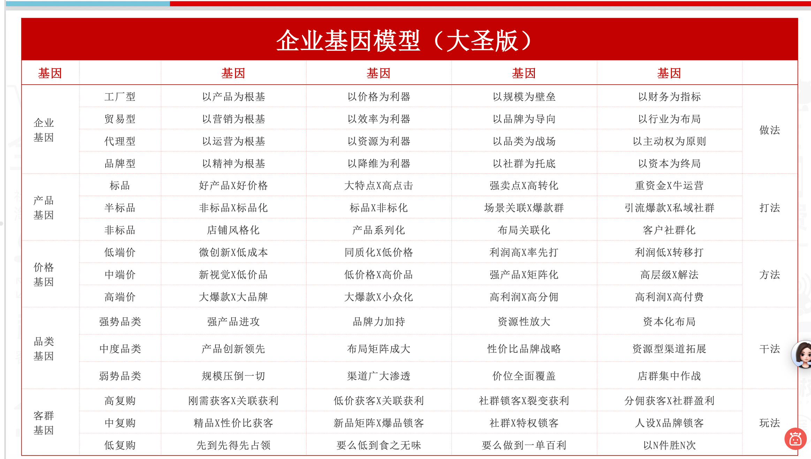
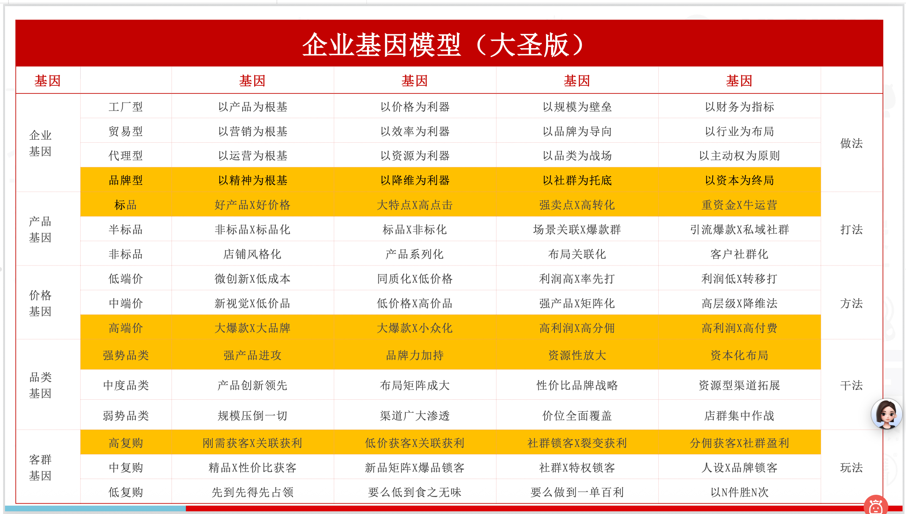

# 专业体系与基因模型

## 核心位置

基因模型是“领先的专业认知”中最基础的一组模型。它帮助咨询师判断企业、产品、品类、价格和消费结构，而不是只看店铺表面数据。

## 企业基因

- 工厂型
  - 成本优势
    - 规模优势
      - 微利润困局
  - 研发优势
    - 后发优势
      - 产品线局限
- 拿货型
  - 选择优势
    - 紧跟市场趋势
      - 无根基困局
  - 营销优势
    - 卖出高价优势
      - 产品无甚区别
- 代理型
  - 品牌优势
    - 资源优势
      - 无自主权利
  - 经营优势
    - 运营优势
      - 无能力结构
- 品牌型
  - 品牌优势
    - 产品优势
      - 成本无优势
  - 营销优势
    - 研发优势
      - 品线拓展慢

## 产品基因

- 标品
  - 关键词少
    - 流量集中
      - 必须打爆款
        - 付费广告贵
  - 产品款式雷同
    - 同价转化相对一致
      - 价格战常见
        - 以产品力为中心
- 半标品
  - 关键词少
    - 流量集中
      - 必须打爆款
        - 付费广告贵
  - 产品款式多样
    - 人群风格明显
      - 同品转化相对不稳定
        - 以风格布局为中心
- 非标品
  - 关键词较多
    - 流量分散且精细化
      - 必须多产品线密度布局
        - 付费广告便宜精细化
  - 产品款式多样
    - 人群风格明显
      - 同品转化相对不稳定
        - 以人群布局为中心

## 品类基因

- 强势品类
  - 品牌力驱动
    - 强产品进攻
    - 品牌力加持
    - 资源型放大
    - 资本化布局
- 中度品类
  - 产品力驱动
    - 产品创新领先
    - 布局矩阵成大店布局
    - 性价比品牌战略
    - 以规模换资源拓渠道
- 弱势品类
  - 价格力驱动
    - 价位全面覆盖
    - 规模压倒一切
    - 渠道广大渗透
    - 店群集中作战

## 价格基因

- 高客单价
  - 规模有限
  - 利润狼视
- 中客单价
  - 规模最大兵家必争之地
  - 上下围堵四面受敌
- 低客单价
  - 有规模无利润
  - 需强供应链支撑

## 消费基因

- 一个客户一个产品买n次
  - 高访客价值
    - 策略
      - 刚需获客✖️关联获利
      - 低价获客✖️关联获利
      - 社群锁客✖️裂变获利
      - 分佣获客✖️社群盈利
- 一个客户一次买n件
  - 中访客价值
    - 策略
      - 精品✖️性价比获客
      - 新品矩阵✖️爆品锁客
      - 社群✖️特权锁客
      - 人设✖️品牌锁客
- 一个客户只买一件
  - 低访客价值
    - 策略
      - 先到先得先占领
      - 要么低到食之无味
      - 要么做到一单百利
      - 群店布局霸屏截流

## 应用提示

- 工厂型企业要看成本、规模、研发和产品线局限。
- 拿货型企业要看选择能力、趋势跟随和营销溢价。
- 代理型企业要看品牌资源、经营能力和自主权边界。
- 品牌型企业要看品牌优势、产品优势、营销能力和研发节奏。
- 标品更依赖爆款和付费进攻，非标品更依赖人群、风格、系列化和库存管控。
