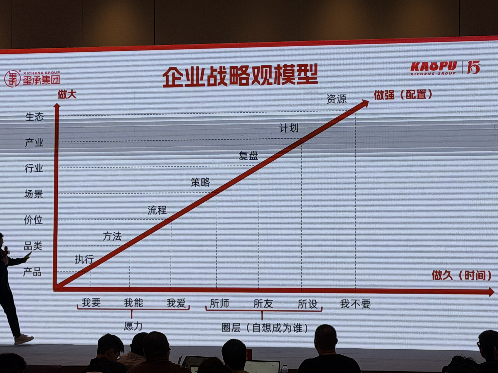
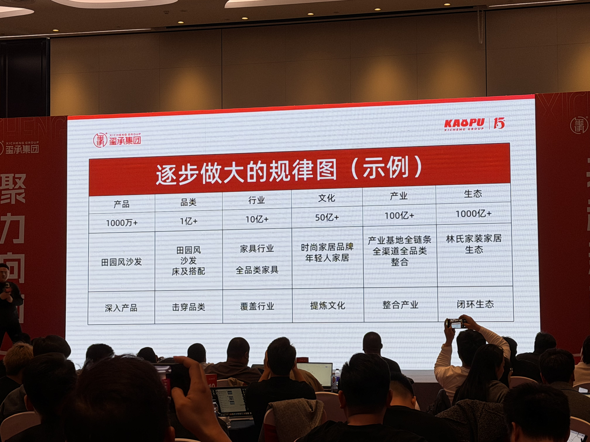
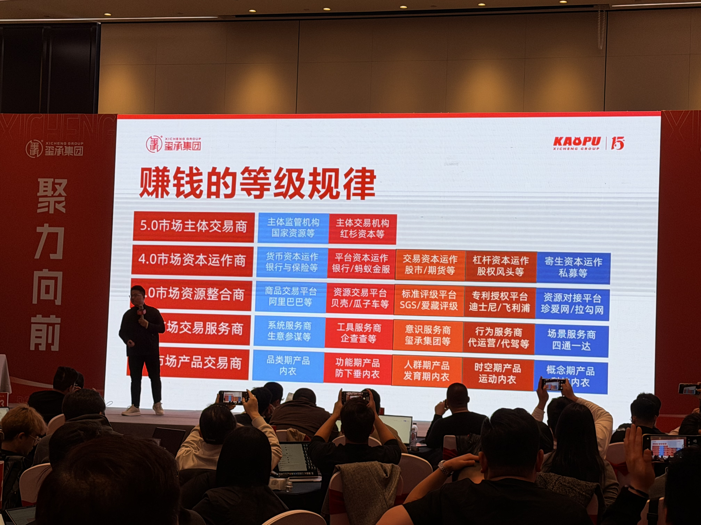

# 战略框架与赚钱等级

## 核心位置

战略框架用于把企业从单品、单店或单类目的增长，推演到大店结构、品类延展和更高等级的赚钱方式。

## 大店结构

- 缘起品类
  - 举例：袜子
    - 围绕属性拓人群
      - 多场景
        - 进攻造血
      - 多价位
        - 防守输血
- 主营品类
  - 举例：内衣
    - 围绕人群拓品类
      - 多品类
        - 多价位
      - 多场景
        - 多价位
- 关联品类
  - 举例：家居服
    - 围绕场景拓品类
      - 多品类
        - 多价位
        - 多场景
          - 核心价位
      - 多人群
        - 多场景
          - 核心价位
- 延展品类
  - 举例：家居日用品
    - 围绕心智拓品类
      - 多品类
        - 多场景
          - 核心价位

## 赚钱的等级规律

- 1.0市场产品交易商
  - 品类期产品
    - 功能期产品
      - 人群期产品
        - 时空期产品
          - 概念期产品
  - 10%净利润左右，利润周期短，利润规模一般
- 2.0市场交易服务商
  - 系统服务商
    - 工具服务商
      - 意识服务商
        - 行为服务商
          - 场景服务商
  - 20-30%净利润左右，利润周期长，利润规模中（强调专业服务）
- 3.0市场资源整合商
  - 商品交易平台
    - 资源交易平台
      - 标准评级平台
        - 专利授权平台
          - 资源对接平台
  - 5%净利润左右，利润周期长，利润规模大
- 4.0市场资本运作商
  - 货币资本运作
    - 平台资本运作
      - 交易资本运作
        - 杠杆资本运作
          - 寄生资本运作
  - 30-50%净利润左右，利润周期短但连续，利润规模大
- 5.0市场主体交易商
  - 主体监管机构
    - 主体交易机构
  - 40%净利润左右，利润周期长且连续，利润规模大
- [image]

## 应用提示

- 缘起品类通常是起盘入口，围绕属性拓人群。
- 主营品类要围绕人群拓品类，建立大人群。
- 关联品类围绕场景拓品类，形成多场景。
- 延展品类围绕心智拓品类，进入更大行业。
- 从 1.0 到 5.0，赚钱方式从产品交易逐步走向服务、资源整合、资本运作和主体交易。
