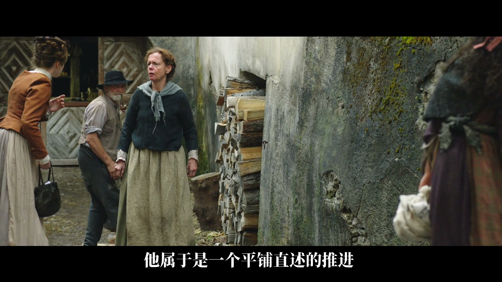
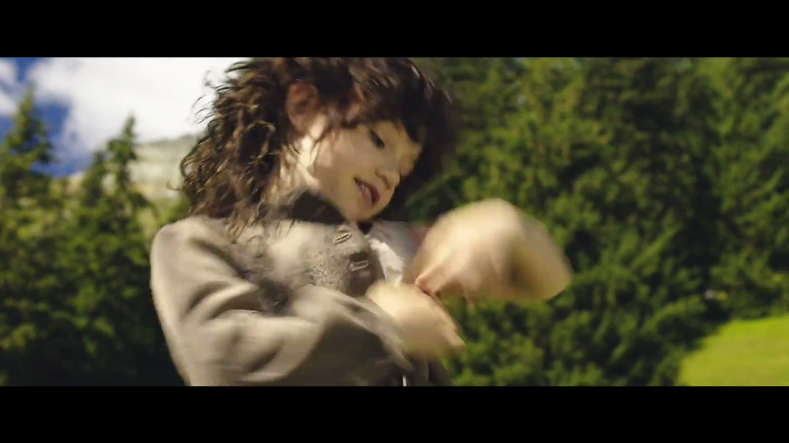
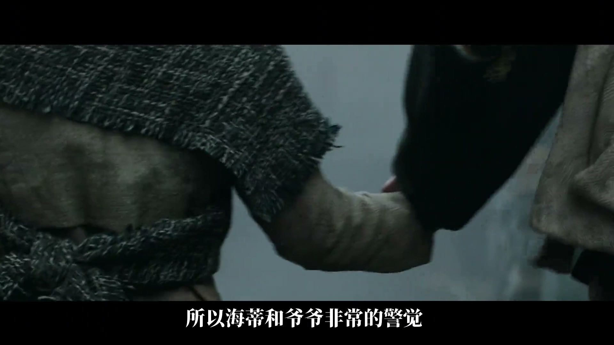
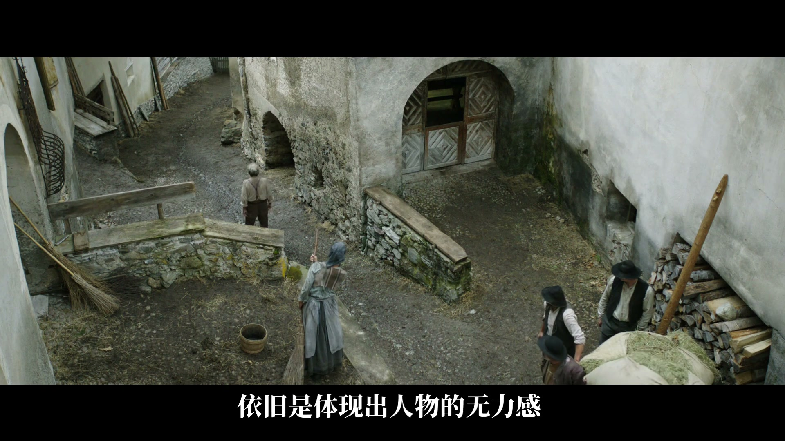
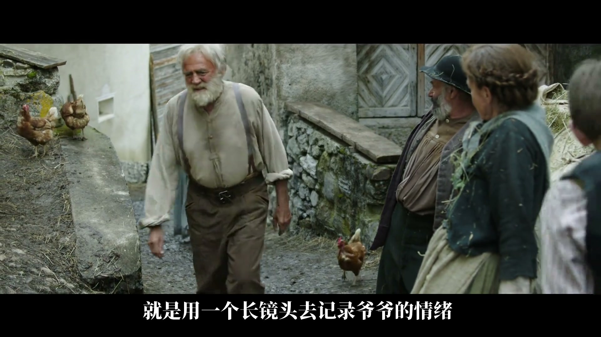

# 导演动机、导演工具与分镜生成

分镜不是先把剧情切成几个镜头，再为每镜补景别和运镜。真正的生成关系是：

```text
场景任务
→ 导演动机：这一场要让观众看见、感受和期待什么
→ 导演工具：视点、景别、机位、焦段、构图、调度、运动、时长、声音、剪辑
→ 镜头序列
→ 图片资产与视频 Prompt
→ 成片验收
```

只列镜头用了什么，只能复述结果；说清为什么此刻选择这些工具，才有能力为新场景重新设计分镜。

## 两层结构

### 导演动机

导演动机回答“表达什么”和“怎样让观众经历它”：

- 场景任务是介绍环境、刻画人物、揭示关系、制造转折，还是承接情绪；
- 观众站在外部观察，还是进入某个人物的立场与视野；
- 哪些信息先出现，哪些人物值得更多视觉笔墨；
- 情绪要被强化、延迟、压住，还是持续到无法迅速消化；
- 场景结束时，观众相比开始多知道什么、感受到什么。

### 导演工具

| 决策维度 | 可用工具 | 不应停留在 |
| --- | --- | --- |
| 观众位置 | 外部观察、主观镜头、第一/第三人称切换 | “有代入感” |
| 信息权重 | 景别、镜头时长、出场顺序、声音先行、反应镜头 | “突出重点” |
| 人物状态 | 动作、表演细节、视线、节奏、动静对比 | “开心、焦虑、无力” |
| 空间关系 | 机位、构图、遮挡、人物占比、前中后景 | “有压迫感” |
| 时间经验 | 运动速度、长镜头、切点、停顿 | “节奏高级” |

工具熟练度是动机落地的前提，但工具本身不是目的。

## 四个案例说明“为什么先于怎么拍”

### 案例一：介绍环境时，保持外部观察

《海蒂和爷爷》中，姑母带海蒂进入村庄寻找爷爷。八个镜头在大全景、小全景和更近景别之间变化，却共享外部观察视角：观众看到村庄，也看到人物状态，但不进入任何一方的立场，不以特写激化情绪。导演动机是先建立环境并平铺推进，因此镜头保持距离。



*外部观察让环境和人物互动同时可读，却不把观众强行拉入某个人的情绪中心。*

### 案例二：转为人物刻画时，视点和动态同步变化

当任务转为刻画海蒂，镜头先进入她的视野，再给反应、决定、位置和动作。脱衣服被拆成动态特写，情绪最强时动态也最强；随后用跟随和主观视野延续。主观镜头、动作、长焦特写和动静变化共同承担儿童天真活泼的刻画任务。



*动态近景把“活泼”从性格词变成身体动作、运动幅度和镜头能量。*

### 案例三：用景别和出场方式分配人物权重

海蒂与爷爷去镇上换粮食时，外界带有敌意，因此镜头把两人的警觉锁在近景和连续反应中。新出现但不重要的人物只在小全景中带过；牧师先以声音出现，接人物反应，再以中近景进入。导演通过景别、反应链和声音顺序分配视觉笔墨。



*关系紧张时，近景细节和反应链比泛化的“紧张氛围”更可执行。*

### 案例四：无力感不一定用快速镜头

海蒂被姑母带走后，爷爷十分焦虑，但正反跟镜运动并不快。慢运动让焦虑带上追不回来的无力；随后高机位大全景以环境尺度压制人物，再用长镜头让浓烈、无法迅速消化的情绪持续。速度、构图和镜头时长由同一情绪逻辑决定。



*人物在大环境中被缩小，“环境压制”把无力落实为尺度关系。*



*长镜头不是固定的高级语法，而是在情绪需要持续、不能被快速切断时使用。*

## 导演决策单

进入分镜前，为每个场景写出最小决策单：

```yaml
scene_task: 这一场推动什么
audience_experience: 观众应知道、感受、期待什么
viewpoint: 外部观察 / 人物主观 / 如何切换
information_order: 先给什么，后给什么
character_weight:
  primary: 谁获得主要视觉笔墨
  secondary: 谁只需被交代
emotion_curve: 起点 → 增强/压制/转折 → 落点
spatial_strategy: 人物与环境、他人、产品的尺度和位置
time_strategy: 运动速度、停顿、镜头时长与切点
tool_choices: 每项选择及其理由
forbidden_drift: 不应被强化、抢戏或误读的内容
```

镜头字段若无法回指这张决策单，它可能只是习惯性镜头，尚未证明必要性。

## 从导演决策到 AI 执行字段

> 本节是知识库根据视频观点与现有 AI 生成协议做的应用编译，不是视频作者直接提供的 Prompt 方法。

导演思维要先翻译成分镜中可见、可听、可计时的事实，再进入图片参考和视频 Prompt。

| 导演决策 | 分镜字段 | 图片资产 / 图片 Prompt | 视频 Prompt | 验收 |
| --- | --- | --- | --- | --- |
| 保持外部观察，不激化情绪 | 视点、大全景/小全景、人物占比 | 环境优先，人物较小；避免情绪特写 | 保持观察距离，不主动冲近面部 | 是否误入人物 POV 或自动切近 |
| 刻画人物的活泼 | 主观镜头、动作相位、动态特写 | 固定身份与动作起点，给关键动作构图 | 写动作顺序、速度变化、跟随方式和结束状态 | 是否由动作与节奏成立 |
| 表现警觉并区分人物权重 | 近景、反应、出场顺序、声音先行 | 主角反应与关键关系需要参考；次要人物不过度资产化 | 先声、反应、入画；景别按权重变化 | 工具人是否抢戏，反应链是否完整 |
| 表现焦虑中的无力 | 慢跟镜、大环境、长镜头 | 准备人物在大空间中占比较小的关键帧 | 明确运动不快、空间压制、持续时长与不切断表演 | 是否擅自加速、乱切或放大人物 |

两条转换规则：

1. 参考图已清楚提供的人物、产品、场景与空间事实，不在 Prompt 中重新长篇描述；文字主要写动机、动作顺序、时间、表演、声音和禁止漂移。
2. 抽象词必须找到可见或可听的承担方式。“无力”要落实为较慢跟随、环境中的较小人物、迟滞动作或较长停留，并逐项验收。

继续执行：

- [[domains/视觉制作/06-AI视频/04-图片与控制资产/01-导演决策到图片Prompt的转换协议|导演决策到图片 Prompt]]
- [[domains/视觉制作/06-AI视频/05-视频生成/01-分镜与资产到视频Prompt的转换协议|分镜与资产到视频 Prompt]]
- [[domains/视觉制作/06-AI视频/03-分镜脚本/25-02-AI视频镜头字段标准|AI 视频镜头字段标准]]

## 训练顺序

1. 为场景写导演动机。
2. 熟悉视点、景别、机位、焦段、构图、调度、声音、运动和剪辑。
3. 学习镜头设计与剪辑思维前置的叙事方法。
4. 研究导演模式如何落到具体场景。
5. 进一步训练情绪设计、节奏表达与观众心理控制。
6. 把每次判断转换成分镜、参考资产、Prompt 和验收规则，形成闭环。

重复术语不会自动升级导演思维；能够解释选择、生成画面并验证结果，才算完成一次导演决策。
