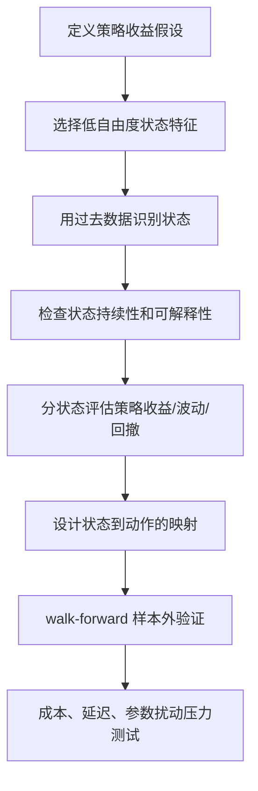

# 市场状态识别与策略失效

固定策略在某些年份失效不是异常，而是量化策略的常态。市场不是同一个稳定分布：收益均值、波动率、相关性、流动性、趋势持续性、尾部风险和交易成本都会随时间切换。一个策略在某一年有效，可能只是它遇到了适合自己的市场状态。

本页回答：如何把“某些年份策略失效”从主观感受转成可检测、可验证、可行动的市场状态问题。它应与 [[domains/量化交易/04-量化理论基础/05-策略类型与收益假设|策略类型与收益假设]]、[[domains/量化交易/04-量化理论基础/10-绩效评估、归因与报告|绩效评估、归因与报告]] 和 [[domains/量化交易/04-量化理论基础/11-过拟合、数据泄漏与样本外验证|过拟合、数据泄漏与样本外验证]] 一起使用。

## 什么是市场状态

市场状态不是一个神秘标签，而是一组统计性质的相对稳定组合。

| 状态维度 | 可观察证据 | 为什么影响策略 |
| --- | --- | --- |
| 收益方向 | 指数/资产过去收益、趋势斜率 | 趋势和动量策略依赖方向延续。 |
| 波动水平 | realized volatility、ATR、VIX、波动分位数 | 高波动会放大回撤和止损噪声。 |
| 相关性结构 | 资产间 rolling correlation、同跌比例 | 分散持仓在相关性上升时失效。 |
| 趋势稳定性 | R²、ADX、均线斜率稳定性 | 趋势跟随怕震荡和反复突破失败。 |
| 流动性状态 | 成交额、买卖价差、冲击成本 | 执行成本会吞掉纸面 alpha。 |
| 风险偏好 | risk-on/risk-off、信用利差、避险资产表现 | 决定股票、债券、黄金、美元等资产轮动关系。 |
| 尾部风险 | 跳空、极端日收益、CVaR | 固定仓位模型通常低估尾部亏损。 |

常见状态标签包括：

- 牛市 / 熊市 / 震荡市。
- 低波趋势 / 高波趋势 / 高波下跌 / 低波横盘。
- risk-on / risk-off。
- normal / crash。
- calm bull / transition / crisis。

标签本身不重要，重要的是标签是否能解释策略收益差异，并在未来交易时点可计算。

## 策略为什么会在某些年份失效

| 失效原因 | 典型现象 | 诊断方法 |
| --- | --- | --- |
| 市场状态错配 | 强趋势年份赚钱，震荡年份反复亏 | 分年度和分状态收益拆解。 |
| 分布漂移 | 历史参数突然失效 | rolling 指标、rolling Sharpe、rolling drawdown。 |
| 信号拥挤或反转 | 过去强者开始快速回撤 | 持仓贡献和换手分析。 |
| 相关性上升 | 持有多个标的但一起下跌 | 组合相关性和类别暴露归因。 |
| 波动/流动性变化 | 回测买卖点正确但实盘滑点变大 | 成本敏感性和成交质量分析。 |
| 过拟合 | 某个年份或参数段特别好 | walk-forward 和参数扰动。 |
| 交易宇宙偏差 | 选池在某些年份天然有利 | 历史时点宇宙复现和失败池归档。 |

因此，策略失效不应马上被解释为“参数不对”。更好的问题是：

1. 这个策略的收益假设依赖什么状态？
2. 当前失效年份属于什么状态？
3. 失效是信号失效、仓位失效、资产池失效，还是执行失效？
4. 有没有证据说明状态检测在交易时点可用？

## 状态识别方法地图

| 方法 | 核心思想 | 优点 | 风险 |
| --- | --- | --- | --- |
| 规则阈值 | 用趋势、波动、回撤、均线等阈值定义状态 | 可解释、实现简单 | 阈值容易过拟合，状态边界粗。 |
| 分位数法 | 用历史分位数定义高/中/低波动或趋势 | 比固定阈值稳健 | 分位窗口选择仍会影响结果。 |
| 聚类 KMeans/GMM | 用收益、波动、相关性等特征聚类 | 无需人工标签 | 聚类标签不一定有交易含义。 |
| HMM | 假设隐藏状态生成可观察收益/特征，并有状态转移概率 | 能表达状态持续性和转移概率 | 状态数、特征选择、训练窗口敏感。 |
| Change Point | 检测统计性质突变点 | 适合结构断裂识别 | 可能滞后，且不一定给出可交易状态。 |
| Statistical Jump Model | 用跳跃惩罚增强状态持续性，减少状态频繁跳动 | 对交易策略更友好 | 模型和惩罚选择需要严格验证。 |
| 监督学习分类 | 用历史标签训练模型识别 bull/bear/crash | 可结合多特征 | 标签定义容易把未来信息带入。 |

HMM 的基本理解：

- 市场真实状态 `s_t` 不可直接观察。
- 收益、波动、成交量、相关性等 `o_t` 是状态生成的可观察数据。
- 模型估计 `P(s_t | s_{t-1})` 状态转移概率和 `P(o_t | s_t)` 发射概率。
- 交易系统不应迷信“状态标签”，而应使用状态概率、状态持续性和状态对应的风险/收益差异。

## 状态特征清单

状态识别可以用很多特征，但越多越容易过拟合。推荐先从低自由度特征开始：

| 特征类别 | 示例 |
| --- | --- |
| 收益 | 20/60/120 日收益、趋势斜率、动量排名。 |
| 波动 | 20/60 日 realized volatility、ATR、VIX 或波动代理。 |
| 回撤 | rolling max drawdown、距高点跌幅、下跌天数。 |
| 相关性 | 风险资产平均相关性、股债相关性、类别内相关性。 |
| 广度 | 上涨资产比例、创新高/新低比例、行业扩散度。 |
| 流动性 | 成交额、换手、价差、冲击成本代理。 |
| 尾部 | 极端负收益频率、CVaR、跳空。 |

Agent 研究状态识别时应优先回答：

- 特征在交易时点是否已经可见？
- 特征是否需要未来窗口或重叠标签？
- 状态是否稳定到足以交易，还是每天乱跳？
- 状态是否只在样本内解释得好，样本外失效？

## 状态识别的常见坑

1. **把状态检测当预测神谕**：状态模型通常更擅长刻画当前风险环境，不等于能精准预测未来收益。
2. **标签事后解释**：回测后把盈利阶段命名为“趋势状态”，把亏损阶段命名为“震荡状态”，这不是可交易模型。
3. **状态切换太频繁**：如果状态每天跳，交易成本和噪声会吞掉收益。Jump Model 的一个动机就是增强状态持续性。
4. **状态数过多**：二三状态常常比五六状态更可用，因为状态越多越难解释，也越容易样本内拟合。
5. **状态和策略动作没有映射**：检测出状态但不知道如何调仓，只会增加复杂度。
6. **只看总收益，不看每个状态内表现**：状态模型的价值必须通过状态内收益、波动、回撤、换手证明。

## 最小可用流程

## Agent 使用模板

当用户问“这个策略为什么某些年份失效”时，先不要调参数，按以下顺序分析：

1. 固定主回测周期，至少覆盖牛市、熊市和震荡市。
2. 输出分年度收益、夏普、最大回撤。
3. 标注每年市场状态：趋势/震荡、高波/低波、risk-on/risk-off。
4. 对比策略在不同状态下的收益和风险。
5. 判断失效来自：信号、仓位、选池、执行、成本、交易宇宙还是过拟合。
6. 只有在失效机制明确后，才设计状态识别或状态自适应规则。

## 相关记忆

- [[domains/量化交易/04-量化理论基础/14-状态自适应策略与动态资产配置|状态自适应策略与动态资产配置]]
- [[domains/量化交易/04-量化理论基础/15-策略失效监控与滚动验证|策略失效监控与滚动验证]]
- [[domains/量化交易/04-量化理论基础/10-绩效评估、归因与报告|绩效评估、归因与报告]]
- [[domains/量化交易/04-量化理论基础/11-过拟合、数据泄漏与样本外验证|过拟合、数据泄漏与样本外验证]]

