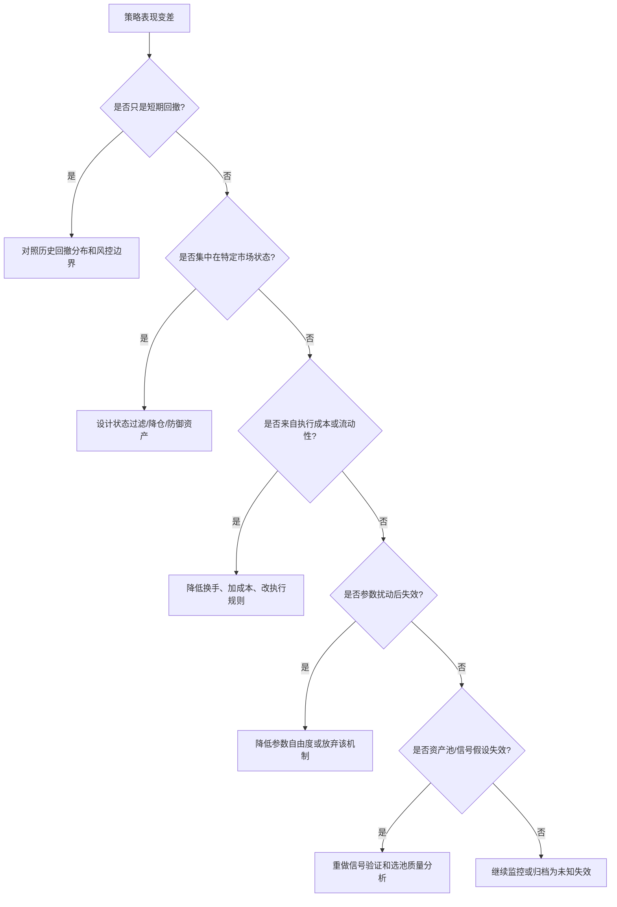

# 策略失效监控与滚动验证

策略失效不是一次回测结果不好，而是策略的收益假设、数据分布、交易环境或执行成本发生变化，使历史有效机制不再稳定。固定长周期回测能防止单年幻觉，但仍不足以证明策略未来有效；还需要分年度、分市场状态、滚动样本外和持续监控。

本页把 [[domains/量化交易/04-量化理论基础/11-过拟合、数据泄漏与样本外验证|过拟合、数据泄漏与样本外验证]] 中的原则扩展为策略失效处理流程。

## 主评估周期与分层评估

量化策略研究应固定一个主评估周期，作为版本比较的最终裁判。例如：

- 主评估周期：尽量覆盖完整牛熊震荡周期。
- 分年度评估：每年单独计算收益、波动、Sharpe、最大回撤。
- 分状态评估：趋势/震荡、高波/低波、risk-on/risk-off。
- 分资产/类别归因：收益是否来自少数资产、少数类别或少数交易。

不能接受：

- 只展示表现最好的单一年份。
- 在短周期结果好时推进方向，长周期结果差时忽略。
- 每次换周期后都重新选择最优参数。

## Rolling / Walk-Forward 验证

Walk-forward 的核心思想是：只能用过去选择规则，然后在未来验证。

常见结构：

| 模式 | 做法 | 适用 |
| --- | --- | --- |
| Expanding window | 训练/观察窗口从起点逐步扩展 | 市场机制较稳定，数据越多越好。 |
| Sliding window | 只使用最近 N 年训练/观察 | 市场机制漂移明显。 |
| Anchored split | 固定早期样本内，后续多个样本外段 | 策略开发阶段的初始验证。 |
| Purged/embargo CV | 删除标签重叠和邻近泄漏样本 | 机器学习和重叠标签策略。 |

示例：

| 训练/观察 | 样本外验证 |
| --- | --- |
| 2020-2021 | 2022 |
| 2020-2022 | 2023 |
| 2020-2023 | 2024 |
| 2020-2024 | 2025 |

如果每个样本外年份都需要重新调参才能好看，策略大概率不稳健。

## 状态策略的特殊验证

状态识别策略尤其容易看未来，因为状态标签常常是事后用全样本拟合出来的。必须遵守：

1. 状态模型只能在训练窗口拟合。
2. 测试窗口每天只能用当时已知数据预测状态。
3. 状态动作至少测试一日执行延迟。
4. 报告状态切换次数和平均持续期。
5. 报告每个状态内的收益、波动、回撤、换手。
6. 加入交易成本和滑点。
7. 对状态数、窗口长度、特征集做扰动测试。

对于 HMM/GMM/KMeans：

- 聚类/状态编号本身没有经济含义，需要按状态内收益、波动、回撤、相关性解释。
- 状态标签可能在重新训练后编号交换，不能把“状态 0”固定解释为牛市。
- 如果状态切换过于频繁，需要考虑状态平滑、最小持有期、Jump Model 或冷却期。

## 策略失效监控指标

| 监控对象 | 指标 | 触发解释 |
| --- | --- | --- |
| 收益假设 | rolling Sharpe、rolling hit rate、分组收益 | alpha 可能衰减。 |
| 风险 | rolling volatility、rolling max drawdown、CVaR | 风险环境变化或仓位过高。 |
| 交易 | 换手、滑点、失败订单、成交额占比 | 执行层失效。 |
| 组合 | 持仓集中度、类别暴露、相关性 | 分散失效或押注单一风险。 |
| 状态 | 状态持续期、切换次数、状态内收益 | 状态识别噪声或状态动作无效。 |
| 参数 | 参数扰动后的结果分布 | 参数脆弱或过拟合。 |
| 数据 | 缺失、异常、样本变化、宇宙变化 | 数据源或交易宇宙漂移。 |

## 失效处理决策树

## 长周期固定，不等于停止学习

固定主评估周期是为了防止“哪里好看看哪里”。但研究仍需要多层样本：

| 用途 | 周期 |
| --- | --- |
| 主裁判 | 长周期，覆盖多状态。 |
| 冒烟测试 | 单年或短期，检查代码和日志是否正常。 |
| 分环境诊断 | 按年份、状态、资产类别拆分。 |
| 参数开发 | 只在训练/观察窗口内。 |
| 样本外决策 | 开发完成后才看。 |
| 压力测试 | 成本、延迟、滑点、极端行情。 |

如果短周期和长周期结论冲突，应优先信长周期，但不要直接丢弃短周期。短周期可能说明：策略在某个状态确实有效，只是它不是全市场全周期策略。

## 策略去留标准

继续研究：

- 失效集中在可解释状态。
- 状态过滤或组合调整能在多个样本外段改善风险调整收益。
- 参数扰动后结果仍稳定。
- 成本和延迟后仍有优势。

暂停研究：

- 只在一个年份或一段行情好。
- 每次换样本都要换参数。
- 主要收益来自少数无法复现交易。
- 状态识别只有事后解释，没有交易时点可用性。
- 成本提高后收益消失。

转为多策略组件：

- 单独看夏普一般，但和其他策略相关性低。
- 在某些状态表现稳定，其他状态可由过滤器关闭。
- 能提供组合层面的回撤保护或收益补充。

## Agent 使用模板

当用户拿来一组新回测结果，Agent 应输出：

1. 是否同一策略版本和同一回测周期。
2. 主周期核心指标。
3. 分年度核心指标。
4. 分状态或分环境表现。
5. 与上一版相比改善来自收益、波动、回撤、换手还是暴露变化。
6. 是否改变了下一步研究方向。
7. 如果短周期与长周期冲突，优先根据长周期修正结论。

## 相关记忆

- [[domains/量化交易/04-量化理论基础/13-市场状态识别与策略失效|市场状态识别与策略失效]]
- [[domains/量化交易/04-量化理论基础/14-状态自适应策略与动态资产配置|状态自适应策略与动态资产配置]]
- [[domains/量化交易/04-量化理论基础/10-绩效评估、归因与报告|绩效评估、归因与报告]]
- [[domains/量化交易/04-量化理论基础/12-量化研究工作流与实验纪律|量化研究工作流与实验纪律]]

