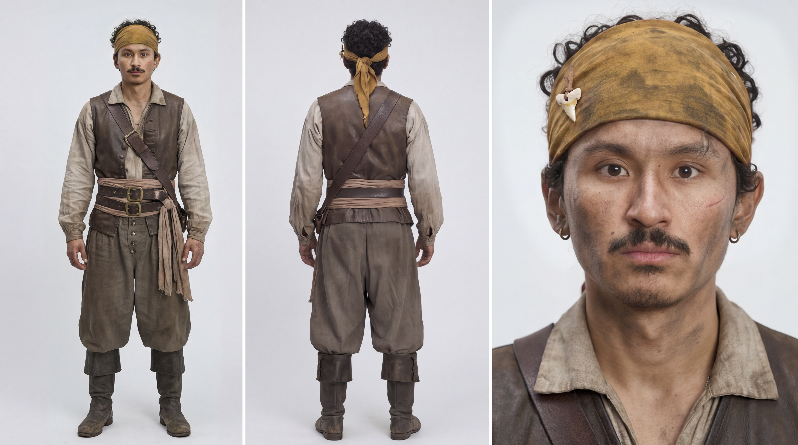
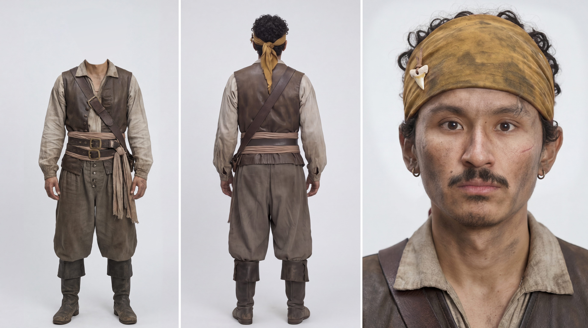
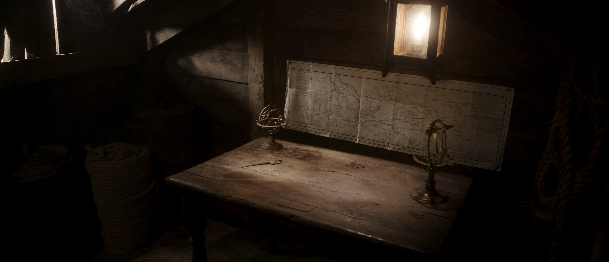
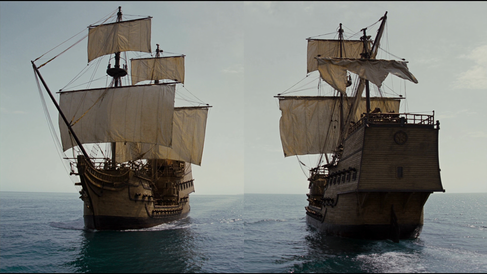
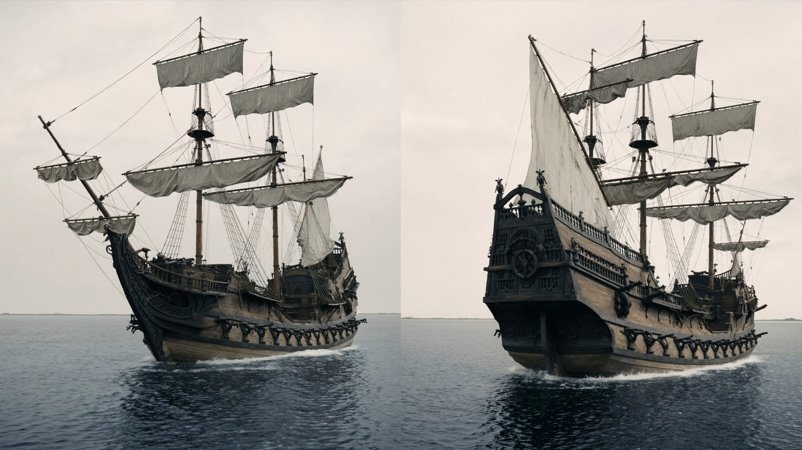
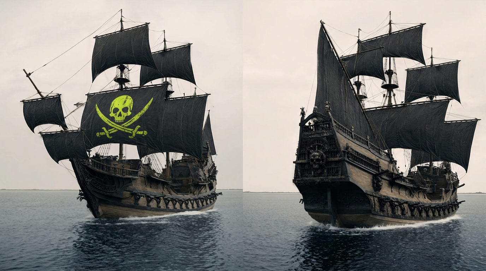

# Make Viral AI Short Films With This Exact Workflow — Full Tutorial

For the full breakdown, check out the YouTube video: <a href="https://youtu.be/CHHH8tNioSc?si=_1yf8MYHtqIizosy" rel="nofollow"><u>I Made a Viral AI Short Film From Scratch — Full Workflow (Seedance 4K + Claude Fable 5)</u></a>. Every clip below is pulled straight from the tutorial, complete with the exact prompts!

------------------------------------------------------------------------

## Before You Start

Before generating a single video, build your assets — the character sheets, locations, and props. Every one of them will appear in multiple scenes, and a fixed reference is what keeps your hero's face, your props, and your locations identical from shot to shot.

The routine is always the same: **Soul Cinema** for the raw pass (simple prompt, lots of variety), **GPT Image 2** for edits and the final clean sheet. Then every scene is written by the Claude Skill and generated in **Seedance 2.0**.

Below we walk through the four core assets — the hero, the location, and the ships. The rest of the assets you'll get scene by scene.

[下载归档：higgsfield-seedance-prompt.skill](../../assets/higgsfield-blockbuster-4k/downloads/higgsfield-seedance-prompt.skill)

------------------------------------------------------------------------

## Stage 1 — The Assets

## The Hero — Pirate character sheet

**What it does:** Generates a 3-view character sheet of the hero as a pirate — full body front, full body back, and a frontal close-up — from your own reference photo. The close-up gives the model the exact face to lock onto; a grey background keeps the generations clean.

    3-view character reference sheet for a film character. Gritty cinematic 35mm film photograph, naturalistic editorial reference, fine film grain. Lit with very soft, low, diffused natural light — a large heavily-diffused source dimmed well down, the quality of soft shade or thin overcast through a scrim, wrapping gently around the face with extremely smooth gradual falloff. Low-key restrained exposure, slightly underexposed and moody, the overall light level kept low so nothing is bright, hot or glaring; absolutely no harsh shadows, no hotspots, no blown highlights, no hard edges of light; kept consistent across all three panels. Neutral medium-grey seamless backdrop — a clear mid-grey, never white. Age-of-sail pirate costume, weathered and slightly dirty look — not glossy or hyperreal, organic matte film skin texture. The same man in all three views: youthful attractive man in his early 30s, warm olive-brown skin, dark thick curly hair (medium length, natural curl), thin mustache with a small soul-patch under the lip, faint stubble along the jaw, two small silver hoop earrings on the left ear, thin silver chain necklace, subtly asymmetrical face with one eye marginally higher than the other and a slight jaw skew. A small, thin, subtle healed scar near the RIGHT eye — a short faint pale line on the cheekbone just below the outer corner of the eye, understated and easy to miss, not large or dramatic, the right eye itself fully intact and open. Keep the exact same facial identity, bone structure, features and this small subtle right-side scar across all three views. Both arms whole and both hands normal, intact human hands — no missing limbs, no prosthesis. Grimy and weathered — smudges of soot and dirt on the face, neck and hands, skin kept matte and low-sheen with only faint dampness (no oily highlights, no specular hotspots), slightly matted curls, grime worked into the fabric, the look of someone who has been at sea and in a fight. Early-18th-century pirate attire: a YELLOW pirate durag/head wrap tied over the curly hair — a deep faded mustard-yellow bandana, worn bandana-style, knotted at the back with the tails hanging down, fabric weathered, smudged and faded but clearly yellow. A small white shark tooth pendant threaded on a thin leather cord is attached to the durag above the left temple, hanging against the yellow fabric — a real shark tooth, slightly worn, an understated talisman, present and identical in every view where the head is visible. An open loose off-white linen shirt with laced or open neck, sleeves pushed up, a worn dark leather vest or waistcoat over it, a wide sash/belt at the waist, baggy dark breeches tucked into scuffed leather boots, a few leather straps and a baldric across the chest, tarnished buckles, all fabric faded, frayed, salt-stained and dirty. Layout: three panels side by side in a single horizontal row on a clean continuous neutral medium-grey studio seamless (a clear mid-grey, never white), very soft low diffused natural lighting, gently and evenly lit with no hotspots, no props, thin subtle vertical divider lines separating the three panels. LEFT panel — "FRONT, full body": full-length front view, full body head to boots, standing straight and neutral facing camera, arms relaxed at sides with both intact hands clearly visible, head and face fully visible, even framing with headroom and foot room, the whole pirate costume visible. CENTER panel — "BACK, full body": full-length back view, full body head to boots, standing straight facing directly away from camera, showing the back of the yellow durag knot with hanging tails, the vest back, sash and breeches from behind, same costume. RIGHT panel — "FRONTAL CLOSE-UP": frontal close-up portrait from the chest up, head facing straight toward camera (full front view, not three-quarter or profile), eyes looking directly into the lens, face square to camera, symmetrical framing, sharp detail on the face, the small subtle scar on the right cheekbone clearly visible, yellow durag with the shark tooth pendant on its leather cord, mustache, earrings, dirt and matte skin texture, neutral confident expression. Consistency: the same single character with identical face, small subtle right-side scar, hair, yellow durag with shark tooth pendant, costume, dirt, two whole arms with intact hands, and proportions in all three panels — only the camera angle and crop change. Consistent very soft low diffused natural lighting (slightly underexposed, low-key, no harsh shadows, no hotspots, no blown highlights) and a neutral mid-grey backdrop (never white) throughout. Cinematic film-photo finish, never plastic CGI skin. 16:9 horizontal sheet.

One important edit after that. A character sheet with multiple faces confuses Seedance later — it doesn't know which face to lock onto, and your hero slowly drifts scene by scene. Keep only the close-up face on the sheet:

    Erase the face from the full-body shot on the first panel.

------------------------------------------------------------------------

## The Location — Captain's cabin

**What it does:** Generates the pirate captain's cabin below deck — table, hanging lantern, map on the wall, thin rays of daylight leaking through the planks. Asking for a 3/4 angle adds depth, which gives the camera much more to hold onto when it moves.

    Photorealistic cinematic movie still, grounded period maritime realism, early 18th-century Golden Age of Piracy, Caribbean privateer vessel. A cramped below-deck captain's cabin on an old wooden sailing ship. A large weathered sea-chart is pinned to the rough plank back wall above a heavy waxed-oak table strewn with brass navigation instruments — dividers and a sextant. A gimbaled brass lantern hangs low in the upper frame, swaying gently with ship motion, throwing a warm pooled glow into deep corner shadow. Tarred coiled rope and a barrel fill the foreground edges. Low heavy-beamed ceiling, rough plank walls and floor. Mid-morning, calm weather, warm and enclosed — tropical maritime, lantern-and-candle era.Wide three-quarter interior establishing shot, eye-level, slow push-in. Painterly low-key cinematography: warm tungsten lantern as the single key practical from frame-left, soft Rembrandt pooling, deep shadow falloff into the corners, thin hard daylight slivers leaking through plank gaps. Color palette of aged oak brown, tarred black, oxidized brass amber, sun-bleached parchment cream, shadowed sea-grey — warm-leaning but desaturated, muted period grade. Mood: enclosed, hushed, conspiratorial, weathered, anticipatory, intimate.Shot on a modern digital cinema camera with vintage spherical prime lenses, 24mm, 2.39:1 Cinemascope. Gentle anamorphic horizontal flare off the lantern, soft bokeh, mild halation on the flame. Deep depth of field, bow-to-stern interior in focus, slight falloff in the darkest corners. Fine low-intensity 35mm grain, organic texture. Hand-hewn waxed oak grain, tarred rough hemp, tarnished brass, brittle creased parchment, coarse canvas. Drifting dust motes in the lantern beam, faint smoke haze. In-camera practical lantern light with film emulation — lantern flare, slight chromatic aberration at the light edge, soft vignetting.

------------------------------------------------------------------------

## The Props — The ships

**What it does:** Generates both ships on one split-screen sheet — front 3/4 and rear 3/4 of the same vessel — so the model always knows what the ship looks like from either side.

    Split-screen sheet, same two-masted pirate ship twice: LEFT front 3/4 (bow, bowsprit, foaming wave); RIGHT rear 3/4 (transom stern, wheel, wake). Aged wood hull, furled grey sails, cannons, calm grey ocean, overcast. Photoreal.

The bigger result became the enemy ship — but it needed to look dangerous. So we fed that bigger ship back into GPT Image 2 as the input image and ran an edit on top of it: open the sails, turn them black, add the skull emblem:

    Edit the provided reference image — a two-panel side-by-side diptych of the same wooden galleon on calm water under a pale overcast sky. Fully unfurl and deploy all the ship's sails on every yard and mast so they are completely open and billowing in the wind — no furled, rolled-up, or partially stowed sails anywhere. Change all the sails to deep matte black. In the LEFT panel only, add a large menacing pirate skull-and-crossbones emblem printed on the largest black mainsail — emblem color exactly hex #D1FE17, bright chartreuse yellow-green, looking weathered and hand-painted onto the sail fabric, following the sail's curvature, billow, and folds, with slightly cracked and faded paint. The RIGHT ship keeps plain black sails with no emblem. Add light pirate styling to the ship: a subtly weathered look and a few small skull-and-bone ornamental touches on the wooden carvings. Do not change the background at all — keep the exact same calm sea, the exact same pale overcast sky, the exact same dual side-by-side two-panel composition, the wooden hull geometry, masts, rigging layout, and each ship's pose and angle exactly as in the original. Only the sails (now fully open and black), the green skull emblem on the left mainsail, and the light pirate styling change. Photorealistic, cinematic, matching the original's muted desaturated color grade. No text, no watermark.

------------------------------------------------------------------------

## Stage 2 — The Prompting Framework

We don't write Seedance prompts by hand — a Claude Skill does it. Describe the scene, it splits it into shots and writes the full prompt, director hacks included.

Setup:

1.  

[下载归档：higgsfield-seedance-prompt.skill](../../assets/higgsfield-blockbuster-4k/downloads/higgsfield-seedance-prompt.skill)

In Claude, go to **Customize → Skills**, hit **+** button, and upload the skill file.

Open a new chat, attach the script and every asset sheet, and give Claude the element list below.

In Higgsfield, add each asset under **Elements** with **exactly the same name.**

This matters because during scene generation the prompts auto-match your inputs by these tags — nothing gets mixed up.

> @eduardo — main pirate character@loc_cabin — captain's cabin @main_ship_sheet — hero's ship @villain_ship_sheet — enemy ship @spyglass_sheet — spyglass @parrot_sheet — parrot @ship_cannon — ship cannon @map_prop — treasure map @cannonball — cannonball @button — the treasure case with the glowing green button @eduardo_crew — hero's crew @ocean_location — ocean @island_location — island @villain_captain — villain captain @helmsman_sheet — helmsman @main_character_desert — the hero in desert wanderer wardrobe @location_desert — desert dunes @rider — desert rider in black robes @ostrich — riding ostrich with goggles and saddle @binoculars — field binoculars @oasis — oasis with palms and a pond @main_character_jungle — the hero in explorer wardrobe @main_character_jungle_torn — the same explorer with claw-torn pants @location_jungle1 — jungle clearing with the colossal tree @location_jungle2 — ruined jungle path @location_jungle3 — jungle ridge over the cliff @spider — spider @macaque — white macaque @jaguar — jaguar @main_character_room — the hero in apartment wardrobe @cindy — Cindy, the little sister @room1 — apartment living room, master angle @room2 — the same room, reverse angle @room3 — the same room, desk wall angle

From here, the workflow per scene is: describe what happens in plain language, attach the assets the shot needs, get the prompt, run it in Seedance 2.0, then take your notes back to Claude for exact fixes.

------------------------------------------------------------------------

## Stage 3 — The Scenes

## Scene 1, Part 1

Here are all the assets used in this scene:

[下载归档：scene_1.zip](../../assets/higgsfield-blockbuster-4k/downloads/scene_1.zip)

Assets built, skill installed — now the actual filmmaking. Scene by scene, here is every prompt that made the final cut. We open in the captain's cabin. **What it does:** Animates Eduardo searching the cabin, finding the treasure map, and reacting when a crewman bursts in with daylight behind him. One prompt covers the whole beat — the cuts, the dialogue line, and the sound come out of a single generation.

*Every prompt from the skill follows one locked template: scene context → references → shot-by-shot action → lighting → locks. Audio is always real-world sound only — music gets added later, in the edit.*

    SCENE CONTEXT Bright day outside, darkness inside a cramped windowless ship cabin. Pirate captain Eduardo works through stacks of papers on a chart desk, sliding sheet after sheet aside, and uncovers an old treasure map — a red X on a small island, a dashed course line running from a drawn ship to that island. The cabin door swings open behind him and a crewman delivers one hoarse line — Eduardo slaps the map back onto the desk and immediately heads for the door. The shot ends on his walk out. ACTIVE REFERENCES @eduardo — lean pirate captain, dark curly hair falling free from under a dusty mustard-yellow cloth bandana, a small white shark tooth pinned to the front of the bandana above his temple, thin moustache, gold hoop earrings, cream linen shirt under a worn brown leather waistcoat, cloth sash and leather belts at the waist. 100% matches the reference; identity, face and wardrobe locked. Studio sheet background and layout NOT inherited. @map_prop — square aged parchment map, torn edges: hand-drawn compass cross in the top-left, a small inked sailing ship on the left, a dashed course line running right across the sheet to a small island with two palm trees, marked with a red stitched X. 100% matches the reference; the drawing on the parchment stays exactly as on the reference in every frame. @loc_cabin — cramped dark windowless wooden ship cabin: heavy chart desk, one lit hanging lantern above it, coiled ropes, low beamed ceiling, deep shadow in the corners. Controls environment, materials and mood only; reference framing not inherited. @eduardo_crew — one weathered pirate crewman taken from the reference group (bandana, rough shirt, vest). 100% matches the reference; he appears ONLY in the doorway in the final cut. LOCATION MAP Interior of @loc_cabin. The chart desk sits midground-center under the hanging lantern — the only light source. The desk is buried in paper: stacked sea charts, folded letters, logbook pages, scattered loose sheets. The cabin door is in the background screen-left, closed until the last cut. Foreground: edge of the desk and paper stacks. Background: dark planked wall, rope coils, shadow. Camera works from the dark side of the desk, across from the lantern spill. FIRST FRAME / BLOCKING First frame: @eduardo already bent over the desk, screen-center, in profile-three-quarter to camera, both hands in the paper stacks, mid-motion sliding a chart aside. The lantern burns above his head. The door screen-left stays closed. Composition holds him off-center right, the paper field leading toward him. FORMAT MODE Sequence of cuts, no timecodes — cuts only at the specified points, the camera does not cut on its own. CUT 1 — MS, 47°: Eduardo bent over the desk, working through the papers in a steady searching rhythm — lifts a sheet, scans it half a second, slides it aside; one loose page slips off the desk edge and seesaws down out of frame. Smooth continuous hand movements, one sheet at a time. As he searches he MUTTERS to himself under his breath, wry and competitive: "You think you're gonna outsmart me?.. Nice try!" CUT 2 — MCU, 29°: his hands stop — under loose papers a corner of aged parchment. He pulls @map_prop free with both hands and lifts it into the lantern light, eyes locking onto it — and a slow grin spreads across his face, one corner of the mouth first, the smile of a man who knows he is close to his prize. CUT 3 — OVER-THE-SHOULDER MS, 29°, brief: from behind Eduardo's shoulder, at a step's distance — the map held in his hands in the lantern light, occupying part of the frame, his shoulder and head framing it. The red stitched X on the small island and the dashed line from the drawn ship read clearly. A short hold, about 1.5 seconds, no camera move. CUT 4 — MS, 47°, past Eduardo toward the door: the door swings open and hard white daylight BLASTS into the dark cabin — @eduardo_crew stands in the doorway as a pure black SILHOUETTE against the burning-bright rectangle, face unreadable, edges rimmed with light. Volumetric light rays shaft past him through the doorway, cutting through the cabin dust, drawing long bright streaks across the floor and desk. He speaks his line, hoarse and urgent. Eduardo startles, head snapping toward the light — and SLAPS the map back down flat onto the desk in one sharp reflex motion, both hands pressing it for a beat — then pushes off the desk and strides straight toward the doorway, empty-handed, walking into the light past the silhouetted crewman. The map stays lying on the desk. The shot ends on his stride toward the exit. OPTICS FOV per cut as stated: 47° neutral for the desk work and the door, 29° portrait compression for the find and the over-the-shoulder map view. No drift mid-segment. In CUT 3 the parchment is sharp, Eduardo's shoulder soft in the near foreground, background falling away. CAMERA Handheld with a quiet 1–2 cm breath, operator on the dark side of the desk across from the lantern, chest height, moving at under 2 km/h. On CUT 3 the camera holds a steady over-the-shoulder position behind him, a step back, no move. Focus rides Eduardo's hands, then the map. ACTION Eduardo searches with focused urgency, but every movement stays readable and unhurried in the frame: fingers walk through the stacks, each sheet is lifted, tilted to the lantern, slid aside — one page at a time, papers keeping their shape and place until his hands move them. He freezes the instant the parchment corner appears — one full second of stillness — then draws it out carefully with both hands. On the door opening: a startle reflex — the map slapped back flat onto the desk in one sharp motion — then a decisive push off the desk and a straight, fast walk toward the doorway, hands free. The action ends mid-stride toward the exit. PERFORMANCE Muscle-level acting: jaw set during the search, breath audible and short; on finding the map the breath stops, eyes widen a fraction, pupils flick along the dashed line left to right — then the grin arrives: one corner of the mouth lifting first, eyes brightening, the hungry smile of a man close to his goal, held as he studies the map. Pore-level skin realism, lantern catch-lights in the eyes, living micro-movement in the face. PHYSICS Papers slide and settle with air resistance; every sheet keeps its exact shape, size and markings while it moves — objects on the desk hold stable identity from frame to frame and move only when his hands move them. The parchment is stiff, aged — it bends in a gentle arc, corners trembling slightly in his hands. Dust motes drift through the lantern beam. The whole cabin sways gently, 2–3 cm amplitude; the hanging lantern swings with a slow offset. LIGHTING CUTS 1–3, single practical source: the hanging lantern above the desk, warm 3200K, hard small-source key from above, deep soft shadows everywhere else. Eduardo half-lit — lantern side of his face warm, camera side falling into shadow. Haze thin, visible only inside the lantern beam. CUT 4: the opened door introduces a second, dominant source — hard 5600K sun blasting through the doorway, 3 stops over the cabin exposure, blooming at the frame edge. The crewman reads as a full black silhouette inside it; volumetric god rays fan from the doorway through 40% dust haze, striping the desk and Eduardo's face with light. AUDIO Creak of ship timbers, dry paper rustle, sheet after sheet sliding on wood. Over the search in CUT 1, Eduardo's low muttering to himself, wry, half-grinning: "You think you're gonna outsmart me?.. Nice try!" On CUT 4: door latch clack, hinge groan, then the crewman's hoarse, gravelly voice: "Cap'n — island sighted, dead ahead!" Low room tone of sea against the hull throughout. STYLE Photoreal live-action, cinematic low-key interior, fine film grain, deep blacks with detail held in shadow, 8K master. POSITIVE LOCKS The drawing on @map_prop stays identical in every frame: red X on the two-palm island, dashed line from the drawn ship to the island, compass cross top-left. The lantern stays lit in every cut. The door stays closed until CUT 4; when it opens, the crewman stays a full black silhouette against hard sunlight for the whole cut, light rays visible in the dust. Only two people ever appear: Eduardo and the one crewman in the doorway. Eduardo keeps the map in his hands from CUT 2 until the door opens in CUT 4 — there he slaps it back onto the desk, and the map lies flat on the desk for the rest of the shot. The final frames show Eduardo mid-stride toward the doorway, hands empty, walking into the light. Eduardo's head: mustard-yellow bandana with the small white shark tooth at the front, hair loose. The desk holds only papers and the map — every object keeps a stable shape and identity across frames, moving only when his hands move it. Cuts only at the specified points.

------------------------------------------------------------------------

## Scene 1, Part 2

**What it does:** Animates Eduardo running to the helm, taking the spyglass, and spotting the case on the island through a monocular crash-zoom POV — then the reveal of the enemy ship behind them. Giving the parrot a voice that screams the bad news twice is what makes the scene land.

    SCENE CONTEXT Bright day at sea aboard a sailing galleon. Captain Eduardo bursts out of the sterncastle door onto the deck; his scarlet macaw lands on his LEFT shoulder mid-stride. He runs up to the quarterdeck where a lookout crewman watches the horizon through a brass spyglass, takes the spyglass and looks himself: a distant island, and a violent optical crash zoom finds a small futuristic hard case on the beach. Then a second crewman runs up, grabs his arm and points the OTHER way, astern — Eduardo turns: a black-sailed pirate ship very far behind them, a speck on the horizon. He does not raise the spyglass — he just stands and stares at the distant black sails, holding the look. ACTIVE REFERENCES @eduardo — lean pirate captain, dark curly hair falling free from under a dusty mustard-yellow cloth bandana, a small white shark tooth pinned to the front of the bandana above his temple, thin moustache, gold hoop earrings, cream linen shirt under a worn brown leather waistcoat, cloth sash and leather belts. 100% matches the reference; studio sheet layout NOT inherited. @parrot_sheet — scarlet macaw, red body, blue-and-yellow wing feathers, small leather shoulder harness. 100% matches the reference; it flies in and rides Eduardo's left shoulder. @eduardo_crew — weathered pirate crewmen from the reference group (bandana, rough shirt, vest). 100% match the reference; TWO of them appear: the lookout at the quarterdeck rail, and a second runner who arrives in CUT 4 pointing astern. @spyglass_sheet — collapsible brass spyglass with dark leather-wrapped barrel sections. 100% matches the reference; starts in the lookout's hands, ends at Eduardo's eye. @main_ship_sheet — Eduardo's galleon: pale square sails, tall wooden sterncastle, raised quarterdeck. 100% matches the reference; controls hull, deck, masts and rigging only. @ocean_location — calm bright sea, glittering sun path, hazy horizon. Controls water and sky atmosphere only. @island_location — small lone island: dense dark-green jungle cover, a curved white-sand beach on one side, grey rocky cliff edges, turquoise shallows ringing the shore. 100% matches the reference; it is the island seen on the horizon and inside the spyglass view. @button — small futuristic hard case: matte-black armored corners, neon acid-green side panels, brushed-steel top plate with a glowing green star-shaped button. 100% matches the reference; it appears ONLY inside the zoomed spyglass view of CUT 3, lying on the beach. @villain_ship_sheet — enemy pirate galleon: black sails, acid-green skull-and-crossed-swords on the mainsail, dark carved hull. 100% matches the reference; revealed VERY far astern in CUT 4 as a tiny silhouette on the horizon — never seen closer in this beat. LOCATION MAP @main_ship_sheet under sail on @ocean_location, open bright sea. The sterncastle door opens onto the main deck; a short wooden stair leads up to the quarterdeck at the stern. The lookout stands at the quarterdeck rail on the forward side, spyglass raised toward the horizon screen-right. Far on that horizon, 2–3 km out: @island_location — dense green jungle mass, the white-sand beach catching the sun on its near side, turquoise water at its shore. In the OPPOSITE direction, astern of the ship screen-left: open sea where @villain_ship_sheet rides VERY FAR OFF — 4–5 km out, right on the horizon line, a tiny dark silhouette almost dissolved in the haze — present in the world from the start, revealed to the camera only in CUT 4. Haze visible at the horizon distance. Sun high, sea glitter everywhere. FIRST FRAME / BLOCKING First frame: the sterncastle door already swinging open, @eduardo mid-stride through it onto the deck, body angled toward the quarterdeck stair screen-right. Crew activity in the background of the deck. The lookout is visible up on the quarterdeck at the rail, spyglass already at his eye, pointed screen-right toward the horizon. FORMAT MODE Sequence of cuts, no timecodes — cuts only at the specified points, the camera does not cut on its own. CUT 1 — 63° handheld follow: the door bursts open, Eduardo comes out in a strange hurried scurry — up on TIPTOE, quick tiny mincing steps, both arms half-raised in front of him with elbows out, hands hovering at chest height, shoulders slightly hunched — comically odd, but FAST, covering the deck at 10 km/h. @parrot_sheet sweeps in from off-frame upper-right, wings braking, and lands on his left shoulder without breaking the scurry. He tiptoe-rushes across the deck and up the quarterdeck stair; the camera chases behind-left, half a beat late. CUT 2 — MS, 47°, on the quarterdeck: the lookout at the rail with @spyglass_sheet raised. Eduardo arrives frame-left, the scarlet macaw @parrot_sheet sitting clearly visible ON HIS LEFT SHOULDER through the whole cut. With his RIGHT hand he grabs the spyglass out of the lookout's hands in one firm motion and raises it right-handed to his RIGHT eye toward the horizon screen-right, left eye squeezing shut. The lookout yields a step. CUT 3 — SPYGLASS POV, MONOCULAR: one single round image — the view through ONE lens of a telescope, a single circle centered in frame, black around it. This is a one-eyed spyglass view, never the twin overlapping circles of binoculars. Extreme telephoto image swaying with a hand-held tremor, compressed haze layers stacking toward the island. Distant @island_location sits small in the circle: dark-green jungle, the curved white-sand beach, turquoise shallows, heat haze. Hold 1 second — then a RAPID CRASH ZOOM, one continuous accelerating optical dive down to the waterline of the beach: @button lying on the wet sand, black-and-acid-green case, steel top plate, green star button glinting. The zoom lands and locks on the case filling half the circle. Hold. CUT 4 — MS, 47°: Eduardo lowering the spyglass, macaw on his left shoulder — a second crewman from @eduardo_crew runs into frame from screen-left, grabs Eduardo's arm and jabs his finger the OTHER way, astern, screen-left, shouting over the wind: "CAP'N! BEHIND US!" — and the macaw on Eduardo's shoulder instantly screams it back in a harsh parrot voice: "BEHIND US! BEHIND US!", wings half-flaring. Eduardo whips around following the point; the camera racks past his shoulder — REVEAL deep in the frame: @villain_ship_sheet VERY far astern, a TINY black silhouette sitting right on the horizon line — smaller in the frame than Eduardo's fist, under 5% of the frame height, barely bigger than a speck, half-swallowed by haze — but the black sails read unmistakably. Vast empty water fills everything between the rail and that distant speck. Eduardo does NOT raise the spyglass — it stays lowered in his right hand. He simply STANDS and STARES at the tiny black sails, motionless, eyes locked on the horizon. The cut ends on his long look toward the enemy ship against the empty sea. OPTICS CUT 1: 63° observational wide, handheld. CUT 2: 47° neutral. CUT 3: monocular spyglass optics — ONE single circular image (a one-lens telescope, never the twin circles of binoculars), tele compression as at 8°, soft edge inside the circle; the crash zoom is purely optical, horizon compressing, haze layers stacking. CUT 4: 47° neutral with a rack to the deep background on the reveal, then holding on Eduardo's profile against the horizon. No drift mid-segment. CAMERA Handheld operator character throughout the real-world cuts: chases the run at deck level in CUT 1 with visible footstep energy, settles to a 1–2 cm breath on the quarterdeck. Camera stays on the shadow side of Eduardo, sun working across from screen-right. The POV cut carries a hand-tremor sway of 1–2 cm that calms when the zoom locks on the case. ACTION Door kicks open from inside. Eduardo's gait in CUT 1 is deliberately odd: he rushes on the balls of his feet, heels never touching the planks, tiny fast tiptoe steps, arms half-raised with hands floating in front of his chest — hurried and urgent, never slow, sash swaying with the quick mincing rhythm, boot toes tapping the deck. The macaw's landing is physical: wings flare to brake, claws grip the leather waistcoat's shoulder, one small balance flap as he keeps scurrying. The spyglass handover is brisk, captain's-right, two hands to one. In the POV the island rises gently with the ship's sway until the crash zoom pins the case. PERFORMANCE Urgency without panic: breath fast through the nose, eyes fixed forward during the run. At the eyepiece his face stills completely — squint tightens, lips part a fraction when the case appears. In CUT 4 the runner's grip snaps him out of it — head whip, eyes refocusing to the far black sails — then he goes still: eyes fixed on the distant ship, a slow exhale, jaw tightening a fraction — the look held long, unreadable, no words at all. Pore-level skin realism, sun catch-lights, spray-damp sheen on the temples. PHYSICS Ship heels gently on a calm swell; rigging sways against the sky. The parrot has real bird mass — landing compresses the shoulder slightly. Cloth reacts to the run wind. In the POV, heat haze wobbles the island image and glitter fires irregularly off the water; the case sits with real weight in the wet sand, a shallow water film sliding around its base. LIGHTING High bright sun, 5600K daylight, hard key from screen-right with sea-bounce fill from below. Deck in full sun, crisp short shadows. Inside the spyglass POV the image is brighter and milkier — long air column, haze density rising toward the horizon; the case's acid-green panels and glowing star button read as the only saturated color on the pale beach. AUDIO Wind over the deck, sails snapping, boots on planks, macaw squawk on landing, gulls distant. On the POV: the world's sound thins to wind and a faint ring of focus. On the crash zoom a low whoosh rising in pitch, landing on near-silence with only the surf of the far beach, thin and distant. CUT 4: deck sound returns — running boots, the crewman's urgent shout over the wind: "CAP'N! BEHIND US!", answered at once by the macaw's harsh screeching echo: "BEHIND US! BEHIND US!" — then only the wind, a slow exhale, and the creak of the deck. No spoken line from Eduardo. STYLE Photoreal live-action, bright maritime daylight, fine film grain, crisp highlights with gentle roll-off, 8K master. POSITIVE LOCKS @button appears only inside the spyglass POV of CUT 3, lying on the beach at the waterline, star button glowing green in every frame it exists. The island always matches @island_location: green jungle, white-sand beach, turquoise shallows — and stays screen-right, ahead; the enemy ship stays astern, screen-left, in the opposite direction from the island. The spyglass POV (CUT 3) is MONOCULAR: one single round telescope image per frame. Eduardo handles the spyglass with his RIGHT hand at his RIGHT eye in every cut where he uses it. @villain_ship_sheet keeps black sails and the green skull mainsail in every appearance and stays VERY FAR AWAY the whole beat — naked-eye, she is only a tiny silhouette on the horizon, under 5% of the frame height in CUT 4; she never gets closer than the horizon line. After the reveal Eduardo keeps the spyglass LOWERED — he never raises it at the enemy ship; he speaks no line and makes no gesture — he simply stands looking at the distant ship, and the beat ends on that look; no cannons and no gunfire anywhere in this beat. Eduardo's head: mustard-yellow bandana with the small white shark tooth at the front, hair loose. In CUT 1 Eduardo moves only in the tiptoe scurry: heels off the deck, quick small steps, arms half-raised at chest height — fast and urgent the whole way. The macaw sits on Eduardo's LEFT shoulder continuously from its landing in CUT 1 through the end of the beat, clearly visible in CUTS 2 and 4. The spyglass is in the lookout's hands in CUT 2's first frame and in Eduardo's hands from then on. Same sun direction, same sea state, same wardrobe in every cut. Cuts only at the specified points.

------------------------------------------------------------------------

## Scene 1, Part 3

**What it does:** Animates the villain's introduction: the camera rises up the black-sailed hull to the captain, who delivers his line and fires the cannon himself in one unbroken take — then a hard cut to the miss beside Eduardo's ship. Merging the line and the shot into a single continuous take is what makes the sequence flow.

    SCENE CONTEXT Open sea, bright day. The villain's epic introduction. A low camera rises up the towering black-sailed galleon from the waterline to her deck, where the enemy captain stands with a brass spyglass raised at the pale-sailed ship far ahead. He lowers the glass and greets it quietly, smirking — and in ONE UNBROKEN SHOT the camera stays with him from that close-up all the way to the cannon: a pirate hands him a burning linstock, the CAPTAIN himself lights the fuse — FIRE, one single shot. Hard cut, WIDE: the shot MISSES — one column of water erupts beside Eduardo's distant ship, never touching her. The opening rise is FAST; the final wide gets the longest hold. ACTIVE REFERENCES @villain_ship_sheet — enemy pirate galleon: black sails, acid-green skull-and-crossed-swords on the mainsail, dark carved hull. 100% matches the reference; the ship the camera rises along. @villain_captain — heavyset enemy pirate captain: weathered dark tricorn hat with gold trim, long dark oilskin coat over layered rags, tangled reddish-brown beard, scarred weathered face, tall boots. 100% matches the reference; voice: low, gravelly, unhurried. Studio sheet layout NOT inherited. @main_ship_sheet — Eduardo's galleon: pale square sails, tall wooden sterncastle. 100% matches the reference; the distant ship under fire in the final wide (CUT 3). @ocean_location — calm bright sea, glittering sun path, hazy horizon. Controls water and sky atmosphere only. @ship_cannon — black iron naval cannon on a dark wooden wheeled carriage with rope tackle. 100% matches the reference; the bow cannon fired at the end of CUT 2. @spyglass_sheet — collapsible brass spyglass with dark leather-wrapped barrel sections. 100% matches the reference; raised at the captain's eye in CUTS 1–2, lowered before his line. @island_location — small lone island: dense dark-green jungle, curved white-sand beach, turquoise shallows. 100% matches the reference; sits far in the distance BEYOND Eduardo's ship, on the horizon, in the final wide only. LOCATION MAP Open water, @ocean_location. EXACTLY TWO ships in the world, on one course line: @main_ship_sheet sailing far AHEAD, @villain_ship_sheet BEHIND her, closing under full black sail, white bow wave; far BEYOND Eduardo's ship, on the horizon ahead: @island_location — a distant green speck with its white beach, on the same course line. No other vessels anywhere. Sun high screen-left. On the villain's ship: @villain_captain stands ON THE BOW ITSELF — at the very PROW, on the small raised foredeck right above the bowsprit, at the forward-most point of the ship, open sea dead ahead of him — @spyglass_sheet raised to his eye toward the distant pale sails, @ship_cannon mounted right there on the bow platform two steps from him; his gun crews wait at the rail cannons further aft. Eduardo's ship appears only in the final wide, as a distant vessel on the water. FIRST FRAME / BLOCKING First frame: EWS from water level — the camera almost touching the surface, looking UP: the dark carved bow of @villain_ship_sheet cutting toward camera-right, hull towering, black sails stacked overhead into the sky, the green skull mainsail catching the sun. Spray flicks past the lens. FORMAT MODE Sequence of cuts, no timecodes — cuts only at the specified points, the camera does not cut on its own. PACING: CUT 1 is fast; CUT 2 is one flowing unbroken take; CUT 3 holds longest — most of the remaining runtime belongs to the final wide. CUT 1 — THE RISE, 84°, one FAST continuous crane move, about 2 seconds: from the waterline the camera shoots straight up the ship's dark flank at 6 m/s — planking, gunports and the huge green skull sweeping past in one rush — cresting the rail onto the weather deck — and looking FORWARD along the whole length of the deck to the very PROW: there, standing right on the bow platform above the bowsprit, at the forward-most tip of the ship, a lone broad figure in a long dark coat, back to camera, a brass spyglass raised to his eye toward the sea ahead. CUT 2 — ONE CONTINUOUS UNBROKEN SHOT, handheld, from the captain's face to the fuse — no cut inside: it opens MCU, 29°, ON THE PROW — @villain_captain standing at the forward-most point of the ship, the bowsprit running out below him, nothing but open sea beyond, in profile-three-quarter, coat and beard moving in the wind, @spyglass_sheet at his RIGHT eye, sighting the pale sails far ahead. A slow 10-centimeter push toward his face. One beat — he LOWERS the spyglass, eyes staying on the horizon — and a SMIRK spreads under the beard as he says it quietly, to himself, low and gravelly, amused: "Didn't see this coming, did ya?" Then, WITHOUT CUTTING, the camera eases back and tracks with him as he turns and takes two unhurried steps to @ship_cannon right there on the bow platform, the frame widening from MCU to MS — sea and sky behind him on both sides, the prow's tip in frame; a pirate crewman steps in and hands him a burning linstock — the captain takes it without looking, eyes still on the prey, and LOWERS it to the touchhole HIMSELF — the powder FIZZES, a spit of sparks — BOOM: white-hot muzzle flash, the carriage slamming back against its rope tackle, the camera kicked by the blast, smoke rolling over the bow rail past his coat. CUT 3 — HARD CUT, WIDE MISS SHOT, the LONGEST cut of the sequence: EWS, 84°, from open water abeam of @main_ship_sheet — the pale-sailed galleon mid-frame under full sail, @island_location far behind her on the horizon, a distant green silhouette in the haze — a far whistle — and ONE tall white water column ERUPTS off her port side, 30 meters short: a single miss. The column hangs, collapses and drifts as mist across the water, spray carrying over her deck where tiny figures of crew scramble. The round never touches the ship — no impact, no damage, only the one column of water. Hold the wide long as the column falls and the ship sails on. OPTICS 84° architectural wide for the rise and the wide miss shot; CUT 2 lives at 29° portrait compression, opening tight on the face and easing to MS at the cannon within the same take. No drift mid-segment. The round shot itself is never featured as an object — only the whistle, the single water column and the spray are seen. CAMERA CUT 1 a smooth FAST vertical crane rise at 6 m/s, locked to the hull, no shake. CUT 2 one unbroken handheld move: near-static with the slow push on the face, operator breath 1 cm, then a smooth ease back and lateral track with his two steps to the cannon, settling as the linstock comes down — kicked 3 cm by the blast. CUT 3 a long static vantage from the water, slow 1 cm swell-sway, letting the single column rise and fall in the wide. ACTION The rise plays the scale: gunports, crew hands, rigging passing the lens, sails opening overhead. The captain does almost nothing — wind moves more than he does; the slow lowering of the glass, one slow blink, the murmured line, the smile. The hand-off of the linstock is casual, one motion; the captain fires without ceremony: match down, fizz, fire — one shot only. In the wide, the single water column does the acting: rise, hang, collapse — the ship sails on untouched, tiny crew figures scrambling on her deck. PERFORMANCE @villain_captain: absolute calm, predator's patience — the line delivered through a smirk, private amusement, eyes never leaving the horizon; at the cannon the same lazy confidence, firing without a glance at the gun. Muscle-level realism, wind in the beard, sun catch-lights in narrowed eyes, pore-level skin detail on the scarred face. PHYSICS The ship displaces real tonnage — the camera rise reads her mass. Sails belly and crack; spray hits the lens as beads for a frame at the waterline. Cannon recoil throws the carriage back hard to the tackle stop. The near-miss column erupts, hangs, collapses and drifts as mist over the water; the deck heels slow and heavy. LIGHTING High sun, 5600K, hard key from screen-left, sea-bounce fill. The black sails throw the deck into moving shadow bands; the green skull burns acid-bright where the sun hits it. The muzzle flash is a white-hot pop. On Eduardo's deck the spray hangs backlit in the sun after each splash of the single column. AUDIO CUT 1: sea against the hull, rising wind, creak of timber and rigging growing with the climb. CUT 2, one continuous soundscape: wind, slow creak, the soft slide of the collapsing spyglass — the low gravelly smirking murmur: "Didn't see this coming, did ya?" — two unhurried boot steps on planks, the linstock changing hands, the fizz of the slow-match, one breath of silence — BOOM. CUT 3: one far whistle, ONE heavy water eruption rolling across open water, faint distant shouts from the ship, then only wind and falling spray. No music. STYLE Photoreal live-action, bright maritime daylight, fine film grain, crisp highlights, epic low-angle scale on the reveal, 8K master. POSITIVE LOCKS EXACTLY TWO ships exist: @main_ship_sheet (pale sails) far AHEAD, @villain_ship_sheet (black sails) BEHIND — no other ships anywhere. @villain_captain appears only aboard the villain ship, CUTS 1–2, and stands ON THE PROW the whole time — the forward-most point of the ship, above the bowsprit, never amidships and never at the stern; his line is quiet, smirking, never shouted, and comes only AFTER he lowers @spyglass_sheet. CUT 2 is ONE unbroken take from his face to the fuse — the camera does not cut between the line and the shot; the linstock is handed to him by a crewman and the CAPTAIN fires the cannon himself. The cannon fires ONCE, at the end of CUT 2 — one shot in the whole sequence. CUT 3 is a WIDE from the water with EXACTLY ONE water column, off the port side, a clean miss; @main_ship_sheet sails on with no hit, no damage, no fire aboard. CUT 3 holds the longest. The round shot is never shown as an object. @island_location appears only in CUTS 3 and 5, always FAR in the distance beyond Eduardo's ship, on the horizon — never close. Same sun, same sea state across all cuts. Cuts only at the specified points.

------------------------------------------------------------------------

## Scene 1, Part 4

**What it does:** Animates the near-miss barrage: water columns raining over the helm, the camera flying with the fired cannonball, and the slow-motion hits that hurl Eduardo toward the lens. When words fail on geometry, draw it — a quick sketch of where the shots land and where everyone stands tells the model more than ten sentences, and this prompt was built from exactly that drawing.

    SCENE CONTEXT Open sea, bright day, mid-chase — Eduardo's pale-sailed galleon fleeing the black-sailed pirate galleon astern. Three cuts: the two men at the wheel on the raised stern deck under near-miss spray, Eduardo commanding "HARD A-PORT!"; the camera flying with a fired cannonball toward the ship's tall stern; the slow-motion hits below the deck that hurl Eduardo through the air toward the camera. ACTIVE REFERENCES @eduardo — lean pirate captain, dark curly hair under a dusty mustard-yellow bandana with a small white shark tooth pinned at the front, thin moustache, gold hoop earrings, cream linen shirt, worn brown leather waistcoat, sash and belts. He commands with his voice and arms; his hands never touch the wheel. 100% matches the reference; sheet layout NOT inherited. @helmsman_sheet — heavyset bald pirate, thick reddish-brown beard, loose cream shirt, dark sash, leather cross-straps. The only man touching the wheel. 100% matches the reference. @parrot_sheet — scarlet macaw, red with blue-and-yellow wings, small leather harness, riding Eduardo's left shoulder. 100% matches the reference. @main_ship_sheet — Eduardo's galleon: large ship, pale square sails, tall carved sterncastle. 100% matches the reference; controls hull, decks, masts, wheel. @villain_ship_sheet — enemy galleon: black sails, acid-green skull-and-crossed-swords mainsail, dark hull. 100% matches the reference. On camera only in CUT 2. @cannonball — round black iron cannonball, rough pitted surface. 100% matches the reference. @[island_location] — lush green island, steep cliffs, white beach, turquoise shallows. On camera only in CUT 2, far on the horizon at the left edge of frame. @ocean_location — calm bright sea, glittering sun path, hazy horizon. Water and sky atmosphere only. STAGE — THE RAISED STERN DECK (serves CUTS 1 and 3) The stern of @main_ship_sheet, seen from the main deck looking AFT and slightly UP. The raised poop deck sits high atop the carved sterncastle bulkhead — a wooden wall with an ornate cabin door and brass lanterns — with two matching staircases climbing it, one on each side of frame. Across the forward edge of that raised deck runs a carved wooden BALUSTRADE with turned balusters and a polished handrail. Behind the balustrade, at the center of the deck, stands the GREAT WHEEL, and directly behind the wheel the mizzen mast rises out of frame; a pale square sail is spread high above the scene, rigging and shroud lines framing the left and right edges. On BOTH sides of the raised deck, past the rigging, open sea and the low hazy horizon — the water surface far below deck level, the horizon running at the height of the men's chests. @helmsman_sheet stands AT the wheel on the RIGHT side of frame, hands on the spokes; @eduardo stands LEFT of the wheel, a full stride from it, macaw on his left shoulder — both men visible from head to boots above the balustrade line, open deck air around them. Sun high screen-left; camera on the shadow side. FIRST FRAME / BLOCKING First frame: MS, 47°, the stage exactly as described — camera at the sterncastle, looking aft and slightly up at the two men on the raised deck. The frame is a MEDIUM SHOT: the two men and the great wheel dominate the center, the balustrade handrail cutting across the lower frame, the twin staircase tops entering at the lower corners, sea and sky flanking both sides, the mast and the spread sail above closing the top of frame. The helmsman's hands are on the spokes; Eduardo is turning to shout, macaw gripping his shoulder. A near-miss water column is already collapsing beside the ship, spray falling across both men in bright backlit drops. FORMAT MODE Sequence of cuts, no timecodes — cuts only at the specified points, the camera does not cut on its own. CUT 1 — MS, 47°, the framing defined above, real time: a near-miss round erupts a tall white water column off the LEFT side of frame — it climbs from the sea far below deck level, overtops the raised deck, hangs, and its spray RAINS DOWN over both men: water streaming off the helmsman's bald head and beard, off Eduardo's bandana, drops flying off the wheel spokes and the balustrade handrail. A second column bursts off the RIGHT side of frame mid-cut. The ship holds full speed, hull unmarked — only water touches her. Eduardo, both hands free, pivots and roars "HARD A-PORT!", arm slashing screen-left; the macaw screams it back in a harsh parrot voice: "HARD A-PORT! HARD A-PORT!", wings half-flaring. The helmsman alone answers: spins the wheel hand-over-hand to the left of frame, fast full-force cranks, water flying off the spinning spokes. The deck heels; both men lean into the tilt. CUT 2 — PROJECTILE-FOLLOW, 63°, real time: opens on the enemy deck of @villain_ship_sheet — black iron cannons on wooden carriages already run out, trained toward screen-left where the pale-sailed galleon rides in the distance. The nearest cannon FIRES instantly — white-hot muzzle flash, carriage slamming back against its rope tackle — and the camera whips onto the @cannonball and FLIES WITH IT: rigid chase mount beside the round, low over the water, sea streaking below in heavy motion blur. @[island_location] holds the far horizon at the LEFT edge of frame the whole flight, hazy green in the distance. Dead ahead the target grows: the back wall of Eduardo's ship — a tall carved wooden cliff rising from the waterline to the railed deck at its top — swelling from silhouette to a wall filling the frame, the flight aimed at its upper half. CUT 3 — HARD CUT into SLOW MOTION, MS, 47°, back on the stage, the SAME framing as CUT 1: camera at the sterncastle looking aft and slightly up — helmsman gripping the wheel frame-right, Eduardo a stride left of it, macaw on his shoulder, both soaked and dripping, the balustrade across the lower frame, sea flanking both sides. The @cannonball strikes the ship's stern BELOW and BEHIND the raised deck, out of view — and the eruption bursts UP from behind the men, beyond the far edge of their deck: planks, long tumbling splinters and smoke fountaining into the sky at their backs. A second and a third hit pound the same stern wall in sequence, each throwing a fresh fountain up behind them. The nearest blast hurls EDUARDO OFF HIS FEET — STRAIGHT TOWARD THE CAMERA. Flight direction, unambiguous: the explosion is BEHIND him, so his body is thrown TOWARD the lens — with every frame Eduardo grows LARGER, flying at the camera over the balustrade handrail, arms thrown straight out ahead of him, while the wheel, the mast and the debris fountains RECEDE behind him. His face is a comic mask of shock: mouth blown wide, eyes perfectly round, cheeks rippling in the shockwave; the macaw is blown off his shoulder in a burst of red feathers, flapping beside him. The helmsman hunches over the wheel, planted. The cut ends MID-FLIGHT — Eduardo airborne, filling the frame toward the camera. OPTICS 47° for the deck cuts, 63° for the projectile-follow. No drift mid-segment. CUTS 1–2 real time; CUT 3 slow motion start to finish — speed changes only on the hard cut. CAMERA CUT 1 handheld, 2–3 cm shake, spray drops on the lens for a frame at each column collapse. CUT 2 rigid chase mount beside the round, horizon tearing past, buffeting vibration. CUT 3 near-static slow-motion frame letting debris and Eduardo cross it, one deep shudder rolling through on each hit. ACTION & PHYSICS The wheel work is the helmsman's alone — hand-over-hand, spokes blurring, his mass in every crank; Eduardo's hands stay in the air, pointing and commanding. Ships displace real tonnage: heels slow and heavy. Water columns have real mass — climb, hang, collapse; spray soaks cloth so it clings and darkens. The @cannonball flies a flat fast arc, spinning slowly, kicking spray off wave crests. In slow motion every splinter flies ballistically — heavy chunks fall first, fine fragments hang; struck timbers open outward; the deck shudders underfoot; the parrot compensates with wingbeats. Eduardo's launch is a real ballistic throw: feet leaving the deck, body arcing toward the lens, arms outstretched ahead. The shot ends before he lands. PERFORMANCE Eduardo's shout comes from the chest, veins at the neck, spray flying off his lips. The helmsman: no words, teeth bared in the beard, knuckles white on wet spokes. In the slow-motion flight every muscle of Eduardo's shock-mask face is readable. Pore-level skin realism, water beading through grime, sun catch-lights. LIGHTING High sun, 5600K, hard key from screen-left, sea-bounce fill. Falling spray hangs backlit — every drop a bright streak. Muzzle flash a white-hot pop. Powder smoke 20% on the enemy deck, 40% by CUT 3. AUDIO CUT 1: heavy water eruptions, spray slapping deck and men, wind, rigging, wheel ratchet — Eduardo's roar "HARD A-PORT!" echoed instantly by the macaw's harsh screech "HARD A-PORT! HARD A-PORT!". CUT 2: one beat of wind-silence, the concussive BOOM, then a roaring wind-shear whoosh riding with the ball. CUT 3: three deep stretched cracks of oak in sequence, groaning timber, debris in long doppler arcs, the macaw's scream drawn out over a bass rumble. STYLE Photoreal live-action, bright maritime daylight with powder haze, fine film grain, crisp highlights, 8K master. POSITIVE LOCKS Only two ships exist. STAGE LOCK: in CUTS 1 and 3 the composition holds exactly — camera looking aft and slightly up at the raised stern deck: carved balustrade across the lower frame, twin staircase tops at the lower corners, the great wheel center with the mizzen mast rising behind it, the pale sail closing the top of frame, open sea and low horizon flanking BOTH sides, water surface far below deck level. The helmsman stays at the wheel frame-RIGHT; Eduardo stays frame-LEFT of the wheel, a stride clear of the spokes. HANDS LOCK: only the helmsman touches the wheel, turning it to the LEFT of frame and holding it over; Eduardo's hands stay in the air, commanding. FLIGHT LOCK: in CUT 3 the blast is BEHIND Eduardo and throws him TOWARD THE CAMERA — he grows larger every frame, clearing the balustrade toward the lens, the wheel and eruptions receding behind him. @villain_ship_sheet and @[island_location] appear only in CUT 2 — the island far on the horizon at frame-left, the enemy keeping black sails and the green skull mainsail. Only ONE cannon fires on camera; all THREE impacts in CUT 3 land below and behind the raised deck, every eruption rising behind the men. Eduardo: mustard-yellow bandana, shark tooth at the front, hair loose. The macaw rides his left shoulder until the CUT 3 blast. Same sun, sea and wardrobe across all cuts. Cuts only at the specified points.

------------------------------------------------------------------------

## Scene 1, Part 5

**What it does:** Animates one continuous take: Eduardo flies into frame from the blast, fights down the burning wet deck through explosions, leaps over the bow — and the whole ship goes up behind him, the dust swallowing everything. Ending the shot inside the dust is what sets up the seamless transition into the desert.

    SCENE CONTEXT One continuous shot. The camera faces down the wrecked, burning deck toward the BOW of the ship — and Eduardo, thrown FORWARD from the stern by a blast, comes FLYING IN from ABOVE AND BEHIND the camera — sailing in over the lens on a forward arc, through raining seawater — slams onto the deck AHEAD of the camera and rolls through a tumbling somersault, momentum carrying him toward the bow. Two crewmen flee past him — one leaps overboard. Eduardo fights his way toward the bow under incoming fire: an explosion bursts on his LEFT — he dodges away and is knocked down; he struggles back to his feet — a second explosion on his RIGHT — he ducks and shields behind debris; then he breaks into a sprint for the bow — the camera sweeps around ahead of him and settles OFF THE BOW, FRONTAL: he leaps over the bow rail TOWARD the camera, the ship filling the background behind him — and THE INSTANT he clears the rail, a COLOSSAL explosion consumes the ship behind him: the blast wall catches him MID-AIR and he VANISHES inside it — he never escapes. The cloud overtakes the camera; the frame floods to 100% smoke and dust. The shot ENDS inside the dust: no transition, no reveal — it holds to the end. ACTIVE REFERENCES @eduardo — lean pirate captain, dark curly hair falling free from under a dusty mustard-yellow cloth bandana, a small white shark tooth pinned to the front of the bandana above his temple, thin moustache, gold hoop earrings, cream linen shirt under a worn brown leather waistcoat, cloth sash and leather belts. 100% matches the reference; the man fighting down the deck toward the bow. @main_ship_sheet — Eduardo's galleon: pale square sails, tall wooden sterncastle. 100% matches the reference; already battle-damaged in this shot — burst bulwark, smoldering rigging, debris on the deck. @ocean_location — calm bright sea, glittering sun path, hazy horizon. Controls water and sky atmosphere only. @eduardo_crew — weathered pirate crewmen (bandanas, rough shirts, vests). 100% match the reference; TWO of them appear early in the shot, fleeing — one leaps overboard. LOCATION MAP The main deck of @main_ship_sheet on @ocean_location — a wrecked corridor of splintered planks, fallen spars, torn rigging and small fires running FORWARD from the mainmast to the BOW. The bow rail and bowsprit are the destination, background-center, open sea beyond them. Sea and smoke beyond the broken side rails; seawater from near-miss columns rains down over the deck in the opening. FIRST FRAME / BLOCKING First frame: deck level, MS, camera facing down the wrecked deck toward the BOW in the background-center — bow rail and bowsprit against open sea and sky, smoke streaming across the frame, small fires burning left and right, seawater spray falling across the deck like rain, the deck listing, loose gear sliding. Eduardo is NOT in the first frame; within the first half second he enters from ABOVE AND BEHIND the camera — his body sweeping in OVER the lens, boots crossing the top of the frame, flying FORWARD into the depth of the shot toward the bow. FORMAT MODE One continuous shot — the camera does not cut on its own. The shot ENDS inside the dust whiteout; there is NO location change and NO reveal after it. PHASE 1 — the landing and the gauntlet: @eduardo comes FLYING IN from ABOVE AND BEHIND the camera — thrown FORWARD from the stern by a blast, his body sweeping in over the lens and arcing DOWN-AND-FORWARD into the depth of the frame, arms out in front of him, back to camera — falling THROUGH a curtain of seawater raining down from a collapsed near-miss column; he SLAMS onto the wet deck planks several meters AHEAD of the camera and rolls through a hard tumbling somersault AWAY from the lens, toward the bow, water bursting off him and the boards, scattering debris, coming up to a crouch facing the bow, soaked and shaken. TWO crewmen of @eduardo_crew bolt past him in panic — one sprints aft past the camera, the other vaults the side rail and LEAPS OVERBOARD, legs kicking. Eduardo starts working down the deck toward the bow, camera following behind. An incoming round EXPLODES on his LEFT — a burst of flame, planks and spray — he flinches away to the right and is knocked off his feet onto the deck. He struggles up, heavy and unsteady, one hand pushing off a fallen spar — and a second round EXPLODES on his RIGHT — he ducks hard, shielding his head behind a broken mast stump, debris raining over him. PHASE 2 — the sprint, the frontal jump, the blast, the dust: he shoves off and breaks into a desperate sprint at 12 km/h for the bow — and as he runs, the camera SWEEPS AROUND him in one continuous arc, ending positioned OFF THE BOW, out over the open water, FACING BACK at the ship: now Eduardo sprints STRAIGHT AT THE CAMERA, the burning ship towering behind him. He plants one boot on the bow rail and LEAPS OVERBOARD TOWARD THE CAMERA — body launching up and out over the water, frontal, face and reaching arms filling the frame — and THE INSTANT he clears the rail, mid-air, the ENTIRE SHIP EXPLODES behind him in full view: a colossal white flash silhouetting his flying body for two frames, the whole vessel going up in one blast — and the expanding wall of flame-lit smoke and debris CATCHES HIM IN THE AIR from behind, swallowing his silhouette whole before he can fall clear — he VANISHES inside the explosion, never escaping it — and the cloud overtakes the lens, the dust filling 100% of the frame. The dust churns, a deep orange glow pulsing inside it and fading. HOLD inside the full dust to the last frame — the generation ENDS here, inside the dust. He never reaches the water; the blast takes him mid-air. OPTICS 47° neutral through the landing, the gauntlet and the jump. No drift. Focus rides Eduardo throughout; in the final dust the frame is pure particulate with no fixed plane. CAMERA Handheld chase behind him for the entire shot, deck level, always looking TOWARD THE BOW — footstep energy visible, jolted by each explosion; in phase 2 it accelerates after his sprint, then arcs around him in one unbroken move and settles off the bow over the water, FRONTAL to Eduardo — he runs and leaps straight into the lens with the ship in the background of his jump. The final blast is the WHOLE SHIP exploding behind his airborne body — a colossal flash, then the wall of smoke bursting forward, swallowing him mid-air and then the lens — the camera stays buried, holding inside the churning dust until the end. ACTION Strict order of events: flying entry from above through falling seawater → hard landing roll (somersault over one shoulder, forward momentum carrying the roll toward the bow, ending in a crouch) → two crewmen flee past, one over the side → left explosion → dodge right → knocked down → a hard, clumsy struggle back to his feet → right explosion → duck and shield behind the mast stump → shove off → full sprint to the bow, camera arcing around to meet him head-on → one boot on the rail → LEAP overboard straight toward the camera → THE INSTANT he clears the rail, the ENTIRE SHIP EXPLODES behind him → the blast wall catches him MID-AIR and swallows him whole → the cloud overtakes the camera → dust to 100% → hold in the dust → END. He never escapes and never reaches the water. Each explosion visibly moves his body: the first throws him down, the second folds him behind cover. PERFORMANCE During the gauntlet: jaw clenched, eyes fixed forward, water streaming off his face after the landing. The fleeing crewmen are pure panic — arms pumping, one glance back, the vault over the rail desperate. In the final sprint: full commitment, arms reaching for the rail, eyes wide — in the jump: full commitment, arms reaching at the lens, eyes wide — and mid-air the world behind him turns white: his flying silhouette swallowed by the blast, reaching hands the last thing visible. PHYSICS The flying entry has true ballistic momentum: he arrives on an arc from above, and the landing roll absorbs it — impact compresses the body, the somersault carries the leftover energy, no weightless float. Falling seawater has real weight — it rains in heavy drops and sheets, splashing off planks, soaking cloth so it clings and darkens. The listing deck tilts his movement; debris has weight and stops his foot when hit. The two deck explosions throw real shockwaves — planks lift, flame flashes then roll into smoke, and Eduardo's falls carry true body weight, hard contact with the deck, no bounce. The overboard crewman drops with real gravity. The final whole-ship explosion obeys mass: the shockwave arrives first — cloth and hair snap flat, the deck bucks under his planted boot — then the fireball's light, then the wall of smoke and debris, heavy pieces falling short, fine dust travelling farthest and swallowing the frame. Dust churns with internal motion, dense, filling every corner of the frame. LIGHTING High sea daylight 5600K, hardened by fire-glow accents from the deck fires and smoke shadow sweeping the deck; falling water catches the sun as bright streaks; each of the two explosions throws a brief warm flash from its side of the frame. The final whole-ship blast: two frames of white-hot overexposure flooding from behind, then deep fire-orange glow inside the rolling dust, fading toward neutral grey-brown as the frame holds and ends. AUDIO Phase 1: a whistling whoosh as he drops in, heavy water raining on planks, a THUD and clatter of the landing roll, grunt, ragged breath; panicked boots of the fleeing crewmen, a yell and a distant splash as one goes over the side; then BOOM left, ringing ears, his grunt as he hits the deck; scrabbling boots; BOOM right, debris pattering down over him. Phase 2: sprinting boots hammering the deck, the wooden knock of his boot on the bow rail, half a beat of pure wind as he hangs in the air — then ONE colossal BOOM as the whole ship goes up behind him, the deepest sound of the film, cracking timber and folding masts inside the roar, everything collapsing into a muffled ring, sound buried with the picture — the ring and the churn of dust holding to the last frame. No music. STYLE Photoreal live-action, fine film grain, real pyrotechnic and particulate language, one unbroken take, 8K master. POSITIVE LOCKS One continuous shot; the camera stays at deck level, behind Eduardo, always looking TOWARD THE BOW. The shot OPENS with Eduardo NOT in frame; he flies in from ABOVE AND BEHIND the camera, over the lens, on a forward arc toward the bow, through falling seawater, and lands in a tumbling roll ahead of the camera — he does not walk into frame and never appears standing before the landing. Exactly TWO fleeing crewmen: one runs aft, one leaps overboard — they appear only in the opening beat. The deck explosions land in strict order after his landing: first LEFT of him (he dodges and falls), then RIGHT of him (he ducks behind cover), then the final blast — the ENTIRE SHIP exploding the INSTANT he clears the bow rail — three explosions total, no more. The jump is FRONTAL: the camera faces Eduardo from off the bow, he leaps toward the lens with the exploding ship behind him in frame. HE NEVER ESCAPES: the blast wall catches him MID-AIR and he vanishes inside the explosion before he can fall clear — no water contact, no landing, no survival beat; the dust swallows him and then the lens. The dust reaches 100% frame coverage and the shot ENDS inside the dust: the frame stays fully dust-filled to the last frame, no clearing, no new location, no reveal. Eduardo's head: mustard-yellow bandana with the small white shark tooth at the front, hair loose.

------------------------------------------------------------------------

## Scene 2, Part 1

Here are all the assets used in this scene:

[下载归档：scene_2.zip](../../assets/higgsfield-blockbuster-4k/downloads/scene_2.zip)

**What it does:** Animates Eduardo running to the helm, taking the spyglass, and spotting the case on the island through a monocular crash-zoom POV — then the reveal of the enemy ship behind them. Giving the parrot a voice that screams the bad news twice is what makes the scene land.

    SCENE CONTEXT The frame opens as a solid impenetrable wall of ochre dust — pure blind murk with nothing visible — holding for seconds before it slowly begins to thin; the dune location emerges only gradually, and only then a young man hauls himself over the crest, finds endless empty desert, and screams a name; beyond the dunes, three riders in black on saddled ostriches — birds dozing with heads lowered — snap their heads toward the scream in perfect unison, exchange a few rough words, and launch into a sprint. Light sand-wind only, no storm. ACTIVE REFERENCES Sequence-wide identity lock: one man, one dune field, one rider design, one ostrich design, held identical across every shot. @main_character_desert — young man, hood UP over his dark curly hair in every frame, thin mustache, layered beige desert robes with rust-red scarf, clothes torn and dusted with sand. 100% matches the reference. @rider — man wrapped head to toe in dusty black robes and black head-wrap, only weathered eyes visible, leather belt with a coiled rope, worn leather boots. 100% matches the reference. Exactly three identical riders in this scene. Rough, guttural desert voices. @ostrich — black ostrich with neon-green tail plumes and a green stripe down its neck, wearing small leather goggles, a worn leather saddle and rope reins. Stands a head taller than a man. 100% matches the reference. Each of the three riders sits mounted in the saddle of an ostrich, boots tucked against its flanks, rope reins slack in hand — three riders, three ostriches. @location_desert — endless field of golden dunes to the horizon, no landmarks. Defines the entire environment across all shots. 100% matches the reference. LOCATION MAP The man's dune: camera on the front slope just below the sharp crest, thin sand ribbons blowing off its edge camera-left. The riders' hollow: a sheltered flat between dunes further out, same dune field, same light — the three mounted riders clustered there, birds idle. Background everywhere: rolling crests dissolving into pale heat haze. Sun high and camera-right. FIRST FRAME / BLOCKING First frame is a completely opaque wall of suspended dust: 100% density, uniform warm ochre-brown filling the entire frame, visibility zero — no shapes, no horizon, no sky, no ground, only faint darker and lighter swirls churning through it. The frame HOLDS this total blindness for the first 2.5 seconds; from 2.5s to 4.5s the haze thins slowly and steadily — 100% to 70% to 50% to 30% — the EMPTY dune crest resolving in stages. Only after the air has cleared to 30% does the man appear. FORMAT MODE Timed multishot. Cuts only at the specified points, the camera does not cut on its own. 0.0s to 12.0s — ONE CONTINUOUS UNBROKEN SHOT, no internal cuts. LENS LOCK: 29° from 0.0s to 8.5s, camera 2 meters from the crest, eye-level, handheld 1–2 cm tremor. 0.0s to 2.5s: total ochre blindness, 100% dust density, visibility zero — the frame is nothing but slowly churning dust texture, holding blind the entire 2.5 seconds. 2.5s to 4.5s: the haze dissolves slowly and evenly from 100% down to 30%, the empty dune crest emerging from the murk in stages — light gradient first, then a soft dark edge, then a sharp crest line — still no one in frame. At 4.5s a hand FLINGS into frame from behind the dune crest and slams down on the sand, fingers digging in; a second hand follows; the man drags himself up over the crest chest-first, his hood already up, dry sand shedding off the OUTSIDE of his hood and shoulders as he moves; he coughs hard — dry racking coughs of clear air, chest heaving — and pushes up onto his knees, turning his head left, then right — nothing but dunes. At 8.5s he drags in one huge breath, tilts his head back and screams with his whole body, fists pressed into the sand — and on the first beat of the scream the handheld tremor settles and the camera lifts off into a crane retreat: easing into motion over the first half second, then gliding at constant speed, buttery and unbroken, from 2 meters to 150 meters away and 60 meters up by 12.0s, the FOV widening gradually and evenly from 29° to 107° ultra-wide across the retreat — his kneeling figure shrinks to a speck in an infinite field of dunes, the horizon stretching across the full 21:9 width. Shot ends at 107°. 12.0s HARD CUT 12.0s to 13.5s — LENS LOCK: 63° MS on the riders' hollow, locked off, clear air. Deadpan stillness: the three riders slumped relaxed in their saddles, all three ostriches with heads LOWERED out of frame or drooped to the sand, idly pecking, tail plumes twitching. The faint distant scream carries on the wind — and the three RIDERS' heads snap toward the sound in one crisp synchronized whip, bodies otherwise frozen; the birds keep pecking, oblivious. The lead rider growls a short guttural question; the SECOND answers with one rough clipped word; the THIRD gives a single curt nod; the lead barks a two-syllable command — three riders, three voices, three birds. Shot holds 63° to the cut. 13.5s HARD CUT 13.5s to 15.0s — LENS LOCK: 29° medium-close, locked off, framed on the rider's knee and saddle, empty sky above. A beat — then an ostrich head RISES into frame from below on its long neck, goggles askew, a few grains of sand dropping off its beak; it rotates toward the sound in one smooth owl-like turn, blinks once behind the goggles, and lets out a sharp rasping chirr-honk. Shot holds 29° to the cut. 15.0s HARD CUT 15.0s to 16.0s — LENS LOCK: 84° low wide on the hollow, locked off. All three riders yank their reins in unison with short harsh driving shouts; the three ostriches wheel on the spot in tight scratching turns, sand spraying from their feet, and EXPLODE across the hollow camera-left — legs instantly a rapid scissoring blur, at least three full strides per second, feet snapping off the sand the instant they touch, necks shooting forward, green tail plumes streaming — and all three RUN OUT of the left edge of frame before the cut, leaving only their hanging dust and collapsing footprints in the empty hollow. Shot holds 84° to the end. CAMERA Shot 1 is one unbroken take: handheld tremor planted at the crest through the blind opening and the crawl, then at 8.5s the tremor settles and the same camera lifts into a smooth constant-speed crane retreat, buttery like a drone glide, his figure centered the entire move. Shots 2–4 locked off; in shot 4 the birds exit frame left, the camera stays. No drift mid-segment except the stated continuous FOV widening during the shot-1 retreat. PERFORMANCE The man: racking dry coughs of clear air, sand on his lashes; during the scream, neck tendons standing out, ribcage expanding, the scream held past comfort, his open mouth clean. The riders: bone-dry comic timing — total stillness, then the single synchronized head-snap, nothing else moving; the exchange is clipped and businesslike, eyes never leaving the horizon; alert eyes above the wraps. The ostrich in the insert: unhurried, faintly indignant, the goggles slightly crooked — comedy through deadpan, never mugging. PHYSICS The opening dust behaves as a dense suspended cloud, not a surface: at 100% it blocks all light transmission and all depth, its interior churning slowly in the 15 km/h wind with layered eddies drifting camera-left; it dissolves by dilution — thinning evenly everywhere rather than parting like a curtain, the reveal slow and continuous over two full seconds. Sand as dry granular flow: sheds only from the outer surface of his clothes — hood, shoulders, sleeves — in thin streams triggered by his movement; handprints collapse. His coughs and his scream are clear air from an empty mouth, his lips and mouth free of sand. Wind at 15 km/h drifts thin sand ribbons camera-left — light drift, storm-free sky once the haze clears. In the launch every mass obeys inertia: the wheeling turns gouge arcs in the sand, the riders' bodies lag the acceleration and snap forward, saddles creak; at full sprint the legs cycle in a fast scissoring blur — three-plus strides per second, ground contact a fraction of a beat — bodies bouncing vertically with each kick, necks swinging as counterweights, two-toed prints ripping open and collapsing behind; after the exit, their dust hangs and drifts across the empty frame. LIGHTING Single hard sun high and camera-right, 5600K. Through the long blind opening the light is fully diffused inside the dust — a shadowless warm ochre glow with no visible sun disk, brightness pulsing faintly as denser eddies drift through; as the haze thins the sun burns through first as a bright smear, then hardens into a single sharp source with crisp shadows by the time the man appears. Black plumage reads as deep light-drinking feather mass with sun rim-lighting its edges; the neon-green tail plumes and neck stripes are the only saturated accents; goggle lenses throw small hard glints. AUDIO The long blind opening is a wall of muffled wind-choked roar, sand hissing against the lens, no other sound for the first 2.5 seconds; the roar drops steadily as the haze thins, wind resolving into distinct gusts; dry racking coughs; one long scream — "CIN-DEEEEEEEE!!!" — the final vowel a long held "EE" sound, stretched and fading as the camera retreats; the same scream faint on the wind over the hollow, then near-silence for the head-snap; a short exchange of rough guttural desert voices — a growled question, one clipped answer, a barked two-syllable command — wordless gruff phrases, no clear language; the soft peck-peck of a beak in sand; one sharp rasping chirr-honk; then harsh driving shouts and an explosive fast drumroll of two-toed feet dopplering away as the birds exit, wind over the emptied hollow. STYLE Photoreal live-action adventure film look, anamorphic widescreen, fine grain, 8K. Anamorphic character: oval out-of-focus highlights in the drifting dust, a long horizontal flare streaking off the sun at the widest framing, distant ridges compressing into layers of heat shimmer. OUTPUT SETTINGS 2.39:1 (21:9) anamorphic frame, real-time throughout. POSITIVE LOCKS OPENING LOCK: the first 2.5 seconds are 100% opaque ochre dust — visibility zero, no shapes, no people; the haze thins to 30% between 2.5s and 4.5s over an EMPTY crest, and the man's hand enters frame only at 4.5s. ONER LOCK: the first 12 seconds are ONE CONTINUOUS SHOT with zero internal cuts — handheld at 29° until the scream at 8.5s, then one smooth constant-speed retreat widening evenly to 107° by 12.0s; the first cut lands exactly at 12.0s. CLEAN MOUTH LOCK: sand sheds only from the outside of his clothing; his mouth stays clean, every cough and the scream release only clear air. HEADCOUNT LOCK: exactly THREE riders on exactly THREE ostriches in every shot where they appear — never two, never four. The man matches @main_character_desert; his hood stays up in every frame, his face readable, the desert around him empty. Ostriches match @ostrich, each with a rider matching @rider in its saddle in shots 2–4. In shot 2 the birds' heads stay down while ONLY the riders' heads snap toward the sound; the exchange is short, rough and wordless. In shot 3 exactly one ostrich head rises into frame and honks. At full sprint the legs cycle in a rapid blur, three-plus strides per second; in the final shot all three birds RUN OUT of the left frame edge, the last frames holding the empty hollow with hanging dust. Shot 4 moves camera-left.

------------------------------------------------------------------------

## Scene 2, Part 2

**What it does:** Animates the sighting-and-flight beat: the hero spots the case through a binocular POV, launches down the dune face toward the oasis, and the riders close from a kilometer out with the storm wall growing behind them. One direction axis rules the whole prompt so he always runs toward the oasis. The oasis itself is a separate location sheet — our desert asset didn't have one, so we built it as its own asset, which keeps it identical in every generation.

    SCENE CONTEXT From the top of a high dune a man spots a distant oasis through battered binoculars — a black-and-green case under one of its palms — then sees riders on ostriches far behind, already sprinting his way, and launches down the dune face toward the oasis; the distant chase closes fast, a sandstorm wall rising on the horizon. ACTIVE REFERENCES Sequence-wide identity lock: one man, one dune field, one oasis, one rider design, one ostrich design, held identical across every shot. @main_character_desert — young man, hood UP over his dark curly hair in every frame, thin mustache, layered beige desert robes with rust-red scarf, clothes torn and dusted with sand, worn leather satchel on a crossbody strap. 100% matches the reference. @binoculars — aged black-and-brass field binoculars with worn patina. 100% matches the reference. @button — rugged matte-black metal case with bright green side panels and one glowing green square button on its lid. 100% matches the reference. @rider — man wrapped head to toe in dusty black robes and black head-wrap, only weathered eyes visible, leather belt with a coiled rope, worn leather boots. 100% matches the reference. A three-man crew rides in this scene: the LEAD, the SECOND, the THIRD — identical in dress, distinct only by position. @ostrich — black ostrich with neon-green tail plumes and a green stripe down its neck, wearing small leather goggles, a worn leather saddle and rope reins. Stands a head taller than a man. 100% matches the reference. Each of the three crew members sits mounted in the saddle of his own ostrich, boots tucked against its flanks — a three-bird pack. @location_desert — the dune field. Defines ONLY the terrain around the man, foreground and midground in every non-POV shot. @oasis — desert oasis with date palms, green brush and a pond. Defines the distant view inside the binocular mask in shot 2, and the tiny green cluster on the far left horizon in the wide shots. Never the terrain around the man. LOCATION MAP One axis rules the whole prompt: the man stands on the crest of a HIGH dune; the oasis (@oasis) lies camera-LEFT, roughly 800 meters away at the foot of the dune field — a distant target he only BEGINS moving toward in this part. The three-bird pack appears from camera-RIGHT: when first seen it is roughly a kilometer away, tiny figures with a dust plume, closing at 60 km/h against his 20 — still far by the end of this part. Far on the RIGHT horizon a wall of ochre sandstorm as tall as a hundred men stacked is rising — distant, a full third of the sky. Sun high and camera-right. FIRST FRAME / BLOCKING MS of the man in full profile on the dune crest, facing camera-LEFT, feet pointed camera-left, lifting the binoculars to his eyes with both hands. FORMAT MODE Timed multishot. Cuts only at the specified points, the camera does not cut on its own. 0.0s to 1.5s — LENS LOCK: 29° profile framing on the crest, handheld 1–2 cm tremor, sky behind him. He raises the binoculars toward camera-left and steadies them, whole body aimed down that axis. Shot holds 29° to the cut. 1.5s HARD CUT 1.5s to 4.0s — LENS LOCK: 12° super-tele binocular POV looking camera-left along his sightline, double-circle binocular mask vignetting the frame, handheld 1–2 cm tremor, thick heat shimmer bending the image across the 800-meter air column. The oasis resolves out of the shimmer — small with distance, palms, brush, water flashing a horizontal glint — and the view settles on the base of one palm: the black case with green side panels and one glowing green square button, tiny but unmistakable in the shade. Shot holds 12° and the mask to the cut. 4.0s HARD CUT 4.0s to 6.5s — LENS LOCK: 107° ultra-wide EWS, locked off, low horizon. The full geography in one frame: the man a small lone figure on the crest of the high dune, center; far camera-LEFT on the horizon, the tiny green cluster of the oasis; far camera-RIGHT, the ochre storm wall climbing a third of the sky, its base merging with the dunes in haze; between them, an ocean of empty sand stretched across the 21:9 width. Thin sand ribbons stream off the crests. Shot holds 107° to the cut. 6.5s HARD CUT 6.5s to 8.5s — LENS LOCK: 47° MS, handheld, same profile axis: he faces camera-left, oasis off-frame left. He drops the binoculars — and his head alone whips back over his right shoulder: FAR in the right background, a kilometer out, the three-bird pack — the LEAD out front, the SECOND and the THIRD flanking behind — tiny dark shapes with a faint dust plume, unmistakably sprinting his way, growing even as he watches. His body never turns — feet still aimed camera-left, he shoves the binoculars into his satchel in one motion. Shot holds 47° to the cut. 8.5s HARD CUT 8.5s to 11.0s — LENS LOCK: 63° WS from the side of the dune face, locked off. He EXPLODES off the crest and plunges down the long leeward slope camera-left — huge sliding strides, each landing punching a spray of sand, half-running half-surfing the collapsing face, arms out for balance, robes snapping, a scar of disturbed sand growing behind him; the oasis a tiny green speck on the far left horizon, still hundreds of meters of open sand between him and it. Shot holds 63° to the cut. 11.0s HARD CUT 11.0s to 13.5s — LENS LOCK: 84° ultra-low static camera resting on the sand at the foot of the dune field, locked off, grains in sharp focus in the extreme foreground. In the deep background, small with distance, main character races down the dune face camera-left — and the ground begins to tremble: the frame shudders 1 cm per impact, and the three-bird pack BLASTS past the lens camera-left in tight file — the LEAD first, then the SECOND, then the THIRD — huge and close, legs a rapid scissoring blur at three-plus strides per second, each foot snapping off the sand and ripping grains across the lens, green tail plumes streaking, riders pitched forward over the necks — gone in a heartbeat, their dust washing over the camera while the tiny figure of main character still runs in the distance beyond. Shot holds 84° to the cut. 13.5s HARD CUT 13.5s to 15.0s — LENS LOCK: 63° lateral tracking with him at 20 km/h at the base of the dune, full profile, deep focus. He sprints right-to-left across open flat sand — the oasis still only a tiny green cluster on the far left horizon, a long way off, vast empty sand ahead of him; behind him on the right the three-bird pack devours the gap, hundreds of meters back but visibly bigger by the end of the shot; beyond them the storm wall has grown taller than at the start of the sequence, its shadow starting to crawl across the farthest dunes. Shot holds 63° to the end. CAMERA Shot 1 handheld tremor, square profile. Shot 2 handheld POV anchored at distance. Shot 3 locked-off ultra-wide. Shot 4 handheld with a sharp half-step push on the head-whip. Shot 5 locked off on the dune face. Shot 6 locked off on the sand, impact tremor only. Shot 7 low lateral tracking, deep focus. No drift mid-segment. PERFORMANCE Breath settling behind the binoculars, a hard swallow as the case registers; the backward glance is one sharp beat — eyes narrowing at the distant shapes, then widening as he reads their speed; the descent is controlled panic — total commitment, arms working for balance; then pure flight on the flat, gaze locked ahead, no second look back. PHYSICS Heat shimmer bends the POV image in slow waves and half-dissolves the distant pack into haze. On the descent the dune face avalanches under each stride — sheets of sand sliding with him, momentum building, each landing sinking shin-deep and bursting; his launch and every stride obey inertia. Ground tremor in shot 6 scales with the pack's distance; their feet rip sand across the lens in ballistic sprays that fall under gravity. The distant storm front advances as a dense rolling wall at 80 km/h. LIGHTING Hard sun high and camera-right, 5600K, full strength through shot 5; in shots 6–7 the light dims 20% as the storm eats the right edge of the sky. Inside the POV the oasis reads saturated palm-green and dark water against blown-bright sand; the case's green button emits a faint self-glow. The pack reads as dark silhouettes with flickering green plumes at distance, and as rim-lit black feather mass with hard goggle glints in the close pass. AUDIO Wind and his close breathing; sound thins inside the binocular POV; vast open-desert silence under the ultra-wide; the snap of the satchel flap; the hissing avalanche of the descent; in shot 6 a swelling ground-rumble erupting into a thunderous close pass of drumming feet with a rough guttural driving shout from the LEAD as they pass, then dopplering away; in shot 7 his gasps, the distant drumming, a rising storm-wind undertone. STYLE Photoreal live-action adventure film look, anamorphic widescreen, fine grain, 8K. Anamorphic character: horizontal flare off the pond inside the POV, oval bokeh in heat shimmer, a long horizontal flare streaking off the sun in the ultra-wide, the storm wall stretching across the 21:9 width. OUTPUT SETTINGS 2.39:1 (21:9) anamorphic frame, real-time throughout. POSITIVE LOCKS HEADCOUNT LOCK: the crew is exactly three — the LEAD, the SECOND, the THIRD, each on his own ostrich; all three appear together in the distant sighting, all three pass the lens in file in shot 6, all three pursue in shot 7, the same three throughout. One direction axis for the whole prompt: the man faces, aims his binoculars, descends and runs camera-LEFT in every shot where he appears — his run direction is identical to his binocular sightline, the oasis always on that line, left of frame. His hood stays up, covering his head, in every frame — through the descent and the wind; the hood shadows his brow but his face stays readable. The oasis matching @oasis appears inside the binocular-mask POV and otherwise ONLY as a tiny green cluster on the far left horizon — distant in every shot, the man never nears it in this part; the terrain around the man always matches @location_desert. The case matches @button exactly, flat on the sand under a palm. The binoculars end inside his satchel; from the descent onward his hands are empty. Ostriches match @ostrich, legs always a rapid blur at three-plus strides per second, the gap visibly shrinking shot to shot while the pack stays behind the man for the whole part. In shot 6 the pack passes CLOSE to the lens while main character stays a small distant figure ahead of them. The storm wall stays on the right horizon, growing shot to shot. This part ends with the man still far from the oasis, mid-desert: ahead of him open sand, behind him the distant closing pack, the storm wall dominating the right horizon.

------------------------------------------------------------------------

## Scene 2, Part 3

**What it does:** Animates the finale of the desert: the full chase to the oasis edge, the dive for the case — and the storm wall overrunning him mid-flight, meters short. The outcome lock is what sells the beat: the storm reaches the man before the man reaches the case, and *almost* is what makes it hurt.

    SCENE CONTEXT A man fights his way to the edge of an oasis as three riders on ostriches close in behind him with guttural cries — he spots the black-and-green case under a palm and hurls himself at it, but the sandstorm wall overruns him mid-flight, meters short of the case, and buries everything. ACTIVE REFERENCES Sequence-wide identity lock: one man, one dune field, one oasis, one rider design, one ostrich design, held identical across every shot. @main_character_desert — young man, hood UP over his dark curly hair in every frame, thin mustache, layered beige desert robes with rust-red scarf, clothes torn and dusted with sand, worn leather satchel on a crossbody strap. 100% matches the reference. @button — rugged matte-black metal case with bright green side panels and one glowing green square button on its lid. 100% matches the reference. It lies flat on the sand in the shade of a palm at the oasis edge. @rider — man wrapped head to toe in dusty black robes and black head-wrap, only weathered eyes visible, leather belt with a coiled rope, worn leather boots. 100% matches the reference. A three-man crew rides in this scene: the LEAD, the SECOND, the THIRD — identical in dress, distinct only by position. @ostrich — black ostrich with neon-green tail plumes and a green stripe down its neck, wearing small leather goggles, a worn leather saddle and rope reins. Stands a head taller than a man. 100% matches the reference. Each of the three crew members sits mounted in the saddle of his own ostrich — a three-bird pack. @location_desert — the dune field. Defines the sand terrain of the chase up to the oasis edge. @oasis — the oasis: date palms, green brush, a pond. Defines the oasis ahead of the man camera-left across its full approach: a distant green cluster in shot 1, real palm trunks, thrashing fronds and dense brush by shot 2, the physical environment he crashes into in shots 3–4 — the brush at its edge and the nearest palm shading the case. LOCATION MAP One direction axis, continued from the previous part: the man labors camera-LEFT toward the oasis (@oasis), which grows from a green cluster on the horizon to real palms he reaches by the end; the case (@button) lies under the nearest palm at the oasis edge. The three-bird pack closes behind him from camera-RIGHT, shrinking the gap from roughly 150 meters to 20 meters across this part. Behind them the full-height storm wall, as tall as a hundred men stacked, races in at 80 km/h from camera-right, its shadow sweeping the sand — by the final shot the wall itself enters the frame and crosses it right to left, in the same direction the man runs, faster than he moves. World geometry, continued from the previous part: the oasis is always AHEAD of the man, the pack and the storm always BEHIND him — so the storm reaches the man BEFORE the man reaches the case. Sun camera-right, dimming from 40% to blackout: while any direct light survives it strikes the man's back-right shoulder, and his shadow — soft and fading — falls ahead-left of him along his run line. FIRST FRAME / BLOCKING 47° frontal MS: the man laboring straight at camera through deep sand, hood framing his gritted face, the three riders small but distinct in the background behind him, the storm wall filling the sky behind them. FORMAT MODE Timed multishot. Cuts only at the specified points, the camera does not cut on its own. 0.0s to 2.0s — LENS LOCK: 47° frontal tracking, retreating just ahead of the man at his labored 13 km/h, MS from the front. He fights straight at camera — short driving strides, each footfall sinking to the ankle and sliding back, knees pumping high, breath tearing — the weak sun catching his back-right shoulder, his faint shadow thrown ahead of him toward the lens; behind him the three-bird pack GROWS in frame shot-long, legs a rapid scissoring blur, gliding over the sand that swallows his feet; the LEAD rises in his stirrups with a long ululating cry, the SECOND answers with sharp whistles, the THIRD barks a guttural command — the pack surges on the cries; the storm's shadow races across the sand and swallows the ground behind them. Shot holds 47° to the cut. 2.0s HARD CUT 2.0s to 4.0s — LENS LOCK: 63° from BEHIND the pack, tracking at their 50 km/h, low over the riders' backs — hunting geometry: the three black-robed backs fill the near frame, robes cracking, green tail plumes streaming beneath them; between their bobbing shoulders, ahead and below, the small laboring figure of the man running camera-LEFT away from the lens — and beyond him the oasis is REAL now: palm trunks, thrashing fronds, brush, meters of ground closing; the LEAD throws his head back and howls a war cry, the others answering in overlapping shouts, heels drumming the birds' flanks; daylight dying at the frame edges as the storm's murk bleeds in from behind. Shot holds 63° to the cut. 4.0s HARD CUT 4.0s to 5.5s — LENS LOCK: 47° low tracking beside the man at his pace, tight MS in profile, facing camera-left. He crashes through the first brush at the oasis edge, the last amber light grazing his back-right shoulder — and his eyes LOCK camera-left onto the case under the nearest palm, the green button glowing in the palm's shade eight meters ahead; his whole body redirects toward it, one arm already reaching, the riders' cries and the wind roar stacking behind him — and the frame itself darkens beat by beat as the storm wall's leading edge eats the sky behind him. Shot holds 47° to the cut. 5.5s HARD CUT 5.5s to 7.0s — LENS LOCK: 29° low angle at sand level beside the case, locked off. Internal timing of this single locked shot: at 5.5s the case sits large in the left foreground, green button glowing, and the storm wall is ALREADY IN FRAME — a churning ochre cliff filling the entire right third, racing camera-left at 80 km/h, sand streaking horizontally ahead of it. At 5.9s the man DIVES into frame from the right ahead of the wall — a full-body lunge through the air, hood pinned by the wind, arm at maximum stretch toward the button, still meters of open air between his fingertips and the case. At 6.2s, mid-flight, the wall CATCHES him — the churning murk swallows the man first, whole, while he is still airborne and still meters short, his outstretched arm the last of him to vanish. At 6.4s the murk rolls on across the remaining gap and drowns the case — the green glow the last thing visible, untouched, then gone. From 6.5s to 7.0s the frame is solid churning ochre, sand grains streaking horizontally past the lens. The wall moves faster than the man flies; it closes the distance before he can. Shot holds 29° to the end. CAMERA Shot 1 frontal retreat at the man's pace, 1 cm rhythmic tremor from the closing strides. Shot 2 low tracking behind the pack, sharing its jolting rhythm, unstabilized. Shot 3 low lateral tracking beside the man, tight. Shot 4 locked off at sand level as the storm crosses and overruns the frame. No drift mid-segment. PERFORMANCE The man: desperate labor inside the hood — mouth open, breath ragged, effort in every muscle; the moment he sees the case, his face sharpens from panic to purpose; the dive is total commitment, eyes fixed on the button — then the wall takes him mid-reach, arm still stretched into empty air. The riders: predatory momentum — rising in stirrups, heads thrown back on the cries, heels working the flanks, bodies pitching with the stride. The ostriches: heads low and thrust ahead, surging on every shout. PHYSICS His run obeys sand physics: footfalls sink to the ankle and slide back, sand spraying from his kicks, a churned trench behind him; the brush at the oasis edge whips and snaps as he crashes through. The dive is true ballistics — launched off one driving leg, body stretched horizontal, sand bursting where he took off; a human dive covers two meters of air, and the case lies eight meters out — his trajectory falls short by physics alone. The storm wall moves at 80 km/h, four times faster than his flight — it overtakes him mid-air from behind. The ostriches' legs cycle in a rapid blur, ground contact a fraction of a beat, wide two-toed feet barely sinking. Palm fronds thrash and bend leeward. Airborne sand thickens in visible layers; grains streak horizontally as the wall arrives; the wind plasters the hood tighter against his head. LIGHTING Sun camera-right, 40% dimmed at frame one and dying fast — while it lasts it strikes the man's back-right shoulder, his fading shadow falling ahead-left along his run line; the storm's shadow sweeps the sand in shot 1, murk bleeds into the frame edges in shot 2, deep amber gloom by shot 3. Shot 4 is exposed for the button's green glow, the brightest element in frame — a saturated glow in the dimness, the diving man reading as a dark shape with a faint amber rim, detail sacrificed to the gloom — the man vanishes into the murk first, then the green glow drowns last, still untouched, then near-total ochre blackout. AUDIO Rising deafening wind roar underneath everything; the rapid drumming of six ostrich feet closing; his tearing breath and the crunch-slide of sinking footfalls; the riders' voices cutting through the wind — ululating cry, sharp whistles, guttural overlapping shouts, one final war cry — each closer than the last; the crash of brush; then the wall hits with a concussive WHUMP of sand that cuts the riders' cries dead, and from inside the murk a muffled scream — "NOOO!!!" — swallowed by the roar. STYLE Photoreal live-action adventure film look, anamorphic widescreen, fine grain, 8K. Anamorphic character: a last horizontal flare smears off the dying sun camera-right; the green button glow blooms as a soft oval highlight in the gloom; the storm wall stretches across the full 21:9 width as it crosses the frame. OUTPUT SETTINGS 2.39:1 (21:9) anamorphic frame, real-time throughout. POSITIVE LOCKS HEADCOUNT LOCK: the crew is exactly three — the LEAD, the SECOND, the THIRD, each on his own ostrich, the same three throughout. DIRECTION LOCK: one axis continued from the previous part — the man runs camera-LEFT toward the oasis in every shot where he appears; his chest, hips and toes point toward the oasis and the case; the pack and the storm wall stay behind him frame-right until the wall overruns the frame; while any sunlight survives it strikes his back-right shoulder and his shadow falls ahead-left along his run line. OUTCOME LOCK — order of events is fixed: the storm reaches the man BEFORE the man reaches the case. The man's dive launches from eight meters out and covers two; the wall swallows him mid-air at 6.2s while meters of open air still separate his fingertips from the case; his hand touches only churning sand and empty air, never the case, never the button. The case stays flat on the sand through the entire shot — untouched, lid closed, button unpressed, its green glow the last visible object, drowning at 6.4s after the man is already gone. The part ends on solid churning ochre with the muffled "NOOO!!!" — no contact, no resolution. His hood stays up in every frame. The case matches @button exactly, flat in the palm's shade. Ostriches match @ostrich, legs always a rapid blur, wide two-toed feet; the pack stays behind the man for the whole part, gap shrinking from 150 to 20 meters but never reaching him. The oasis matching @oasis grows from a distant cluster to real brush and palms he physically enters — its edge brush and the nearest palm are the set of shots 3–4; the sand terrain of the chase before the oasis edge matches @location_desert.

------------------------------------------------------------------------

## Scene 3, Part 1

Here are all the assets used in this scene:

[下载归档：scene_3.zip](../../assets/higgsfield-blockbuster-4k/downloads/scene_3.zip)

**What it does:** Animates a first-person wake-up — the frame opens from black through eye-slit shutters, the vertically flipped jungle blurred behind, and focus lands on the spider. Keeping the camera fully static and the spider off-center (fixed distance, at the frame edge) is what makes the POV read as an eye instead of a lens.

    SCENE CONTEXT POV of a person waking up while hanging upside down under a giant jungle tree: the camera IS the hero's eye — from a black screen the eye opens like shutters shaped as an eye slit, and focus pulls from defocus onto a spider sitting on a barely visible web of a couple of thin silk strands right in front of the eye. Deep misty rainforest, day. ACTIVE REFERENCES @spider — palm-sized spider, glossy black exoskeleton covered in acid lime-green dot markings, lime-green eyes, fine black hairs on the legs. 100% matches the reference. @location_jungle1 — jungle clearing dominated by one colossal ancient tree with a massive flared root base, hanging lianas, mossy stone ruins in the background, cool green mist between trunks. 100% matches the reference. Location vertical flip. LOCATION MAP The location is vertically flipped — location vertical flip, reversed top to bottom — and stays flipped for the whole shot: the colossal ancient tree with its massive flared root base and hanging lianas reads upside down, canopy at the bottom of frame, ground at the top. The whole environment sits in deep defocus blur from first frame to last — soft, dim, unresolved. Foreground: just two or three hair-thin silk strands stretched flat across the frame, 10 centimeters from the lens, barely visible — reading only as faint glinting lines when the light catches them, no volumetric web — with the spider sitting on them in the right corner of frame; the spider holds this exact distance from the lens through the entire shot, its size in frame constant from the first visible moment to the last; only focus changes, never distance. Midground: the inverted trunk and moss-covered roots as soft blurred masses. Background: dense dark-green jungle wall dissolving into cool mist and heavy blur, haze visible at 20 meters depth. Soft dim daylight filters down through the dense canopy; deep green shade lies evenly across the whole frame. FIRST FRAME / BLOCKING The first frame is pure black — the eye fully closed. The image fills the entire 21:9 frame edge to edge for the whole shot. The eye-opening reads purely as soft black shutters shaped like the curve of an eye slit: two smooth featureless dark masses parting from the middle of frame — a clean eye-shaped vignette opening, zero anatomical detail, only the sensation of an eye opening. When the shutters first part, a narrow slit of deep green shadow opens across the middle, a dark blurred spider-shaped mass sitting motionless in the right corner of frame at its fixed distance, appearing to hang in the air — its few silk strands invisible in the blur — the dim vertically flipped jungle a soft blurred wash behind it. FORMAT MODE One continuous shot, the camera does not cut on its own. OPTICS POV, 84° FOV rectilinear wide, the image filling the full frame edge to edge in every moment; shallow depth of field — focus travels from defocus onto the spider across the blinks while the spider's distance and frame size stay constant, the flipped jungle behind staying in soft blur through the entire shot, its highlights rendering as large oval bokeh shapes; gentle edge falloff, anamorphic optical character. CAMERA The camera IS the hero's eye, fixed in place as if attached to his hanging head: it holds one position at one distance from the spider for the entire shot, with zero forward movement — the rack focus is purely optical. Its only motion is a very slow, gentle right-to-left sway of 1 cm during the defocused blinks, like the residual rocking of the hanging body; the moment focus lands on the spider the sway stops completely and the gaze fixes dead still on it. Camera sits in the deep shade, all light coming from the canopy above. ACTION Waking up from black: the blinks are built entirely from soft black eye-slit-shaped shutters — two smooth curved featureless dark masses closing from the top and bottom of frame and parting again, purely the sensation of an eye opening, with the slightly uneven organic rhythm of a person surfacing from sleep — five blink cycles, roughly one per second, each opening slightly wider than the last. The spider sits still on its few thin strands in the right corner of frame for most of the shot; it takes only a couple of short steps toward the center and stops well short of it — no continuous walking. 0.0s to 1.0s, blink one: from pure black the shutters open a narrow curved slit, heavily defocused, the eye swaying very slowly right-to-left, the dark mass sitting still in the right corner of frame, seeming to float in the air. 1.0s to 2.0s, blink two: opens wider, the dark blurred mass barely readable, motionless. 2.0s to 3.0s, blink three: opens wider still, the spider resolving out of the blur — palm-sized, black body with acid lime-green dot markings, lime-green eyes; it takes two short deliberate steps along its strands toward the center of frame, head pointing left, and settles while still clearly on the right side. 3.0s to 4.0s, blink four: the shutters open almost fully, the spider just slightly soft, one step short of sharp, sitting still, the sway fading. 4.0s to 5.0s, blink five: the shutters clear completely past the frame edges, focus lands razor-sharp on the spider, the sway stops dead and the gaze fixes on it — the spider resting between the right edge and center of frame, never reaching the center, legs giving only tiny micro-shifts in place, its two or three hair-thin silk strands catching the faintest glints, barely there. PHYSICS The few hair-thin strands dip and ease subtly under the spider's weight on each of its two short steps, then settle still; the spider's legs move slowly and smoothly with real articulated weight during the steps, then hold in place with only tiny micro-shifts; the spider stays at one constant distance from the lens, frame size constant from first visible frame to last; the eye's slow sway follows the gentle residual rocking of the hanging body; faint mist drifts slowly through the blurred background depth. LIGHTING Dim diffused daylight through dense canopy, 5600K; the whole shot sits in the deepest green shade, the shade holding unchanged from first frame to last; the spider reads as a dark blurred mass until the focus lands, where its lime-green markings catch the dim light and the thin strands show only as the faintest glinting lines; background canopy gaps render as soft blurred glows, never as sharp points. COLOR GRADE Deep emerald and teal greens carried by wet foliage and moss in dim diffused daylight, smeared into soft blurred masses behind the spider; the spider's acid lime-green dot markings as the sharpest color accent, reading clearly against the glossy black exoskeleton. AUDIO Muffled underwater-like ambience from the black screen through the first two blinks, opening into full dense jungle ambience on the third: insects, distant bird calls, the faint creak of a stretching liana; slow groggy waking breath throughout, steadying as the gaze fixes. STYLE Photoreal live-action adventure film look, 8K fine grain, 21:9 anamorphic widescreen, real-time speed. OUTPUT SETTINGS 21:9 aspect ratio, 5 seconds total, real-time. POSITIVE LOCKS The camera is the hero's eye, fixed in place with zero forward movement for the entire shot — its only motion is the very slow 1 cm right-to-left sway during the defocused blinks, stopping dead when focus lands. The shot starts on a pure black frame with the eye closed and stays a single vertically flipped POV in deep green shadow to the last frame — location vertical flip reversed, canopy at the bottom of frame, ground at the top — the image filling the full 21:9 frame edge to edge. The blinks read only as soft featureless eye-slit-shaped black shutters opening and closing — a clean eye-shaped vignette, no anatomical detail anywhere in frame. The web is just two or three hair-thin silk strands, barely visible, showing only as faint glints — the spider appears to almost float in the air. The spider sits in the right corner of frame and takes only two short steps toward the center during the third blink, settling between the right edge and center — it never reaches the center and never walks continuously across the frame. It holds one fixed distance from the lens for the entire shot, palm-sized, frame size constant — focus changes, distance never does. Exactly five waking blinks: the first four in progressive defocus, the fourth just slightly soft, the fifth landing razor-sharp on the spider. The location stays flipped and in soft defocus blur throughout — only the spider ever reaches sharp focus. Lighting constant through the whole shot. One continuous shot with no cuts.

------------------------------------------------------------------------

## Scene 3, Part 2

**What it does:** Animates the fall-and-stampede gag: he trips, covers his head, begs mid-monologue — and the macaque troop simply floods over and past him. Timing the stampede to hit while he's still falling, plus a crane-down opening and a ground-level side profile for the chaos, is what makes the comedy land. The macaques here replaced a mandrill sheet that kept rendering cartoonish — swapping an asset mid-iteration is normal when a design fights the model.

    SCENE CONTEXT Ruined stone path in a foggy jungle. The fleeing explorer trips, falls flat on his stomach, covers his head and begs for it to stop — and the macaque troop simply stampedes over and past him. Two cuts. ACTIVE REFERENCES @main_character_jungle: male explorer, late 20s, shoulder-length wavy black hair, thin mustache, khaki shirt with utility vest, brass compass pendant, canvas backpack, tall leather boots. 100% matches the reference. Voice: young male, panicked, sobbing, muffled against the ground. @macaque: Japanese macaque — thick shaggy grey-brown fur, bare bright-red face, amber eyes, short tail. Every macaque in the scene is this same macaque. 100% matches the reference. @location_jungle2: ruined jungle path — cracked moss-covered stone slabs, broken mossy blocks flanking the path, fog between the trees. 100% matches the reference. LOCATION MAP Foreground: cracked stone slabs of the path. Midground: broken moss-covered blocks on both sides. Background: the path climbing into fog, density 50%, visibility 20 meters. His run travels from background depth toward the camera. FORMAT MODE Two cuts. Cut only at the specified point, the camera does not cut on its own. CUT 1 — Opens high above the path: camera at 4 meters up, 47° FOV, angled down the foggy trail as the explorer sprints toward camera below, arms pumping in natural sprint form. His boot catches the raised lip of a broken slab — he pitches forward and slams flat on his stomach, sliding on the stone. The instant he hits, the camera tilts down and descends toward him in one continuous crane-down move, sinking from high angle to just above his curled body, ending close. He slams a palm flat over the back of his head on each side — right palm behind his right ear, left palm behind his left ear, fingers held together flat against his hair, a clear gap between the two hands — elbows tucked tight, eyes squeezed shut hard, whole body clenched tight in a protective curl. Even as he hits the stone, the stampede is already on him: the first macaques whip past on both sides of his body, blurred grey-brown shapes crossing the frame, one leaping clean over his back mid-plea in a flat-out leap — the flood keeps pouring past while his face stays buried against the stone and his voice carries the shot as he screams and begs: "Okay. Okay. Fine. I'm done! I'll do it! You win! Just make it stoooop!" HARD CUT CUT 2 — Ground-level profile shot, 47° FOV: camera lying at stone height, side-on, the explorer's full body in profile across the frame, palms clamped flat over the back of his head, one on each side. The stampede continues at full flood through the frame left to right in depth layers: macaques leap over and across his body, small feet landing on his backpack and shoulders; the biggest male plants a hand square on his back as it vaults over him, clambering across like over a stone block; another darts past between him and the camera in full gallop, a blur of grey-brown fur wiping the foreground; the rest swing by through the fogged trees in the background as soft blurred shapes. The stream passes in short waves — at any moment no more than three macaques are sharply visible. His muffled screaming continues under the stampede. The stream thins — the last macaque clears frame right — and the path stands empty around him; he holds the same tight curl, back rising and falling with his breath. CAMERA Operator on the shadow side. Wide tonal latitude, soft roll-off in the fog highlights. PERFORMANCE Terror through muscle: palms pressed hard against his skull, fingers together and flat, shoulders hunched to his ears, body flinching at every contact, voice breaking between words. PHYSICS The fall carries full body weight: chest and forearms hit first, dust bursts off the stone, the compass pendant clatters on the slab. Each macaque contact presses real weight into his back and backpack — fabric compresses, he flinches at every step, the big male's hand presses him flat for a beat before lifting away. LIGHTING Diffused foggy daylight 5600K, soft green ambience off the moss, fog at 50% density, even low-contrast exposure. AUDIO His begging scream, muffled against the stone, running under both cuts. Rapid slap of small hands and feet on stone, shrill macaque screeches, foliage crashes receding at the end. SFX ONLY, NO MUSIC — the soundtrack is pure diegetic sound. STYLE Photoreal action-comedy footage, 8K, fine film grain, real-time speed throughout. POSITIVE LOCKS Explorer 100% matches @main_character_jungle. All macaques 100% match @macaque — grey-brown fur, bright-red face, amber eyes. At any moment no more than three macaques are sharply visible; any others stay soft blurred silhouettes deeper in the fog. Each macaque is one continuous solid body that enters and exits the frame only through its edges. Path consistent with @location_jungle2 in both cuts. He stays face-down through all of cut 2, each palm flat on its own side of the back of his head, fingers together, a visible gap between the two hands. Every macaque has exited frame by the end of cut 2.

------------------------------------------------------------------------

## Scene 3, Part 3

**What it does:** Animates one unbroken take: the jog along the ridge, the jaguar strike that swaps the hero to the torn wardrobe state, the chase to the cliff tree, and the fall into the gorge with the device locked in his fist while the jaguar stays at the edge. The torn wardrobe is its own second character sheet — whenever something on your character changes mid-story, generate the changed state as a separate sheet and it stops repairing itself between frames.

    SCENE CONTEXT A young explorer jogs along a jungle ridge trail. A jaguar bursts from a rustling bush on the left, startling him, and shreds the seat of his trousers with one claw strike; he staggers, nearly falls, but keeps running to the lone tree over the cliff. As he reaches the glowing device on the trunk, the jaguar slams into his back and he flies over the cliff edge with the device in his hand, screaming, while the jaguar stays on the lip watching him fall. ACTIVE REFERENCES @main_character_jungle — the explorer with intact trousers. 100% matches the reference. Valid from 0.0s to 3.2s only. @main_character_jungle_torn — the same explorer, identical identity and costume, but with the seat of his trousers ripped open by claws. 100% matches the reference. Valid from 3.2s to the final frame. @location_jungle3 — jungle ridge location. 100% matches the reference. @jaguar — adult jaguar, lean explosive athlete's build, agile and fast, moves like a true big cat. 100% matches the reference. Hidden inside the bush until 2.5s. @button — small rugged black-and-metal cube device with a glowing green square button on top. 100% matches the reference. WARDROBE STATE SWAP — HARD CONTINUITY RULE One human exists in this shot. His wardrobe has exactly two states and switches exactly once, at 3.2s, at the claw strike: 0.0s to 3.2s: he matches @main_character_jungle — trousers intact. 3.2s to the final frame: he matches @main_character_jungle_torn — trousers torn open at the seat exactly as in that reference, ragged claw gashes, hanging tatters. The torn state is permanent and irreversible: it persists at 5s, 8s, 10s, through the lunge, the back strike, and the entire fall. The trousers never repair or return to intact in any frame. LOCATION MAP The narrow dirt trail from @location_jungle3 runs into depth along the ridge. Screen-left of the trail: dense bushes and a chest-high green wall. Screen-right: ferns, then the cliff lip dropping into the hazy valley. The lone gnarled tree stands 35 meters ahead at the cliff lip, its moss-covered trunk jutting horizontally screen-right over the void; once the frame reaches his upper body, the tree reads BG upper-right around x 75%, y 30%. Light source: soft morning sun ahead and slightly left through haze. Camera travels on the trail behind the character. BUTTON PLACEMENT @button rests flat on the top surface of the horizontal trunk, about 1.5 meters out from the cliff edge, wedged in a shallow moss saddle, glowing green face up, reachable from the trail side. It stays in this exact spot until his hand grabs it at 10.5s. FIRST FRAME AND SPATIAL BLOCKING The first visible frame already contains @main_character_jungle mid-jog: handheld camera low behind him at a 3/4 back angle from his left-rear, framing his boots and pumping legs on the dirt trail, trousers intact. He runs into depth toward the tree, body facing away from camera down the trail for the entire take — he never turns back. Bushes screen-left, cliff void screen-right. No empty establishing frame. FORMAT MODE SINGLE CONTINUOUS TAKE, 12 seconds, real-time motion, ZERO cuts. One unbroken handheld shot; the camera does not cut on its own at any point. OPTICS 47° diagonal field of view, standard normal lens character, camera 2 to 3 meters behind the subject, natural human-eye perspective, zero obvious distortion. Warm streaking flares and soft blooming ghosts when the frame swings into the low sun; haze fills the depth. Lens character holds for the whole take. CAMERA Shoulder-mounted handheld with constant visible shake for all 12 seconds: an operator running on the uneven trail — footstep jolts, breath heaving the frame, weight rocking, rough corrections on every reframe. The frame never smooths out. Holds the 3/4 back angle from his left-rear throughout the run. 0.0s to 2.5s: while tracking the jog, one continuous tilt up his body — from boots and legs, past the backpack and vest, ending on head and shoulders with the flaring sun ahead; the tilt fights the running shake the whole way. 2.5s: the operator startles at the rustle and burst from the bush — one sharp jolt and overcorrection — then accelerates after him, dropping the framing at 3.2s–4.5s to his lower body so the claw strike and the tearing trousers read clearly. 8.5s onward: the camera rushes in as he reaches the tree, lurches violently with the jaguar's impact, and stops at the cliff lip, holding down on his fall for the final beat, with @jaguar visible at the lip edge of frame. ACTION TIMING 0.0s to 2.5s: @main_character_jungle jogs easily along the trail at 12 km/h into depth — real ground contact, relaxed stride, arm swing, dust off his heels, hat brim bouncing. Trousers intact. 2.5s to 3.2s: the bush screen-left shakes and rustles — @jaguar bursts out of it low and fast. He flinches upward mid-stride with a short sharp fright scream and slams into a hard sprint. 3.2s to 4.0s: the extended forepaw of @jaguar rakes across the seat of his trousers — claws snag the fabric, it stretches, resists an instant, then tears in ragged runs along the claw lines, seams popping — switching him permanently to @main_character_jungle_torn. The strike makes him stagger hard: one broken stride, a deep sideways lurch, arms flailing, almost going down — but he catches his balance and keeps running without stopping. @jaguar lands in a compact roll and is back at full speed in two bounds. 4.0s to 8.5s: full chase into the flaring sun — he sprints at maximum effort screaming a long raw "AAAAA", torn flap whipping behind him; @jaguar closes to 2 meters and holds the gap, running like liquid muscle — long low bounds, tail streaming as a rudder; the tree grows from silhouette to full size ahead. 8.5s to 10.0s: he reaches the tree at the cliff lip and lunges along the horizontal trunk, arm at full stretch, fingers reaching for @button in its moss saddle, boots on the last meter of solid ground. 10.0s to 10.5s: @jaguar leaps — a full airborne pounce that slams into his back with heavy force, whipping his torso forward past the trunk. 10.5s to 11.0s: his outstretched hand closes around @button and rips it off the moss in the same motion as the impact carries his body over the cliff lip; @jaguar lands hard on the lip and stays there. 11.0s to 12.0s: he falls into the hazy void screaming "AAAAA" — body tumbling, torn trouser tatters whipping in the airstream, @button clutched tight in his fist, the dark cliff face rushing upward past him. @jaguar stands at the cliff lip looking down at him. The camera holds at the lip, angled down, his falling figure shrinking into the haze until the final frame. PHYSICS The run carries real weight: heel strike, weight transfer, toe push-off, torso lean deepening with panic, backpack and hair bouncing with inertia. The stagger is a real balance recovery: one broken stride, sideways lurch, arms flailing, then rhythm restored. The trouser tear follows real fabric mechanics — claws snag the weave, fabric stretches, then gives way in jagged runs, never a clean cut; the torn cloth then behaves as permanent damaged fabric with its own inertia, fluttering through every remaining second. @jaguar moves with true big-cat biomechanics — agile, never lumbering: rotary gallop with suspension phases, deep spine flexion, explosive hindquarter loading, tail as counterweight; the pounce transfers full mass and momentum into his back. @button tears free of the moss with visible resistance and stays locked in his fist. In the fall: true gravity acceleration, tumbling limbs, cloth whipping in the airstream, valley haze thickening below. LIGHTING Soft golden morning sun ahead and slightly left through haze — a warm backlit run: the character and @jaguar rim in gold, dust glows in the air, lens flares streak when the lens crosses the sun. Exposure priority on the backlit atmosphere. The green pulse of @button is the only saturated cool highlight, glowing in his fist as he falls. AUDIO Light footfalls on dirt, easy breathing, backpack rattle, wind, jungle birds. At 2.5s: loud rustle and explosive burst from the bush, a snarl, his short sharp fright scream, birds scattering. At 3.2s: a ragged multi-thread fabric RRRIP as the claws drag through the trousers, a scrambling stagger-step. From 4.0s: his long raw terrified "AAAAA" over pounding footfalls and drumming galloping paws. At 10.0s: a heavy body-slam thud, his scream pitching into a falling cry that drops away with him, wind roar swallowing everything; a faint electronic pulse from @button in his fist. The wordless screams are the only vocal content in the take. POSITIVE LOCKS One human only: @main_character_jungle before 3.2s, @main_character_jungle_torn from 3.2s to the final frame — same identity, single scripted wardrobe change, torn trousers never return to intact. He runs forward the entire take with zero stops; the claw strike costs him only one staggered stride. Exactly one jaguar exists — @jaguar, hidden until 2.5s, one trouser strike on exit, held 2-meter chase gap, back-strike pounce at 10.0s, then it stays on the cliff lip watching the fall. @button stays in its moss saddle until 10.5s, then stays clutched in his fist. Screen geography fixed: bushes screen-left, cliff void screen-right, tree ahead upper-right. One unbroken shot, zero cuts, shaky handheld throughout, 47° lens character from first frame to last, ending at the cliff lip angled down on his fall into the haze.

------------------------------------------------------------------------

## Scene 4, Part 1

Here are all the assets used in this scene:

[下载归档：scene_4.zip](../../assets/higgsfield-blockbuster-4k/downloads/scene_4.zip)

**What it does:** Animates the twist reveal: the hero crashes from above onto the couch (stitching with the cliff fall), a giggle sounds behind him, and the swivel chair rotates to reveal Cindy with the device. The reverse-angle room references, the locked device size, and the parrot pinned to the top of the cage are what hold the shot-to-shot consistency.

    SCENE CONTEXT Night. A cozy apartment living room. main character crashes down from ceiling height onto the couch and, still tangled in the cushions, immediately yells at his little sister CINDY — who is revealed at the desk with a soft sly snicker, calmly threatening him with a strange palm-sized green-button device held up in her hand while he scrambles onto his knees and pleads his first offer. ACTIVE REFERENCES @main_character_room — main character: young man, dark curly hair, thin mustache, light-blue striped short-sleeve shirt over a black tee, silver chain; hair mussed, out of breath. Voice: young male, breathless, cracking with panic. 100% matches the reference. @cindy — Cindy: 10-year-old girl, dark curly hair with star-shaped clips, thin mustache, purple ribbed tank top, faint amused half-smile, natural relaxed expression. Voice: 10-year-old girl, soft sly giggle. 100% matches the reference. @room1 — environment and light reference only, master plate: night apartment living room, grey couch center-left, brass birdcage on a stand by the window at frame left, floor lamp behind the couch, bookshelves and vintage posters on the back wall, wooden desk with a monitor and a cognac-leather swivel chair at frame right, warm practical lamps, city night outside the window. The monitor screen in this plate is the master screen for the whole scene. @room2 — environment and light reference only, the reverse angle of the same room at the master plate's low-key night exposure: the fourth wall with the switched-off wall-mounted TV — a near-black rectangle with only a faint warm lamp reflection — above a wooden media console, open shelves with books and plants on both sides, the grey couch seen from behind with the window and birdcage at frame right, deep blacks matching the master. @room3 — environment and light reference only, the frontal angle of the desk wall of the same room at the same low-key exposure: wooden desk center-right with the white-framed monitor as the local key, keyboard catching the green screen spill, sideboard with a glowing paper lamp at frame left, dark open doorway falling to near-black, cognac-leather swivel chair, deep blacks matching the master. @parrot_sheet — scarlet macaw, red-yellow-blue plumage, thin leather medallion strap across its chest, perched on top of the brass birdcage's dome. 100% matches the reference. @button — palm-sized armored gadget box, roughly 8 × 8 × 4 cm: black metal frame, neon-green side panels, brushed-steel top plate with one glowing green square button about 3 cm wide carrying a black four-point star icon. 100% matches the reference. LOCATION MAP Foreground: round coffee table with magazines and binoculars at frame left. Midground: grey couch center-left facing the room; brass birdcage by the window behind it at frame left, the macaw perched on top of its dome. Background: bookshelf wall and doorway center, wooden desk with monitor and swivel chair at frame right — the desk wall composed per @room3. The fourth wall — opposite the bookshelf wall — carries the switched-off TV over the media console per @room2; from any camera near the desk looking at the couch this TV wall lies at frame left. THE 180° AXIS: the action line runs from main character at the couch to Cindy at the desk; every camera sits on the TV-wall side of this line — main character always reads looking toward frame right, Cindy toward frame left. FIRST FRAME / BLOCKING Frame 1: the couch fills the lower half of frame; main character's falling body already breaks the top edge of frame above it, arms flailing, dropping toward the cushions. Camera below the couch seat line, 1 meter from the couch, tilted slightly up at the falling body, hard 15° Dutch tilt. FORMAT MODE Timed multishot. Cuts only at the specified points, the camera does not cut on its own. OPTICS 0.0–3.5s: 84° wide, low and close. 3.5–7.0s: 63° medium, low and close. 7.0–10.0s: 47° over-shoulder medium, eye level. No drift mid-segment. CAMERA Shot 1: camera below the couch seat line, 1 m from the couch, looking slightly up, hard 15° Dutch tilt left, locked off; main character falls into the static frame. Shot 2: camera at knee height, 1 m from the desk chair, looking slightly up, hard 15° Dutch tilt right (mirrored), locked off; the segment opens on the chair's cognac BACK — it faces the desk, Cindy hidden behind its backrest — and the chair then rotates into frame. Shot 3: level horizon, eye level just behind Cindy's LEFT shoulder, shooting toward main character at the couch, locked off, one fixed framing for the whole segment. Camera stays on the shadow side. ACTION 0.0s–3.5s — main character plummets from ceiling height and slams into the couch on his back; cushions compress deep, one throw pillow bounces off, dust motes burst into the lamp beams; in the background left the macaw on top of the cage shrieks, flares its wings and side-steps along the dome to rebalance; at 1.2s a child's soft sly giggle sounds from off-screen right; main character, still sprawled and gasping, whips his head toward frame right and yells: "Cindy! Stop it. I said I'll do it." 3.5s HARD CUT 3.5s–7.0s — low close at the desk, the desk wall behind per @room3 — the dark doorway and postcard wall at frame left, the desert-caravan print above, the plush monkey toy beside the monitor: at the cut the cognac swivel chair faces the desk, its tall backrest to the camera, Cindy hidden behind it; the chair then rotates 180° to face the camera, revealing Cindy sitting in it, calm, a faint amused half-smile, her eyes already locked past the camera on main character at the couch, off frame left; as the chair settles she lets out a soft sly snicker — two short giggle-breaths through the nose, shoulders bouncing once; beside her the monitor glows with the master screen from @room1 — a single line of green capital letters: NEXT LOCATION? — the display holds exactly this screen, frozen and identical in every frame; keeping her steady gaze on main character, Cindy raises the palm-sized armored box up in her left hand to chest height, gripped from beneath, elbow bent, the box close to her body, the glowing green button on top angled toward him — showing it off like a prize — then lifts her right index finger high and holds it arched 5 cm above the button, only air between fingertip and button, and gives the airborne fingertip one tiny teasing waggle, the threat living entirely in the gesture; the whole move done blind, by feel, her eyes on main character throughout; the fingertip stays at hover height, airborne, to the end of the shot, the button surface untouched. 7.0s HARD CUT 7.0s–10.0s — over Cindy's left shoulder, one fixed framing: her dark head and left shoulder soft in the RIGHT foreground, her left hand holding the glowing box close at her chest, elbow bent, entering from frame right, fingertip arched in the air above the button; main character sharp in midground center-left, scrambling up onto his knees on the couch cushions, turned over the backrest toward the desk, face and eyes toward frame RIGHT at her, both palms rising; behind him the window at frame right where the macaw sits in plain view on top of the cage dome, ruffling its feathers and shifting its grip, its long tail hanging down the cage bars, and the edge of the fourth wall with the switched-off dark TV at frame left; his voice climbing: "Two weeks! I'll do your chores for two weeks. Deal?" — the line lands by 9.0s, then a held beat: main character frozen mid-plea on his knees, palms out, mouth slightly open, breath caught, the room silent except the hum of the night; the shot ends on this hold, the fingertip still airborne above the untouched button in the final frame. PERFORMANCE All movement follows natural human rhythm — small weight shifts, nothing posed. main character: ragged breathing, chest visibly heaving, eyes wet with sharp catch-lights, micro-pauses mid-line, a swallow before "Deal?"; after "Deal?" he holds completely still on his knees — the plea frozen on his face, fingers of his raised palms trembling slightly; pore-level skin realism, sheen of sweat. Cindy: wordless apart from the single soft sly snicker at the reveal — a faint amused half-smile that barely moves, quiet even breathing, eye-line locked steady on main character in every frame; she raises the box and waggles the finger blind, by feel, the composure itself reading as confidence; her left arm stays bent, the box close at her chest; the fingertip, after its single waggle, holds arched 5 cm above the button through the final frame. The macaw stays a living presence on the cage dome: it shrieks and rebalances at the crash, then settles — ruffling feathers, small head turns — never leaving the dome. PHYSICS The fall carries real mass: the couch frame jolts, cushions compress and rebound, dust motes hang in the lamp beams and settle; his shirt fabric lags his body by a frame; the cushions dip under his knees as he rises onto them; the macaw's claws grip the cage dome, its wings flare and settle as the cage sways slightly on its stand; the swivel chair rotates with believable inertia and stops with a small overshoot; the palm-sized box sits gripped in her left hand with the dense weight of a solid metal gadget, the hand steady beneath it. LIGHTING Warm 3200K practicals: floor lamp behind the couch as key on main character, small shelf lamp and the paper lamp on the sideboard as fill; cold city-night spill edges the couch from the window; at the desk the green monitor glow keys Cindy from the screen side, throwing a soft green rim on her face, the keyboard catching the green spill; the glowing button throws a green pool onto her hands and the underside of her chin. Both reverse walls hold the master plate's low-key exposure — dim warm shadow away from the lamp pools, deep blacks matching @room1; the switched-off TV reads as a near-black rectangle with only a faint warm lamp reflection. AUDIO Heavy sofa WHUMP with spring creak, pillow flop, macaw shriek and wing flaps from the cage top, low city rumble through the glass; at 1.2s a child's soft sly giggle from off-screen right; a soft sly on-camera snicker from Cindy as the chair settles; main character's lines delivered breathless and panicked, natural gasps and inhales audible between words; after "Deal?" a full beat of silence — only room tone, the soft electric hum near the monitor and his caught breath. STYLE Photoreal live-action comedy, cinematic single-location night interior, natural depth of field, subtle fine film grain, real-time speed throughout. POSITIVE LOCKS main character, Cindy, the room, the macaw and the button box stay 100% identical to their references in every shot; @room1, @room2 and @room3 are three angles of one set at one shared low-key night exposure. The 180° axis holds across every cut — main character always faces and looks toward frame right, Cindy toward frame left. Each shot holds one fixed locked-off framing. The macaw stays perched on the cage dome — visible, alive, never absent — in every shot where the cage is visible. The box stays palm-sized in Cindy's left hand close at her chest, never extended toward main character; the fingertip's only movement is the single tiny waggle — it stays arched and airborne 5 cm above the untouched button in every frame including the last. In the second shot the chair starts facing the desk with Cindy hidden behind its backrest and ends facing the camera. main character ends the piece kneeling on the couch cushions facing the desk, palms raised, frozen mid-plea through the held final beat. The monitor shows exactly the static master screen from @room1 — one line NEXT LOCATION? in glowing green capitals — identical in every frame; the wall-mounted TV stays switched off, the desk monitor the only lit screen. Performances stay naturalistic and human-paced. Hard 15° Dutch tilt held for the first two shots, level horizon on the third. Cuts only at the specified points, single night lighting state throughout.

------------------------------------------------------------------------

## Scene 4, Part 2

**What it does:** Generates the full shot-reverse-shot dialogue where Cindy counters the offer, presses the button, and the hero dissolves completely into green light. The camera is locked into two repeating framings — one identical clean single on Cindy for her lines, one identical over-the-shoulder toward the hero for his — so the 180° axis holds across every cut and the scene assembles cleanly in the edit.

    SCENE CONTEXT Night. A cozy apartment living room. CINDY sits in the desk chair turned toward the couch, calmly threatening her brother main character with a palm-sized green-button device held up in her hand — he kneels on the couch facing her, palms raised, mid-plea. She mock-considers, playfully names her price, he deflates in scoffing disbelief, she shrugs and drops her finger onto the button without looking — and main character dissolves completely into green light, screaming. ACTIVE REFERENCES @main_character_room — main character: young man, dark curly hair, thin mustache, light-blue striped short-sleeve shirt over a black tee, silver chain; hair mussed, sweaty, pleading. Voice: young male, breathless, cracking with panic. 100% matches the reference. @cindy — Cindy: 10-year-old girl, dark curly hair with star-shaped clips, thin mustache, purple ribbed tank top, playful teasing grin with a glint of gloating. Voice: 10-year-old girl, bright playful sing-song with a hint of gloat. 100% matches the reference. @room1 — environment and light reference only, master plate: night apartment living room, grey couch center-left, brass birdcage on a stand by the window at frame left, floor lamp behind the couch, bookshelves and vintage posters on the back wall, wooden desk with a monitor and a cognac-leather swivel chair at frame right, warm practical lamps, city night outside the window. The monitor screen in this plate is the master screen for the whole scene. @room2 — environment and light reference only, the reverse angle of the same room at the master plate's low-key night exposure: the fourth wall with the switched-off wall-mounted TV — a near-black rectangle with only a faint warm lamp reflection — above a wooden media console, open shelves with books and plants on both sides, the grey couch seen from behind with the window and birdcage at frame right, deep blacks matching the master. @room3 — environment and light reference only, the frontal angle of the desk wall of the same room at the same low-key exposure: wooden desk center-right with the white-framed monitor as the local key, keyboard catching the green screen spill, sideboard with a glowing paper lamp at frame left, dark open doorway falling to near-black, cognac-leather swivel chair, deep blacks matching the master. The plate fixes the wall, desk and dressing only; in this scene the chair is pulled out and turned fully toward the couch. @parrot_sheet — scarlet macaw, red-yellow-blue plumage, thin leather medallion strap across its chest, perched on top of the brass birdcage's dome. 100% matches the reference. @button — palm-sized armored gadget box, roughly 8 × 8 × 4 cm: black metal frame, neon-green side panels, brushed-steel top plate with one glowing green square button about 3 cm wide carrying a black four-point star icon. 100% matches the reference. LOCATION MAP Midground: grey couch center-left facing the room, round coffee table before it; brass birdcage by the window behind it at frame left, the macaw perched on top of its dome. Background: bookshelf wall and doorway center, wooden desk with monitor at frame right — the desk wall composed per @room3; the cognac swivel chair pulled 30 cm out from the desk and turned fully toward the couch, its backrest behind Cindy's shoulders, between her and the desk. The fourth wall — opposite the bookshelf wall — carries the switched-off TV over the media console per @room2; from any camera near the desk looking at the couch this TV wall lies at frame left. THE 180° AXIS: the action line runs from main character at the couch to Cindy at the desk; every camera sits on the TV-wall side of this line — main character always reads looking toward frame right, Cindy toward frame left; in Cindy's singles the monitor sits behind her at frame LEFT of her head, the shelves with the vintage camera at frame right. Blocking held from frame one: main character kneels on the couch cushions, turned over the backrest toward the desk, both palms raised; Cindy sits in the turned chair, back to the desk, the armored box held up in her LEFT hand close at her chest, elbow bent, gripped from beneath, glowing button on top, her RIGHT index finger arched 5 cm above it — only air between fingertip and button. FIRST FRAME / BLOCKING Frame 1: medium close single on Cindy in the turned chair facing the camera, back to the desk, nothing between her and the camera; the monitor with the frozen master screen NEXT LOCATION? behind her at frame left of her head, shelves at frame right; the box up at her chest in her left hand, right fingertip arched in the air above the button; a playful grin forming, eyes on main character off frame left. FORMAT MODE Timed multishot. Cuts only at the specified points, the camera does not cut on its own. OPTICS 0.0–4.5s: 29° medium close single, eye level. 4.5–7.0s: 47° over-shoulder medium, eye level. 7.0–10.5s: 29° medium close single, eye level. 10.5–15.0s: 47° over-shoulder medium, eye level. No drift mid-segment. CAMERA Shot 1: eye level, 1.2 m in front of Cindy, clean single, foreground empty, locked off. Shot 2: eye level just behind Cindy's LEFT shoulder, shooting toward main character at the couch, locked off, one fixed framing. Shot 3: the same clean single as shot 1, locked off. Shot 4: the same over-shoulder as shot 2, locked off, no camera movement for the entire segment. Camera stays on the shadow side. ACTION 0.0s–4.5s — clean single on Cindy: she takes her time — tilts her head, lifts her chin, eyes rolling up to the ceiling in exaggerated mock consideration, a soft sing-song "Hmm...", both hands perfectly still, the fingertip arched airborne above the glowing button; then her eyes drop back down onto main character off frame left, the grin curls wide, and she says playfully, savoring every word: "Make it two months." 4.5s HARD CUT 4.5s–7.0s — over Cindy's left shoulder, one fixed framing: her dark head and left shoulder soft in the RIGHT foreground, her left hand holding the glowing box close at her chest, elbow bent, entering from frame right, fingertip arched above the button; main character sharp in midground center-left, kneeling on the couch cushions, turned over the backrest, face and eyes toward frame RIGHT at her; behind him the window at frame right where the macaw sits in plain view on top of the cage dome, ruffling its feathers and shifting its grip, its long tail hanging down the cage bars, and the edge of the fourth wall with the switched-off dark TV at frame left; the words land and the air goes out of him — a stunned beat, brows knitting, jaw going slack, a short humorless scoff, a slow head shake: "Two months?! HELL NAHHH!" — flat and indignant, pitch dropping, an exasperated refusal rather than a shout, his raised palms loosening at the wrists, shoulders sagging. 7.0s HARD CUT 7.0s–10.5s — clean single on Cindy, identical to the opening framing: eyes on main character off frame left, bright with playful mischief, she gives a light teasing one-shoulder shrug and chirps: "Okay." A beat, the grin curling with a glint of gloat: "You said you hate monkeys?" — delivered playfully, like the punchline of a game she has already won — at 10.2s her right index finger drops blind onto the small glowing green button, her sparkling gaze staying off frame left on main character through the press, the grin holding; the 3 cm button clicks in and flares bright green; the monitor behind her holds the frozen master screen NEXT LOCATION? identical in every frame. 10.5s HARD CUT 10.5s–15.0s — the same over-shoulder toward main character, camera motionless: green light floods over him while he is still kneeling on the couch cushions, palms out, face toward frame RIGHT; he screams "CINDYYYYY!!!" — a real, raw, terrified scream; his entire body turns translucent ghost-green and fades uniformly, opacity dropping evenly head to toe all at once, tiny green ember particles lifting off his silhouette and drifting upward over the couch; the scream's loudness decays in exact sync with his fading body; the macaw shrieks and beats its wings on top of the cage dome at frame right, staying perched; his wide-eyed screaming face is the last element to dissolve, thinning to nothing by 14.4s — the dissolve completes above the couch cushions; the final beat holds the empty couch in the same framing, the last embers rising and winking out, the green light decaying back into warm lamp light. PERFORMANCE All movement follows natural human rhythm — nothing posed. main character: the "HELL NAHHH" beat plays as deflated disbelief, not volume — stunned micro-pause, knitted brows, one humorless scoff, a slow head shake, shoulders sagging, the voice dropping in pitch instead of rising; in the final shot the scream stretches every facial muscle — eyes wide with genuine terror, wet catch-lights flaring in the green glow — held until his face itself dissolves away. Cindy: a kid enjoying the game — the mock-thinking beat big and theatrical, every line playful, sing-song, teasing, a glint of gloating underneath, a suppressed giggle behind "Okay"; her eye-line stays locked on main character — the press lands blind, by feel, gaze on him; her left arm stays bent, the box close at her chest; the arched fingertip stays airborne until 10.2s; pore-level skin realism and living catch-lights on both. The macaw stays a living presence on the cage dome in both over-shoulder shots — ruffling feathers, a slow blink — then shrieking and flapping at the dissolve, never leaving the dome. PHYSICS The 3 cm button travels 4 mm into its housing with a firm mechanical click; the box stays gripped in her left hand through the press, the hand dipping a few millimeters and steadying; the swivel chair holds its rotation toward the couch, only a tiny natural sway under her weight. The dissolve behaves like matter turning into light: ember particles rise with slight thermal drift, the couch cushions slowly re-expand as his weight leaves them, the contact shadow beneath him fades in sync with his body, gone entirely by the final beat; the macaw's claws grip the cage dome, wings flaring as it shrieks. LIGHTING Warm 3200K practicals: floor lamp behind the couch as key on main character, small shelf lamp and the paper lamp on the sideboard as fill; at the desk the green monitor glow keys Cindy from behind-left, rimming her hair, the button glow filling her face from below, the keyboard catching the green spill. Both reverse walls hold the master plate's low-key exposure — dim warm shadow away from the lamp pools, deep blacks matching @room1; the switched-off TV reads as a near-black rectangle with only a faint warm lamp reflection. From 10.2s the button flare and the dissolve become a temporary green key light, washing the couch and walls in green that decays together with main character's body; by the final frame the room stands fully back in warm lamp light, the couch empty. AUDIO Dialogue as scripted, tight comedic timing, soft natural breaths audible between lines; Cindy's lines bright, playful, teasing, a gloating smile audible in the voice; main character's "Two months?! HELL NAHHH!" flat, indignant and deflated. Deep mechanical button click at 10.2s followed by a rising green energy hum; shimmering particle hiss during the dissolve; the scream "CINDYYYYY!!!" starting at full raw volume and decaying in exact sync with his fading body, fully silent by 14.4s; the final beat is room tone — the macaw settling after its shriek, low city rumble through the glass. STYLE Photoreal live-action comedy, cinematic single-location night interior, natural depth of field, subtle fine film grain, real-time speed throughout. POSITIVE LOCKS main character, Cindy, the room, the macaw and the button box stay 100% identical to their references in every shot; @room1, @room2 and @room3 are three angles of one set at one shared low-key night exposure. The 180° axis holds across every cut — main character always faces and looks toward frame right, Cindy toward frame left. Each shot holds one fixed locked-off framing; the third shot repeats the first shot's framing, the fourth repeats the second's. The swivel chair stays turned fully toward the couch in every frame. The macaw stays perched on the cage dome — visible, alive, never absent — in every shot where the cage is visible. The box stays in Cindy's left hand close at her chest, never extended toward main character; her right fingertip stays arched in the air above the button until it drops at 10.2s, and touches only the button, only then. main character stays kneeling on the couch until the dissolve consumes him there — the dissolve happens on the couch, nowhere else, and completes: his screaming face the last element to go, the final frame holding only the empty couch and thinning embers. The monitor shows exactly the static master screen from @room1 — one line NEXT LOCATION? in glowing green capitals — identical in every frame; the wall-mounted TV stays switched off until the dissolve's faint green reflection. Cindy's singles stay clean — foreground empty. Performances stay naturalistic and human-paced. Level horizon, cuts only at the specified points, single night lighting state throughout.

### Want to Make Viral AI Short Films?

<a href="https://higgsfield.ai/generate" class="flex items-center justify-center shrink-0 h-10 min-w-10 px-3 pt-2 pb-2.5 rounded-[10px] bg-white text-[#1a1a1a] hover:not-disabled:bg-[#e6e6e6] transition-colors shadow-[0px_32px_24px_0px_rgba(0,0,0,0.15),0px_6px_4px_0px_rgba(0,0,0,0.25),inset_0px_-3px_0px_0px_rgba(0,0,0,0.32)] disabled:cursor-wait disabled:opacity-50">Let's Create!</a>

by Mariam Barova

Share article
