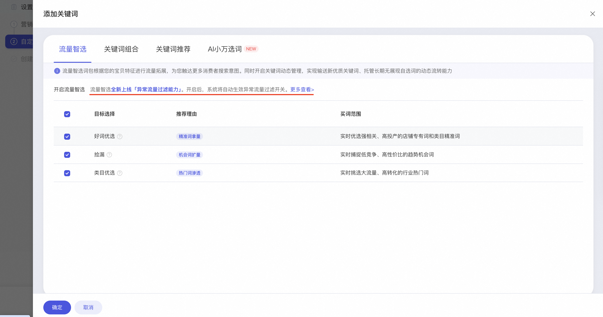
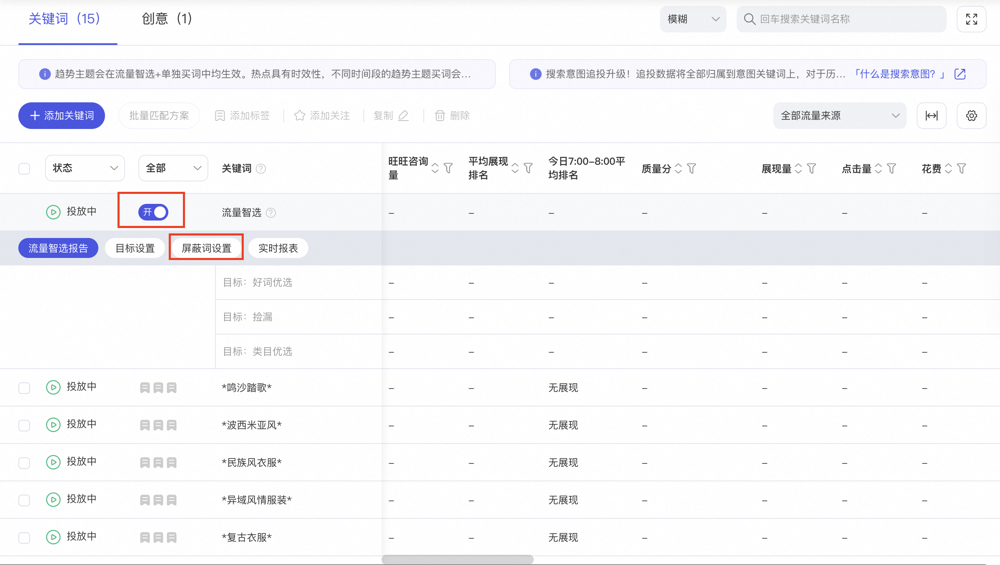
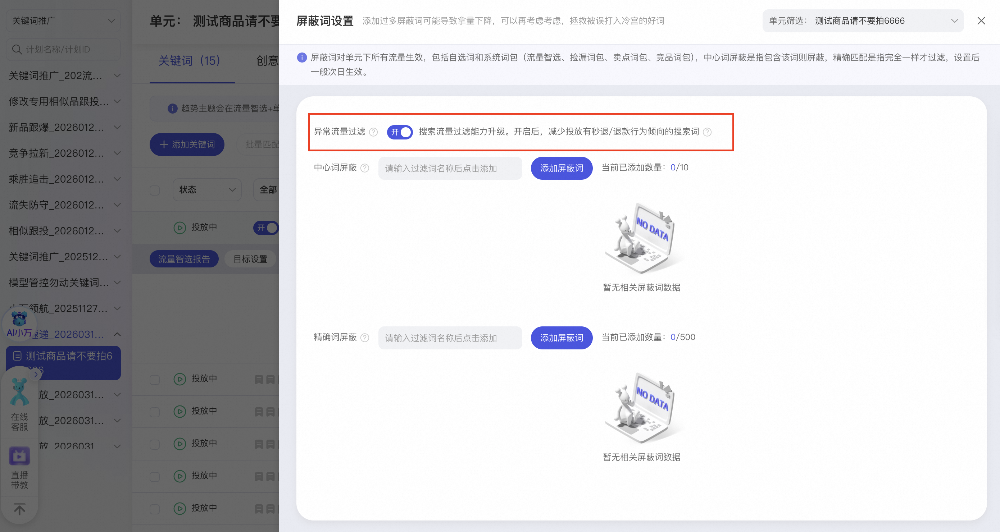
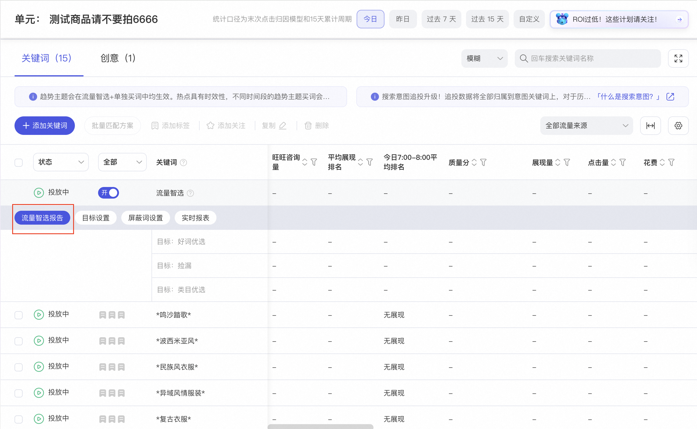
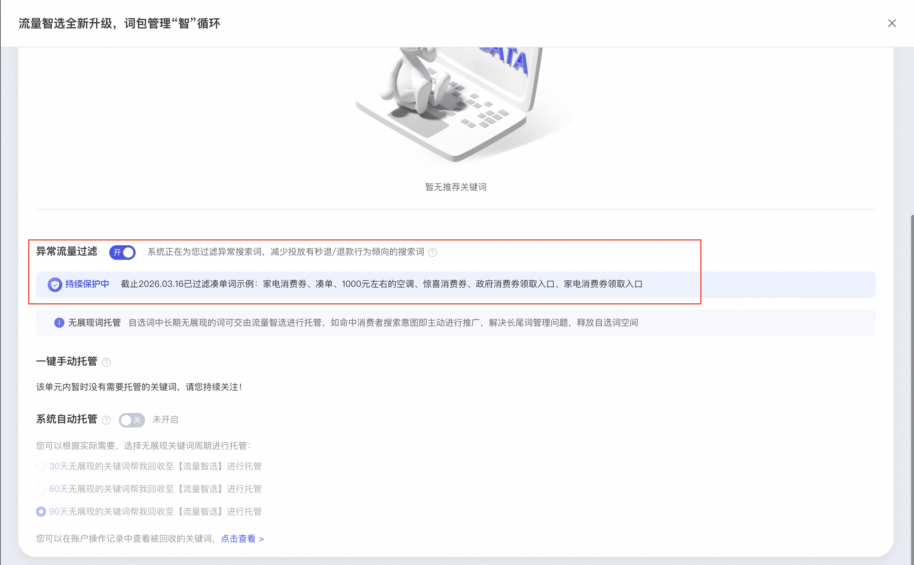

# （内测报名已结束）流量智选 上线「异常流量过滤」能力

> 来源：https://alidocs.dingtalk.com/i/nodes/gvNG4YZ7Jnxop15OCqeZ01vyW2LD0oRE

😫你是否在激烈的竞价环境中感到疲惫😫
不仅要应对激烈竞争，还要时刻提防看不见的“恶意点击”

**让原本就紧张的推广预算雪上加霜？**

😭你是否有过“防不胜防”的挫败感：😭
明知有异常流量在作祟，却缺乏有效的技术手段进行拦截

**只能眼睁睁看着推广费打水漂？**

🙏**你是否期待一位全天候的“流量守门人”**🙏
能在毫秒级时间内识别并拦截异常行为，为你筑起一道坚固的防御防线

**让你能心无旁骛地专注于产品与运营！**

**万相台无界 - 关键词场景 「流量智选」升级**

**上线「异常流量过滤」能力**

**一键即可****减少投放有凑单/秒退行为倾向的搜索词**

**让每一分搜索投入都听见回响**

**一、什么是「异常流量过滤能力」**

异常流量过滤能力是关键词推广-「流量智选」下全新上线的过滤能力。商家**在开启流量智选后**，通过屏蔽词可以一键开启「异常流量过滤能力」，系统自动识别有明确凑单倾向且秒退款率异常高的搜索词（例如凑单、满减等），并减少投放。

**二、如何开启**

**新建计划**：在创建新计划时，开启「流量智选」功能系统将自动为你生效「异常流量过滤能力」

**适用场景包含：关键词推广场景下的流量智选均可使用*

**存量计划**：在单元计划列表下，开启「流量智选」后->选择「屏蔽词设置」->开启「异常流量过滤能力」

*注：未开启「流量智选」，「异常流量过滤能力」不生效*

**三、如何查看过滤的词**

**【流量智选报告】- 【异常流量过滤】**

开启「流量智选」后，在「单元列表」下可以通过「流量智选报告」查看「异常流量过滤」具体有哪些词被过滤

**更多问题，可入群讨论（钉钉群号： 171525013854）：**

**--- 内测报名已结束，请商家关注后续产品进展。谢谢**
