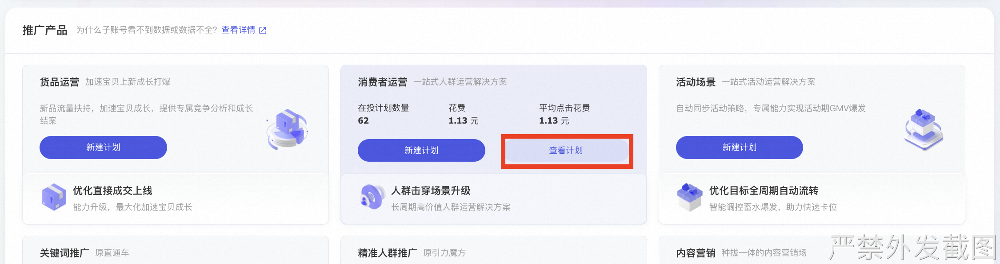
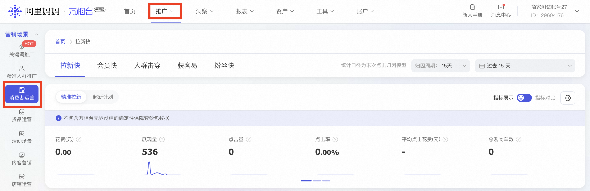

# 消费者运营问题

> 来源：https://alidocs.dingtalk.com/i/nodes/14lgGw3P8vxjwogPCDNpkEp6V5daZ90D

**原语雀文档链接：**https://yuque.antfin.com/chenchun.chen/gqhty9/vb46onx5eo79d8kg

---

#### 如何查看消费者运营的所有计划？

首页下拉「消费者运营」场景->「查看计划」

或 点击顶部「推广」-「消费者运营」

可编辑计划或查看所投放计划数据和结案、创意等

#### 如何查看消费者运营的相关结案报表？

查看入口：「报表」-「消费者运营」

目前「拉新快」和「会员快」可以正常查看结案和下载报表，

「粉丝快」的结案可以在下载管理中下载查看，

「人群击穿」的报表结案小二会尽快上线的~

|  |  |
| --- | --- |

#### 为什么设置了侧重投放人群，还是会在万相台智能人群有更多的呈现？

万相台是全域智能黑盒人群投放，算法会优先触达对店铺优化目标最有价值的人群，达到场景下优化目标为最高优先级投放，因此对于所选的定向人群不会保持固定的触达比例和消耗比例，但不代表投放效果不好。建议商家关注场景下对应优化目标的表现。

#### 为什么在高级设置中设置不投放的时间段，还会产生消耗？

设置不投放时间段是指在这段时间不侧重投放，并不是完全不投放，因此可能会存在有少量消耗的情况 ，属正常现象，请安心投放。
