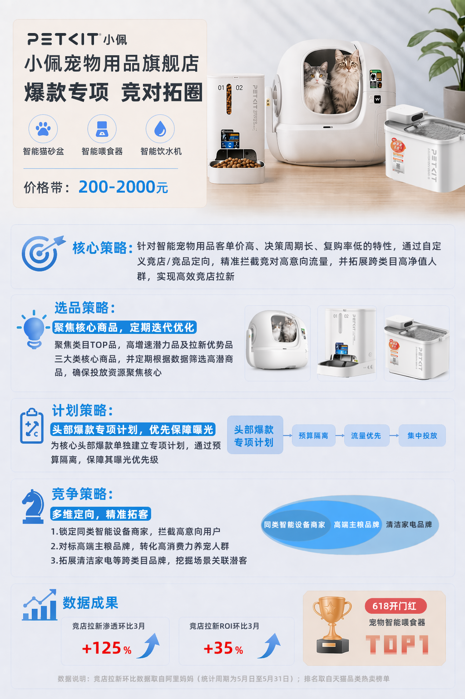
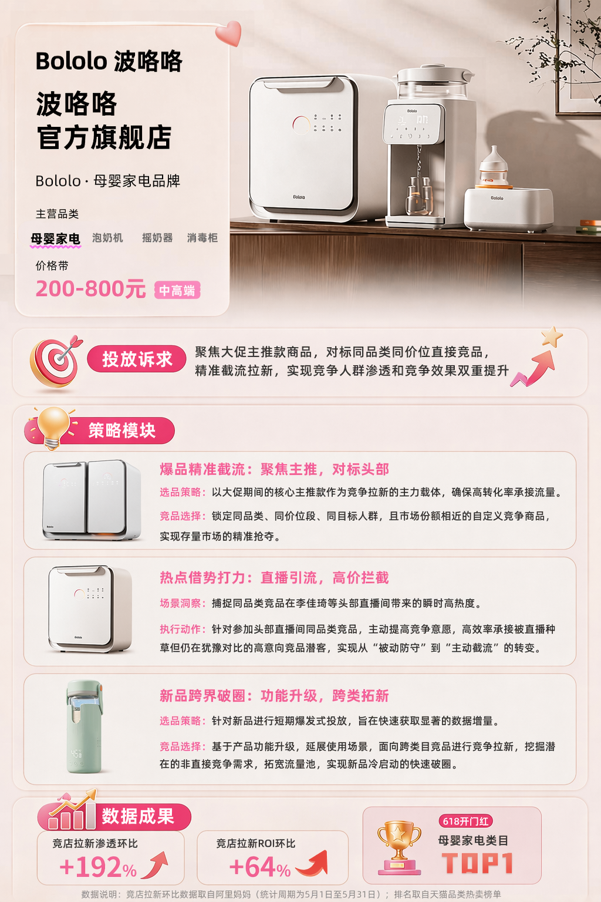
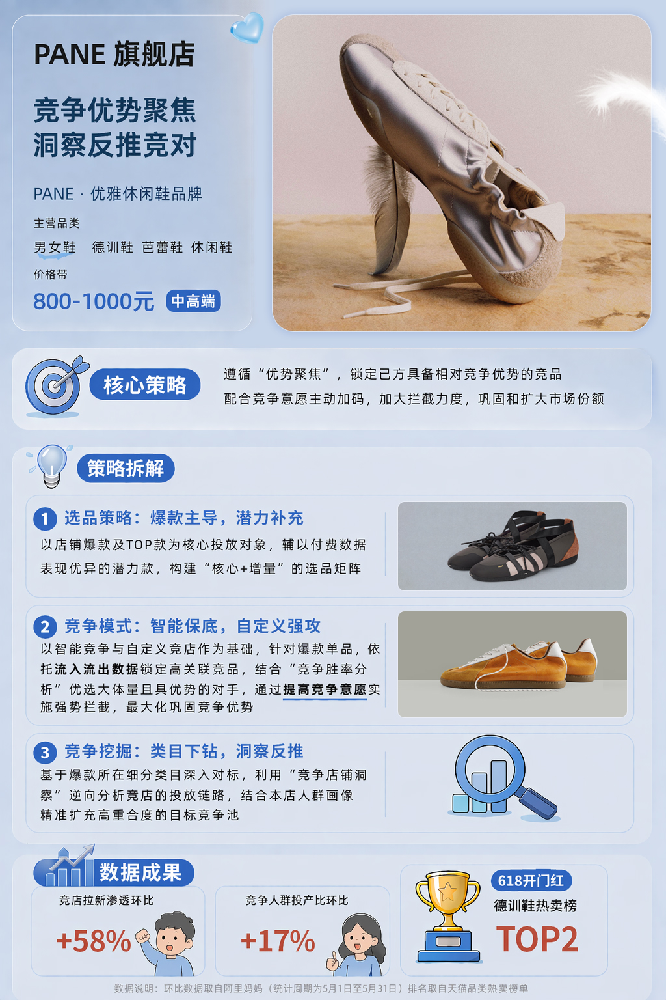
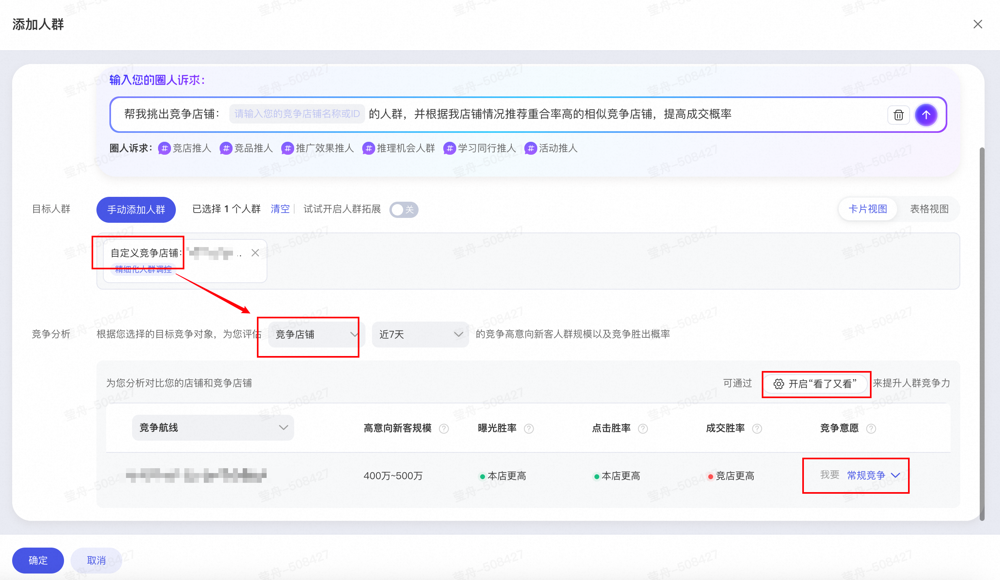

# 【竞店拉新】新增投前胜率洞察，精准截流竞对“临门一脚”新客！

> 来源：https://alidocs.dingtalk.com/i/nodes/14lgGw3P8vxjwogPCvz2vrolV5daZ90D

## ** ****一、618 实战案例**

### ** ****宠物用品标杆策略：竞店拉新多维破圈，锁定高净值竞店新客实现大促渗透****+125%****！**

### **母婴家电标杆策略：爆品精准截流与直播热点拦截，驱动竞店拉新渗透****+192%****！**

### **男女鞋标杆策略：竞店拉新优势聚焦，自定义强攻拦截实现精准扩圈，竞争渗透环比****+58%****！**

## ** 二、产品升级能力简介**

### **1.投前胜率洞察 **** **

| **竞对胜率预判，投前看清胜算，让每一分预算都花在刀刃上！** | 商家原声：我们希望**将有限的预算精准聚焦在具备竞争优势的竞品上。**目前担心使用航线投放时，若对竞争力不足的竞品盲目拉新，容易陷入竞争劣势，造成预算无效消耗。 商家原声：目前我们主要靠竞品的流入流出数据来判断它的重要性，但这只是“事后看流量”，**缺少投放视角下的竞争预判**——比如：**我到底有没有能力打赢？更关键的是，打赢之后能带来多少真实增量？**毕竟，如果对手是个“小透明”，就算我胜率100%，抢来的用户也没多少，根本不值得大把预算砸进去。 |
| --- | --- |

| **Q：如何通过这些指标快速判断：该竞品到底值不值得我投入资源？应该列为高优、中优，还是可以暂时忽略？** A：可参考以下竞争判断和建议： **胜率组合****竞店高意向新客规模****竞争建议****原因**曝光↑+ 点击↑ + 转化↑大✅ 强势竞争，设为“高优先级竞对”全链路占优 + 人群池大 = 高ROI增量机会曝光↑ + 点击↑ + 转化↑小⚠️ 常规竞争，不必重投入虽能打赢，但天花板低，投入产出比有限曝光↑ + 点击↓任意🔧 先优化主图/利益点，再评估流量入口能抢到，但点击弱，需提升吸引力曝光↓ + 转化↑大🔍 小预算测试 + 搭配内容/搜索卡位引流商品力强、人群多，缺的是曝光破冰曝光↓ + 转化↑小❌ 暂不主攻，可追踪观察人群基数小，即使转化好也难起量，收益不高三项均低大🧪 谨慎测试（尤其是本品是新品的情况）可能因新品数据冷启动导致误判，小跑验证三项均低小❌ 直接跳过，聚焦高潜力竞对既打不赢，又没多少人 |
| --- |

### **2.竞争意愿表达 **** **

| **支持主动表达竞争意愿，实现分层竞争、精准打击！** | 商家原声：我们面对的竞品不一样，打法也不一样，希望能有一个机制让我们**明确表达竞争强度意愿**，而不是一视同仁，确保关键战役打得准、打得赢。 商家原声：像春招季、双11这些关键节点，用户正在疯狂比价、看竞品、准备下单，我们希望能在这些**关键节点提前标记好重点竞品加强竞争**，在这些高意向流量爆发期主动卡位，比如在竞品详情页下方抢到“看了又看”的曝光，把犹豫的用户直接截过来。错过这个窗口，再拉新成本就高多了！ |
| --- | --- |

**Q：什么场景下适合主动表达竞争意愿的诉求？**

A：在**关键对手、关键时段、关键商品**上掌握竞争主动权：

**大促期间的头部品牌攻防战**：某国产美妆品牌在“D11”期间将国际大牌A列为头号竞对，希望在XX类目集中火力截流其高意向用户。此时可通过设置“我要强势竞争”竞品A-XX大单品人群（航线/达摩盘人群），争取更多曝光资源和胜率加权。

**新品上市对标行业标杆**：一家新锐扫地机器人品牌推出旗舰新品，直接对标国产品牌B的某爆款SKU。为快速建立市场认知，希望在投放中明确表达“强势竞争”意愿，从而优先获得该竞品商品详情页下方黄金推荐位——“看了又看”的曝光资源，高效拦截高价值流量，抢占用户决策心智。

**细分市场争夺战**：某中高客单的女装品牌聚焦25–35岁职场女性，希望在春招/跳槽季对头部快时尚品牌爆款西装集开启分层竞争，通过“看了又看”精准曝光其抗皱垂感、耐看不过时西装，集中预算打透高净值职场人群。

**防御性竞争**：某母婴品牌发现新兴DTC品牌C正以相似定位抢夺其核心客群，虽非行业巨头，但对其细分人群威胁极大。需标记为“高危竞对”，触发更激进的反制策略。

### **3.“看了又看”资源位加持 **** **

商家原声：**商品详情页下面那个“看了又看”位置太关键了**——用户都逛到竞品详情页了，说明马上要下单了！我们特别想知道：怎么才能抢到这个黄金位，**守在竞品门口**，把那些“手已经放在购物车”的高意向用户直接截过来？

| **接入竞争黄金资源位——“看了又看”曝光加权！** | **Q：“看了又看”资源位在哪？**A：位于竞品商品详情页下方的黄金推荐区域。开启后，您的商品将有机会在该位置优先展示，直接触达正在浏览竞品的高意向用户。 |
| --- | --- |

**Q：打开“看了又看”资源位会不会导致获客成本明显上升？**

竞争环境决定成本波动：

低竞争市场：当投放竞对商家较少时，「看了又看」资源位因位置优质、转化率高，开启后成本波动较小；

高竞争市场：当投放竞对商家密集时，竞争加剧可能导致开启后成本小幅上升，但可通过优化投放策略平衡成本与曝光优先级。

核心建议：

评估竞争热度：通过平台提供的胜率预判和竞争激烈程度等数据，动态调整投放策略；

精准选择竞品：根据市场竞争关系，选择差异化竞品/非直接替代品类或针对性投放自身具有明显优势的竞品，降低竞争压力。

### **4.多元人群圈选 **** **

商家原声：我们习惯在达摩盘中圈选竞对人群，因为能基于用户行为、消费力等多维标签，**构建更精准、更符合业务动态需求的竞争人群包**。希望「竞店拉新」能支持接入达摩盘人群，以满足我们在差异化竞争拉新场景下的精细化运营诉求。

| **支持添加达摩盘人群和竞争航线人群，精准锁定竞对高意向新客！ ** | 升级前：仅支持添加竞争航线人群 |
| --- | --- |

| **Q：推荐使用「竞争航线人群」还是「达摩盘人群」？** A：选择哪种人群圈选方式，取决于您**是否已有明确的竞对目标**，以及**对竞争策略精细度**的要求： **若暂无明确竞对对象 → 推荐使用 「竞争航线-智能竞争人群」**。 系统将基于实时数据，智能识别与本店人群重合度高、且存在竞争关系的店铺或商品，并自动圈选其互动人群。这种方式无需手动配置，适合快速启动、高效截流泛竞争流量。 **若有明确竞对对象，且希望定向打击**** ****→ 可选择 自定义竞争店铺/宝贝，或通过 达摩盘（DMP）圈选人群。** 两者均能实现更有指向性的竞争拉新，但适用场景略有不同，求快求效投放竞争航线人群，求准求精投放达摩盘人群 **若不仅有明确竞对，还追求更高灵活性与精细化运营**** ****→ 推荐使用 达摩盘（DMP）人群。** 您可在DMP中叠加多维标签（如行为、兴趣、消费力、品类偏好等），精准构建“高意向+高转化潜力”的竞争人群包，实现更细粒度的定向投放，满足复杂或定制化的竞争拉新需求。 |
| --- |

### **5. 投后效果追踪**** **

商家原声：投了竞对之后，怎么快速知道：我到底打得过打不过？优势是在扩大还是被反超？

| **投后1v1竞对胜率趋势追踪，动态优化竞争策略！** | **Q：如果胜率状态变动不大，对我的投放还有指导意义吗？**A： 即使状态看似稳定，也建议在开启竞店拉新计划后持续追踪——因为“不变”本身就是一种信号。例如，长期“优势扩大”说明策略有效，可放心加投；而持续“持平”可能意味着陷入拉锯战，需考虑差异化破局。结合清晰的状态应对指南，您能更主动地优化投放节奏，而非被动等待变化。 |
| --- | --- |

## ** 三、产品操作指南**

| **步骤** | **详情** |
| --- | --- |

| 新建人群推广计划 | *新建*高效拉新-竞店拉新推广方案 |
| --- | --- |

| 选择推广商品 | *选择商品，建议选择本店高竞争力宝贝* |
| --- | --- |

| 设置拉新人群 | *选择人群，可自定义圈选人群或使用AI圈人，均支持投前1v1竞对分析* |
| --- | --- |

| 竞争状态追踪 | *人群推广首页 -> 推广解读 -> 竞争店铺/宝贝胜率透视* |
| --- | --- |

## ** 四、问题反馈通道**

| **加群反馈使用问题** 如您在使用过程中遇到问题，或有任何产品优化建议，欢迎随时反馈至「妈妈客服」或加入右侧钉钉答疑群，我们将安排专人跟进处理，感谢您的理解与支持！ |  |
| --- | --- |

## ** 五、Q&A**

**Q：本次产品升级只对新建计划生效吗？**

A：不是，存量计划也生效；

存量计划修改入口：计划详情 -> 添加人群 -> 竞争分析 -> 修改竞争意愿或「看了又看」资源位

