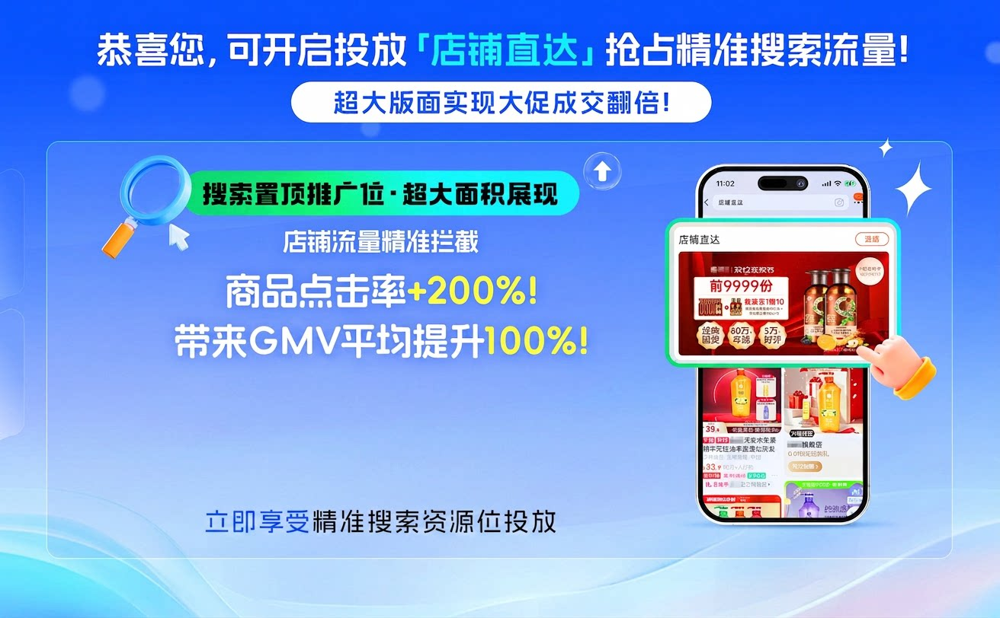
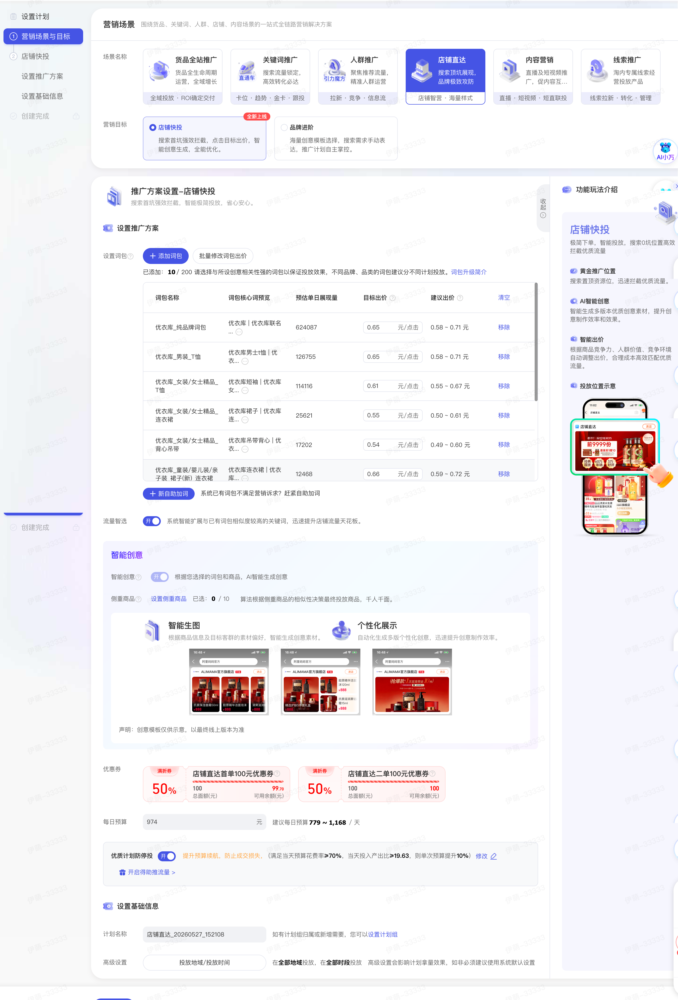

# 【店铺快投】高效获取品牌目标人群，搜索首坑置顶展现！

> 来源：https://alidocs.dingtalk.com/i/nodes/20eMKjyp810mMdK4H4Q9MRQvJxAZB1Gv

店铺直达场景焕新升级，构建“快投提效+进阶可控”双引擎。

**「店铺直达焕新升级」**预计6月中陆续开通客户，请耐心等待。

“店铺直达焕新升级内测”群的钉钉群号：171850010186

## **一、****核心升级内容**

为提升商家在搜索置顶资源位投放效率，降低操作门槛，店铺直达进行了底层逻辑与交互体验的全面升级。解决“创意制作难、出价策略单一”痛点，通过智能出价和智能创意，助力商家轻松获取搜索黄金资源位流量。**本次主要升级点：**

🔥**新增店铺快投营销目标**，店铺快投极简智能计划，品牌进阶手动计划，**智能、手动推广计划**满足不同商家投放诉求。

🔥店铺快投极简投放，**智能出价和智能创意**，助力商家轻松获取搜索黄金资源位流量。

| **店铺快投** 黄金位置展示，点击目标出价，智能创意生成， 极简投放。 | **品牌进阶** 海量创意模板选择，手动设置，自主可控， 精细调优。 |
| --- | --- |

| **升级维度** | **升级前痛点** | **升级后价值** |
| --- | --- | --- |
| 操作效率 | 需制作多尺寸白盒创意，流程繁琐，渗透率低。 | 智能生成创意，操作门槛大幅降低。 |
| 成本控制 | 出价策略单一，缺乏竞争力。 | 综合流量价值、商品竞争力，新增围绕目标出价智能调价。 |
| 投放效果 | 依赖人工经验，两极分化严重。 | 算法全域优选，点击率、转化效果充分提升。 |

## **二、 ****搜索结果页置顶展示&****两大营销目标，满足不同商家投放诉求**

品牌词、品牌品类词【搜索结果页-置顶展示位】100%展现，高效收割精准搜索流量，助力店铺GMV提升！

#### **1、店铺快投，极简投放。**

针对以往创意制作成本高，新增“店铺快投”营销目标。

**全自动智能创意，告别作图烦恼。**

零门槛创建：无需手动设计多尺寸素材。系统将根据您选择的推广商品，自动抽取主图并生成高点击率的智能创意（支持单品AI大图及多图模板）。

动态优选展示：根据商品信息（如商品白底图、详情、视频）以及目标客群的素材偏好，自动生成更个性化的创意素材。实时调整展示的创意内容与商品组合，确保每一次曝光都精准匹配用户需求。

**智能出价，提升预算效果。**系统基于实时竞价环境，综合流量价值、商品竞争力、历史成交转化等，为您推荐最优参考价，智能优化投放效果，提高流量价值，提升预算效果。

**极简操作流程，聚焦核心决策。**系统会结合算法推荐与您手动选择的商品，自动去重并锁定最佳推广组合。在预算范围内，让推广效果大幅提升。

#### **2、品牌进阶，****海量创意模板选择，手动设置，精细调优。**

原有“自定义推广”（手动制作创意）依然保留。

黄金推广资源位，搜索置顶资源位，快速拦截优质流量。

自主可控，海量优质创意模板自主选择，手动设置关键词包与出价，灵活调整投放策略。

## **三、 操作指引**

**店铺快投**

进入店铺直达—店铺快投—选择词包（系统默认词包，也可无需操作）—设置出价—设置智能创意（系统默认设置，无需操作）—设置地域/投放时间（系统默认全部地域、全部时间，也可无需操作）—一键设置成功。

## **四、常见问题**

1、店铺直达的计费模式是什么？

|  | **店铺快投** | **品牌进阶** |
| --- | --- | --- |
| **出价** | 点击出价，系统默认点击出价，客户可在系统建议出价范围内手动设置可接受的目标出价，出价高者竞得资源位。 | 展现出价，店铺直达的词有最低的起拍价，平台会参考当前市场竞争度、流量数据、产品成本等情况，不定时调整起拍价,客户可以勾选词包并进行出价系数的设置，最终展现出价系数设置更高的店铺。 |
| **扣费** | 点击扣费，平台参考当前市场竞争度、流量数据、产品成本等情况，最终扣费围绕客户目标出价有上下浮动。 | 展现扣费，店铺直达按千次展现计费，无展现不计费。如果千次展现成本=100元，即每千次展现收费100元。会和明星店铺计划竞价，出价高者竞得资源位。 |

2、店铺直达商家准入有哪些要求？需要上传哪些资质？详情查看：

3、词包生成时效与产词逻辑

| 系统产词 逻辑 | 品牌词包：系统根据您的授权品牌、主营商品类目自动扩展而成（不收录搜索量过小的词） 自助加词：可根据您的品牌、主营商品类目添加品牌词、品牌品类词 注意：特殊情况下如果授权品牌词相关性较差将无法生成词包。 |
| --- | --- |
| 系统产词 时效 | 天猫店铺：天猫店铺自动同步品牌授权（3-5天生成词包），也可以通过后台提交品牌授权资质（在资质通过之后4-6天生成词包） 淘宝店铺：淘宝商家请通过后台提交品牌授权资质（在资质通过之后4-6天生成词包），即商标注册证（R标）、商标持有者主体证明、商标使用授权书。 |
