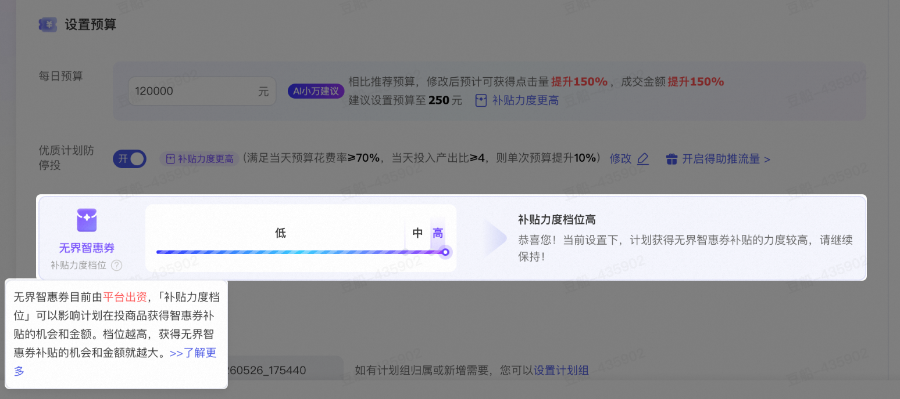
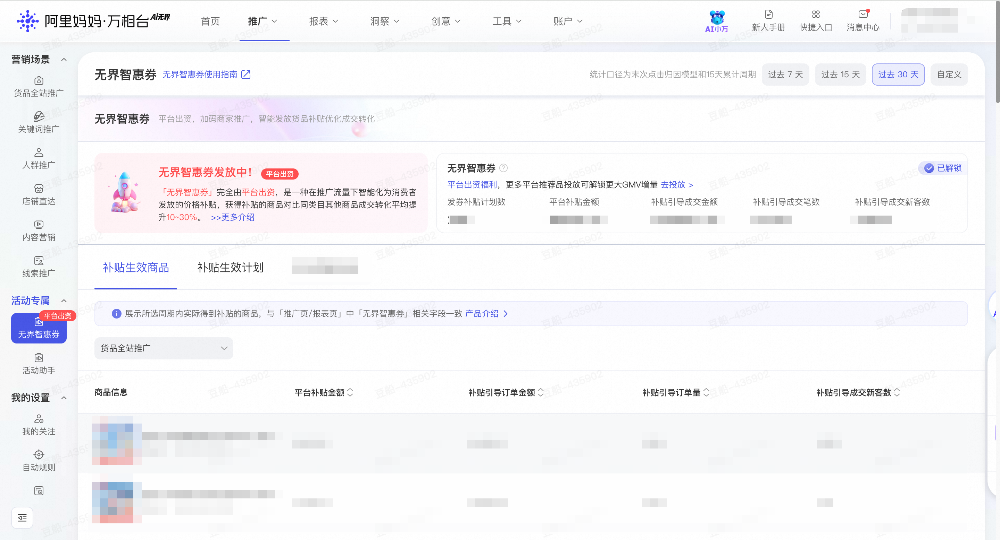

# 关键词推广智惠券攻略-618平台出资补贴、多投多补

> 来源：https://alidocs.dingtalk.com/i/nodes/20eMKjyp810mMdK4H4erEQPZJxAZB1Gv

## 一、补贴背景

618 大促期间，为更好地助力商家朋友们的生意增长，平台针对**关键词推广产品**加码**专项智惠券**补贴活动，**由平台出资，帮助商家智能化为消费者发放补贴**，在不额外提升商家运营成本的前提下，帮助商家在搜索流量高峰期间获得更高的成交转化。

怎么样能获得更多的智惠券补贴？怎么样能更好和关键词推广形成合力？为帮助商家更好地理解智惠券发放规则并最大化补贴收益，小二整理了以下核心注意点，请大家参考调整。

💰 **收益说明**：通过提升出价策略，商家可在不增加实际成本的前提下（平台承担补贴），获得更高营销质量的搜索流量和更高的智惠券补贴额度，实现「高营销质量流量 + 高补贴」双重收益。

## 二、如何提升「关键词推广智惠券」补贴力度？

### 攻略点1：提升计划出价，出价越高越能拿到高营销质量流量和补贴券

**在关键词推广中，****出价水平****直接影响智惠券发放比例和补贴力度****。**

**核心逻辑**：**出价越高**，系统越能够为商家匹配高营销质量的搜索流量，同时提升获得平台智惠券补贴的概率。

**控成本/手动出价计划**：在设置控成本目标时，采纳平台推荐值，提高出价上限，确保在大促高竞争关键词场景下仍能获得充足曝光，提升补贴力度。

**控投产出价计划**：采纳平台推荐值、合理调整ROI出价可吸引更多高意向用户点击，进而提升整体转化效率与补贴获取机会。

**流量质量**：高出价能够触达搜索意图更明确、购买意愿更强的优质用户群体，这些用户不仅转化率高，也更易触发平台智惠券的智能发放机制。

**⚠️风险提示**：若手动设置出价显著偏离系统推荐值，可能导致智惠券补贴额度下降，甚至无法享受本次 618 专项补贴。

### 攻略点2：关键词推广投放增量消耗越多，可获得更高的智惠券补贴力度

**商家在 618 期间关键词推广的****投放增量****与智惠券补贴力度直接挂钩。**

**计算逻辑**：以商家在 618 活动周期内的关键词推广实际消耗金额为基准，相比历史消耗的增量部分，将作为智惠券补贴额度的重要计算依据。

**补贴梯度**：关键词**增量消耗越高**，可享受的智惠券补贴比例与额度越高。

**行动建议**：

**618 爆发期加大关键词推广投放预算：**把握搜索流量红利窗口，实现「消耗越多、补贴越多」的正向循环。

**关键词计划开启优质计划防停投 / 自动规则：**设置合理的预算调整触发条件，提升补贴力度。

**关注计划的补贴力度档位：**根据平台建议优化计划设置，拿到更高补贴力度档位，获得更多智惠券补贴！

📈 **关键提醒**：确保账户余额充足，避免因预算中断导致投放断档，影响消耗统计与补贴获取。

### 攻略点3：大促期间关键词推广智惠券补贴力度大幅提升，投放关键词推广即有概率拿到平台补贴

**本次大促，智惠券对关键词推广的计划、货品实现了****补贴覆盖扩张 & 力度提升****。**

**覆盖扩大**：只要货品处于**关键词推广投放状态中**，平台将采用智能算法，对投放中的商品、计划进行实时评估与随机激励，**高潜力商品**获得补贴的概率将进一步提升，发券覆盖的商品/计划范围也显著扩大。五月以来发券规模提升**+34.0%**！

**智能计划补贴加成**：采用智能出价的计划（如流量金卡、趋势明星、搜索卡位、相似品跟投等），系统在发放智惠券时将给予更高的补贴力度，帮助商家以更低的实际成本获取搜索流量下的成交转化。

**策略建议**：广铺关键词、优质货品全投放、重点优化计划关键词质量分与创意素材，让每一个货品都有机会在 618 期间脱颖而出。

**总结一下：**

| **关键动作** | **对应补贴收益** |
| --- | --- |
| 控成本及手动计划提高出价；控投产出价采纳平台推荐值、合理调整ROI出价 | 获得高营销质量流量和更高补贴概率 |
| 加大 618 期间关键词推广投放消耗，开启自动规则与优质计划防停投 | 增量消耗越多，补贴越高 |
| 将更多优质货品、优质关键词纳入关键词推广投放，提升智能出价计划占比 | 每个计划、每个货品都有机会获得平台补贴 |

请各商家务必把握 618 大促窗口期，按照以上关键动作优化关键词推广投放策略，最大化平台智惠券补贴收益，实现生意增长!

---

## 三、无界**智惠券介绍**

**基础介绍：**「无界智惠券」由万相台·AI无界推出，是**深度结合推广与营销的全新一代补贴型工具**。目前由平台全额出资，智能化发券，以补贴形式降低**推广渠道**中商品的到手价，从而提升消费者下单转化意愿，带来商家生意的增长。

**系统会智能化根据平台实时补贴额度、商品竞争力、用户来访频次、用户优惠享受情况、商家计划设置情况（计划补贴力度档位）以及在阿里妈妈的投放消耗等综合因素，对无界在投的商品智能发放补贴。*

| ** ****核心价值点：** **推广与营销深度结合，形成合力****平台承担成本，优化商家与消费者体验****机制明确可参与性强，多投多补！** 推广与营销能力进行深度联动，将推广的精准流量与营销工具的智能化降价结合，达成1+1> 2 的合力效果，带动生意增长！平台出资补贴，消费者到手价更实惠、购买意愿更高；商家每单实收不变但获得更多成交转化，体验双双优化！无界后台展现计划补贴力度档位，并且有明确优化路径，更合理的计划设置 -> 更智能化的补贴发放 -> 更多补贴带来更好生意！ |
| --- |

### **商家维度的无界智惠券**

|  | **智能发放：**无界智惠券由系统智能化判断是否发放和具体发放金额，具体会根据**商家计划补贴力度档位**、平台实时补贴额度、商家无界账户余额、商品竞争力、用户来访频次、用户优惠享受情况、商家在阿里妈妈的投放消耗等综合因素，对无界在投的商品智能发放补贴。 **计划补贴力度档位：决定无界智惠券是否发放和发放金额的重要参考**，可在新建、编辑计划时查看，主要由计划出价/投产比目标、计划预算、自动规则/计划防停投设置决定，在无界后台的计划创建、编辑、列表页面均可查看，根据诊断优化计划设置即有机会获得更多无界智惠券补贴！ |
| --- | --- |

### **消费者视角的无界智惠券**

|  | **全购买链路展现，显著氛围提升点击/转化效率** 无界智惠券在消费者**搜索、推荐、商详页**等购买链路的关键环节中均有展示，显著的前台氛围带来消费者的点击/转化率提升。 名称上表达为**“限时补贴” / “平台礼金补贴”**，以降低补贴券可能带来的破价、控价影响。 |
| --- | --- |

### **查看无界智惠券的独立阵地**

**生效商家：**本使用说明仅适用于严格遵守阿里妈妈各项推广规则以及智能券相关规则的商家，如经阿里妈妈合理判断，认定商家存在显著作弊风险或已实施明确的作弊行为（包括但不限于虚假交易、刷单、套取补贴、数据造假等），平台有权立即暂停、撤销或永久取消该商家当前及未来获取、使用“无界智惠券”的全部资格，限制或追回已发放权益。平台保留依据违规情节采取其他必要措施的权利。

在万相台·AI无界后台，推广 - 活动专属 - 无界智惠券页面是无界智惠券的独立产品阵地，商家可以在这里可以查看到店铺整体的补贴数据、分商品 & 计划的明细数据；

---

*如有疑问，请联系对应阿里妈妈客户经理或咨询关键词推广官方客服。*

**关于智慧券的完整介绍，更多QA可看：**无界智惠券升级上线，平台出资、多投多补
