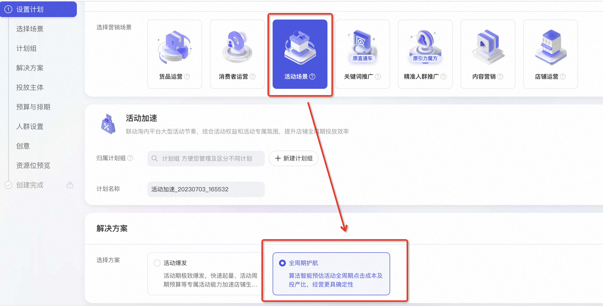
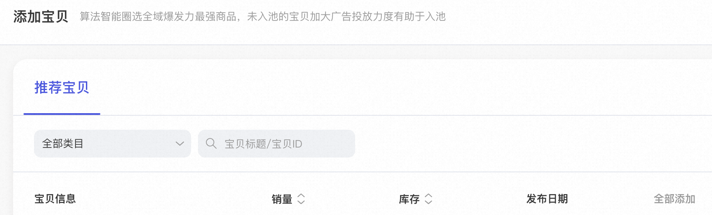
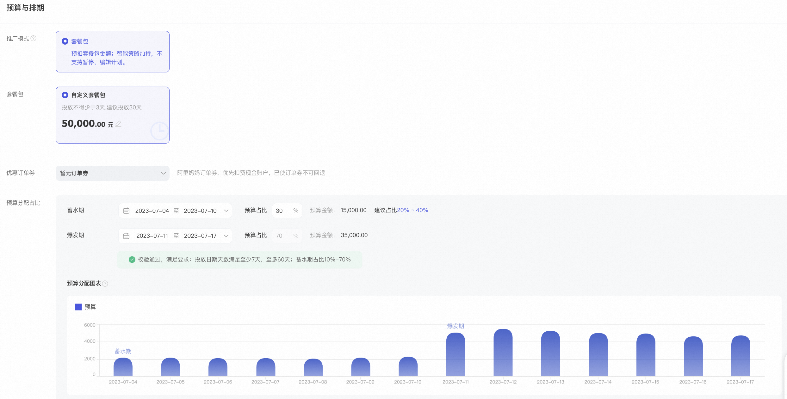
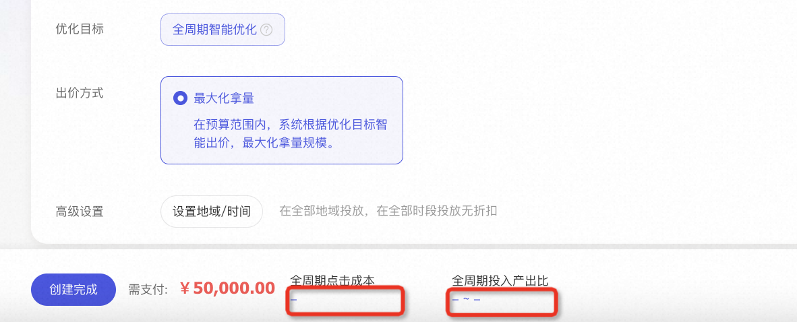

# 05-2-全周期护航

> 来源：https://alidocs.dingtalk.com/i/nodes/20eMKjyp810mMdK4HYp4ljnOJxAZB1Gv

**原语雀文档链接：**https://yuque.antfin.com/chenchun.chen/gqhty9/ggzkx23uoootagnu

---

# 操作介绍

### 1.选择场景

万相台首页选择“新建推广计划”，并在营销场景中选择“活动场景 - 全周期护航”**（仅开放给受邀商家）**

### 2.选择商品（未入池宝贝不可投放）

单计划可支持添加最多10个商品

### 3.设置活动全周期预算并调整蓄水/爆发期费用比例

### 4.获取全周期点击成本和投入产出比（调整投放宝贝和蓄水/爆发占比会影响到预估效果）

### 5.计划数据页面可查看不同人群的行为数据和效果数据（人群数据T+1更新）

#

#

#
