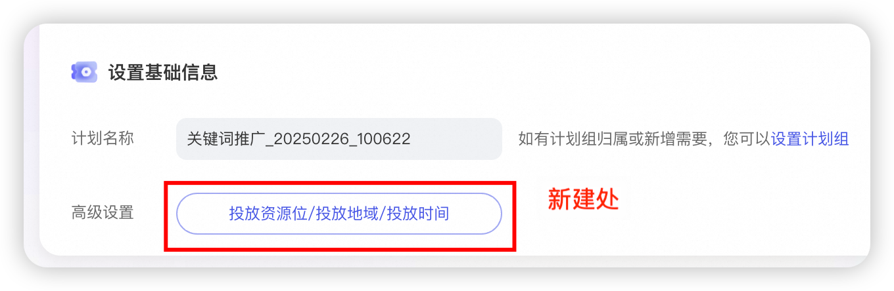
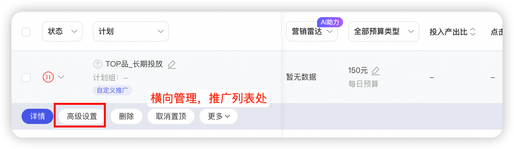
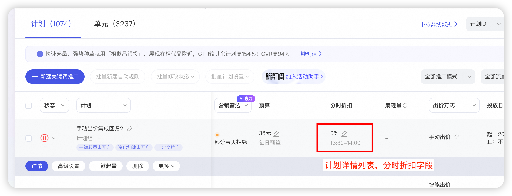
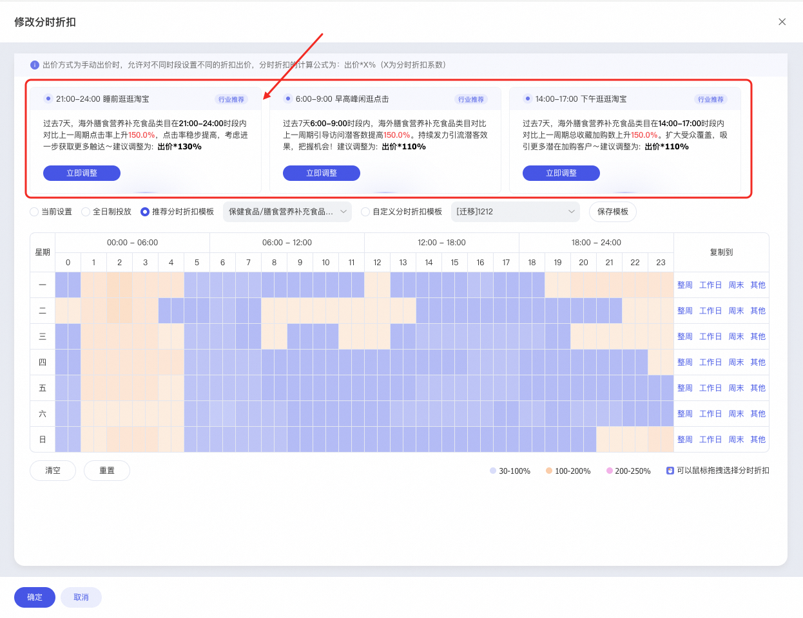
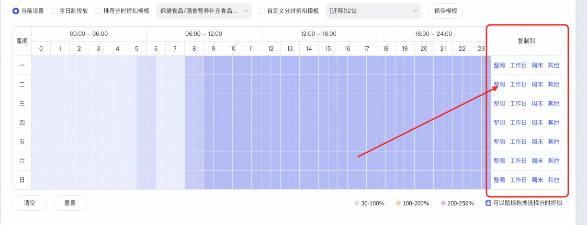

# 关键词推广【分时折扣】升级

> 来源：https://alidocs.dingtalk.com/i/nodes/20eMKjyp810mMdK4HkY1eB3MJxAZB1Gv

钉钉商家群：126415003880

# **一、操作入口**

方式一：关键词推广→新建计划→高级设置

方式二：关键词推广→计划列表→高级设置

方式三：关键词推广→计划列表→修改分时折扣

# **二、升级亮点**

### **1、优质时段推荐**

注意：优势时段推荐，不是必出的。原因：①智能出价计划若全时段投放，则不出建议。②若系统判断好动或智能计划，无优质时段推荐，则不会出现优质时段的建议。

### **2、上线「批量复制」能力**

支持「整周、工作日、周末、其他」的复制能力

举例：设置「复制到工作日」，则说明您将今日的分时折扣设置复制至工作日，只要是工作日都会是这套分时折扣模版。

