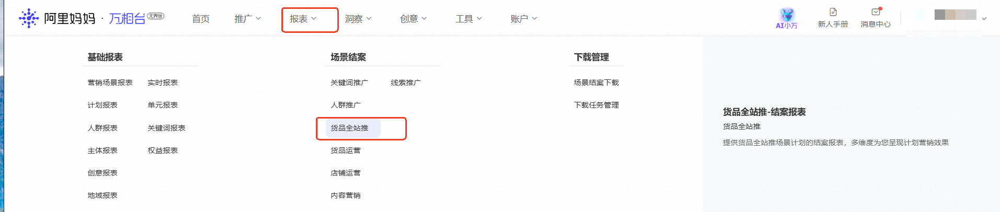
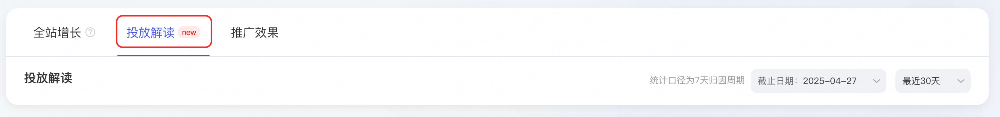
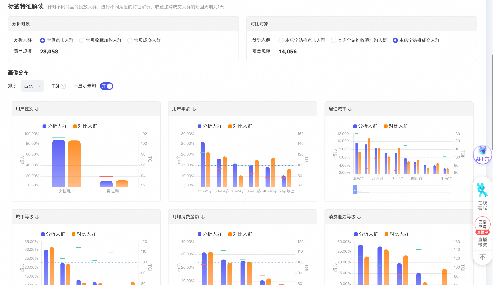
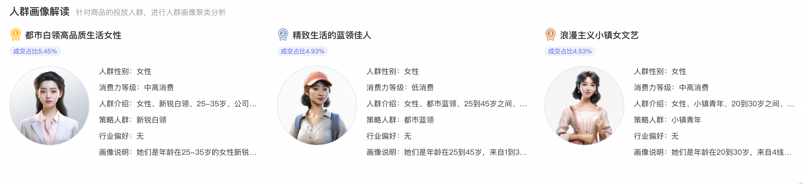
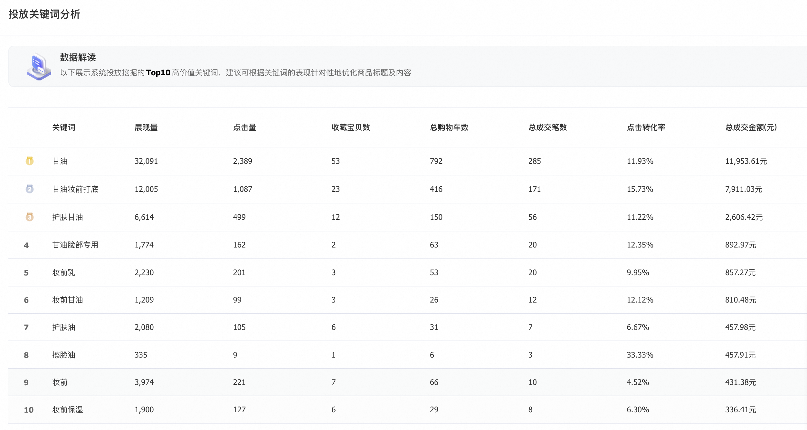
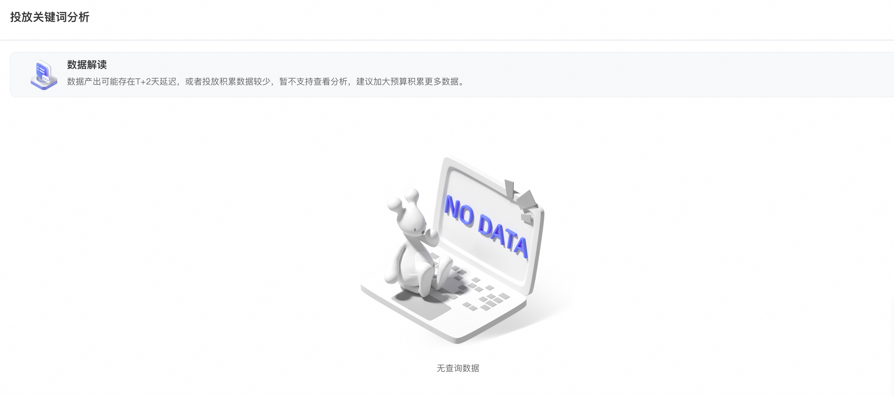

# 【重磅升级】货品全站推广「投放解读」功能上线——让每一份预算都清晰可见

> 来源：https://alidocs.dingtalk.com/i/nodes/2Amq4vjg89jyZdNnCrppQPZ3W3kdP0wQ

**【重磅升级】**

**货品全站推广「投放解读」功能上线——让每一份预算都清晰可见**

您是否因看不到具体的人群画像和关键词数据，导致无法精准优化策略，投中缺乏安全感？

全新升级！货品全站推广「投放解读」板块正式上线

为解决您的核心困扰，我们重磅推出**投放解读**功能，实现流量投放的**透明化、可分析、可优化**，让效果真正“**看得见、控得住**”！

| **升级前** **投放过程不透明**：推广究竟推给了谁？哪些关键词真正有效？原投放模式下，商家只能“凭感觉”调整策略。 **数据反馈缺失**：缺乏清晰的用户画像和关键词效果分析，难以针对性优化商品的预算出价，ROI提升遇瓶颈。 **安全感不足**：流量效果波动时，无法快速定位问题，决策依赖经验，错失黄金调整时机。 | **升级后** **告别盲投，掌控全局**：智能流量全方位解读，清楚掌握每一分预算的流向与效果。 **精准优化，快速提效**：基于解读画像和关键词投放数据，精确调整商品信息、出价和预算，优化流量效率。 **数据驱动，投放无忧**：波动期快速定位问题，沉淀投放数据，反哺投放策略，打造增长正循环。 |
| --- | --- |

**注：能力内测中，平台邀约制，暂不支持商家自主提报**

# **使用方法**

选择报表——货品全站推广结案

选择「投放解读」

选择需解读投放人群画像和关键词数据的商品

查看投放人群分析

选择分析对象和对比对象，可查看两类对象的用户性别、年龄、居住城市、城市等级、月均消费金额、消费水平等，查看该商品投放人群和本店人群的匹配度

针对商品投放的人群进行分析，解析出以下三种特征明显的画像人群，后续可根据画像人群提供相关商品优惠活动、商品详情调整，以帮助商品更好地转化

查看投放关键词数据

将展示系统投放挖掘的Top优质关键词，建议可根据关键词的表现针对性地优化商品标题及内容

如不展现数据，原因为数据产出延迟或数据积累不够，可等待1-2天或者加大预算积累更多投放数据。

