# ⛵️自定义人群极速通道

> 来源：https://alidocs.dingtalk.com/i/nodes/6LeBq413JA9BOdm2iQwrN13MJDOnGvpb

**极速通道现已全量开放，期待您的使用与反馈！****如遇问题欢迎进群咨询：****64335019025 **

---

🤕 亲爱的商家朋友，您是否曾遇到以下问题：

**为什么我的达摩盘人群跑不出去量？**

**计划的拿量多or少该如何界定？**

**我不知道应该重点推广哪些人群？**

**「人群推广」全新能力现已上线！开启****「自定义人群极速通道」****，彻底解决上述问题！**

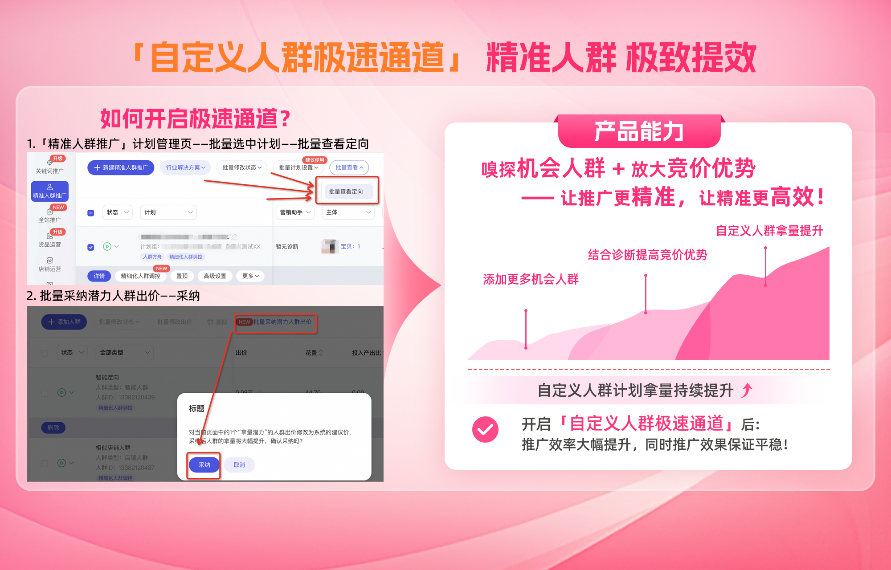

内测数据显示，商家开启极速通道后，**采纳人群拿量可提升****+40%****；**第一波内测商家已明显感受到**极速通道对于****达摩盘人群、平台精选人群 ****的放量加持！**

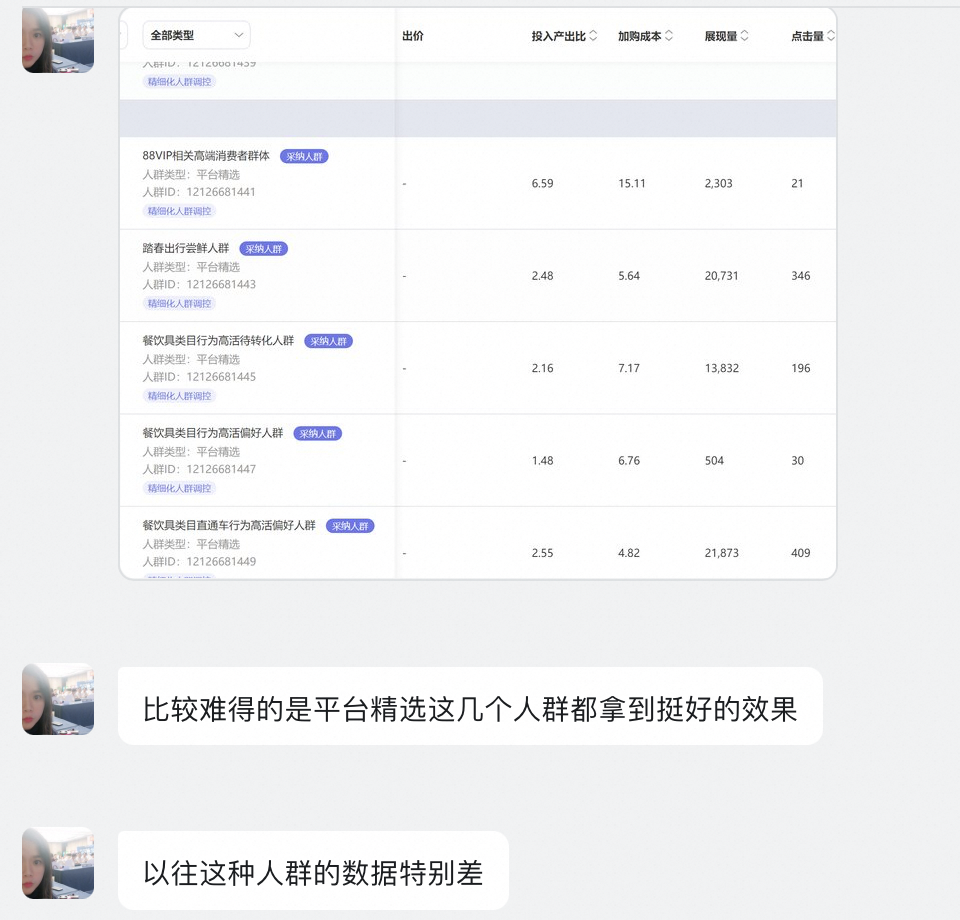

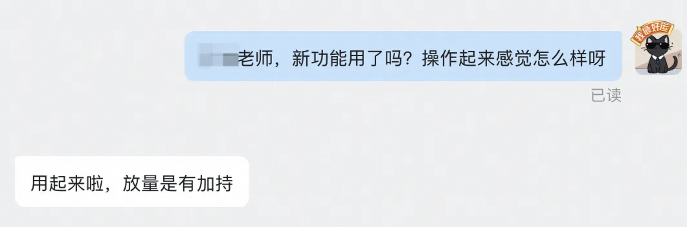

---

## 操作指引

| **能力解读** **👉**** ****一分钟全面了解自定义人群极速通道** | **讲师教学** **👉 ****人群极速通道助力精准人群推广快速放量** |
| --- | --- |

---

## 功能重点入口：批量查看定向

** 只需两步！**

**STEP 1：计划列表页——批量计划设置——****批量查看定向**

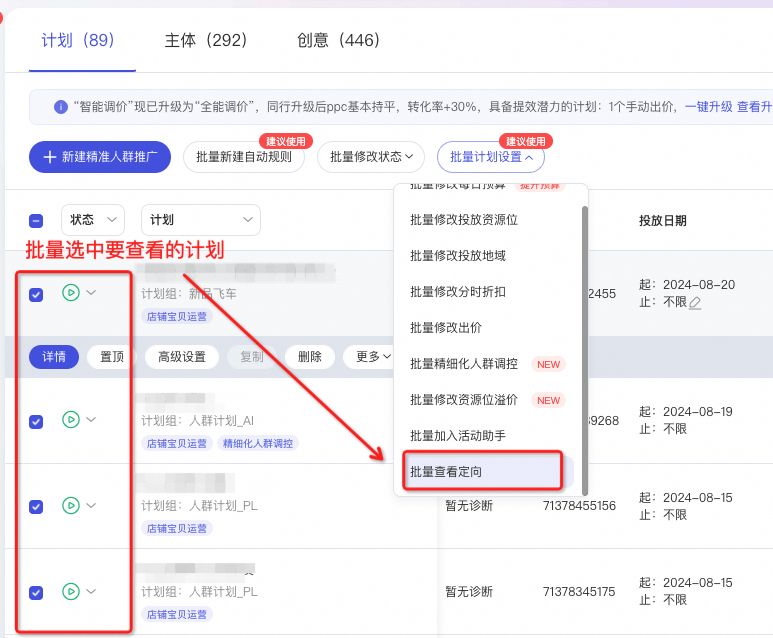

**STEP 2：***批量采纳潜力人群出价***，对所有潜力人群开启极速通道扶持**

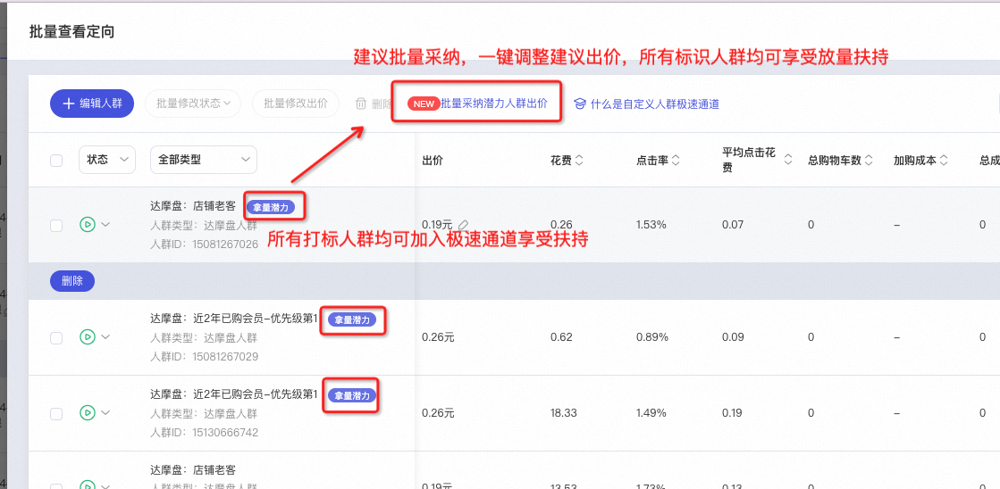

---

## 其他入口：单计划定向管理/营销雷达/计划诊断

### *入口1-单计划定向管理*

**STEP 1: 入口点位**

推广管理页——精准人群推广——计划详情页，找到需要新增拿量潜力人群的计划，点击 详情 ，进入计划管理侧滑窗，点进 **定向数据** 页面。

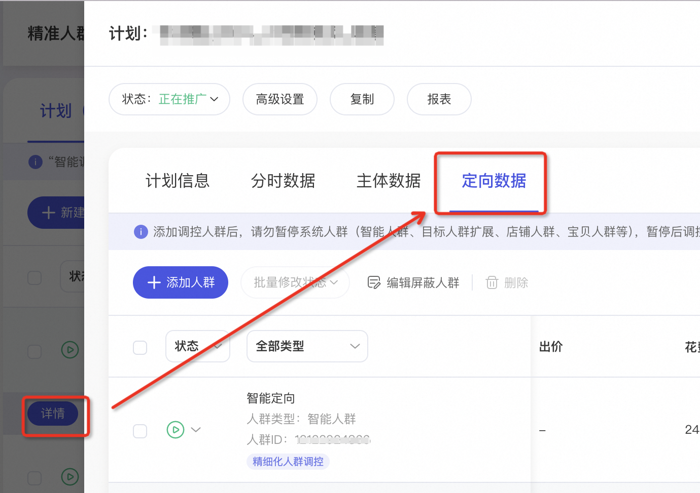

**​**

**STEP 2: 采纳策略**

对于具有拿量潜力的人群，系统会在人群上标识 拿量潜力 。鼠标移动到该标签区域，会显示进一步释放人群潜力的建议，然后点击** 采纳建议 **，拿量潜力人群即刻进入极速通道优化拿量。

对于系统出价的计划，对该计划**追加少量日预算**即可获得大幅流量提升。

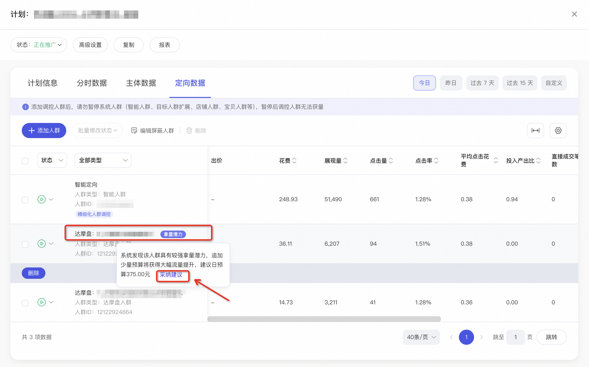

对于手动出价的计划，对该人群**设置建议出价**即可获得大幅流量提升；如该计划有多个拿量潜力人群，可通过 批量采纳潜力人群出价 一键完成出价设置。

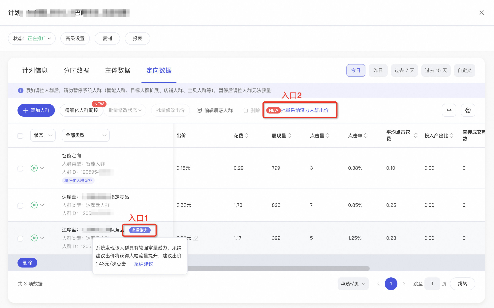

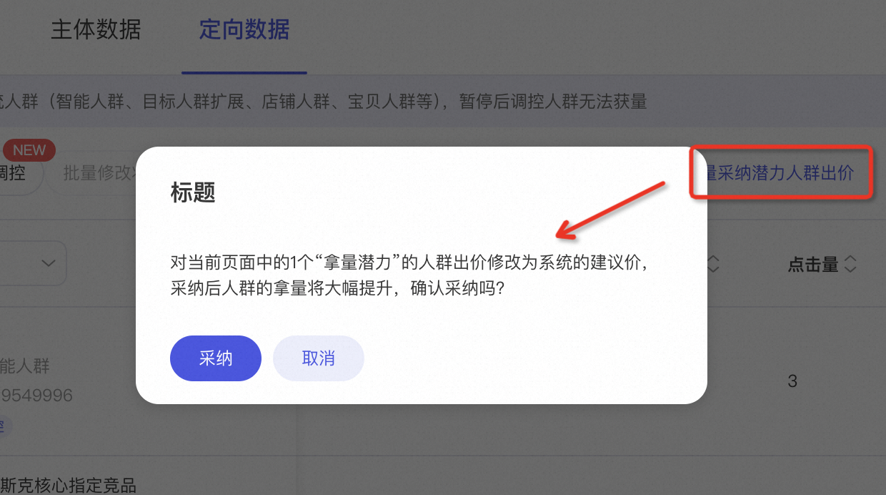

⚠️ 注意：采纳建议务必从** 采纳建议 **入口进行调整，人群才会被标识为 采纳人群 并进入极速通道；

手动修改预算和出价，是不会打标人群，也不会优化人群拿量的！！

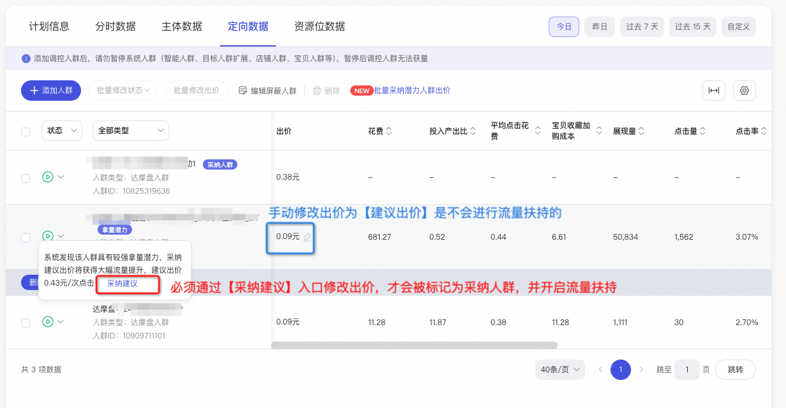

---

### *入口2-营销雷达*

**STEP 1: 入口点位**

推广管理页——精准人群推广——营销雷达，找到**【自定义人群极速通道】**的建议，点击 采纳人群> ，进入功能侧滑窗。

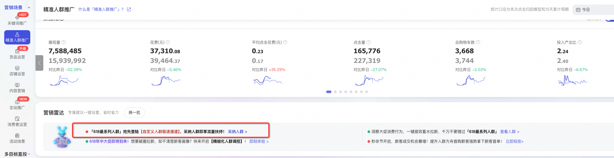

**STEP 2：选择人群**

侧滑窗内编辑本次想要添加的人群。然后点击“下一步”。

默认呈现平台推荐高优人群，**仅采纳默认推荐人群+建议出价，可以进入极速通道优化拿量；**

也可【添加种子人群】手动添加更多符合经营诉求的人群（但不享受流量扶持）。

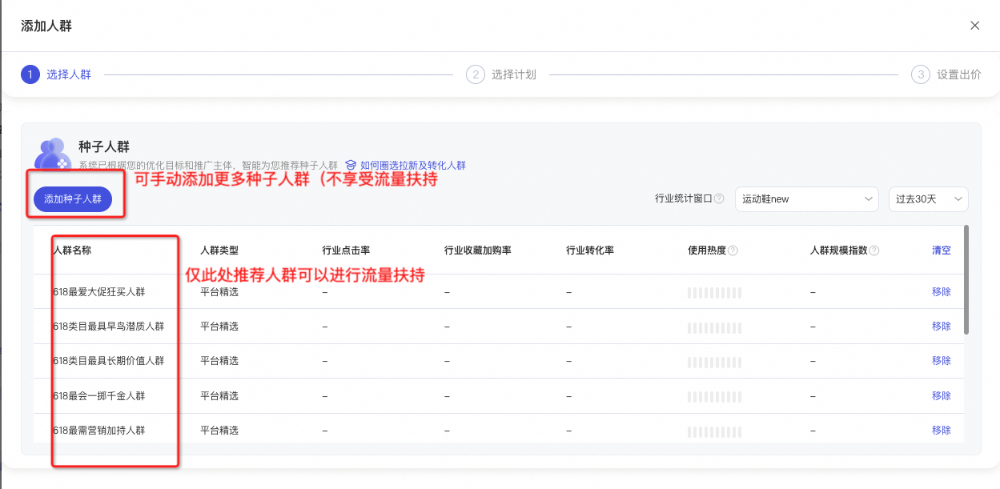

**​**

**STEP 3：选择计划**

选择 or 搜索想要添加计划的人群。上一步选中的人群对第二步选中的计划批量生效。

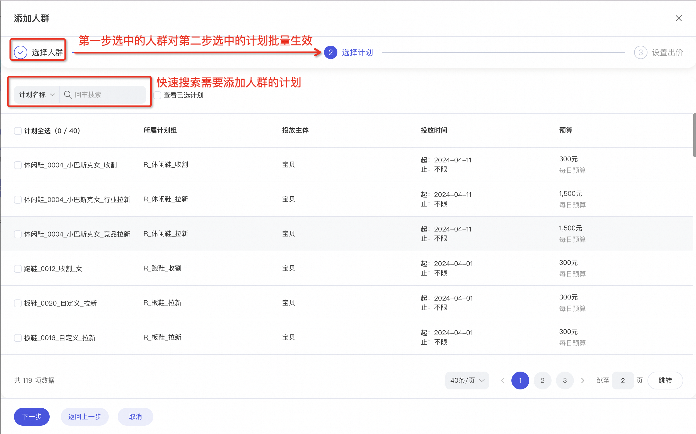

**​**

**STEP 4：设置出价**

如上一步选中的计划为系统出价计划，本步骤无需设置新增人群出价；新增人群与已有人群共享日预算上限。

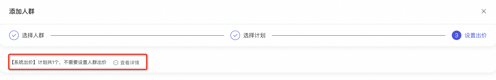

如为手动出价计划，需对新增人群设定出价；新增人群与已有人群共享日预算上限。

**必须对【默认推荐人群】设置【建议出价】，才可以进入极速通道优化拿量；**

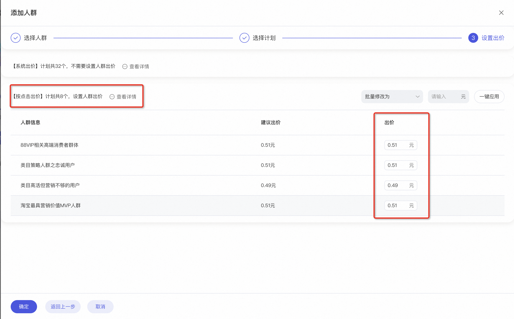

**点击确定，完成对批量计划添加机会人群的设置。**

---

### *入口3-计划诊断*

**STEP 1: 入口点位**

推广管理页——精准人群推广——计划详情页，对于** 拿量困难 **/ **拿量潜力 **的计划，点击 查看分析及建议 。

** 拿量困难 **计划图示：

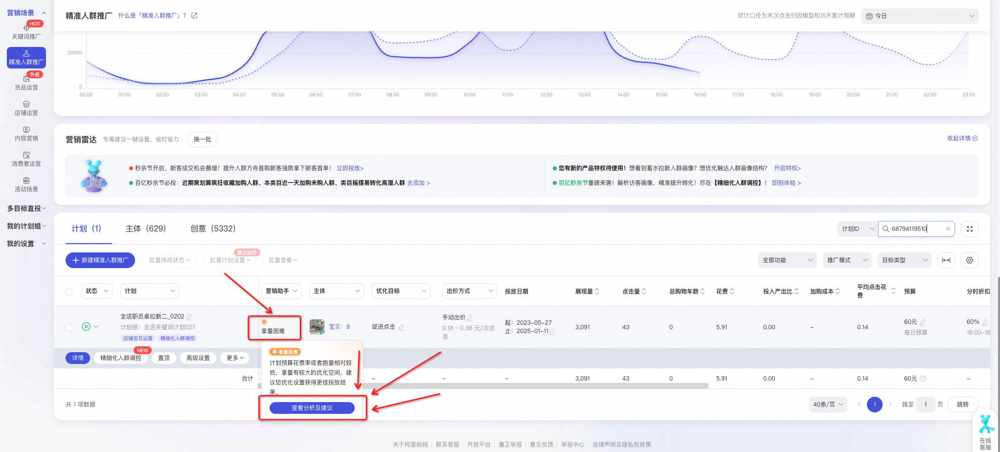

** 拿量潜力 **计划图示：

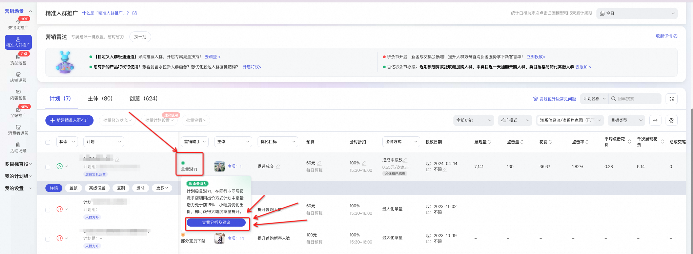

**STEP 2：采纳策略**

**【拿量困难】**优化策略：

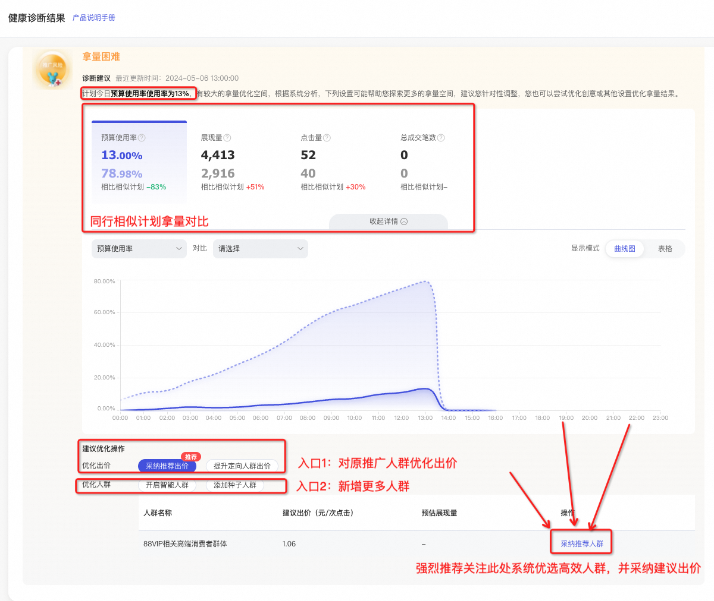

**采纳推荐出价：****对人群采纳推荐出价****，即刻进入极速通道优化拿量。**

**机会人群推荐：****采纳推荐人群并设置【建议出价】****，才可进入极速通道优化拿量。**

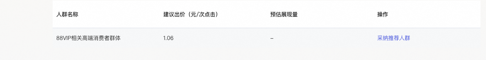

**【拿量潜力】**优化策略：

**优化出价/日预算上限：**系统给出进一步提效策略，释放拿量潜力。**强烈推荐采纳打有【推荐】标识的优化策略。**

**注：**您采纳建议后，人群即刻标识为“采纳人群”并进入极速通道；采纳建议三日后，系统会重新评估计划拿量潜力，并重新给出优化建议，但不影响之前采纳人群的拿量优化。

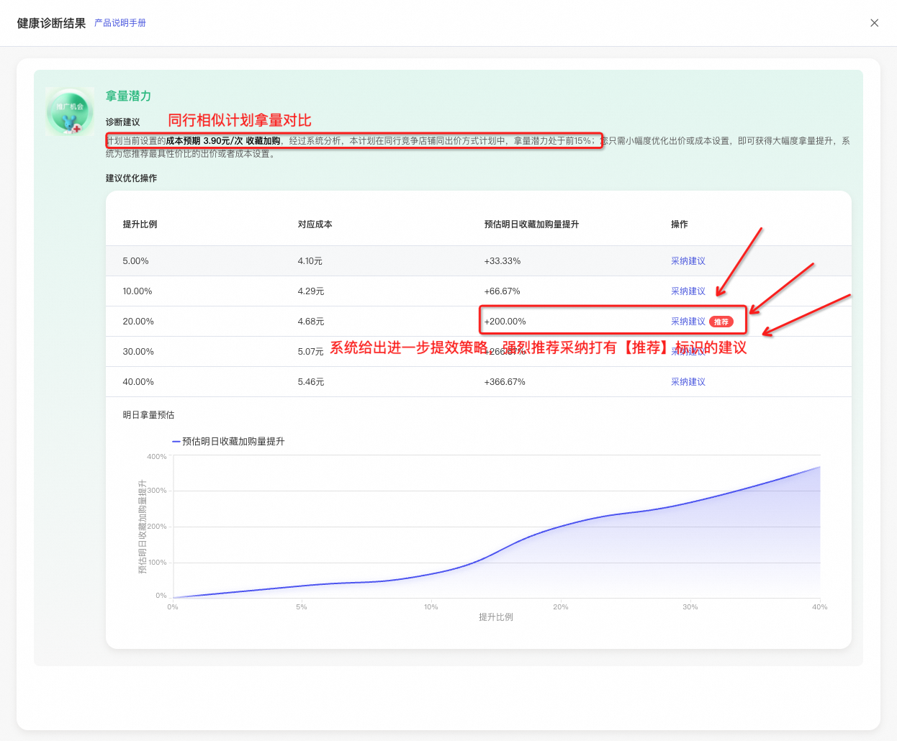

### *入口4-单计划修改出价/批量修改出价*

计划列表页——修改出价（手动出价的计划）/修改优化目标

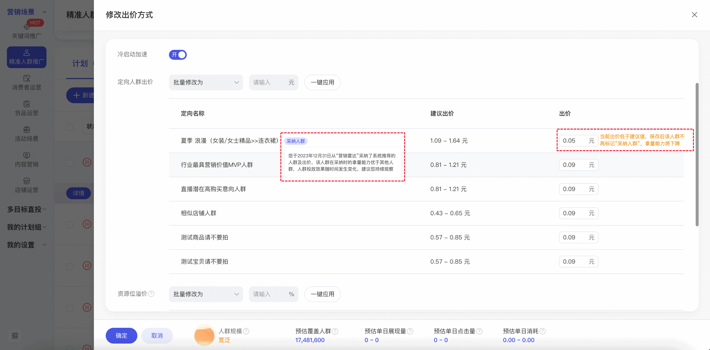

计划列表页——批量设置——批量修改出价

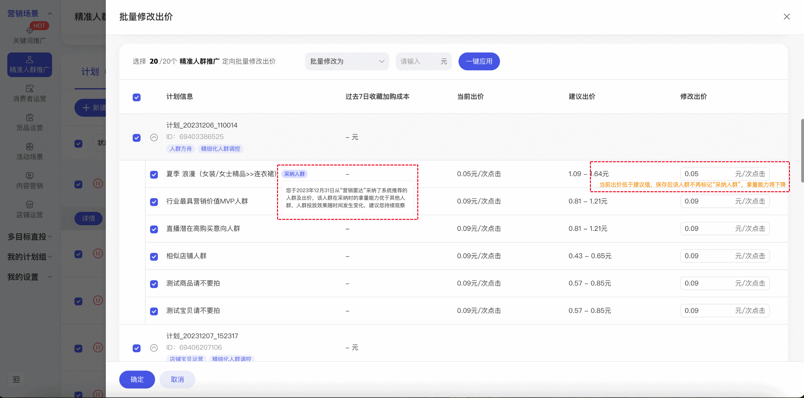

---

## 高频Q&A

**🤔 Q1：如何判断是否开启极速通道？****采纳建议****1-2小时****后**，对应新增人群/拿量潜力人群将打上“采纳人群”的标签，并进入极速通道优化拿量。

**⚠️**** ****拿量潜力≠开启极速通道****；**对拿量潜力人群**采纳建议1-2小时后**（期间不要调低出价/预算），**人群变为“采纳人群”，才说明已开启极速通道。**** **

**🤔 Q2：极速通道是如何优化拿量的？**系统帮助您诊断当前自定义人群计划设置的短板，并反馈优化建议。您采纳建议后，算法机制会帮您加速拿量。**推广人群仍为您圈选的人群标签，不会稀释人群特征**。

​

**🤔 Q3：怎么识别的潜力人群？**主要从**人群量级、竞价优劣势**维度，对计划中的自定义人群进行诊断，找到**本应可以实现更大触达规模**的人群，从**出价**维度反馈优化建议。

​

**🤔 Q4：****如何批量找到****所有的拿量潜力人群****？or 我怎么知道****哪些人群可以开启极速通道****？**

**「精准人群推广」计划管理页——批量选中计划——批量查看定向——批量采纳潜力人群出价**

**⚠️ 若您修改出价/预算低于建议值，该人群将不再标记“采纳人群”并退出极速通道！建议您在测试期间不要调低出价/预算，以免影响拿量优化效果！**

**🤔 Q4：如何查看新增人群/拿量潜力人群的拿量优化效果？****可通过：**计划管理侧滑窗—— **定向数据** 页面进行查看；可设定时间范围查看采纳人群的效果变化。

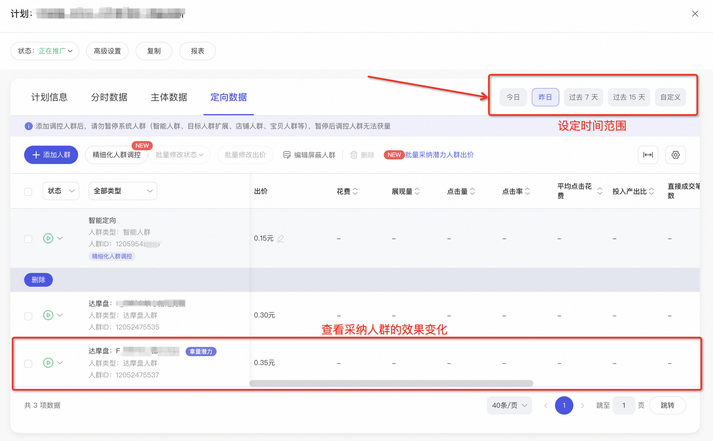

---

**🎁 ****邀您参加有奖调研，我们将收集您的使用感受并不断优化：**

**https://survey.taobao.com/apps/zhiliao/Zl840JlvX**
