# 🎯精细化人群调控

> 来源：https://alidocs.dingtalk.com/i/nodes/6LeBq413JA9BOdm2iQwrNLDrJDOnGvpb

## ‼️ ** **重要更新 ‼️

🤔 竞争航线效果很好，但我想看下**竞店、竞品人群的具体画像**？

**「精细化人群调控」现已覆盖「竞争航线」所有人群类型！！**

🤩 支持解析竞店人群在**性别、年龄、消费力、领券行为**等标签上人群分布占比！

并对符合营销诉求的标签添加溢价，提升触达规模！！

⬇️ ⬇️ ⬇️

**STEP 1：**先创建一条狙击竞店、竞品人群的计划；注：只有使用**手动出价**才可开启调控哦；

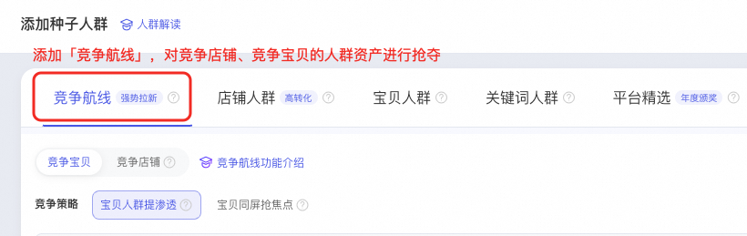

**STEP 2：**计划详情点击**「更多：人群调控」**，查看竞店人群在不同标签下的分布占比；

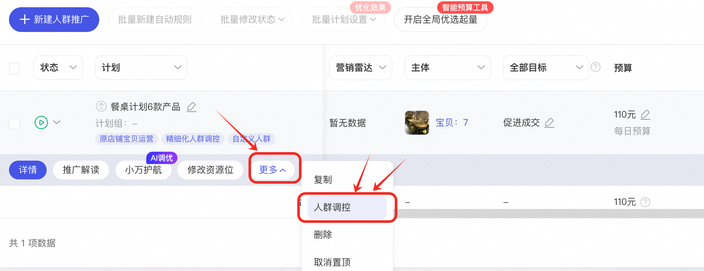

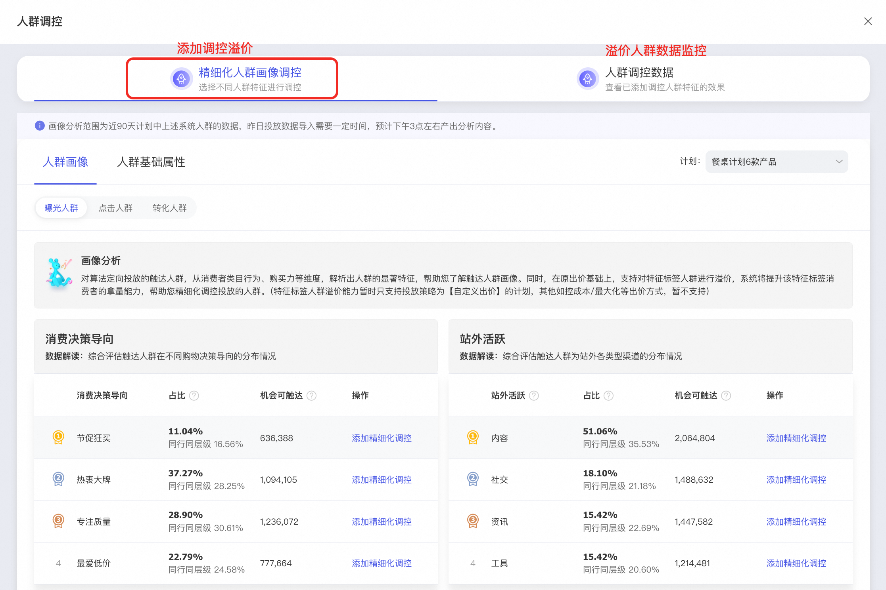

**STEP 3：**您可对重点标签**「添加精细化调控」**，设置更高的溢价比例，提升触达占比！

**👉 ****更多问题欢迎进群咨询：****66730004968 **

---

## **一、产品简介**

💢 系统人群效果好，但生参/达摩盘看人群画像很乱，性别、年龄、消费力都不符合诉求...

😓 达摩盘圈人很繁琐，圈半天结果跑不出去，效果也不如系统人群...

💸 钱都烧没了 💸 最后还是玩不懂人群...

**人群没有那么难～快来试试****「精细化人群调控」****吧！**

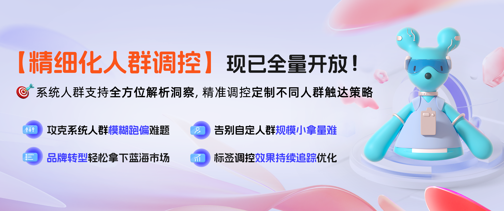

**举个例子 🌰：**

您可以让【系统人群】高效快速跑量，再通过精细化调控了解【系统人群】的消费力分布！

然后对L5人群添加调控设定溢价，拉动整个计划的高消费力人群占比！！

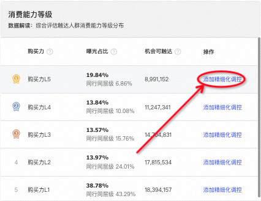

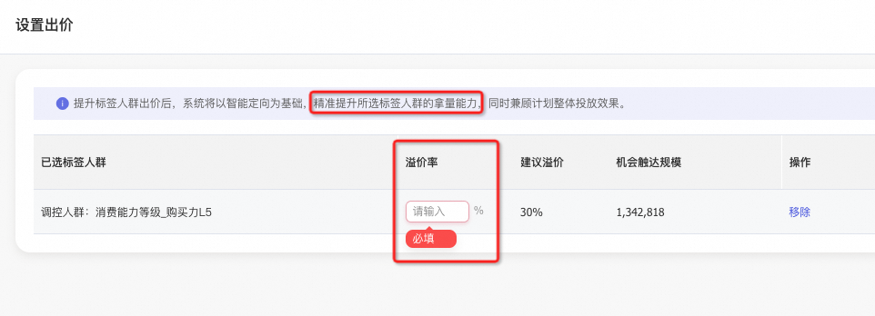

---

## **二、优秀案例**

| **万堂书院·老韵** **👉【点击此处查收课程回放】****🤩** | **诗篇：高端潮流女装品牌** | **SK-II** |
| --- | --- | --- |
| **某体育用品品牌** 围绕品牌人群属性和货品市场定位，明确目标人群为行业高净值消费者，在人群场景重点投放行业高价值人群、88vip、竞店人群等。 👉 搭配【精细化人群调控】，对行业高净值消费者中**购买力L3-L5**群体大幅提升溢价比例。 👉 调控后，在**计划整体ROI保持稳定**的基础上，溢价人群的整体拿量能力提升**200%+**，购买力L3-L5群体曝光占比提升**10%+**，遥遥领先同行商家**​**。 |  |  |

### 三、产品使用

**✨ 重点提炼 ✨**

**Q1：什么计划可以开启调控？**

**A1：**精细化人群调控适用于**人群推广**场景下的**【系统人群】+【手动出价】**计划。

1）系统人群：种子人群为**竞争航线、关键词人群、店铺人群、宝贝人群、平台精选**，或开启任意**扩展策略**；达摩盘人群、AI圈人、基础属性人群不支持开启调控；

2）系统人群**曝光量超过300**的**6小时后**可调控，期间请勿暂停系统人群，暂停后调控将失效，无法获量。

**Q2：如何快速找到可以调控的计划？**

**A2：**快捷入口👉**「** **一键筛选可调控计划**」

无界入口👉：人群推广计划管理页->全部功能-> **精细化人群调控**，快速定位支持调控的计划。

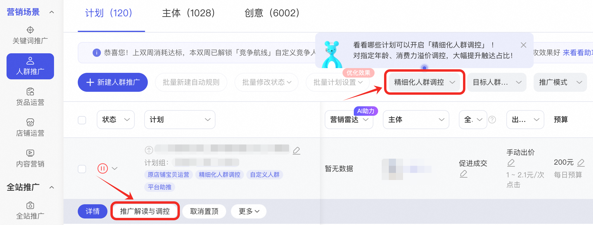

注：若您筛选后列表为空，可能是**现有计划皆不符合调控条件**。推荐您根据下方教程新建计划，再尝试调控！

---

**教程：从新建计划到开启调控**

**第1步：调控前准备**

| **人群：** **系统人群** 系统人群：种子人群为**竞争航线、关键词人群、店铺人群、宝贝人群、平台精选**，或开启任意**扩展策略**。 注：达摩盘人群、AI圈人、基础属性人群不支持开启调控。 | **出价：** **手动出价** | **开启时间：** **系统人群曝光量超过300** **再等待约6小时后可开启** |
| --- | --- | --- |

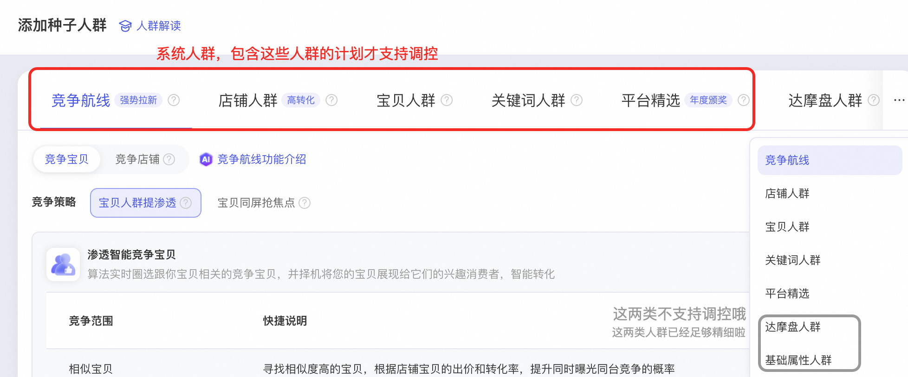

**第2步：找到调控计划**

计划管理页，**全部功能**筛选【精细化人群调控】，单计划点击**【推广解读与调控】**按钮。

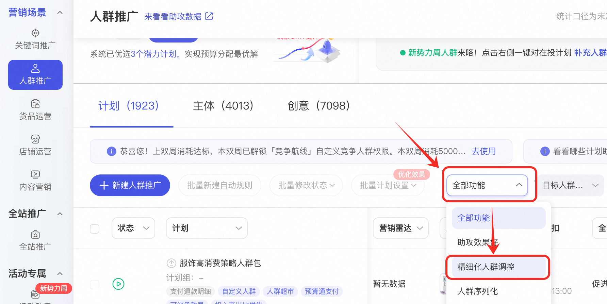

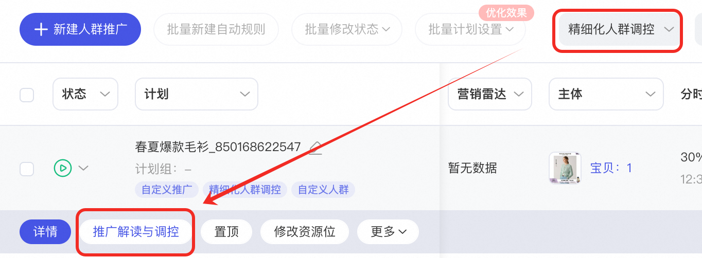

**第3步：解析画像，设置溢价**

查看计划的曝光/点击/转化人群的人群画像、基础属性，**对特定标签设置溢价**（备注：溢价范围0~200%）。

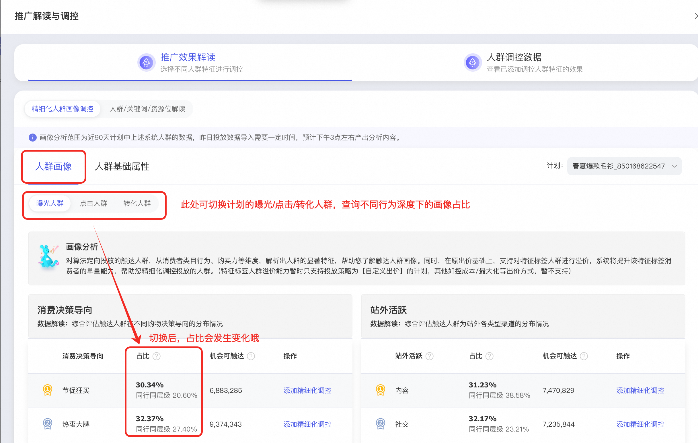

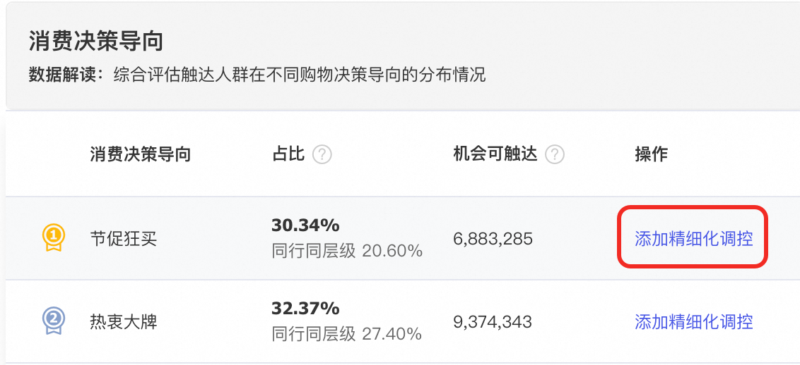

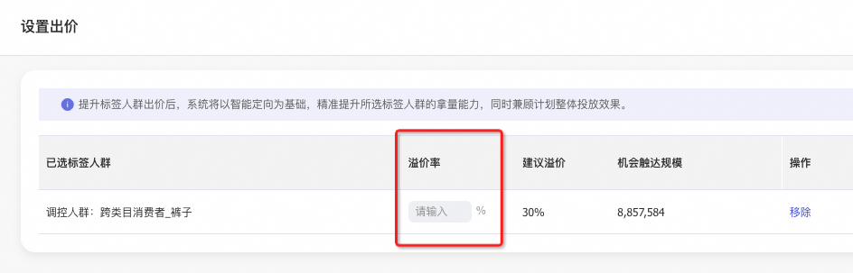

---

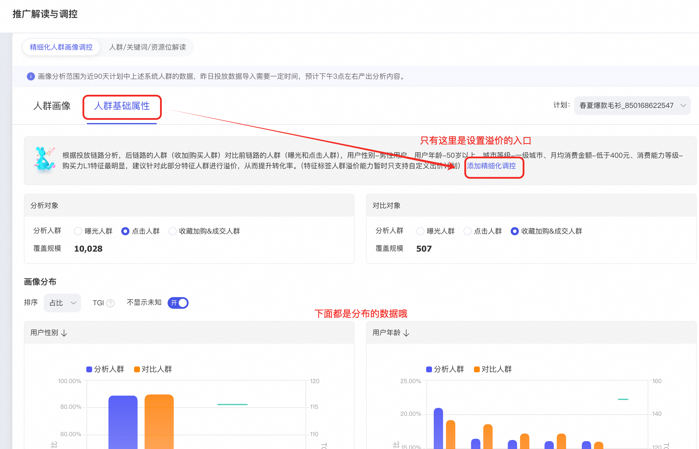

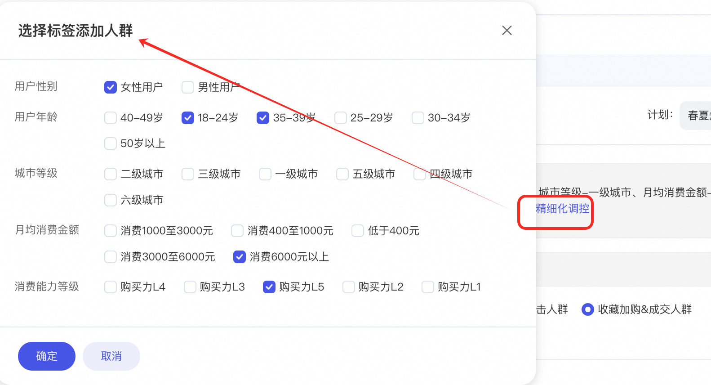

**第4步：查询调控效果，修改溢价**

切换人群调控数据，查看或设置调控人群溢价，**分析调控人群数据与趋势**。

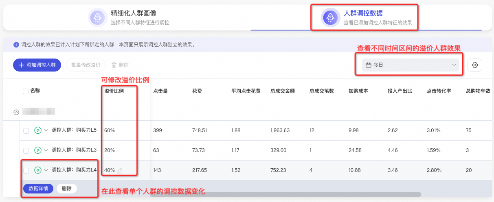

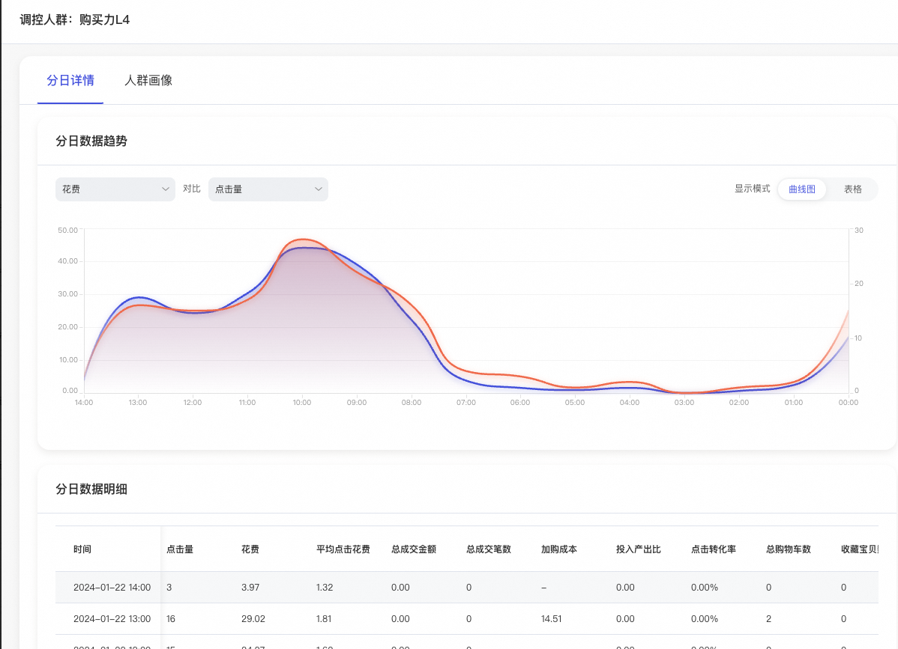

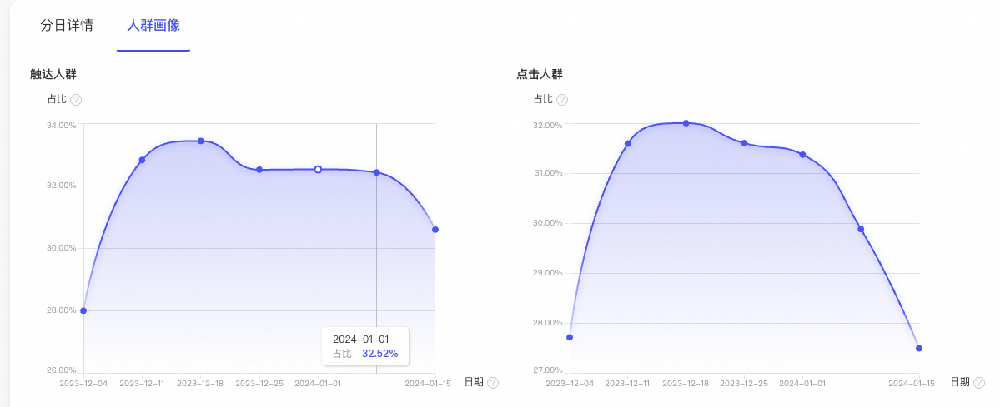

---

### 四、更多问题

**1、我一个计划既有系统人群又有达摩盘人群，调控人群是怎么解析的？**

仅对计划中的系统人群做标签解析，达摩盘与基础属性人群不在解析范围内；仅支持对系统人群和某标签的交集人群做溢价调控。

**2、调控人群为什么消耗不出去量？**

调控期间请勿暂停系统人群的投放，暂停系统人群后调控人群无法获量。

**3、调控人群溢价后具体出价多少？**

与系统人群原出价有关，例如：竞争航线出价0.8元，店铺人群出价1元，针对消费力L5标签溢价100%，那么竞争航线的L5人群出价1.6元，店铺人群中的L5人群出价2元。

**4、****调控人群的溢价，会叠加分时和资源位溢价吗？**

所有溢价方式累计。最终出价=手动出价 * 手动出价系统调价区间 * 调控人群溢价 * 资源位溢价 * 分时溢价。

**5、为什么我之前没有添加过精细化调控，这次想添加，却提示“最多支持添加8个标签人群”？**

精细化人群调控相当于新增人群，跟达摩盘人群和平台精选人群共用8个人群限制，如果添加不成功，说明该计划达摩盘人群和平台精选人群总数超过8个，若需添加精细化人群调控，请先移除部分已选人群后再添加。
