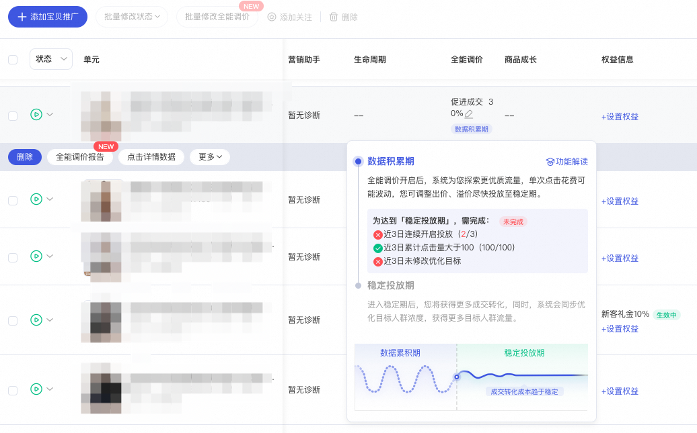
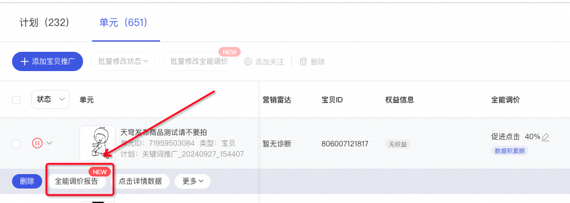
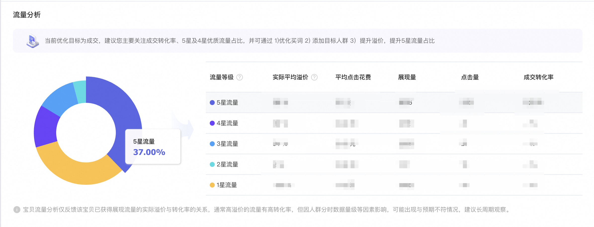
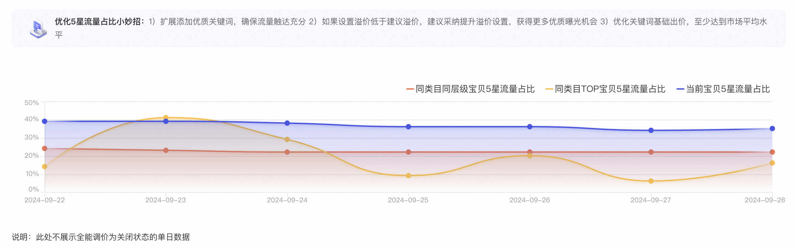
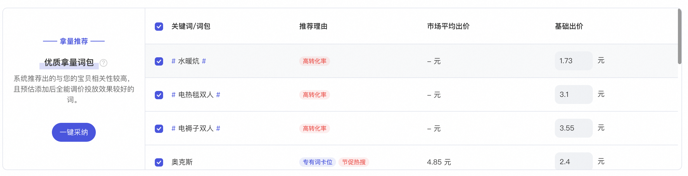
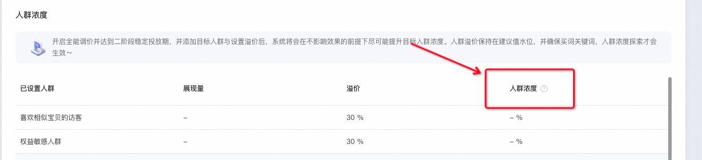

# 全能调价新增【出价状态&结案报告】

> 来源：https://alidocs.dingtalk.com/i/nodes/6LeBq413JA9BOdm2iQwrNarzJDOnGvpb

**原语雀文档链接：**https://yuque.antfin.com/chenchun.chen/gqhty9/oz1manbo0agon3z3

---

# 痛点

在使用全能调价进行投放时，您是否遇到如下问题：不知道计划投放到什么状态，才算稳定？计划如何进入稳定状态，稳定状态**应该做什么？不应该做什么？**感觉当前数据不符合预期，不知道如何调整？

# 一、升级点1：出价状态诊断

### 1、查看入口

关键词推广--手动出价计划--开启了全能调价的单元--全能调价设置的优化目标下面

### 2、不同诊断状态及建议

| 阶段 | 系统标识 | 系统建议 | 截图示例 |
| --- | --- | --- | --- |
| 一阶段 数据积累期 |  | 全能调价开启后，系统为您探索更优质流量，单次点击花费可能波动，您可调整出价、溢价尽快投放至稳定期 为达到「稳定投放期」需完成： 近3日连续投放3天 近3日累计点击量大于100 近3日未修改优化目标 | 以促进点击为例，截图如下 |
| 「数据积累期」任务完成次日进入「稳定投放期」 |  |  |  |
| 二阶段 稳定投放期 |  | 投放效果将趋于稳定，将帮助您获取更多目标流量的同时提升目标人群浓度，您可添加人群、提升溢价来获取更多精准客户！ 促进成交：成交转化成本趋于稳定 促进收藏加购：收藏加购成本趋于稳定 促进点击/新广告加速/新品冷启动：平均点击花费趋于稳定 | 以促进成交为例 |

# 二、升级点2：结案报告

### 1、查看入口

关键词推广--手动出价计划--开启了全能调价的单元--鼠标放在单元上--点击【全能调价报告】

### 2、功能介绍

#### （1）流量分析

以促进成交为例，当前优化目标为成交，建议您主要关注成交转化率、5星及4星优质流量占比，并可通过 1)优化买词 2) 添加目标人群 3）提升溢价，提升5星流量占比

#### （2）机会透视

**优化5星流量占比小妙招：**1）扩展添加优质关键词，确保流量触达充分 2）如果设置溢价低于建议溢价，建议采纳提升溢价设置，获得更多优质曝光机会 3）优化关键词基础出价，至少达到市场平均水平

**优质拿量词包推荐：**系统推荐出的与您的宝贝相关性较高，且预估添加后全能调价投放效果较好的词。

#### （3）人群浓度

开启全能调价并达到二阶段稳定投放期，并添加目标人群与设置溢价后，系统将会在不影响效果的前提下尽可能提升目标人群浓度。人群溢价保持在建议值水位，并确保买词关键词，人群浓度探索才会生效～

人群浓度的计算公式=目标人群的展现量/ 单元的全部展现量 *100%

​

​

​

​

​
