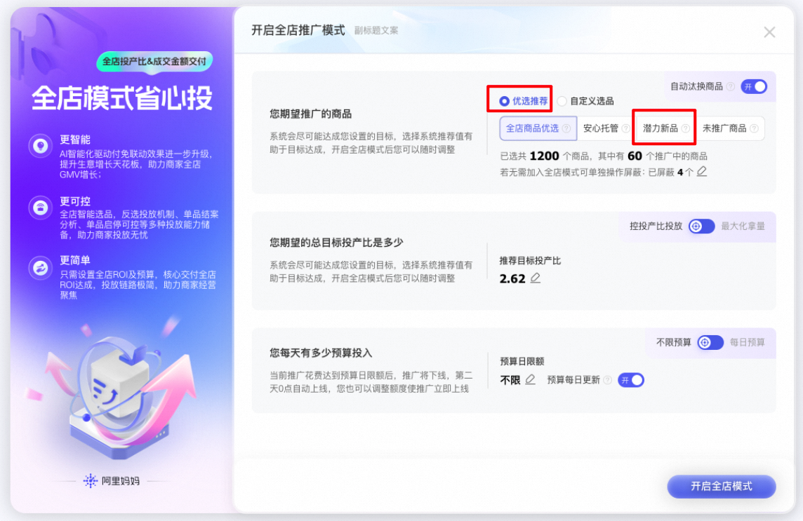
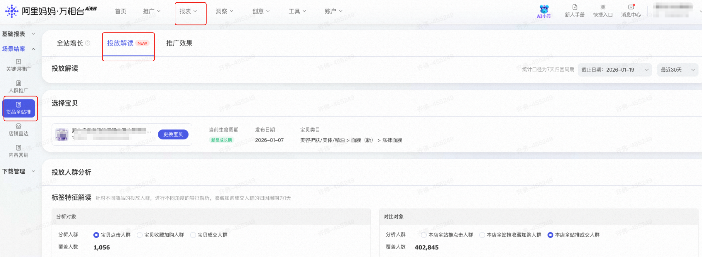

# 🔥 新品全新升级：冷启无忧，爆款快人一步（重磅内测）

> 来源：https://alidocs.dingtalk.com/i/nodes/6LeBq413JA9BOdm2irlLXr6wJDOnGvpb

### **一、产品背景**

**New！****「潜力新品」是平台基于全新“成交潜力模型”智能识别的高增长潜力商品**

不再仅看“上架时长”，而是综合评估商品的用户兴趣、类目趋势、转化能力、订单增速潜力等维度，精准锁定具备早期爆发力的新品，以订单增速为优先目标，抢占早期市场心智。

** **** **** ****更智能选品：**从“时间判断”到“潜力判断”，让好品不被埋没；

** **** **** ****更低试错成本：**3天无单必赔，让新品试投零压力；

** **** **** ****更快冷启动：**30%流量助推 + 新品加速，5天破百不再是梦；

** **** **** ****全链路支持：**从选品、投放、优化到数据分析，一站式赋能；

### **二、核心权益 **

**权益1：3天无成交必赔**

历史未投放新品启投三日无成交享100%消耗金额赔付，单品模式下且采纳推荐投产比的商品计划；详见下方表：

| 规则 | 1）赔付生效标准 投放推荐商品： 当天投放商品为新品×平台推荐商品——潜力新品 计划类型： 控投产比持续推广计划，出价目标为总成交金额或净成交，单品计划 采纳推荐出价： 新建第1-3个自然日，每天设置的最高ROI<=系统推荐值； 计划状态： 新建第1-3个自然日，内保持持续投放，无暂停/删除操作 新建第1-3个自然日，内未切换过最大化拿量 新建第1-3个自然日，内未切换出价类型（比如净成交切换到总成交或相反） 计划累计消耗条件： 计划对应的商品近180天内累计消耗等于0 ⚠️注意：该赔付和新客赔付互斥---新客首单且命中新品的情况下，–只赔新客，和成本保障不互斥； |
| --- | --- |
| 赔付形式 | 系统主动赔付，赔付推广代金券，支持无门槛优先抵扣，生效时间定30天； |
| 代金券使用条件 | 无门槛优先抵扣，生效时间30天。仅全站推广使用； |

⚠️「潜力新品三天无成交赔付」权益自上线以来，已服务众多商家完成新品冷启动。**因产品能力迭代升级，我们将对该权益进行调整。**

**下线内容：** **「新品三天无成交赔付」权益将于 2026年6月5日 起下线**

**影响范围：**

• 已发放的赔付券不受影响，在有效期内正常生效
• 公告发出后，新建的潜力新品计划不再享受该赔付权益
• 已投放的计划在权益有效期内正常享受，不受影响

**权益2：新品加速**

算法挖掘有成交潜力新品，推广后销量加速增长，享多重权益；

**权益3：新品新建专属助推****（待上线）**

新建计划前7天，获得助推流量**+30%**，助力商品快速冷启；

### **三、新建入口 & 投放解读**

**新建入口**

**单品模式 → 创建入口：**

1）阿里妈妈·万相台AI无界->货品全站推广->新建货品全站推广->添加商品->**“潜力新品”**标签商品

| 投前 | 投中 |
| --- | --- |
|  |  |

**全店模式 → 创建入口：**

1）阿里妈妈·万相台AI无界->货品全站推广->全店模式->优选推荐->**潜力新品**；（支持批量添加）

**投放解读**

**计划详情页 → 查看“新品权益”：**

1）货品全站推广->计划列表下->点击**“新品权益”**；

2）了解当前是否享有： 新品加速、3天无单必赔、新品新建专属助推；

|  |  |
| --- | --- |

**投放解读 → 深度分析新品表现：**

1）报表->货品全站推广->点击投放解读->选择**“潜力新品”**；

**四、商家答疑反馈群**

如您对以上有任何疑问，可向阿里妈妈小袋鼠客服咨询或者钉钉扫码进群咨询；

