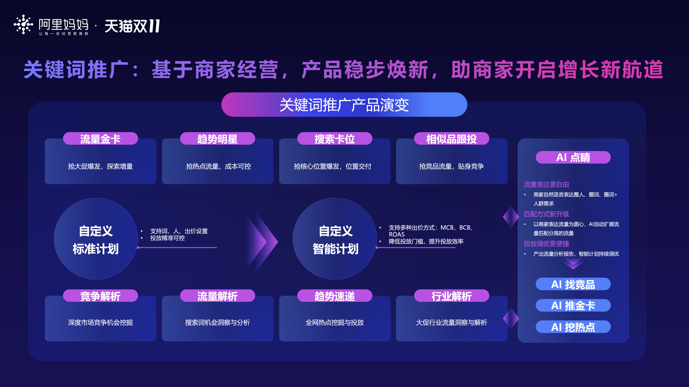

# FY26 WIN赢双11-搜索广告投放策略

> 来源：https://alidocs.dingtalk.com/i/nodes/7NkDwLng8Za7QYkeHzawxZxoJKMEvZBY

## 双11投放秘籍，助力生意增长！

**如何种草收割提效，助力商品抢赢全周期？速来解锁双11投放秘籍，手把手教你成为双11投放卷王！从预热到爆发，一招一式助你轻松打赢这场投放战斗，让销量起飞，生意爆发增长！**

## 双11投放节奏

双11大促活动时间：2025年10月15日00:00:00-2025年11月14日23:59:59

1.预售

预售预热：2025年10月15日00:00:00-2025年10月15日19:59:59

预售定金支付：2025年10月15日20:00:00-2025年10月20日17:59:59

预售尾款支付：2025年10月20日20:00:00-2025年10月24日23:59:59

2.现货

现货预热：2025年10月17日00:00:00-2025年10月20日19:59:59

现货售卖：2025年10月20日20:00:00-2025年11月14日23:59:59

## 关键词推广产品全面升级，助商家开启增长新航道

在流量争夺白热化的市场环境中，关键词推广为商家构建精准获客护城河。依托AI底层能力支持，实现"词-人-货-价"四维精准匹配；通过动态词包锁定高价值搜索人群，智能出价模型实时优化ROI；「趋势明星」低成本收割流量红利，快速起量，打造爆款曲线。「搜索卡位」打通人找货最短链路，全面开启淘内抢单卡位；「相似品跟投」实现"对手不投我必赢，对手投入我更赢"的竞争优势。「流量金卡」锁定大促优质流量，全面探索生意成交增量！关键词推广，精准拦截促成交，助力商家双11生意大爆发！

**流量金卡：**推出双11大促冲刺拿量套餐包，极简一键托管、智能锁定高转化流量；人词定制全面升级，拒绝泛流量，实现投放确定性、可控性；开启大促无忧续投，好计划赛马，保障效果不中断

**趋势明星：**「趋势感知+流量预判+智能投放」三位一体，精准捕捉机会流量；「趋势抢量」最大化抢夺飙升流量，大促抢量能力更强

**搜索卡位：**行业定制化升级，推出「新品保障卡位」「Nickname种草卡位」「图搜卡位」助推商品抢占首条展现 ，「提升词市场渗透」支持灵活定义投放客群

**相似品跟投：**复制同款/类目爆款/相似品策略，一键跟投，无忧投放，为商家提供竞争解决方案，在搜索场域精准获取目标跟投商品流量

**趋势速递：**AI实时洞察引擎挖掘和预测全网具有电商属性消费热点商机，更及时、更丰富、更精准

**AI点睛****：**实现“AI自动调流量、调出价、调人群”，全链路完成商家的种收链路优化，让推广实现「投放-分析-优化」的自动进化，投前流量表达更智能，一句话表达流量意图，AI自动匹配优质流量组合，让投前准备大幅提效。投中AI接管出价策略+流量匹配，系统根据投放需求，自动获取目标流量，扩展高潜力流量来源，匹配更多优质关键词，提升流量规模，带动新用户首单成交。投后AI复盘及校准，通过详细的投后流量分析报告，AI会针对每一波流量的投放效果进行拆解，并给出“优化建议”或“调价建议”

| **行业** | **双11投放策略** |
| --- | --- |
| **服饰时尚** | **行业特性** **关键词丰富**：服饰行业的各环词流量均很大，在类目精准词、行业热门词竞争激烈的情况下，能从趋势机会词中挖掘到许多流量及生意。 **上新测款，快速打爆**：服饰行业新品上架频率高，测款成本和不确定性较大，测款重点关注CTR（点击率）、收藏加购率、ARPU值（客单价）。 **CTR高但ARPU值低**：可能是应季性不足，适合作为潜力款，后续优化上新场景或搭配方式 **CTR低但ARPU值高**：可能是利润款，适合通过站外种草或精准人群定向提升曝光 **货品生命周期短，需提前布局** 受季节和气候影响，服饰行业的货品生命周期较短，需提前抢占需求市场 通过多平台联动（站外种草+站内推广），延长销售周期，提升全店成交 **大促爆发投放策略** **重点推荐投放产品** 精准卡位搜索流量，提升品牌曝光和转化 **GMV环比+126%**：快速起量，助力新品测款和老品打爆。 **ROI环比+55.6%**：高效投放，降低成本，提升利润空间。 **不同波段投放策略** **蓄水：** 快速测款、全店蓄水，投智能选品：测款选「批量测款」、挖掘新品增量词、加速冷启成长；非测款选「店铺引流」或「目标客户覆盖」，以货品带动全店流量并沉淀人群资产，超前积累海量购买力 抢占趋势流量，投趋势明星：结合「趋势速递」，选择合适的趋势词投放「趋势明星」，挖掘增量市场 收割抢先购人群，投流量金卡：投放「双11大促蓄水拉新抢量卡」「双11大促早鸟抢购人群卡」；新品必投「测款上新打爆卡」、「新品流量付免联动卡」 **正式开卖：** 提升全店成交，投智能选品：选「成交转化」目标，算法优选店内好货， 优化主推品计划：双11正式开卖前1天，出价提前切换成智能出价-获取成交量，最大化获取成交 轻松获取增量成交，投流量金卡：加投「双11大促现货成交冲刺卡」、「新品流量付免联动卡」，获取 开启预算自动规则工具，保证高ROI计划持续拿量、不掉线 |
| **快消** | **行业特性** 快消行业具备消费集中爆发的特性，因此在双11大促期商家需要关注短周期爆发与库存管理的精准平衡，在经营上需要快速响应激增订单（如日化、食品、个护等高频消费品） 消费者对快消商品品质价格敏感，设置低价引流款（如9.9元小样）吸引流量，推出节日限定包装（如中秋礼盒）、家庭分享装，强化囤货价值 快消商品消费者下单转化周期短，需要关注即时转化效率的提升，最好将消费者行为加速为“搜索关键词-直接加购” **大促爆发投放策略** **重点推荐投放产品** 「搜索卡位」打通人找货最短链路，消费者一搜即现，闪电 完成“流量争夺战”，卡位词灵活自选，生意攻防灵活（卡位品牌词防守、卡位类目词进攻） 每月近20万商家使用，CTR相较关键词大盘高出+275%、CVR高出+139% **不同波段投放策略** **蓄水：** 蓄水期必用，使用「提升词市场渗透」抢占大促搜索未进店、搜索未加购、搜索未成交用户，储备更多精准可转化用户池 「流量金卡」双11大促抢先购冲刺卡，抢先占领大促高转化流量，为GMV增长蓄能！ 抢占趋势流量，投趋势明星：结合「趋势速递」，选择合适的趋势词投放「趋势明星」，挖掘增量市场 **正式开卖：** 爆发期投「搜索卡位」全面开启抢单模式，消费者一搜即现，投放CVR相较大盘高出2.6倍！ 大促爆发使用「相似品跟投」跟投大促成交爆品、行业爆品，收割高转化流量；定向跟投指 定竞品，贴身竞争 「流量金卡」推出618现货爆发冲刺卡，抢占大促优质流量，增量不降效 |
| **消电（3C/小家电/大家电）** | **行业特性** **购买节奏前置：**消费者在双11期间的购买行为呈现前置趋势，尤其是在预售阶段，消费者更关注“好货提前抢”，这种行为变化要求品牌在投放策略上更早布局，通过预热活动吸引用户关注，提升转化效率 **低复购率：**电子产品生命周期长，用户需求非高频，需持续拉新，高客单价单次触达转化率低，需多场景全方位触达 **大促爆发投放策略** **重点推荐投放产品** 「搜索卡位」精准卡位搜索流量，提升品牌曝光和转化 **GMV环比+153%**：快速起量，助力新品测款和老品打爆 **ROI环比+26%**：高效投放，降低成本，提升利润空间 **不同波段投放策略** **蓄水：** 流量金卡：使用大促抢先购冲刺卡，提前获取平台精选的高转化流量，全方面蓄水，快速打爆高客单价品，提前蓄水用户需求；扩展行业词与类目词流量，覆盖潜在用户 搜索卡位：蓄水期使用「提升词市场渗透」精准触达大促搜索未点击、搜索未加购、搜索未成交用户，投放搜索新客拓展生意增量 **正式开卖：** 流量金卡：极致收割&流量补充，投放大促爆发卡，锁定高ROI成交增量，助推生意高效增长，在双11期间通过精准投放快速打爆商品 搜索卡位：强化核心商品的「霸屏保障」，确保高曝光位置持续引流，强势抢位拿最优质流量，抢首条或首页广告位，确保核心货品在高曝光位置 |
| **家装** | **行业特性** **低频/复购率低 --> 需要强拉新/广投放** 家装行业消费频率、复购率均较低，在推广上需要额外注重拉新，要持续扩大人群资产，做潜在成交客户的蓄水，同时，可以放大推广货品的范围，多货品推广做宽流量广度，不错过任何潜在的成交机会； **家装行业品下单决策周期长 --> 需要多布局引流、收加、拉新、线索计划** 在投放期间除了关注ROI、成交量等成交指标以外，还需要格外关注引流、拉新、收加数、旺旺咨询量等数据，并持续触达已有收加等意向行为的客户，抢占摇摆意图人群； **家装行业品核心词较少、竞争激烈心 --> 关注趋势/蓝海机会** 家装行业大多类目的核心调比较集中，推广时竞争激烈、拿量较难，需要商家格外关注差异化的趋势/蓝海流量； **大促爆发投放策略** **重点推荐投放产品** **搜索卡位 - 提升市场渗透** **不同波段投放策略** **蓄水：** **计划一 - 底层支撑：**大预算投入至「自定义推广-手动出价（开启全能调价）」，人群上倾向「大促易感人群」等预计高价值人群，或者使用「智能出价」计划选择「获取点击 or 收加量」做高效蓄水； **计划二 - 广泛引流 ＆促前蓄力：**通过好货快投「人群触达」批量选取店内拉新、挽回流失老客的货品推广； **计划三 - 趋势/长尾流量探索：**采用「趋势明星」和好货快投「低成本补量」，大促前期借势消费热点，提前积攒潜在成交机会，同时广泛触达长尾、低成本流量； **正式开卖：** **计划一 - 强势抢位拿最优质流量：**推广「搜索卡位」抢首条 or 首页，核心爆发节点让您的货品在极佳位置展现，拿到高点击率流量； **计划二 - 加大推广范围，批量激活成交机会货品：**推广好货快投「成交转化」计划，批量选取店内成交机会宝贝做店内主推品流量溢出的承接，主推品、潜力品打绝妙配合； **计划三 - 极致转化＆流量补充：**投放「双11大促现货成交冲刺卡」，在基础计划上补充更多高转化广告流量，进一步爆发成交。 关键词场景家装行业投放交流钉钉群：81935018156 |
| **家居** | **行业特性** **行业特征** 行业客单价高，决策周期长，属于新客驱动行业。短期拿量长期转化是常见的经营策略。同时家居家装必须紧跟市场潮流，把握市场趋势 **投放痛点** **新链接起量困难，起链接概率低** 品类非标占比高，同款/类似款（相同图片/近似相似图片多）市场中上新量大，同期新品链接基数大，导致出款该率低 **店铺/单品从0开始到盈利状态周期长，前期投入大** 因品类本身存在较长转化周期，需要积累链接/店铺人群资产，积累过程需要足量，且类目竞争大，访客成本较高 **产品风向/趋势能力把握差，难以挖掘/找到有机会的产品** 因品类非标占比高，量化分析较为困难，难以定位到有机会的产品 **大促爆发投放策略** **重点推荐投放产品** **流量金卡：探索生意增量，加速大促爆发** 基于历史大促投放数据分析：家居行业大促投放，ROI转化最佳，爆发最强 **不同波段投放策略** **预热：计划预算逐渐增加，重点关注拉新，接受点击单价上升** 计划1: 「趋势明星」：控点击成本，抢占趋势热点流量 计划2：「手动出价」：开启全能调价+店铺标签相关人群溢价，稳定店铺高潜力客群 计划3:「流量金卡」：双11蓄水抢跑卡，揽获高性价比流量 **正式开卖：提高最大化拿量计划预算占比，迎来点击高峰，关注ROI和店铺资产转化** 计划1:「相似品跟投」：跟投大促爆品，截流爆品流量 计划2: 「搜索卡位」：核心位置卡位，保证店铺核心词市场份额 计划3:「自定义推广-智能出价」：选择获取成交量，转化大促高峰流量 |
| **食品生鲜** | **行业特性** 食品行业用户决策周期短，通常采取的经营路径是快速打爆、以爆带新。核心运营爆品，打爆后为全店引流、快速收割是食品行业的重点。 **大促爆发投放策略** **重点推荐投放产品** 流量金卡**：探索生意增量，加速大促爆发** 基于历史大促投放数据分析：食品行业投放流量金卡ROI转化最佳 **不同波段投放策略** **蓄水：** 「智能选品」：选品方向选择「成交转化」，批量激活店内机会品成交，解锁更多生意机会 「流量金卡」：双11蓄水抢跑卡，揽获高性价比流量 「搜索卡位」：「提升词市场渗透」精准触达搜索过店铺相关词但没有进店的新访客，高效拉新，提升市场份额 **正式开卖：** 「相似品跟投」：店铺新品跟投本店爆品/本类目爆品-助力新品快速起量打爆；跟投跨类目搭配品-突破相关性限制扩充流量 「流量金卡」：双11大促爆发卡，抢占大促优质流量，增量不降效 「自定义推广-智能出价」：选择获取成交量，转化大促高峰流量 |
| **健康** | **行业特性** 高复购率与用户粘性强：健康相关商品（如保健品、维生素、功能性食品）具有高频刚需属性，用户需长期重复购买 依赖内容种草与专业背书：健康产品需突破“信任门槛”，消费者更倾向参考专业推荐或真实评价 **大促爆发投放策略** **重点推荐投放产品** 自定义推广-智能出价-获取成交量：同时促达新老客，最大程度在大促期间完成转化 **不同波段投放策略** **蓄水：** 计划1: 「趋势明星」：控点击成本，抢占趋势热点流量 计划2：「手动出价」：开启全能调价+店铺标签相关人群溢价，拓展店铺兴趣人群 计划3：「智能出价-增加点击量」：设置店铺拉新人群，提升店铺兴趣人群占比 **正式开卖：** 计划1：「智能出价-获取成交量」：蓄水期店铺兴趣人群收割，刺激老客复购 计划2:「相似品跟投」：跟投大促爆品，截流爆品流量 计划3：「趋势明星-获取成交量」：捕捉趋势流量，快种快收，即刻完成转化 |
| **运动户外** | **行业特性** **高决策门槛，场景化种草驱动转化**：运动户外产品功能属性强（如防水、透气、轻量化），用户决策周期长，依赖专业测评、KOL场景化推荐（露营、徒步、骑行等）建立信任，站外种草+站内回流触达是关键。 **品类细分明显，趋势爆发性强**：细分赛道多（如冲锋衣、登山杖、帐篷、骑行服等），易受户外热潮（如露营经济、City Walk）带动，趋势词流量增长迅猛，需快速捕捉新兴场景需求。 **季节性波动显著，大促前置囤货特征突出**：Q2（春游/踏青）、Q3（暑期/露营）、双11（冬装储备）为三大高峰，用户提前1-2个月囤货，需提前布局反季清仓与应季主推款。 **大促爆发投放策略** **重点推荐投放产品** 围绕“提前蓄水—集中转化”节奏，以趋势明星+流量金卡组合实现高效起量与利润平衡。 **不同波段投放策略** **蓄水：** 抢占趋势先机，投趋势明星：结合平台「趋势速递」洞察（如“防风保暖骑行面罩”、“一人食露营锅具”），锁定上升趋势词定向投放 提前锁客，投流量金卡：必投「测款上新打爆卡」「新品流量付免联动卡」，助力新品冷启动 **正式开卖：** 冲刺成交，投智能选品-成交转化：算法自动聚焦店内高转化商品，最大化利用流量红利，提升全店GMV 抢占竞品流量：「相似品跟投」：跟投大促爆品，截流爆品流量 |
| **文教香氛** | **行业特性** 文教类：强刚需驱动，核心人群为学生家长（K12教辅/文具）、职场自我提升者（成人书籍/技能课程），决策周期短但复购率高； 香氛类：情感消费主导，主力为25-35岁女性（精致悦己需求）、礼品采购人群（节日礼盒），注重产品调性（成分/设计/故事感）。 **大促爆发投放策略** **重点推荐投放产品** 流量金卡**：**香氛类建议投放「行业好货打爆卡」，新增支持添加关键词与自定义投放周期，探索生意增量，加速大促爆发；文教类建议投放「类目精准词卡」及行业趋势金卡，强化场景心智与礼赠需求。 基于历史大促投放数据分析：文教香氛行业投放流量金卡ROI转化最佳 **不同波段投放策略** **蓄水：** 「智能选品」：选品方向选择「成交转化」，批量激活店内机会品成交，解锁更多生意机会 「流量金卡」：「双11大促蓄水拉新抢量卡」，揽获高性价比流量 「搜索卡位」：「提升词市场渗透」精准触达搜索过店铺相关词但没有进店的新访客，高效拉新，提升市场份额 **正式开卖：** 「相似品跟投」：店铺新品跟投本店爆品/本类目爆品-助力新品快速起量打爆；跟投跨类目搭配品-突破相关性限制扩充流量 「流量金卡」：双11大促爆发卡，抢占大促优质流量，增量不降效 「自定义推广-智能出价」：选择获取成交量，转化大促高峰流量 |
| **宠物** | **行业特性** **行业特征** 市场持续增长，情感消费属性强，信任感（品牌口碑）、情感共鸣（内容故事化）、个性化（定制产品）远高于价格敏感度，且复购率较高；此外，消费者年轻化趋势显著 **投放痛点** 用户分散，人群识别精准度低 品牌口碑影响大，需建立品牌心智 **大促爆发投放策略** **重点推荐投放产品** **相似品跟投：跟投同款，继承店铺及行业爆品流量，新品“躺赢”爆单** **不同波段投放策略** **预热：提前新建大促计划，积累投放数据，为大促拿量做准备** 计划1: 「趋势明星」，抢占趋势热点流量，投放获取点击目标，设置预期点击成本 计划2：「流量金卡」：双11蓄水抢跑卡，揽获高性价比流量 **正式开卖：提高最大化拿量计划预算占比，迎来点击高峰，关注ROI和店铺资产转化** 计划1:「相似品跟投」，跟投双11大促爆品，截流爆品流量；跟投行业同款，精准覆盖同款用户群体，快速获取高匹配流量 计划2: 「搜索卡位」，挑选品牌词和品牌品类词，进行前三核心位置卡位，确保店铺核心词市场份额 计划3:「自定义推广-智能出价」：选择获取成交量，转化大促高峰流量 |
| **工业品** | **行业特性** **行业特征** 决策流程复杂，周期长 用户群体垂直且分散 价格敏感度低，更关注性价比（全生命周期成本）、稳定性和售后服务，而非单纯低价 **投放痛点** 用户触达成本高，精准性不足 长决策周期匹配困难：单一投放难以覆盖从认知到决策的全流程 **大促爆发投放策略** **重点推荐投放产品** **相似品跟投：** 基于历史大促投放数据分析：工业品行业大促投放，ROI转化最佳，爆发最强 **不同波段投放策略** **预热：提前新建大促计划，积累投放数据，为大促拿量做准备** 计划1: 「自定义推广-智能出价」：选择获取成交量，转化大促高峰流量 计划2：「流量金卡」双11蓄水抢跑卡，揽获高性价比流量 **正式开卖：提高最大化拿量计划预算占比，迎来点击高峰，关注ROI和店铺资产转化** 计划1:「相似品跟投」，跟投双11大促爆品，截流爆品流量；跟投行业同款，精准覆盖同款用户群体，快速获取高匹配流量 计划2: 「搜索卡位」，挑选品牌词和品牌品类词，进行前三核心位置卡位，确保店铺核心词市场份额 |
