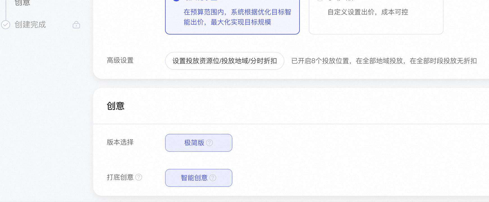
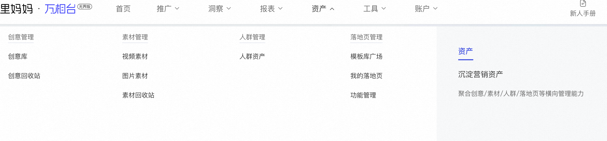
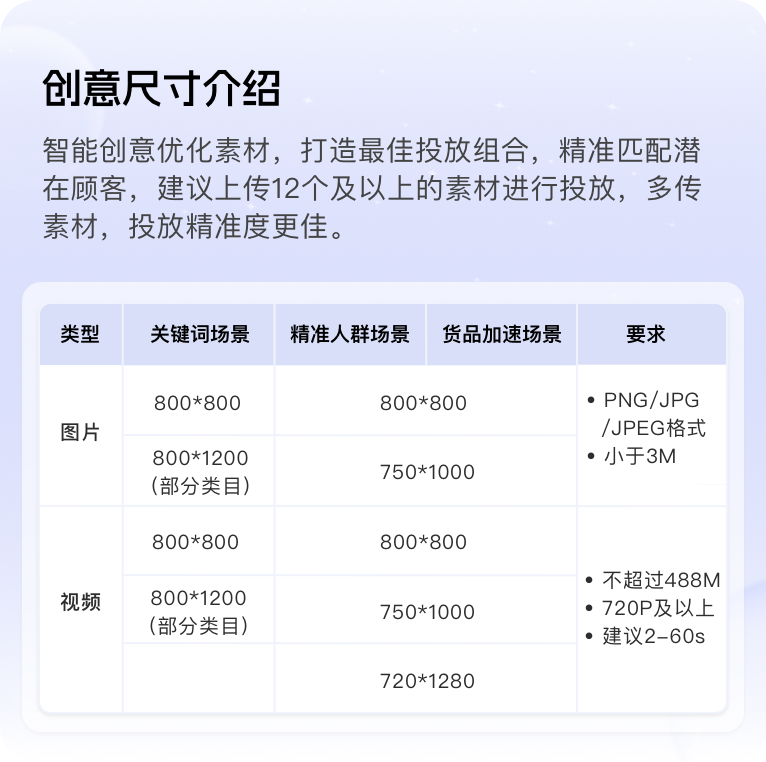
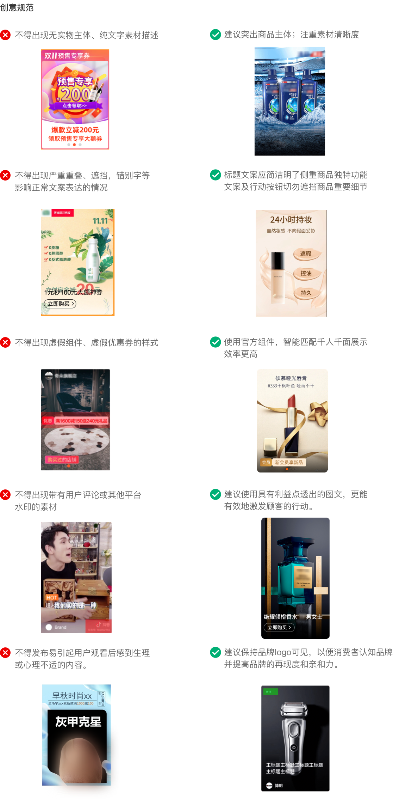
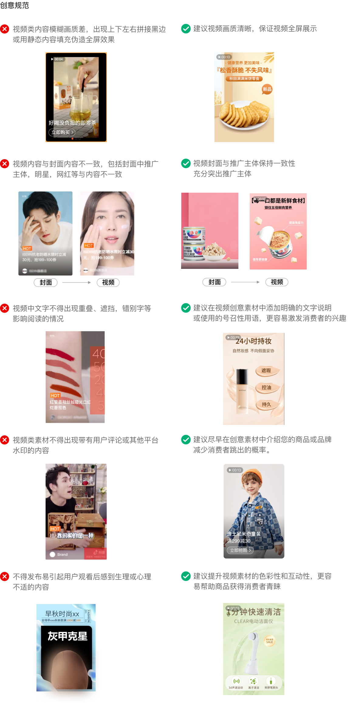

# 创意提效指南

> 来源：https://alidocs.dingtalk.com/i/nodes/93NwLYZXWyxXroNzCjpZL9xK8kyEqBQm

**原语雀文档链接：**https://yuque.antfin.com/chenchun.chen/gqhty9/qaikqzh2z0q9a8m1

---

#### 一、快捷创意功能

** 您可以在计划创建过程中「设置创意」时使用快捷创意开关，快速进行高效创意投放：**

**智能创意：**系统使用宝贝主副图及自定义创意，生成多种创意效果，自动适配不同资源位。

打开方式：

#### 二、自定义上传创意能力

**您可以在主流程中「设置创意」或创意库「创意管理」使用新增创意，新增您自己的图片和视频创意：**

#### 图片及视频素材尺寸规范

图片创意：支持1:1（宽高800*800）、3:4（宽高750*1000）

视频创意：支持1:1（宽高800*800）、3:4（宽高720*960、宽高750*1000）、9:16（宽高720*1280、宽高1080*1920）

#### 三、创意素材规范及建议

#### 图片规范

#### 视频规范

#### 四、常见审核规范

##### 基础规范

素材不得含有淫秽、⾊情、赌博、迷信、恐怖、暴⼒的内容

素材不得含有⺠族、种族、宗教、性别歧视的内容

素材不得出现条形码，股票代码，微信ID，微信QR码，QQ ID或其他社交媒体平台的任何信息。

更多国家、行业及平台规范要求见

https://rule.alimama.com/#!/product/index?type=list&id=1074&categoryId=1108

**【****图片拒审常见原因****】**
您的素材需要满足资源位的特殊规范的格式要求，请对照修改，避免违规哦！
不得出现严重重叠、遮挡等影响正常文案表达的情况
不得出现虚假组件、虚假优惠券的样式
不得出现无推广信息、纯文字等素材描述
不得出现带有用户评论或其他平台水印的素材
不得发布易引起用户观看后感到生理或心理不适的内容。
**【裁剪素材格式规范】**
请您仔细核对裁剪后素材的内容，避免不符合平台规定或要求哦！
创意文案或相关图片不得出现展示不全的情况
创意文案或相关图片不得出现相互遮挡影响阅读的情况
创意内容或推广标题不得出现恶搞或信息严重缺失
创意图片或推广文案不得存在错别字

**【视频拒审常见原因】**
您的素材需要满足资源位的特殊规范的格式要求，请对照修改，避免违规哦！
视频类素材不得出现上下左右拼接黑边
视频类素材画质应当清晰，视频内容与封面内容一致
视频类广告素材中的语音仅可使用普通话，不可使用地方方言或外语
不得发布易引起用户观看后感到生理或心理不适的内容。

| 创意能力概览 | 创意细分 | 模版样式及入口 | 模版优势 |
| --- | --- | --- | --- |
| **建议必选：** **主图视频开关** | 新建计划进入“设置创意”步骤，打开“主图视频”按钮 | 主图视频一键同步宝贝主图视频快速投放 |  |
| 智能创意开关 | 新建计划进入“设置创意”步骤，打开“智能创意”按钮，系统即可自动优选店铺内的宝贝制作创意。 | 创意方案更快落地，解决创意制作复杂的问题，一键制作创意，高效完成投放准备。 |  |
| 自定义创意 | 创意模版-场景角标 首焦&首猜 （按展现优先级排序） | 直播标 | Step1. 新建计划 或 编辑历史计划，进入「设置创意」部分 Step2. 勾选「自定义」，点击「选择模版」图示如下： Step3. 选择首焦和首猜资源位相应模版即可（图示如上） |
|  |  | 首焦会员 |  |
|  |  | 店铺关系 |  |
|  |  | 店铺优惠券 |  |
|  |  | 首猜会员 |  |
|  |  | 爆款标记 |  |
|  | 创意模版-全屏微详情 会员模版 |  | tep1. 新建计划 或 编辑历史计划，进入「设置创意」部分 Step2. 勾选「自定义」，点击「选择模版」图示如下： Step3. 选择全屏微详情模版即可 |
|  | 创意模版-全屏微详情 优惠券模版 |  |  |
|  | 创意模版-全屏微详情 **高阶创意模版-破框** | 详见语雀：https://www.yuque.com/u209206/wyiadn/yl7izf?singleDoc# 《高阶创意：「破框」制作指导》 |  |
|  | 创意模版-全屏微详情 **高阶创意模版-多品连投** |  |  |
|  | 创意组件-动效模版 |  | 根据您提供的静态创意 结合多种复合商品推广特性的动效组建模版即可快速生成动效创意 |
|  | 制图模版库-类目模版 |  | 根据您的需求 快速制作具有行业类目特征或大促限时氛围的独特创意 |
|  | 创意组件-视频模版 |  | 支持3s视频上传 |
