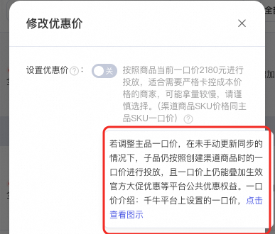
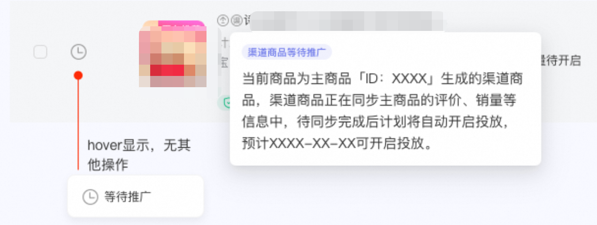
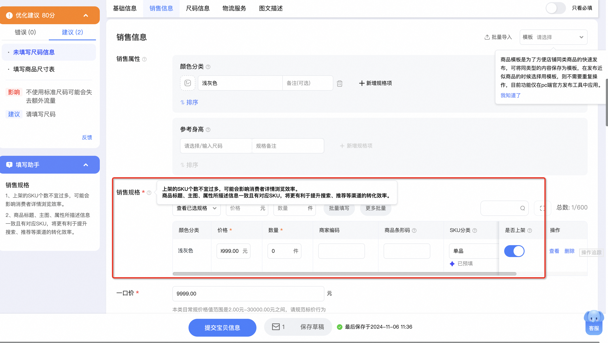
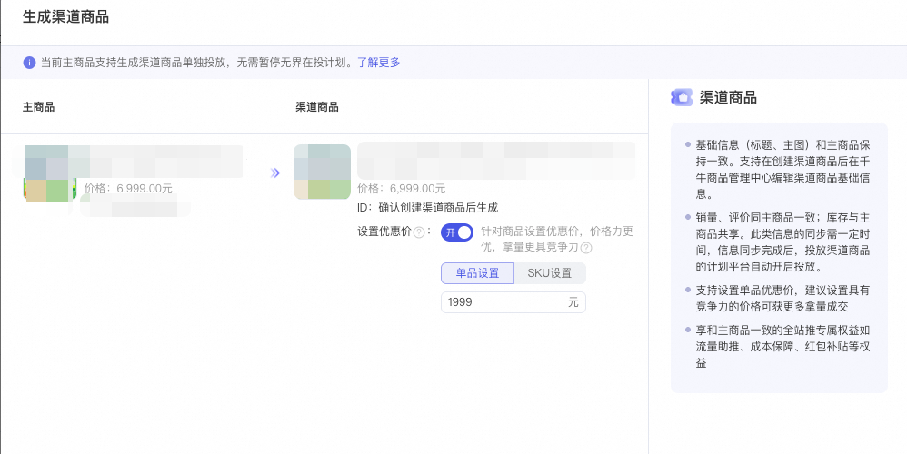
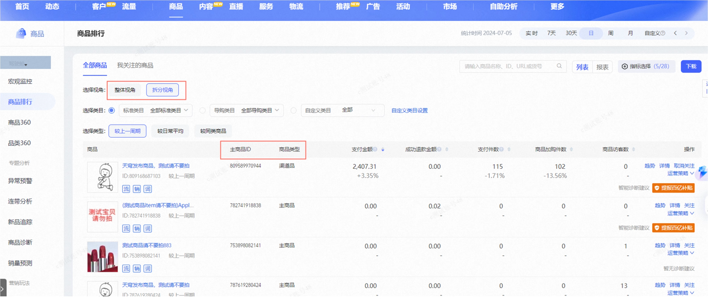

# 渠道商品（暂停开白）

> 来源：https://alidocs.dingtalk.com/i/nodes/93NwLYZXWyxXroNzCjpZLBEk8kyEqBQm

【下线通知】货品全站推广-渠道商品下线通知

因产品功能优化调整，本功能将于10月15日下线，后续不再新增渠道商品，感谢您的支持。

10月15日前未关闭的，系统会统一关闭「渠道商品」投中改价格入口，「渠道商品」功能的关闭，不影响您的店铺其他计划运行。**​**

**原价投放上线：4/23号渠道商品上线新能力！**

**功能介绍：（渠道商品支持设置和主商品一口价等价）****渠道商品创建时，可选择对单品设置单独的优惠价或设置原价投放，当关闭设置优惠价入口，渠道商品默认价格为千牛设置的一口价，当商品有多个SKU时，默认按照主品的SKU一口价设置。**

**延迟启投上线：3/14号渠道商品上线新能力！**

**功能介绍：（渠道商品计划创建48小时内计划上线）****渠道商品创建完成后，等待渠道商品销量、评论等同步的过程中，货品全站推广渠道商品计划处于「等待投放」状态，创建完成48小时内数据同步完成后，系统后自动开启货品全站推广计划，不需要您手动开启，耐心等待即可；**

**诊断功能：****目前诊断能力适配尚未上线，针对等待开启的计划，诊断透出商品下架属于正常现象，该文案透出不影响渠道品及主品的数据同步，请您保持计划处于正常投放状态，暂停或者删除计划将会影响商品数据同步！**

# 一、背景

1、由于同一个商品在无界投放货品全站推广与其他场景互斥的特性，为了满足商家朋友们同一个商品可以在无界实现多场景投放，阿里妈妈货品全站推广推出渠道商品的能力，该能力不仅解决了商家朋友们对于爆品迁移至货品全站推广的投放焦虑，同时也提供了在大促期间商家朋友们针对同一个商品的多重营销诉求。

# 二、核心产品能力

渠道商品在生成一刻，继承主商品的基础信息，如主图、标题等，生成后可自行编辑渠道商品基础信息

**库存共享**：渠道商品与主商品库存共享，不可单独对渠道商品的库存进行设置

**销量&评价互穿**：渠道商品与主商品销量、评价保持一致

渠道商品实际价格建议与主商品通过单品宝券后价格保持一致

**重点备注：价格规则解释**

**case解析：**

| **Case1** | **Case2** |
| --- | --- |

**根据当前平台价格规则，设置价格后，以满减等规则的实际到手价可能存在破价风险，建议商家设置好后实际校验一下到手价；**

**当选择优惠价**-单品设置优惠价会针对商品所有SKU统一设置价格，多SKU商品「**建议」**使用SKU设置优惠价

# 三、商品需求

**商品要求：**

**1、单品最近7日无界消耗>=7000元 **

**2、单品近30天该品在货品全站推广消耗=0**

**3、单品无界必须在投**

**4、单品SKU<200**

**查看近7天消耗入口**：）

|  |  |
| --- | --- |

**商品SKU要求**：0<商品SKU<200（查看商品SKU数量入口：千牛-商品管理-编辑商品）

# 四、操作步骤

#### 1、渠道商品生成入口

| **入口** | **图片示意** |
| --- | --- |
| **入口 ：**进入货品全站推广新建计划页面->添加宝贝->选择**「添加渠道商品」** |  |

#### 2、生成渠道商品

选择生成渠道商品后，跳出「生成渠道商品」浮层，点击设置单品价格后点击确认生成将会进入商品生成环节。

#### 3、渠道商品价格设置

| **​** | **图片示意** |
| --- | --- |
| 单品优惠价展示位置 |  |
| 渠道商品优惠价编辑，支持批量修改优惠价，也可针对单个SKU进行搜索改价 | 注：单品设置优惠价会针对商品所有SKU统一设置价格，多SKU商品建议使用SKU设置优惠价 |
| 注意：必须完整填写渠道商品价格及SKU单价 如选择关闭优惠价，则默认渠道商品=主商品各个SKU一口价 如选择开启优惠价，渠道商品价格必须小于主品原价方可生成 |  |

#### 4、渠道商品生成

| **入口** | **图片示意** |
| --- | --- |
| 生成中 |  |
| **生成成功**-返回选品页可继续生成渠道商品 or 生成渠道商品计划 |  |
| **生成失败**-选择重新生成 or 返回选品页面重新选择其他商品生成渠道商品 |  |

#### 5、渠道商品查看方式及如何修改价格

| **入口** | **图片示意** |
| --- | --- |
| 渠道商品生成成功-返回选品页-渠道选品替换主品被添加到选品list-并在左上角打标**「渠」字** |  |
| **计划管理页**-渠道商品计划打标，并支持在计划管理页修改渠道商品价格 |  |
| **计划管理页**-修改渠道商品价格 |  |

# 五、常见问题

#### 1、渠道商品为什么没有数据？

渠道商品销量评价继承需要一到两天的时间，这个过程中可能会有冷启动，请您耐心等待。

​

#### 2、**渠道商品的创建有哪些要求吗？**

唯一性：同一个商品在同渠道仅限设置1个渠道商品，且不可跨渠道售卖；

价格要求：需满足渠道的价格要求，且渠道商品价格必须小于主品；

>>>了解详情

​

#### 3、渠道商品是否支持编辑基础信息，如编辑图片/标题？

支持。商家可通过**千牛-渠道商品管理**中心对子商品进行编辑。

注：

1、渠道商品类目、属性、资质、图文详情等部分信息与主商品严格保持一致，不支持自定义编辑。

2、风险连带：在假劣滥、禁限售等商品主控处置上，规则与大盘拉齐，渠道商品和主商品存在连带责任。举例：渠道商品和主商品任一触发处罚下架，对应的商品和渠道商品均执行下架处罚；主商品和渠道商品任一存在销量作弊行为，对于累计产生的销量做统一处理。

#### **4、主品的SKU素材修改后，渠道商品的sku素材是否会进行同步？**

不会自动同步，点击千牛-渠道商品管理提交后，子品自动跟随主品的SKU素材。

#### **5、**** 渠道商品和主品的数据可以分开查看吗，渠道商品的权重是否会叠加到主品？ **

可以。渠道商品和主品为两个独立商品，生参/千牛为分开的数据，搜推权重也是分开记录 ;

商品生成成功后，商家可在「生意参谋」-「商品」-「商品排行」-「全部商品」查看商品相关指标，「拆分视角」为主商品、渠道商品相关数据，「整体视角」为同款主商品下渠道品汇总后数据。
>>>了解详情

#### 6、渠道商品库存是否无法单独设置，需与主商品共享？

渠道商品与主商品库存共享，无法对渠道商品的库存进行单独设置。

​

#### 7、渠道商品库存和销量共享的时间 ?

主品和渠道商品的库存和销量/评价是共享的，但可能略有1-2天的延迟，请您耐心等待；

#### 8、如果渠道商品在货品全站推广创建成功后，计划跑量中中途改价，计划会被暂停吗？

改价不会暂停货品全站推广的计划。

#### 9、渠道商品价格需小于等于主商品券后价，都包含哪些渠道的券&优惠价？

渠道商品生成过程过程中，设置的价格是单品宝的价格，包含普惠券叠加后的价格。

#### 10、如果渠道商品在投放货品全站推广，可以替换为主商品投放吗？

货品全站推广支持主商品和渠道商品同时投放，故不需要替换。

#### 11、渠道商品发布后，是否会和正常创建商品一样需要审核，审核失败会怎样？

渠道商品的审核逻辑无改动，遵循统一的风控审核，如果审核失败，需要按照失败提示原因改动即可。

#### 12、渠道商品是否影响主链接商品流量；

功能本身不会从算法底层逻辑上造成影响，实际情况请以当下流量环境做判断分析，建议商家关注商品主子链接总计流量增量做考量。

​

#### 13、如果主商品在货品全站推广中在投，可以创建渠道商品同时投放货品全站推广？

暂不支持。

​

#### 14、 渠道商品和主商品会同时出现在同一个页面吗？

不会。pc单页互斥/无线单次请求互斥，只能看到主品/渠道商品其中1个；

​

#### 15、主商品报名参加平台大促，渠道商品会自动报名吗？

不会。

#### 16、渠道商品界面显示无法上架的原因？

​自营商品不能生成渠道商品，暂时未接入。 >>>具体原因

家装服务的商家，上门安装、“干支装”指定类目下的商品需先绑定服务（设置服务模版）方可上架销售。

>>>查询详情（致电400-800-0808转7咨询(工作日9：00-20:00) / 钉钉群咨询，群号：33249458）

​

#### 17、渠道商品计划删除后，可以再生成一个渠道商品吗？

每个主商品只有一次生成渠道商品的机会，货品全站推广暂停或停止投放，渠道商品下架，恢复计划后渠道商品上架，建议商家谨慎操作；

#### 18、添加渠道商品，如出现以下报错的原因之一是？

####

请自查是否为海外商家，主站侧不支持海外商家创建渠道商品，后续会增加针对海外商家创建进行屏蔽；

如不是海外商家，遇到上面报错情况可找小袋鼠客服提工单。

#### 19、为什么在搜索搜不到自己的主品（渠道商品）？

当用户在搜索结果上，使用了不同的排序方式，对应生效的排序规则会有所不同。

**当选择“综合排序”：**以365天销量 （付款人数）展示销量，主品和渠道商品商品互穿，透出逻辑根据效率（主品和渠道商品谁高排谁）透出效率高的商品；
**当选择“销量排序”：**以30天收货人数排序，主品和渠道商品不互穿，透出逻辑根据30天收货人数，主品和渠道商品谁高透谁；

​

​

​
