# 😎极速通道高端玩法：优化白盒拿量，精准触达TA

> 来源：https://alidocs.dingtalk.com/i/nodes/93NwLYZXWyxXroNzCjpZP7Q18kyEqBQm

**❗️❗️****推广预算有限，人群必须精准高转化，但自定义人群总是拿量困难****❓❓**

😡💢到底是谁还没开始使用**自定义人群极速通道！**

**不会用？**悄悄放一个**高端玩法 **给有缘人，学会了请速速开始实践吧！

请牢记**⛔公式：**

**大促主推爆品 + ****1个自定义人群**** +**** 出价调整****低于系统推荐出价/日预算**

**= ****该人群必被标识为****“拿量潜力”****人群**

**再****采纳建议出价/日预算****，****即可享受****极速通道的独有放量加持**

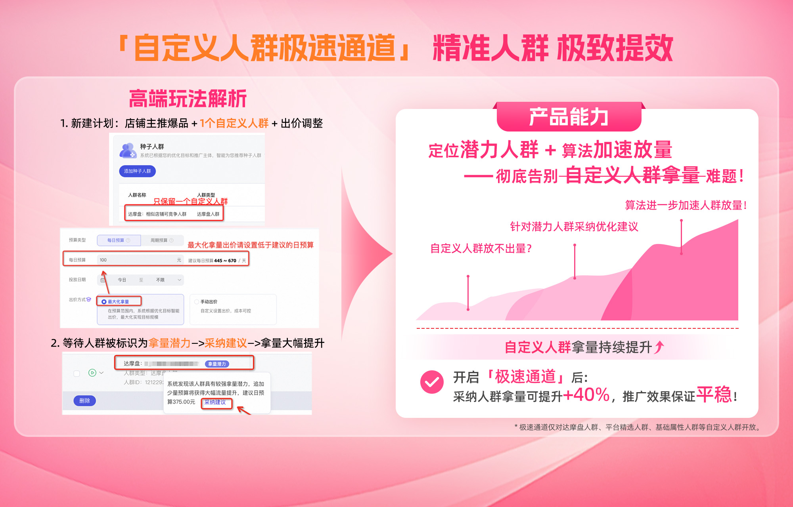

## 操作步骤

### **1-新建计划**

⚡️**点击右侧开始新建：大促强烈推荐您新建****「促进成交」计划****，结合****极速通道****更可事半功倍！！**

*极速通道对于**店铺宝贝运营**和**人群方舟**皆可生效，您可***选择过往投放过程中效果更好的解决方案***参与活动。*

#### *STEP 1：**解决方案&优化目标*

店铺人群运营中的自定义人群 or 自定义推广；

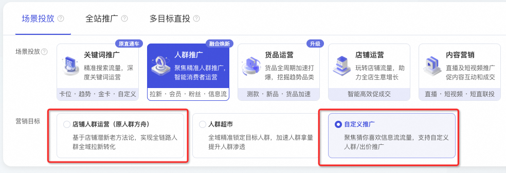

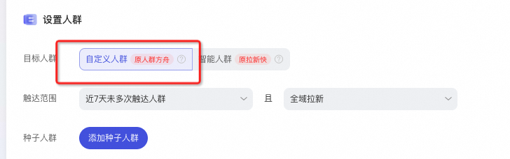

#### *STEP 2：**投放主体*

建议添加**近期店铺主推货品**；

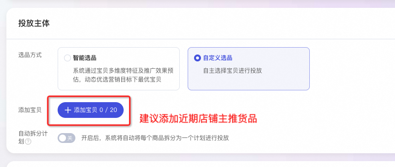

#### *STEP 3：**人群设置*

选择**1个**自定义人群（自定义人群指平台精选、达摩盘人群、基础属性人群），**最好****only one**；

注意：**单个自定义人群必被标识为拿量潜力**；若您推广计划有多个自定义人群，极速通道将在多个自定义人群中选择一个**最具拿量潜力**的人群进行标识；**任意被标识的潜力人群一旦采纳建议，必然会拿量大幅提升**。

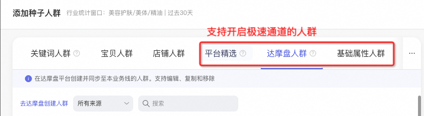

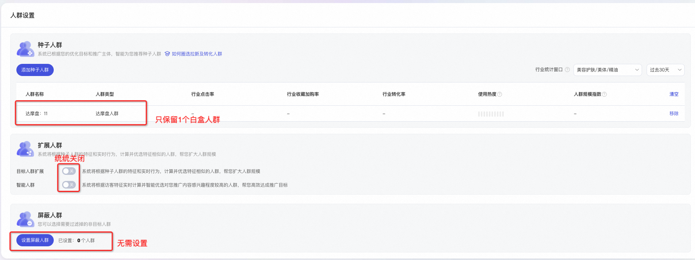

#### *STEP 4：**出价设置*

选择**最大化拿量**出价（大促效果更优），并设置**低于系统建议的日预算**；*亦可***手动出价***设置***低***于系统建议出价；控***投产比出价***设置***高***于系统建议投产比。*

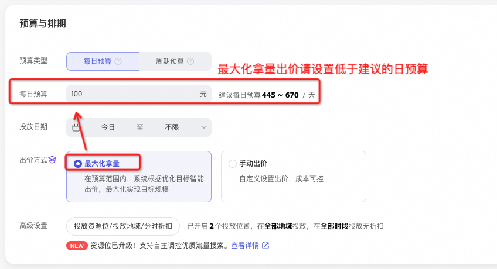

#### *STEP 5：**等待计划产生曝光，该人群即可被算法标识为“拿量潜力”人群。*

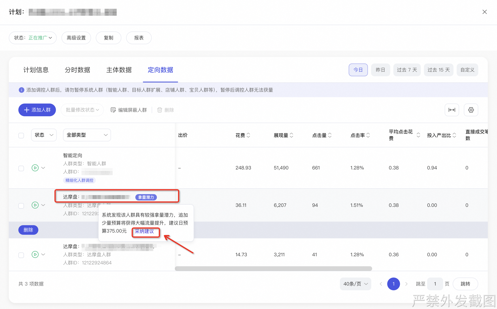

---

### **2-开启极速通道**

**入口-定向数据：**

推广管理页——精准人群推广——计划详情页，找到本条计划，点击 详情 ，进入计划管理侧滑窗，点进 **定向数据** 页面。

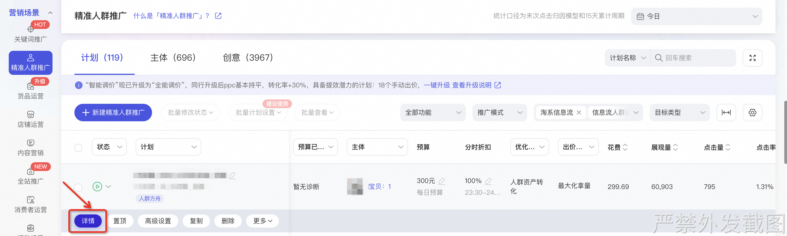

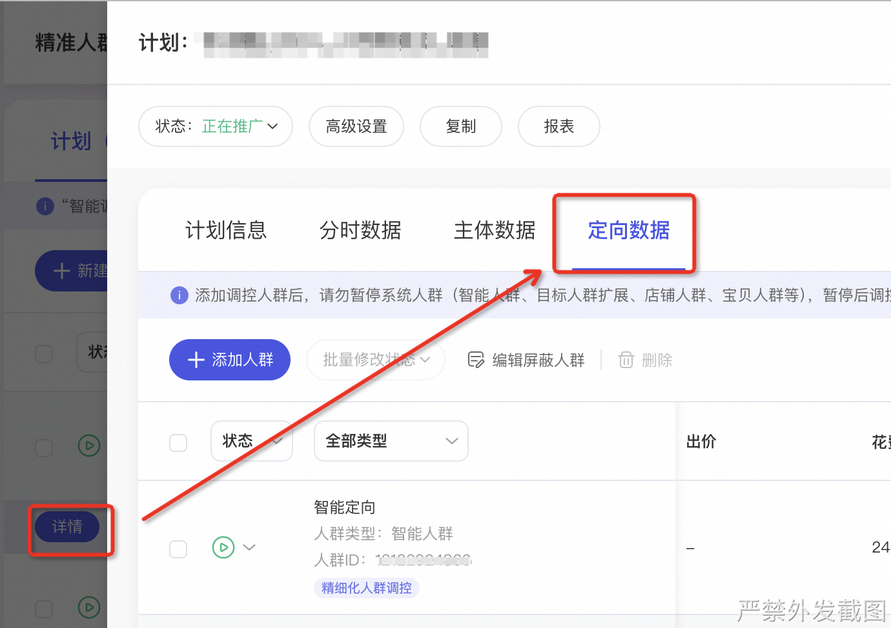

**​**

**采纳策略：**

对于具有拿量潜力的人群，系统会在人群上标识 拿量潜力 。鼠标移动到该标签区域，会显示进一步释放人群潜力的建议，然后点击** 采纳建议 **，拿量潜力人群即刻进入极速通道优化拿量。

对于系统出价的计划，对该计划**追加少量日预算**即可获得大幅流量提升。

对于手动出价的计划，对该人群**设置建议出价**即可获得大幅流量提升；如该计划有多个拿量潜力人群，可通过** ****批量采纳潜力人群出价**** **一键完成出价设置。

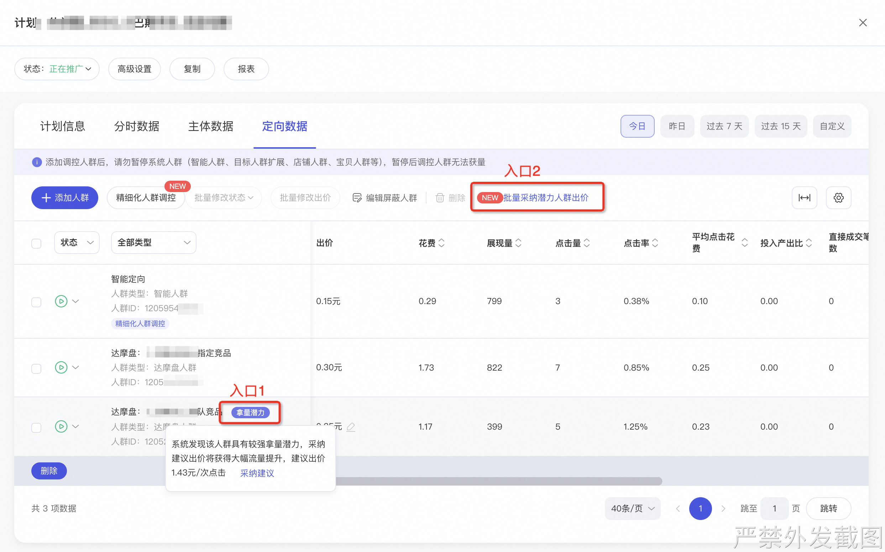

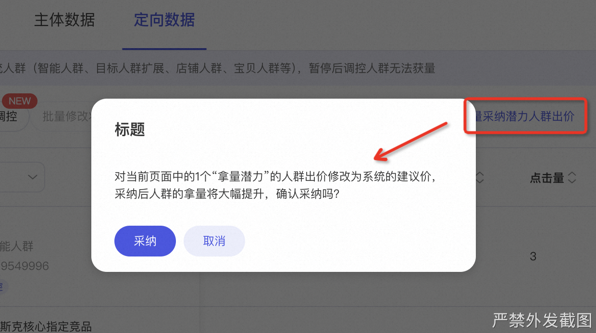

⚠️ 注意：采纳建议务必从** 采纳建议 **入口进行调整，人群才会被标识为 采纳人群 并进入极速通道；

手动修改预算和出价，是不会打标人群，也不会优化人群拿量的！！

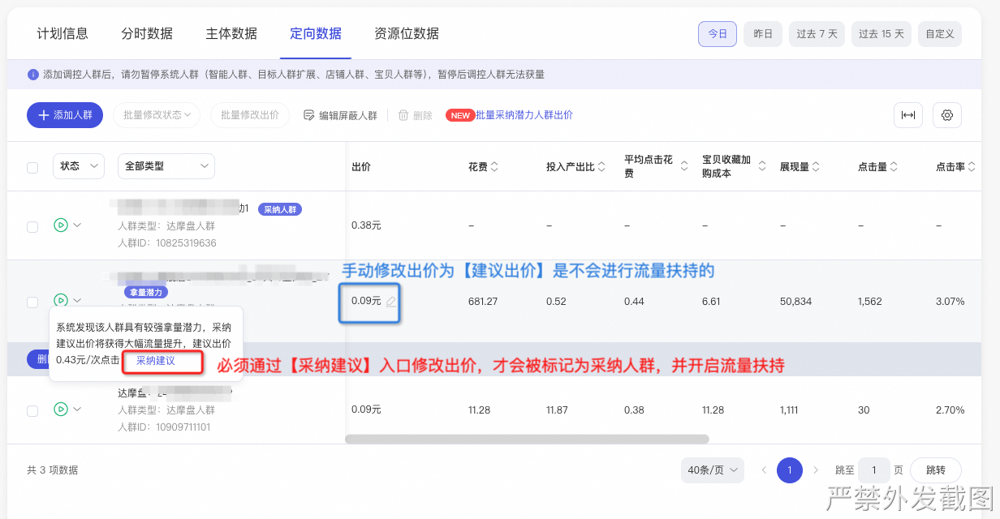

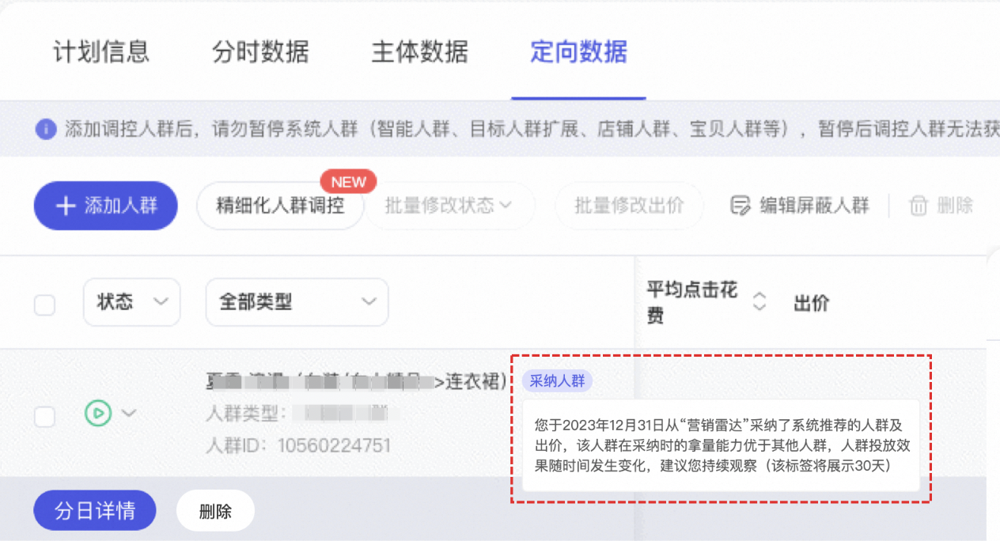

---

### **3-观测极速通道效果**

您可于**定向列表 **中查看该人群的**曝光、点击、转化**数据，**采纳建议****必会对****潜力人群****带来大幅拿量提升**。

---

### *4-推广计划添加更多人群*

若单一人群无法满足您的推广诉求，建议您在对**NO.1自定义人群****采纳建议后**，再对该计划添加其他定向，不影响极速通道对该**NO.1自定义人群**的专属放量扶持。

注意：若您未采纳建议就添加多个人群，极速通道将在多个自定义人群中选择一个**最具拿量潜力**的人群进行标识，可能会与您的推广诉求不相符；但**任意被标识的人群一旦采纳建议，必然会拿量大幅提升**。

### **5-存量计划开启极速通道**

如您想对人群场景的存量计划开启极速通道，助力白盒拿量提升，请收藏文档👇：

## 如遇使用问题，可添加钉群进行答疑：78570010884

---

### 高频Q&A

**🤔 Q1：我的人群没有被标识为拿量潜力？**请先自查：**1-人群是否为白盒人群**（白盒人群指平台精选、达摩盘人群、基础属性人群）；2-**出价设置是否低于系统建议**（最大化拿量低于系统建议预算、手动出价低于系统建议出价、控投产出价高于系统建议投产比）。

**🤔 Q2：如何判断是否开启极速通道？****采纳建议****1-2小时****后**，对应新增人群/拿量潜力人群将打上“采纳人群”的标签，并进入极速通道优化拿量。

**⚠️**** ****拿量潜力≠开启极速通道****；**对拿量潜力人群**采纳建议1-2小时后**（期间不要调低出价/预算），**人群变为“采纳人群”，才说明已开启极速通道。**** **

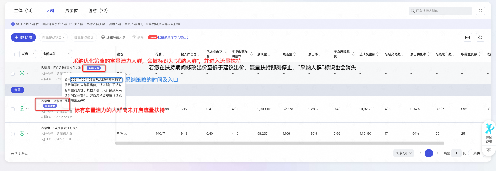

**🤔 Q3：极速通道是如何优化拿量的？**系统帮助您诊断当前自定义人群计划设置的短板，并反馈优化建议。您采纳建议后，算法机制会帮您加速拿量。**推广人群仍为您圈选的人群标签，不会稀释人群特征**。

​

**🤔 Q4：怎么识别的潜力人群？**主要从**人群量级、竞价优劣势**维度，对计划中的自定义人群进行诊断，找到**本应可以实现更大触达规模**的人群，从**出价**维度反馈优化建议。

​

**🤔 Q5：****如何批量找到****所有的拿量潜力人群****？or 我怎么知道****哪些人群可以开启极速通道****？**

**「精准人群推广」计划管理页——批量选中计划——批量查看定向——批量采纳潜力人群出价**

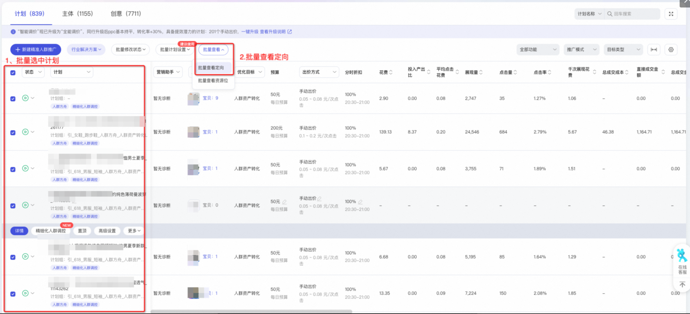

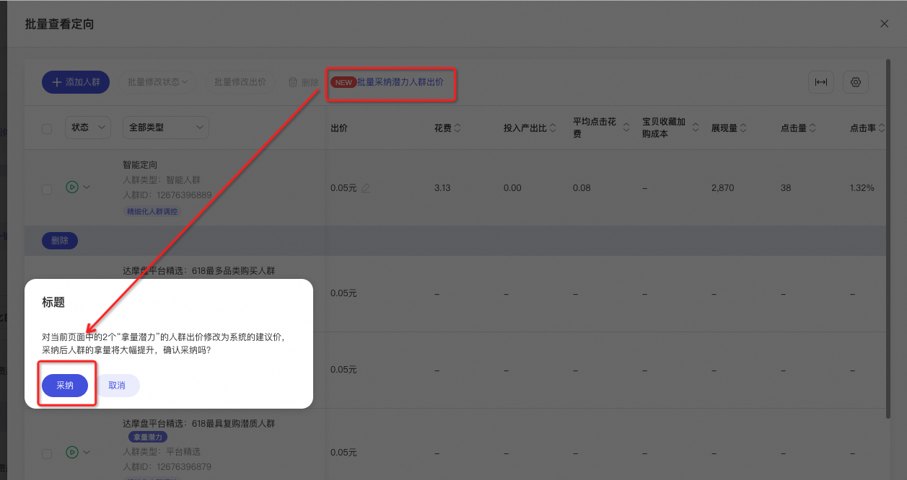

**⚠️ 若您修改出价/预算低于建议值，该人群将不再标记“采纳人群”并退出极速通道！建议您在测试期间不要调低出价/预算，以免影响拿量优化效果！**

**🤔 Q6：如何查看新增人群/拿量潜力人群的拿量优化效果？****可通过：**计划管理侧滑窗—— **定向数据** 页面进行查看；可设定时间范围查看采纳人群的效果变化。

