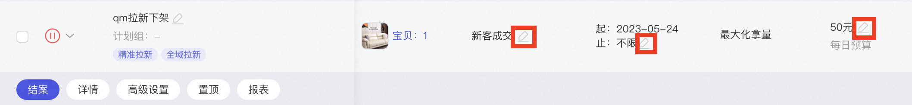
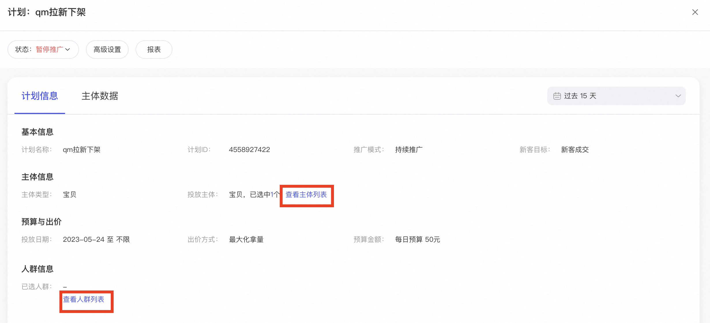
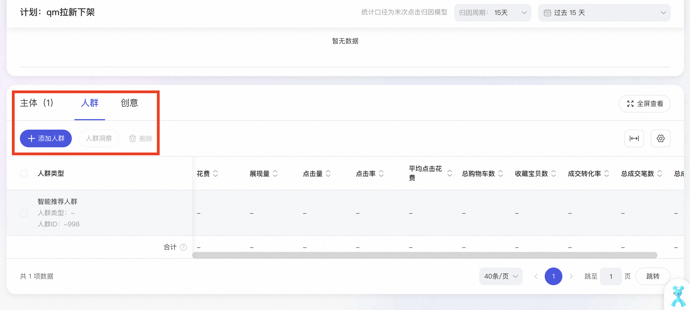
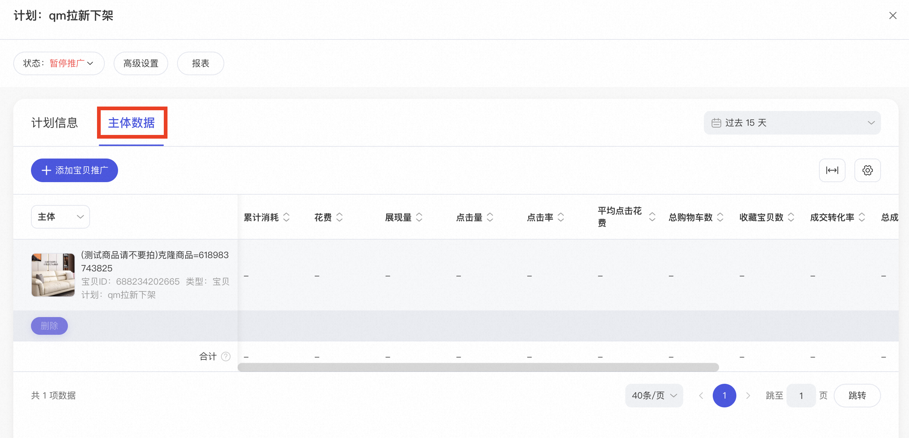
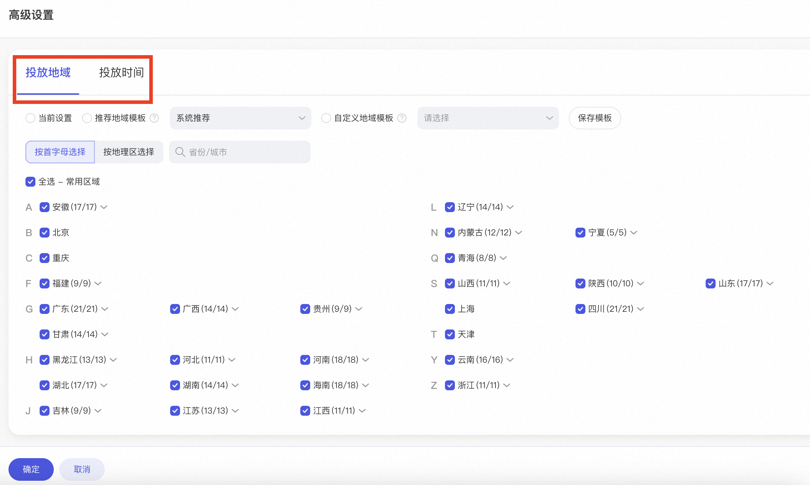

# 计划设置修改问题

> 来源：https://alidocs.dingtalk.com/i/nodes/93NwLYZXWyxXroNzCjpZrv648kyEqBQm

**原语雀文档链接：**https://yuque.antfin.com/chenchun.chen/gqhty9/guaghn3xunbbhr7x

---

**（1）优化目标/日期/预算**

如需修改计划优化目标、日期或预算可以直接点击计划后面的「笔状图标」

**​**

**（2）投放人群/宝贝/创意**

如需修改投放人群、宝贝、创意，需要点击计划「详情」-「计划信息」-「查看人群列表/主体列表」，跳转至对应页面进行修改，点击「添加宝贝」「添加人群」即可进行增加或移除操作。

或者直接点击「详情」-「主体数据」，添加或删除宝贝

**​**

**（3）高级设置：投放地域/时间段**

如需修改投放地域、时间段，点击计划下的「高级设置」

注：一期时高级设置能力未进行迁移，二期高级设置能力上线，所以商家部分老计划无法进行高级设置，目前新建的计划是可以进行地域和时间设置的

