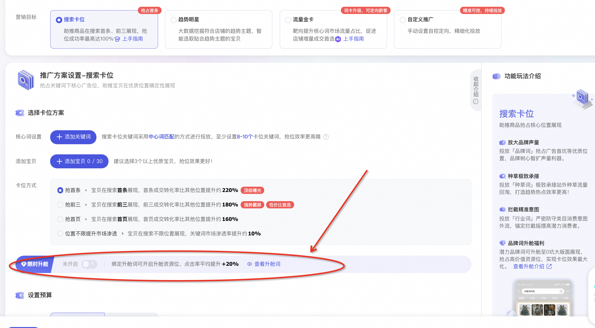
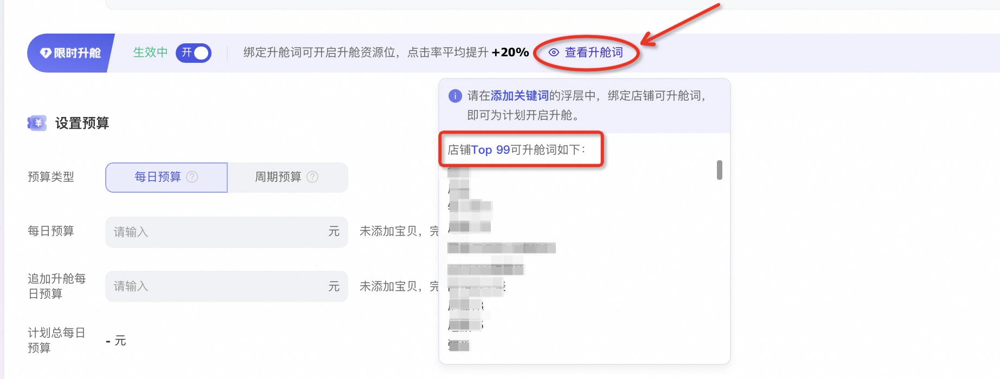
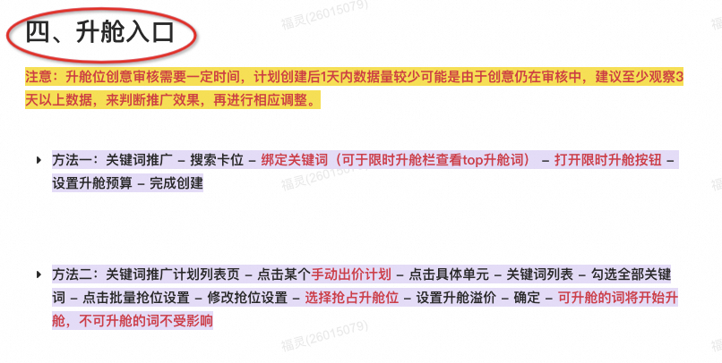
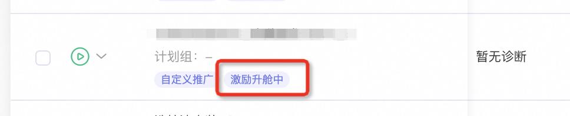
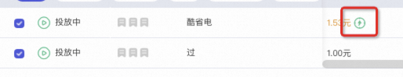
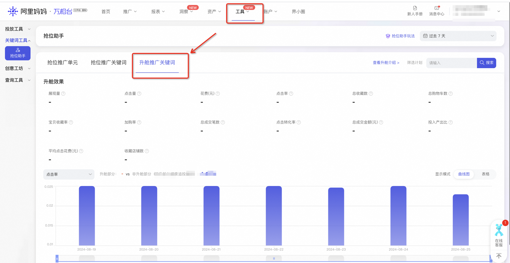

# 【🚀】关键词升舱高频问答

> 来源：https://alidocs.dingtalk.com/i/nodes/AR4GpnMqJzKpOoklFNPa3eAR8Ke0xjE3

此文档可以帮助大家日常遇到升舱相关问题时，快速找到答案，可使用ctrl+f快速搜索问题，若搜索不到，可填写问卷填报：https://survey.taobao.com/apps/zhiliao/ipGp7ZpqV，小二将定期更新此文档。

## 1、怎么确定是否有「关键词升舱」权限？

点击进入：万相台无界版

「关键词推广-搜索卡位」中如果下图位置有升舱栏，则有权限，可以升舱。

​

## 2、哪些关键词是可升舱词？能不能自定义可升舱词？

鼠标移动到「搜索卡位-升舱栏」（下图所示）位置，则看查看店铺top99可升舱词。

另外，可升舱词一般包含品牌名称，可以尝试先添加，创建完成升舱计划后，可升舱的词会自动开始升舱。

目前暂时不支持申请添加系统没有产出的可升舱词，后续会进行升级，请大家耐心等待。

## 3、哪里可以创建「正式升舱」计划？

商家可以在「关键词推广手动出价计划」和「关键词推广搜索卡位计划」中打开升舱，具体操作 >点击查看< 第四部分。

## 4、为什么没有创建过升舱计划，也显示升舱中？

满足关键词场景活跃及消耗要求的天猫商家，可获得「升舱激励体验装」权益。权益自动生效，激励体验装标识为计划维度标签，正式升舱为词维度标签（绿色），可以以此区分。

**激励体验装-计划维度标，如下图：**

**正式升舱-词维度绿色标识，如下图：**

## 5、升舱计费方式是什么？如何竞价？ppc会不会特别高？

关键词升舱是点击计费，二价扣费。

升舱位出价需高于搜索1坑在同词下的价格，才有可能竞得0坑升舱位：若同一时时间、同一关键词下，a、b、c同时竞争0坑升舱位，出价均低于1坑在此时间价格，则abc都无法竞得升舱位；出价均高于1坑在此时间价格，则价高者得。

升舱位价格是根据相应词下竞争情况而实时变动的，不同时间不同词的价格都不同，有高有低。但同一个词下，升舱位PPC肯定会高于搜索结果页其他位置，因为升舱位的拦截人群、点击加购效果也远远优于其他位置，商家可在需要提高商品点击率、快速提高部分人群占比、提高收藏加购率等的情况下使用升舱能力，效果最好。

## 6、为什么设置完升舱，计划显示正在升舱中，但搜索时，有时能看到，有时看不到？

关键词升舱与品销宝不一样，关键词升舱是点击计费，点击计费更具有确定性，能有效减少商家在一些转化可能低的流量上的花费。

所有点击计费的广告都不会百分百出现在广告位，而是系统基于计划的预算/出价等，智能计算效果最大化的投放方式，择优展现。

如果想要尽可能多的展现，可以尝试提高预算/出价（但不太建议仅关注展现，如果只想保证展现的，建议优先选择明星店铺进行投放）。

## 7、升舱数据怎么查看？

因为关键词升舱需要在手动出价计划中，或者搜索卡位计划中打开，所以计划整体的数据是包括正常投放和升舱两部分的数据，不是单独的升舱数据。

升舱部分的数据可以在「无界后台-工具-关键词工具-抢位助手-升舱推广关键词」中查看。

## 7、升舱和明星店铺、品牌专区的区别是什么，会冲突吗？

收费方式不同：品牌专区是合同制收费，明星店铺是按照展现次数计费费，升舱是按照点击次数计费。

买词方式不同：品专一次性付费买断相关词，星店按照词包购买，升舱可以灵活选择单个词进行推广。

推广对象不同：品专和星店推广的对象是店铺，升舱可以对单个商品进行推广。

创建位置不同：品专和星店在品销宝创建计划，升舱可以在无界-关键词推广场景搜索卡位/手动出价中创建，可统一使用无界后台余额，且关键词场景的选词、选品、选人群、选地域等能力，均可生效于升舱推广中，更加灵活，功能更丰富，实现更多个性化推广需求。

三者不会冲突，目前同一个词下推广优先级为：品专>星店>升舱，即升舱出价再高也会优先展现星店创意，因此不会有冲突。

## 8、为什么升舱部分预算花不出去，数据量很少？

升舱位置创意审核需要一定时间，计划创建后1天内数据量较少可能是由于创意仍在审核中，建议至少观察3天以上数据，来判断推广效果，再进行相应调整。

升舱投放的关键词是中心词匹配逻辑，因此添加的可升舱词过少，会导致系统难以拿量，建议至少添加20个以上可升舱词，以保证拿量效果。

手动出价中开启升舱，若数据量很少，还有可能是出价过低导致，可以适当提高出价，观察效果是否有变化。

若以上问题都解决了，数据量还是很少，可以添加升舱钉钉群@福灵并告知计划id（钉钉群号：95535012849）。

##

​

**相关推荐：**1、什么是激励升舱体验装：什么是「关键词升舱·激励体验装」 · 语雀2、怎么设置正式升舱：「关键词升舱」高点击高转化，高效拦截品牌流量！ · 语雀3、升舱行业案例/玩法：【🔥】行业案例/玩法 · 语雀

​
