# 「货品全站推广」百大QA

> 来源：https://alidocs.dingtalk.com/i/nodes/AR4GpnMqJzKpOoklFpnv7lem8Ke0xjE3

# 一、关于活动问题

## **近期活动**

## **1：🔥🔥🔥暑期好货打爆季！平台推荐品消耗达标即返！**** ****>>>点击了解详情**

** **

**Q：如何确认我的商品是否是“平台推荐”？**

A：在「新建货品全站推广」-「添加推广商品」页面，带有「平台推荐」标识的商品即为本次活动对象。

**Q：为什么我看不到“平台推荐”商品？**

A：平台推荐是平台基于历史商品成长路径，通过智能算法对商品进行多维分析，从以下核心维度优选增长潜力大的商品，若暂无符合条件商品，说明当前无入选商品。

**Q：活动达标后奖励什么时候发放？**

A：奖励发放时间以妈妈club-赏金任务发放时间为准（如下图）

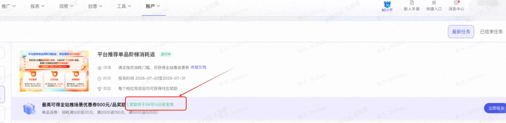

**Q：消耗返的统计周期具体是如何界定的？是以活动报名的时间开始计算，还是以活动期间的实际消耗为准？**

A：消耗返统计周期为活动期间，非报名时间开始。消耗统计时间： 2026-07-20 至2026-07-31，消耗统计口径：货品全站推

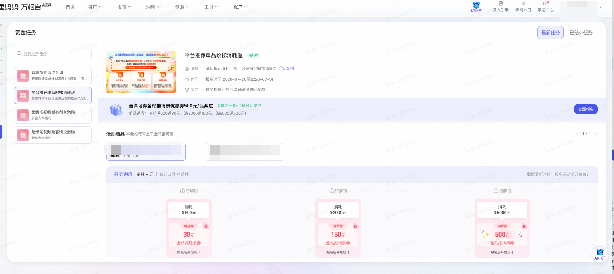

**Q：头部商品与腰部商品在下单后的发券机制上有什么区别？分别需要满足什么条件才能拿到券？**

A：头部商品下单后券直接发放到后台，腰部商品需要新建计划后消耗满足指定门槛后可拿到券。

## **活动优惠券**

**-敬请期待-**

# 二、关于选品问题

## **1：平台推荐商品**** ****>>>点击了解详情**

| **<可获取“专属流量扶持”、“成本保障权益”>** 平台根据货品全站推广历史投放商品进行智能货盘划分，从 GMV 增长、流量增长、roi 交付等多维度进行货品优选，保障宝贝的确定性打爆，商家可以理解**「平台推荐」货品为平台优选最适合投放货品全站推广的商品。** |  |
| --- | --- |

Q：**选择什么样的商品进行投放货品全站推广？**

A：建议优先选择有「平台推荐」、「红包补贴」、「流量助推」等标签的商品，算法挖掘的成交潜力品，系统优选商品拿量提升更快。

Q：**投放「****平台推荐****」****商品有什么优势？**

A：优先获得流量助推，加码扶持更快打爆商品；满足赔付条件，则可能享受赔付保障>>优质商品成本保障

## **2：优质新品****>>>点击了解详情**

| **<成长加速，交付新品破 100 率提升>** 基于商品属性与用户行为，AI 算法精准挖掘高潜新品，通过专属出价策略与流量扶持机制高效协同，依托多目标优化能力组合，**解决新品冷启动期流量增长难题，实现优质新品快速破百** **tips：**专属流量机制提升拿量能力，对比普通商品，平台推荐新品破百单更快！ |  |
| --- | --- |

## **3：潜力品****>>>点击了解详情**

| **<成交额跃升，交付 GMV 正向率提升>** 通过商品的用户特征及商品属性，挖掘**预测未来有 GMV 增长空间的商品进行推荐**，通过净成交出价交付确收 GMV，**多目标出价直接成交进行商品集中打爆**，带动潜力品成交跃迁。 **tips：**流量助推撬动成交增量，对比普通商品，平台推荐潜力品投后 GMV增长幅度更高！ |  |
| --- | --- |

## **4：机会爆品****>>>点击了解详情**

| **<全域流量增长，ROI 稳定交付/PV 正向增长>** **通过多目标出价/一健起量等增量能力的运用，在爆品稳定销量的同时，保障 roi 交付稳定， 提升拿量能力，****撬动 PV 增长** **tips：**付免联动撬动全域流量，对比普通商品，平台推荐机会爆品投后PV增长显著！ |  |
| --- | --- |

## **5：案例魔方 ****>>>点击了解详情**

Q：**为什么我没有案例魔方？**

该功能目前正在内测，后续将陆续开放，欢迎持续关注！

# 三、关于出价方式选择问题

## **1：「控投产比」出价方式****>>>点击了解详情**

### **投前设置问题**

Q：**如何设置出价？**

A：1）目标投产比=推广在15日内引导用户产生的所有支付宝交易的总成交金额/推广花费；

2）目标投产比设置越低，拿量能力越强；设置越高，拿量能力越弱，**请根据商品利润情况，合理设置出价；**

3）新建计划建议**优先采纳系统推荐**的高竞争力档位（即较低的 ROI）出价，可以更快撬动更多的总成交金额提升；

Q：**如何设置预算？**

A：1）算法基于商品历史投放数据和笔单价，设置了最低日预算，可以在此基础上**设置商品投放一天的预算；**

2）如果计划正常跑量提前下线，**建议提升预算至商品一天预计可消耗金额的 2 倍以上**，以保证计划全天在投；

3）当投放稳定后，**建议设置为不限预算**，以保证稳定获取更多 GMV；

Q：**新建货品全站推广计划，添加宝贝时，宝贝库存为0是什么原因？**

A：库存显示并非实时更新，数据不准，以千牛端显示为准。

### **投中优化问题**

Q：**如何获得更大的流量？**

A：1）采纳**系统推荐**的高竞争力档位（即较低的 ROI）出价；

2）开启**「一键起量」，**系统利用部分预算快速起量；

3）切换至**「最大化拿量」**投放，系统在预算范围内尽可能帮助拿量；

4）**优化商品基础**，提升创意竞争力（点击率）和转化竞争力（转化率）；

Q：**日预算和出价怎么调整？**

A：1）**不建议每天调整日预算**，日预算的设置需要能支撑计划持续在线投放；

2）出价每天建议不**要调整超过两次**，同时每次调整的幅度不宜过大，尤其是目标投产比设置较低时，调整幅度要尽可能小；

3）充足的预算和稳定合理的出价有助于计划更稳定跑量；

Q：**怎么看 ROI？**

A：1）在计划投放列表页可看投放实时投放 ROI，因短期投放数据存在较大波动，**建议您保持投放，观察多天整体效果；**

2）对于有一定投放数据的计划，**系统提供 7 天归因 ROI 预估数据**，帮助预估当天的投放在多天累计转化的效果；

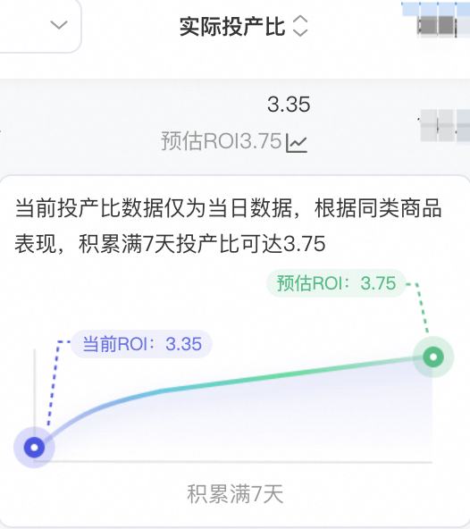

Q：**ROI 不好怎么调整？**

A：1）**计划处于「数据积累期」**，投放不稳定。建议**持续保持投放，尽量避免频繁修改目标投产比**，计划直接引导成交笔数积累 20-50 笔可进入稳定投放期；

2）**计划开启了「一键起量」**，加速拿量期间成本会波动，**属于正常现象，请继续保持投放**；

3）**计划切换到了「最大化拿量」**，系统加速拿量引起成本波动，请**参考系统预估 GMV 设置合理的日预算**；

4）**近期频繁调整出价**，会导致效果波动，建议您综合近期出价记录来评估效果，同时尽量设置系统推荐范围内的出价，并避免频繁大幅度调整出价；

5）投放的**数据量较少**，较低的消耗金额，或者较少的订单数，让短期的实际投产比看起来有波动。系统会尽可能优化计划整体的效果，建议您**拉长时间周期和消耗金额，看整体的效果达成**

6）**处于平销期和大促周期的切换节点**，大促周期建议关注**「长周期整体 ROI」，**并避免大促期间频繁调整出价类型、出价设置，同时保持充足的日预算

排除以上原因，效果仍较差的（实际投放 ROI 低于目标 ROI*0.7），满足相应条件，可申请赔付

详见【控投产比出价成本保障】

### **投后复盘问题**

Q：**怎么看数据？**

A：1）可在投放列表页跳转「报表」看多日投放数据，根据数据评估计划整体投放效果

2）评估前提：尽量用**稳定投放期的数据**对比投放前的数据，同时建议多天均值对比，如投前 7 天对比投后 7 天

再结合生意参谋或者全站增长数据，分析投放商品投前投后变化情况，判断投放效果（具体见前面产品说明的投放效果评估）

## **2：「最大化拿量」出价方式****>>>点击了解详情**

##

### **适合场景问题**

Q：**适合哪些客户？**

A：1）消耗预期明确，需要快速引流（大促爆款/bigday，冷启动；高利润商品等）

2）新客户/账户/商品/创意测试（设置一笔预算快速起量，验证新产品效果和新创意质量，也 能帮助新客户、新账户、新计划快速高效的度过初期的探索）

3）人工盯盘费时间及流量效果不稳定

### **预算设置问题**

Q：**初始预算怎么设置？**

A：根据运营策略选择预算及 gmv 预估档位进行投放；（只有历史 15 天有动销的品才会有预估 gmv）；

最大化拿量是没有成本的约束的，需要通过**调控预算实现成本调控**。

预算和成本相关，预算设置越高，成本可能升高，预算设置降低，成本可能降低；

如对成本把控严格建议先从**小预算开始尝试**；例如：参考历史 5-20 个转化成本来设置小预算；

保证账户有**充足的日预算**，不要让账户内最大化拿量计划预算之和超过组预算或账户预算，避免影响预算分配策略，账户提前撞预算导致计划未消耗完但提前下线；

Q：**后期****预算怎么调整？**

A：关注 ROI 情况做预算调整，通过调控预算实现成本调控

1）ROI 低于预期，冷启动时期建议持续观察，计划成熟期建议下调预算 ;

2）ROI 高于预期，可小幅度上调预算，预算调整比例建议**控制在 30%之内 ;**

3）ROI 符合预期，需要放量，则新增预算，**注意保持创意多样性；**

Q：**预算怕花超怎么办？**

A：1）使用**小预算**投放并尽量坚持消耗到** 5 个转化成本**，**避免中途过早关停**；尽量坚持到预算花完，如果成本不满意可以降低预算，但尽量跑完；

2）提高可控性：对最大化拿量计划设置自动规则，ROI 过低自动关停；

### **出价方式切换****问题**

Q：**切换至最大化拿量后，数据波动大?**

A：计划创建后** 1-3 天数据波动是正常的**，请持续监控计划数据情况；

选择最大化拿量投放商品，查看当日效果的数据表现。建议关注花费；总成交金额、直接成交金额其他指标皆为辅助指标，不建议查看；

Q：**历史计划需要切换出价方式，需要重新新建计划吗？**

A：使用「最大化拿量出价方式」**优先在已有计划上进行出价方式的切换**，可以减少切换出价方式后的算法启动时间，请勿单日内频繁切换出价方式（单日建议最多切换一次）

### **效果及保障问题**

Q：**为什么部分商品没有预估 gmv？**

A：部分不动销产品数据积累量级过少，输出非有效预估，建议使用控 roi 模式投放积累一定的成交输出后根据运营诉求进行出价方式的切换；

Q：**预估 gmv 未达成是什么原因？**

A：最大化拿量最大化拿量出价模式算法基于 gmv 目标最大画实现交付，不做交付保障，如果目标未达成，建议优化产品后进行投放；

Q：**最大化拿量有成本保障吗？**

A：最大化拿量暂不支持成本保障规则，请做好预算管理，通过调整预算控制投放效果。

## **2.1 ：「最大化拿量」**plus-周期投放套餐包 **>>>点击了解详情**

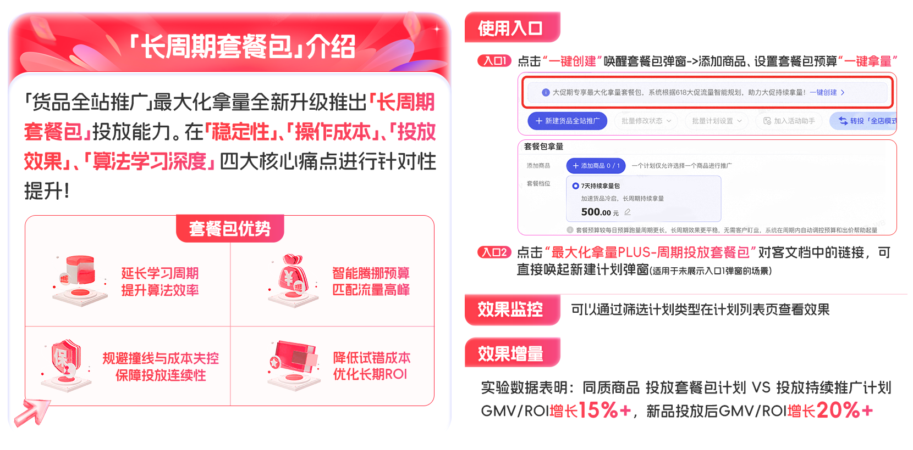

**Q：新建套餐包后是否可以中途退出？**

A：套餐包建议投放 7 天周期效果会更好，套餐包算法模型为 7 日周期模型，可以提升投放效率，中途停投会导致模型优势损失；

**Q：套餐包投放后怎么样继续进行投放？**

A：建议在新建套餐包时候勾选**「套餐包自动续投」**，避免防停投，损失 gmv 增长机会；

可以在套餐包投放结束后手动点击续投；

**Q：单个套餐包预算设置限额最低多少？**

A:不同计划因商品特性及历史消耗表现不同，最低设置限额也不同。

**Q：和现有货品全站推的计划互斥吗？**

A：**互斥；需求新建计划，**全站底层依然为一品一计划；在投的品如果要投放套餐包需要把目前的在投计划删除后进行套餐包的新建（数据积累为品颗粒度数据，不用担心后续不想投套餐包之后切换回持续推广）。

**Q：套餐包周期内可以灵活调整预算吗？**

A：套餐包目前不支持周期内修改预算，等待周期结束后可调整。

**Q：套餐包推广费占比会不会比升级前更多？**

A：不会；套餐包是长周期预算分配，长周期换来的就是效率提升，因为算法学习周期更长，ROI和GMV会相对提升。

**Q：套餐包的续投金额如何确定？如果没开自动续投或续投失败，还能恢复投放吗？**

A：例如：

4.13日创建7日套餐包，预算1000，未开启自动续投；

4.16日进入续投预算浮层，设置自动续投5000元并保存；

4.17日进入续投预算浮层，设置自动续投3000元并保存；

4.20日（第八天）发起自动续投任务，按照3000元进行扣款执行；

可以，如果自动续投失败或者未开启自动续投到期7天内，您可手动发起续投：

• 系统会调用最新算法接口，为您推荐当前最优的续投预算建议金额；
• 实际支付金额需满足平台当前的最低预算要求（遵循线上规则）支付即可重启投放；

## **2.2 ：「最大化拿量」****出价能力升级「直接净成交」** **>>>点击了解详情**

Q：**为什么我的最大化拿量计划不能调整/开启投放调优了？**

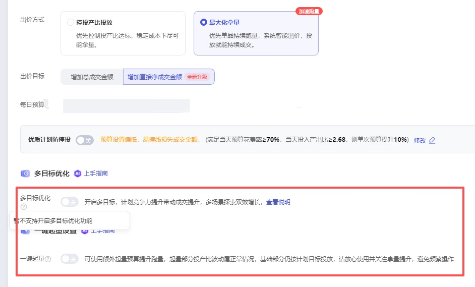

A：升级最大化拿量“直接净成交”的商家，其「最大化拿量」计划将不再支持「投放调优」功能；建议将预算用于最大化拿量计划；（对于已开启投放调优且正在投放中的最大化拿量计划，可继续运行，但不支持修改或重新开启调优设置。）

Q：**bcb升级直接净成交如何看数据？**

A:

bcb 交付由总成交优化为直接净成交，**总成交会下降，但是直接净成交浓度（占比）提升，直接成交ROI提升**

总成交（直接+间接）退款率高：锁定最可能成交的人群，无论直接/间接成交均出价；

直接净成交（直接）退款率低：聚焦在本品不易退款的人群进行出价；

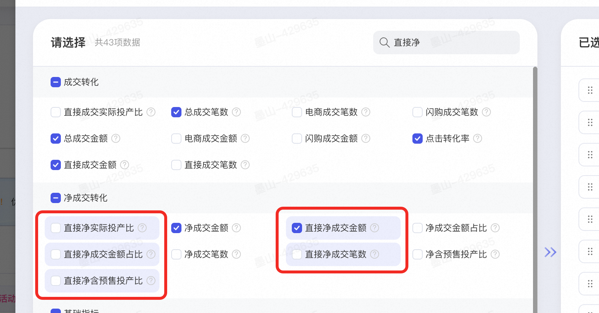

效果对比，**可以用 4/22 切换前后在投放计划来判断直接净的维度升级；**

直接净成交金额占比，通过此数据判断浓度提升；

直接净实际投产比，通过此数据判断直接净维度的ROI交付提升；

直接净成交金额，成交GMV

直接净成交笔数 ，成交笔数

看板优化

可以对比 before 和 after 的直接净的ROI数据情况；

## **3：全店模式**** ****new!**** ****>>>点击了解详情**

##

**自动选品机制问题**

Q：**开启全店模式后，商品是否会自动加入推广？还是需要手动添加？**

| **全店模式-智能托管下** | **投前：**开启「全店模式」后，**系统会自动优选商品投放，无需逐一手动添加**。您可**手动屏蔽剔除**引流品、非主推品等不愿意投入推广预算投放的商品，剩余商品即可在全店实现一键投放。 **投中：**您可在投放过程中，对任意商品执行 「开启投放」或「暂停投放」 操作，支持批量多选，灵活调整；在 「全店 - 推广信息」 模块，可查看两类商品状态： 「推广中」：指当前在全店模式下正常投放的商品（已剔除手动暂停或移除的商品）； 「待推广」：指符合投放条件、但尚未进入推广池的商品，可随时启用。 **以下情况商品会自动加入「全店模式」推广：** ☑️开启“自动汰换”功能（开启该功能即表示您授权系统，将店铺中新上架且未推广的商品天级转投至全店模式智能托管，并汰换在投商品中表现差的） ☑️开启“低效品安心托管”去转投（开启该功能，系统会定期把商品推广-控投产比投放计划中效果差的商品（成交少、投产比不稳定），转投至全店模式分组投放，开发中） |  |
| --- | --- | --- |
| **全店模式-分组投放下** | 支持手动添加商品至「分组托管」计划中（暂无“自动汰换”功能） | / |

Q：**"待推广"状态的商品何时会自动转为"推广中"？**

A：不会自动，需手动转入。

Q：**自动汰换功能是什么？多久淘汰一次商品？如何开启/关闭？**

| 自动汰换功能：**自动推广店铺中新上架且未推广的商品，并汰换表现差的商品**，系统将挖掘潜力商品，自动优化出价，动态分配预算，探索全店增长机会； 店铺中新上架且未推广的商品天级转投至全店模式智能托管，并汰换在投商品中表现差的； 货品全站推 -> 全店模式 -> 开启/关闭“自动汰换”（如图） |  |
| --- | --- |

Q：**全店模式的商品列表是实时自动更新，还是固定不变的？**

A：如开启以下功能，商品列表可能会存在自动更新情况；

开启“自动汰换”功能（开启该功能即表示您授权系统，将店铺中新上架且未推广的商品天级转投至全店模式智能托管，并汰换在投商品中表现差的）

开启“低效品安心托管托管”去转投（开启该功能，系统会定期把商品推广-控投产比投放计划中效果差的商品（成交少、投产比不稳定），转投至全店模式安心托管）

Q：**全站推广，全店推广的自动汰换，昨天换了多少产品呢？**

A：开启“自动汰换”后，系统会每天自动将新上架未推广的商品加入投放，并替换掉表现较差的商品。**但具体替换数量不单独展示**，建议您通过商品投放列表对比前后变化来查看调整情况。

**Q：全店模式下，客户剔除选品后，系统实际投放货品 = 手动剔除后的全部商品吗？**

A：不一定。全店模式下，系统会基于您选择的商品做优选，以达成全店 GMV 效率最大化的优化目标，其中入选系统优选的货品池上限为 1000 个，系统根据每日实际的商品效率预估，选择当天被投放的选品集合（即每天实际被系统投放的商品可能不同）。

**Q：全店模式刚上架的新品在什么时候会开始自动推广？**

A11：需要在「全店模式-可推广商品列表」中，手动添加进全店投放池中推广。

**商品数量与范围问题**

Q：**货品全站推全店模式下能推广多少个商品？**

A：全店模式最多可创建**1个「智能托管」计划，10个「分组托管」计划**

全店模式-智能托管下，入选系统优选的货品池上限为** 1000 **个；为保障全店模式的投放优化空间，系统限制需要至少保留**3个**商品投放；

全店模式-分组托管下，一个分组计划最多添加**500个**商品，至少添加3个商品

Q：**货品全站推广全店计划商品是系统智能选品吗？**

A：全店模式最多可创建**1个「智能托管」计划，10个「分组托管」计划**

全店模式-智能托管下，系统会**基于您选择的商品做优选，以达成全店 GMV 效率最大化的优化目标**，其中入选系统优选的货品池上限为 1000 个，**系统根据每日实际的商品效率预估，选择当天被投放的选品集合**（即每天实际被系统投放的商品可能不同）。

全店模式-分组托管下，可创建10个「分组托管」计划（第一次新建时系统会默认创建推荐分组及推荐商品，可手动删除分组，修改分组内商品）一个分组计划最多添加500个商品，至少添加3个商品；

Q：**全店模式推广，智能托管为什么不能添加商品？**

A：可以添加。智能托管下的货品池上限是1000个。在限额以内，您可在投中对任意商品进行「开启投放」或者「暂停投放」操作，该操作支持批量多选；可以通过“待推广”中选择商品进行添加，「待推广」代表当前可以投放全店模式但尚未进入推广中货品池的货品。

如“待推广”中未显示商品，可能是以下情况：

商品上架时间未超过24h，请商家等待24h后再进行添加；

被屏蔽的商品，需要手动解除屏蔽；操作：点击全店模式高亮条右侧已屏蔽右侧的垃圾箱图标，搜索商品-解除屏蔽-回到待推广中重新搜索，即可搜到，添加至全店模式推广；

初次开启全店后需给系统1-3天左右的冷启时间，冷启时间“待推广”中未显示商品；

Q：**开启全店模式后，新上架的商品会自动加入推广吗？**

A：需开启“自动汰换”功能，开启该功能即表示您授权系统，将店铺中新上架且未推广的商品天级转投至全店模式智能托管，并汰换在投商品中表现差的

Q：**为什么屏蔽了某些商品，找不到在哪里查看被屏蔽的列表？**

A：操作：货品全站推广-全店模式-点击“已屏蔽”小铅笔进行查看。

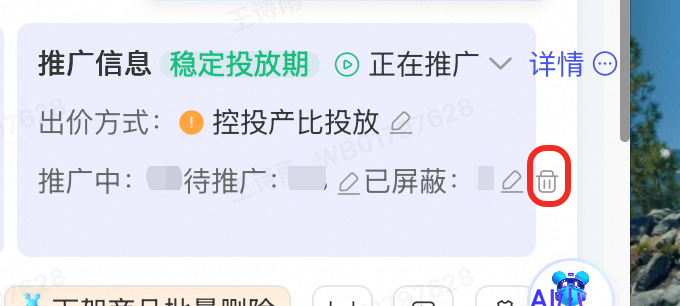

**Q：****全店模式的屏蔽商品数可以增加吗？**

A：全店屏蔽宝贝上限是根据店铺动销商品数进行动态调整更新的，不支持人工干预，商家可以提高动销商品数，或者加入全店后做暂停操作。

**Q：商品在全店模式中（推广中、待推广）搜不到是什么原因？**

| 此情况可能是因为您将该商品屏蔽了，所以搜不到，请您点击全店模式高亮条右侧已屏蔽右侧的垃圾箱图标，搜索商品-解除屏蔽-回到待推广中重新搜索，即可搜到，添加至全店模式推广 |  |
| --- | --- |

**全店与单品推广/其他场景关系问题**

Q：**同一个商品，即可以推单品模式，也能推全店托管全站吗？**

A：不可以。转投全店智能推广现在推广的全站单品推广会暂停。

Q：**我开的货品推广的单品模式商品，怎么早上起床就到货品推广全店里面来了？**

A：可能商家开启了“低效品安心托管托管”去转投（开启该功能，系统会定期把商品推广-控投产比投放计划中效果差的商品（成交少、投产比不稳定），转投至全店模式安心托管）

**Q：开启全店模式后，全店模式下的货品在AI无界其他场景还能投放吗？**

A：货品全站推广全店模式同单品模式一样，与AI无界其他场景存在互斥性。当客户在全店模式开启该商品投放，则会暂停该商品在无界其他场景的投放（在AI无界其他场景正在投放的货品，需要客户手动二次确认后方可暂停）；当客户在全店模式暂停了该品投放，同样也可以继续开启该品在AI无界其他场景的投放。

**预算分配与投放效果问题**

Q：**多个商品同时推广时，预算是如何分配的？是平均分配还是优选分配？**

A：全店模式优先交付「全店铺 GMV/ROI」达成，暂不支持客户对于单个货品的预算追加/减少。

Q：**全店模式下，店铺的每个商品一定会有曝光/消耗吗？会不会预算只投到某一个商品上，其他商品没有曝光？**

A：全店模式下，系统会基于「全店铺」效率优化目标智能优选当前在投品，且会根据商品投后效率指标分天汰换在投品，不保证全店铺的每个商品都可以被优选并投出。您可以拉长时间周期看单品投放效果指标，或者如有单品投放强诉求，可选择货品全站推广-商品模式对该品进行投放。

**Q：全店模式是否保证单个商品 ROI/GMV 的交付?**

A：全店模式下，系统会通过智能探索，基于客户设置的全店铺投产比和预算情况下，优先以「全店」GMV 效率最大化为目标进行投放，优化全店铺的投产比，因此不保证单个货品在全店模式下的 ROI/GMV 效率；如果对于单品投放有强诉求，可在全店模式下剔除该品，选择货品全站推广-商品模式对该品进行目标 ROI 设置。

**Q：全店模式下，是否可针对单个商品设置较多/较少预算？**

A：全店模式优先交付「全店铺 GMV/ROI」达成，暂不支持客户对于单个货品的预算追加/减少。

**其他操作问题**

Q：**我在后台尚未看到货品全站推广全店模式的入口，但希望赶紧开启该功能，有什么可以反馈开白的通路？**

A：目前能力已全量，如未找到可以咨询小袋鼠客服提工单处理。

**Q：从AI无界其他场景转投至货品全站推广-全店模式是否可享受流量助推？**

A：全店模式下，商家可享受从AI无界其他场景转投至货品全站推广-全店模式的流量助推，帮助店铺商品快速度过冷启阶段，提升商品拿量能力，请商家朋友们不要错过产品红利哦。

**Q：是否可以将全店模式下的所有品都暂停投放？全店模式如何暂停？**

| 不建议您这样操作。为保障全店模式的投放优化空间，系统限制需要至少保留**3个**商品投放。若您想暂停全店模式计划，可点击**全店模式推广页右上角计划状态「暂停推广」按钮**。全店模式计划暂停推广后，所有全店模式的商品都会不曝光（包括正在推广中的商品） |  |
| --- | --- |

**Q：全店模式下，在原有推广商品的基础上，我又添加了部分推广商品，系统推荐的目标投产比会有变化，这是正常的吗？**

A：属于正常情况。全店模式下，若您有「添加推广商品」等操作，系统就会根据您的最新选定的全店模式推广商品池重新进行全店目标ROI的预估和推荐，以驱动全店最优调控的投放效果。请知晓您的此类操作可能造成的ROI变动。后续我们也会新增全店模式下货品维度的操作记录，方便您进行操作追溯。

Q：**页面显示 ：全店模式生效中，正在将商品加入全店模式统一管理，商品列表更新中，请稍后查看？**

| 建议初次开启全店后给系统1-3天左右的冷启时间，冷启期间减少对全店模式下单品启停的操作，帮助系统快速度过冷启阶段。 |  |
| --- | --- |

### **3.1：全店模式商品汰换提效 ****new!**** ****>>>点击了解详情**

Q：**全店模式开启自动汰换后，总预算会自动修改是什么原因？**

A：客户开启自动汰换功能后，系统**会结合投放效果和投放商品自动为客户调整预算**，如果客户不希望自动调整可以关闭该功能。

### **3.2：**全店模式支持分组托管** ****new!**** ****>>>点击了解详情**

Q：**为什么我没有这个功能？**

A：目前功能内测中，请耐心等待。

Q：**功能适用于哪些场景？**

A：

服饰、饰品、图书等多链接商家，按不同商品**利润分组投放**，设置不同出价

**新品批量测款**，按品类或上架时间批量分组管理

店铺在架商品多，全店**智能托管屏蔽额度不够**，可以通过分组投放少量商品尝试全店模式

店铺内多人负责不同商品，智能托管没法满足按运营人员分别批量投放，分组托管可支持

智能托管一个预算和出价，会有个别品占用过多预算，设置ROI不敢设太低；分组托管可分多个组隔离预算，毛利高的组可设置更有竞争力的目标投产比，提升商品拿量能力

### **3.2：**全店模式低效品安心托管功能** ****new!**** ****>>>点击了解详情**

Q：**为什么我没有这个功能？**

A：目前功能内测中，请耐心等待。

## **4：控全站费比**** ****new!**** ****>>>点击了解详情**

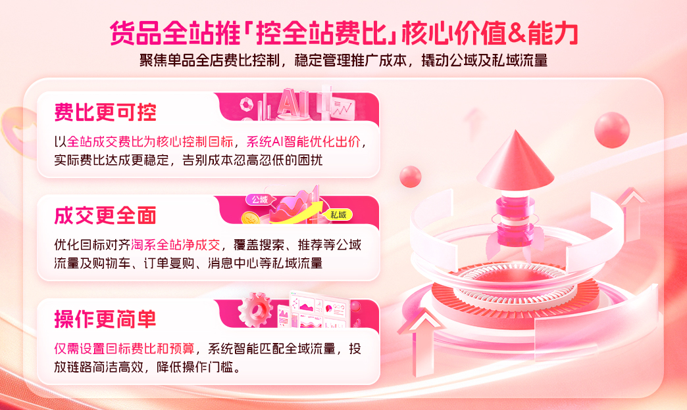

**Q1：全站费比模式和全站标准模式是什么关系？**

A1：两者是货品全站推广下的两种营销目标。全站标准模式即当前线上已有的控投产比（ROAS）投放模式；全站费比模式为全新推出的营销目标，以控制全站成交费比为核心，覆盖更广的成交范围。两种模式的数据独立呈现，同一商品同一时间仅允许在一种模式下投放。

**Q2：全站费比模式支持全店模式吗？**

A2：一期仅支持单品模式，全店模式暂不支持，敬请期待后续升级。

**Q3：全站费比模式的覆盖资源位有哪些？**

A3：投放覆盖淘系全域流量，包括搜索结果页、首页猜你喜欢信息流、购中/购后猜你喜欢等公域资源位，以及购物车、订单复购、消息中心等私域场景。系统会智能匹配最适合成交的流量渠道，无需手动设置。

**Q4：为什么选择「不限预算」？**

A4：不限预算可以让系统在投放期间充分捕捉全域成交机会，避免因预算限制错失私域成交。系统在严控费比的前提下智能分配预算，预算充足的商家建议优先选择不限预算，以获得最大化的全站成交增量。

**Q5：切换为全站费比模式后，原计划的数据还在吗？**

A5：原计划数据保留不变，可在「全站标准模式」Tab中继续查看。新创建的费比模式计划数据在「全站费比模式」Tab中独立呈现。

**Q6：全站费比模式支持多目标出价和一键起量吗？**

A6：一期暂不支持多目标出价和一键起量能力，后续版本将逐步升级，敬请期待。

**Q7：全站费比模式下如何查看创意数据？**

A7：全站费比模式一期采用智能创意，暂不支持自定义创意添加和创意维度数据查看。后续版本将提供更多创意能力支持。

**Q8：费比设置有什么建议？**

A8：建议参考系统推荐值进行设置。费比设置过低可能导致拿量受限，建议保持推荐值或略高于推荐值，以获得稳定的成交增量。投放稳定后，不建议频繁调整费比，每次调整幅度不宜过大。

# 四、关于福利权益问题

## **1：智能补贴券****>>>点击了解详情**

Q：**为什么我已经一键开启了智能补贴券，但部分商品并没有享受到补贴？**

A：可能有以下原因：

由于智能补贴券生效范围为算法智能选品，且授权开启为账户维度，因此可能会出现部分商品无法生效补贴的情况，请商家知悉。

您创建的计划不是货品全站推广计划，因此享受不到补贴。

Q：**开启智能补贴券之后，是否会影响大促期间最低价活动的报名？**

A：不影响。**智能补贴券由平台出资，商家无需出资**，不会计入大促最低价，可放心使用。

Q：**商家是否可以自主选择货品进行补贴？**

A：基于实际补贴后带来的增量成交数据视角，智能补贴券将实际作用于下发补贴后能带来预估转化率提升的货品，因此暂不支持自主选择补贴选品，请留意后续产品迭代通知。

Q：**担心部分商品有破价风险，但部分商品又想享受到平台出资的补贴，应该如何处理？**

A：可前往智能补贴券负责小二答疑群-阿里妈妈智能补贴券答疑6群：162410017127

Q：**为什么消费者看到商品补贴金额是浮动的？**

A：由于补贴是实时进行的，算法会根据当下流量波动情况实时调优，因此用户看到的商品补贴可能是浮动的，调控范围在单品补贴金额的**约 90%～110%区间内**。

Q：**开启智能补贴券功能之后，是否可以关闭？**

A：您可以在货品全站推广场景页->权益中心->智能补贴券右上角小问号->点击「退出权益」按钮关闭该功能。关闭当天无法操作开启，您可在第二天再次操作打开，即可继续享受平台出资的智能补贴。

## **2：自动化成本保障****>>>点击了解详情**

**Q：开启了“投放调优”（如一键起量、多目标出价、多目标起量）的计划，是否在成本保障赔付范围内？**

A：是的，开启“投放调优”的计划仍可参与成本保障赔付。但请注意：赔付金额仅基于“基础出价部分”的消耗及对应达成率计算，不包含因一键起量、多目标出价、多目标起量产生的额外消耗。换句话说，系统会剔除投放调优带来的增量花费，仅对主计划的有效消耗进行赔付核算。

**Q：如何获取货品全站推广成本保障「保障」标识？**

A：需满足以下门槛：

**计划在投门槛：**

计划需在投「货品全站推广-商品模式-控投产比投放-增加总成交金额 或 增加净成交金额」及「货品全站推广-控费比模式」及 全店模式计划

计划新建天数<30天

**计划操作门槛：**

出价门槛：推广商品的ROI设置值<=系统推荐值，以下图为例，ROI出价区间在3.24及以下。

投放状态门槛：当天计划不在【数据积累期】、【效果调整期】，计划必须处在【稳定投放期】 投放期阶段功能解读

投放操作门槛：投放当天计划无暂停、无删除、未开启最大化拿量。

**保障成效门槛：**

置信状态：计划累计消耗需高于单笔成交成本（消耗 > GMV/成交笔数/设置ROI）

**超成本比例：**实际投放ROI<ROI设置值*70%，ROI归因周期15天

注意：如果您的货品全站推广计划属于API调用修改、调用插件修改计划，则不在成本保障范围内，该计划不展示「保障」标识。

Q：**「保障」标识状态如何区分？**

A：点击计划列表中的“保障”标识->“投产保障明细”可查看每日的投产保障状态、赔付阶段说明

|  |  |
| --- | --- |

Q：**成本保障的赔付金额如何测算？**

**A：成本保障金额测算逻辑：**

赔付金额=实际消耗-[实际15天归因成交金额/（目标投产比*0.7)]，计划当日多次调价的，系统按当日设置的最低ROI*0.7为保障目标。

示例：

采纳系统推荐ROI的计划，或者客户自定义ROI<系统推荐值，且计划投放进入「稳定投放期」，且计划满足上述投放操作门槛和保障成效门槛，则系统将按照客户设置的目标ROI，赔付计划ROI*70%未达标部分的消耗。

例如：系统推荐ROI为2，客户采纳推荐ROI，实际投放ROI为1，成交金额为 100元，实际消耗：100/1=100元；预期消耗：100/（2*0.7）=71.43元，则赔付金额为：100-71.43=28.57元。

Q：**推荐ROI每天变化，按昨日值设置会影响保障吗？需每日调整吗？**

A：需要满足**推广商品的ROI设置值<=系统推荐值**（如：昨日设置roi<=系统推荐值，但今日系统推荐值>昨日设置roi，需及时调整设置ROI<=今日系统推荐值）计划当日多次调价的，系统按当日设置的最低ROI*0.7为保障目标。

Q：**成本****保障的赔付何时到账？以什么形式到账，在哪里可以查看？**

A：点击计划列表中的“保障”标识->“投产保障明细”->赔付阶段说明可查看具体赔付金额及发放情况

赔付金额以无门槛代金券形式到账，券面额=该商家货品全站推广场景下成本保障总金额，该代金券无门槛优先抵扣，生效时间30天，仅可在货品全站推广场景使用。

代金券查看方式：万相台AI无界-账户-我的优惠券（如生效中未显示，可去已失效点击查看）优惠券名称“货品全站推「成本保障」”

|  |  |
| --- | --- |

**Q：计划处于“数据积累期”和“效果调整期”，计划有可能享受成本保障吗？**

**A：**不可能。计划需处于“稳定投放期”，才是成本保障“保障”的生效条件之一；计划达成“稳定投放期”的条件可点击计划列表中的“稳定投放期”具体要求为准（如下图）；三阶段具体的生效条件可查阅文档

**Q：新计划、老计划都可享受成本保障赔付吗？**

**A：**在新建计划环节显示「成本保障」或在投中环节显示「保障」标签，若满足所有成本保障条件，系统将自动为该计划进行成本保障赔付。从计划新建后保障15天，计划在此期间仅能享受一次成本保障；

老计划需新建天数<30天，且计划下显示“保障”标识，可通过“保障”-“投产保障明细”中查看每日成本保障情况。

# 五、关于出价交付问题

## **1：AI效果智达**** ****new! ****>>>点击了解详情**

##

Q：为什么升级后在无界看到的货品全站推广效果和在货品全站推广内看到的**数据不一致**？

A：无界的效果默认**按点击时间统计**，货品全站推广「AI 效果智达」升级后默认**按转化时间统计**，二者统计口径不一致，会有数据差异。升级后，货品全站推广的效果建议按转化时间统计查看，货品全站推广的数据请在货品全站推广场景或货品全站推广报表查看。**货品全站推广的详细数据及结案报表，建议用「按转化时间」口径，成交、加购收藏等深度行为转化数据记录在转化产生当天，方便天与天对比，无需多天归因等待；**

Q：为什么升级后**无界实时报表不含**货品全站推广的数据了？

A：无界其他场景的实时数据**按点击时间统计**，货品全站推广「AI 效果智达」升级后，**按转化时间统计**，数据统计口径不同，无法在同一张报表汇总。货品全站推广实时数据请至货品全站推广投放列表页查看；

Q：为什么升级后货品全站推广场景页的实时趋势图从原分小时绝对值变成**按小时累计**了？

A：请关注升级后实时及多日的 ROI 达成情况，保持计划稳定投放，避免因短时其他指标的正常波动，对计划做**频繁无效操作**（如反复启停、频繁向上向下调价），影响系统优化；

Q：为什么当天计划**没有投放，有转化效果数据**？

A：升级后货品全站推广的效果默认**按转化时间记录**，当天未投放或者刚开启投放，可能会有过去几天的计划点击在当天产生成交，记录在当天，是正常现象，请您关注计划整体的效果交付情况；

Q：计划删除后，在投计划列表的计划效果数据和合计行**数据对不上**？

A：升级后货品全站推广的效果默认**按转化时间记录**，投放计划被删除后会有过去几天的推广点击在当天产生的成交记录在当天，在计划投放列表和合计数据对不上（已删除计划不展示在在投计划列表），请您在货品全站推广报表查询含已删除的计划数据明细;

Q：为什么计划的**点击单价波动较大，短期扣费较多**？

A：系统智能匹配流量，更好的让计划实际投产比接近目标投产比。不同流量的精准度不同，系统基于**流量价值预估动态出价**，点击成本可能因此波动较大，请关注计划实际投产比达成情况；预估转化率高的精准流量，系统会以较高的出价竞争，因此精准流量集中的时段可能扣费较多，属正常现象，请保持计划稳定投放;

Q：为什么大促的预售预热期，**实际投产比达成偏低**？

A：大促预售预热期消费者以收藏加购为主，成交转化有一定抑制，建议观察大促全周期（预售、预热、正式、爆发）的整体投产比达成情况，可在货品全站推广报表选择官方活动周期查看整体效果 点击跳转

Q：**预售商品**的推广效果怎么判断？

A：有预售的大促期，预售商品在货品全站推广按**总预售成交金额**（推广预售商品在15日内引导用户产生的所有支付宝交易的总成交金额（含定金、尾款及运费））优化，相应的投产比交付为**含预售投产比**（包含预售尾款的总成交金额/花费），建议推广预售商品的商家关注**含预售投产比、****总预售成交金额**，判断推广效果的达成;

## **2：**全站推周ROI优化**>>>点击了解详情**

Q：**什么是周ROI？**

A：周ROI是系统筛选过去一周**成交少**、**实际ROI交付较差**的全站推商品推广控投产比投放计划，系统进行智能「周ROI」优化，降低实际投产比波动，稳定推广提升成交金额的一项自动优化能力。

Q：**为什么我没有看到周ROI**

A：目前「周ROI」计划系统圈选，并智能优化，不支持商家主动选择或提报。

## **3：净成交出价****>>>点击了解详情**

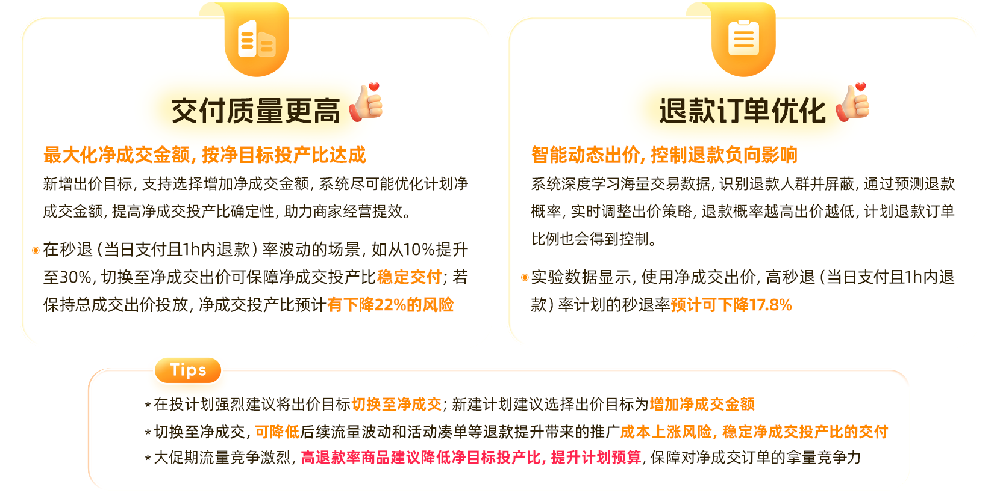

Q：**净成交适合哪些商品使用？**

A：**适合所有商品使用**。退款比例较高，退款数据波动较大的商品，使用效果更显著。如您觉得推广计划的退款风险较高，可以切换出价目标至**增加净成交金额**。小二建议您**切换至净成交**，**可降低**后续流量波动和活动凑单等退款提升带来的推广成本上涨**风险**，**稳定净成交投产比的交付**

Q：**切换至净成交后，出价和预算上有什么需要注意的？**

A：控投产比投放切换至净成交时，请关注系统**基于历史退款率的目标投产比换算**（与当前净目标投产比出价同等竞争力的目标投产比），需要设置系统推荐的有竞争力的净目标投产比，**确保计划在有拿量竞争力**的前提下优化净成交；最大化拿量，根据系统预估的净成交提升金额及预算推荐，设置**有拿量竞争力且充足的预算 **

Q：切换至净成交，为什么可以设置的**最高净目标投产比很低**（被卡控了）？

A：在投计划切换至净成交，系统会根据切换前7天该计划的实际总目标投产比出价，并基于历史退款率给出最高可设置的净目标投产比，是为了确保计划切换前后的整体出价水平一致，**保障计划拿量竞争力，避免掉量**。切换至净成交7天后，这一卡控会放宽，系统会根据该计划总目标投产比的最高可设置值，并基于历史退款率**更新**最高可设置的净目标投产比

## **3.1货品全站推广全面切换至「净成交出价」目标****>>>点击了解详情**

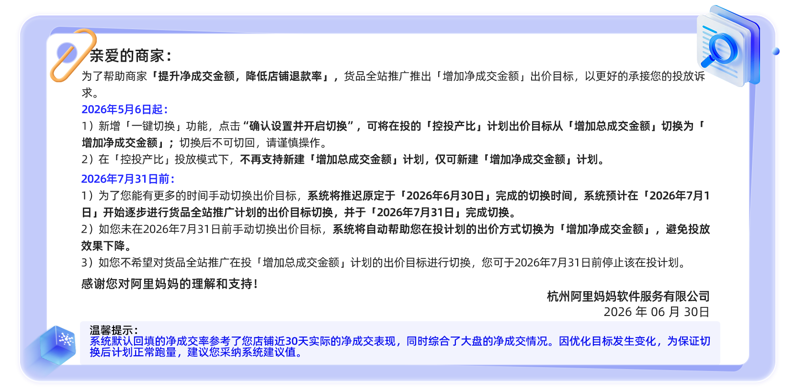

Q：**为什么我没有一键切换出价目标的窗口？**

A：5月6日起系统逐步开放批量迁移公告窗口；如您未看到窗口，可先手动进行切换出价目标；（切换后不可切回，请谨慎操作）具体信息请点击了解详情

## **4：**出价推荐焕新升级**>>>点击了解详情**

Q：**为什么我的计划上有权益角标，并且采纳了对应的系统推荐出价，但是实际没有生效？**

A：角标展示计划可享权益，采纳推荐出价后表示计划满足权益标资格，相关权益标也可在投放计划列表查看。权益标对应的内容是否生效，需结合权益本身的生效条件，如成本保障赔付的实际生效需满足计划新建天数、计划操作门槛、状态门槛、实际投产比低于目标投产比的70%等条件，以对应的权益&活动的说明及规则为准。

# 六、关于多维度调优问题

## **1：一键起量****>>>点击了解详情**

Q：**什么情况下建议开启一键起量？**

A：1）新计划建议开启一键起量，前期帮助计划快速积累数据;

2）大促活动期间，平台竞争激烈，建议您开启一键起量，抢夺平台优质流量;

3）计划长期消耗慢，建议开启一键起量帮助计划快速积累数据；

Q：**一键起量****适合投放的场景****？**

A：1）**新品快速度过冷启动****（hot!)****：**快速帮助商家实现两阶段的跃迁，**更快进入稳定拿量期**，实现稳定成交贡献；

2）**爆品大促销量冲刺：**大促放量升级兼顾稳定的 roi 交付，助力**爆品成交稳中有进**；

3）**控投产比放量困难：**预算使用率低的商家，同时 roi 波动的承受力有限，希望在保障基础 roi 的情况下进行**销售放大**的商家；

Q：**一键起量有哪些升级点？**

A：1）横向管理“投放调优”入口，选择**一键起量能力**。客户可设置额外起量预算，支持商家更灵活的进行起量能力的控制。

2）提供起量部分的数据展示：计划给出刨除一键起量后的**基础部分投产比数据**，并在一键起量的设置页面上提供**“起量数据”**tab，报表中也支持客户进行起量数据的筛选；

3）自定义时段能力：商家可以自定义“起量预算”的**放量时段偏好**，自定义时间不小于** 4 小时；**

4）自定义地域能力​：商家可以根据非运营地域，进行**投放广告的区域的屏蔽；**

升级点new!

**投放链路升级：**一键起量底层机制升级至ECPM叠加机制，提升起量时段对客交付结果，优化客户起量集中消耗的反馈；

**实时数据披露：**适配底层链路升级，起量报表侧透出实时数据；

**创编链路升级：**投前创编流加入一键起量新建入口；

**支持极简弹窗新建：**预算使用率低的商品引导开启一键起量，支持一键全部开启；

**新增批量修改页面：**支持商家批量进行一键起量的设置，方便商家的批量化操作；

Q：**新版本的一键起量是否也会自动关闭呢？**

A：新版本不会自动结束，商家可完全自主操控起量的开始和结束；

Q：**旧版本一键起量每天有 2 次的操作上限，新版本是否还有操作限制呢？**

A：是的还是有操作次数限制，修改起量预算不计算次数，只有开启和关闭起量计算次数；

Q：**新版本开启一键起量期间的消耗优先级是怎么样的，是先消耗起量预算还是基础预算？**

A：是一起消耗的；

Q：**开启一键起量的预算为什么比设置的高 ？**

A：一键起量预算为单独的起量预算设置，独立于基础预算，总预算为起量预算+基础预算的和；

Q：**一键起量对比最大化拿量**

A：1）精简版：

2）详细版：

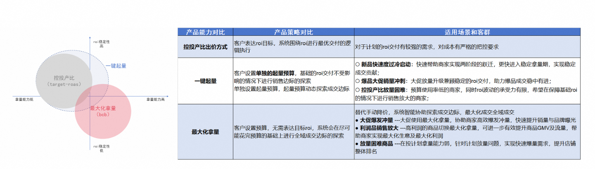

## **2：渠道商品**（已下线）** ****>>>点击了解详情**

Q：**渠道商品为什么没有数据？**

A：渠道商品销量评价继承需要一到两天的时间，这个过程中可能会有冷启动，请您耐心等待。

Q：**渠道商品的创建有哪些要求吗？**

A：1）唯一性：同一个商品在同渠道仅限设置 1 个渠道商品，且不可跨渠道售卖；

2）价格要求：需满足渠道的价格要求，且渠道商品价格必须小于主品；

Q：**渠道商品是否支持编辑基础信息，如编辑图片/标题？**

A：支持。商家可通过**千牛-渠道商品管理**中心对子商品进行编辑；

注：1）渠道商品类目、属性、资质、图文详情等部分信息与主商品严格保持一致，不支持自定义编辑。

2）风险连带：在假劣滥、禁限售等商品主控处置上，规则与大盘拉齐，渠道商品和主商品存在连带责任。举例：渠道商品和主商品任一触发处罚下架，对应的商品和渠道商品均执行下架处罚；主商品和渠道商品任一存在销量作弊行为，对于累计产生的销量做统一处理。

Q：**主品的 SKU 素材修改后，渠道商品的 sku 素材是否会进行同步？**

A：不会自动同步，点击千牛-渠道商品管理提交后，子品自动跟随主品的 SKU 素材。

Q：**渠道商品和主品的数据可以分开查看吗，渠道商品的权重是否会叠加到主品？**

A：可以。渠道商品和主品为两个独立商品，生参/千牛为分开的数据，搜推权重也是分开记录;

商品生成成功后，商家可在「生意参谋」-「商品」-「商品排行」-「全部商品」查看商品相关指标，「拆分视角」为主商品、渠道商品相关数据，「整体视角」为同款主商品下渠道品汇总后数据。>>>了解详情

Q：**渠道商品库存是否无法单独设置，需与主商品共享？**

A：渠道商品与主商品库存共享，无法对渠道商品的库存进行单独设置。

Q：**渠道商品库存和销量共享的时间 ?**

A：主品和渠道商品的库存和销量/评价是共享的，但可能略有 1-2 天的延迟，请您耐心等待；

Q：**如果渠道商品在货品全站推广创建成功后，计划跑量中中途改价，计划会被暂停吗？**

A：改价不会暂停货品全站推广的计划。

Q：**渠道商品价格需小于等于主商品券后价，都包含哪些渠道的券&优惠价？**

A：渠道商品生成过程中，设置的价格是单品宝的价格，包含普惠券叠加后的价格。

Q：**如果渠道商品在投放货品全站推广，可以替换为主商品投放吗？**

A：货品全站推广支持主商品和渠道商品同时投放，故不需要替换。

Q：**渠道商品发布后，是否会和正常创建商品一样需要审核，审核失败会怎样？**

A：渠道商品的审核逻辑无改动，遵循统一的风控审核，如果审核失败，需要按照失败提示原因改动即可。

Q：**渠道商品是否影响主链接商品流量？**

A：功能本身不会从算法底层逻辑上造成影响，实际情况请以当下流量环境做判断分析，建议商家关注商品主子链接总计流量增量做考量。

Q：**如果主商品在货品全站推广中在投，可以创建渠道商品同时投放货品全站推广？**

A：暂不支持。

Q：**渠道商品和主商品会同时出现在同一个页面吗？**

A： 不会。pc 单页互斥/无线单次请求互斥，只能看到主品/渠道商品其中 1 个；

Q：**主商品报名参加平台大促，渠道商品会自动报名吗？**

A：不会。

Q：**渠****道商品界面显示无法上架的原因？**

A：1）​自营商品不能生成渠道商品，暂时未接入。>>>具体原因

2）家装服务的商家，上门安装、“干支装”指定类目下的商品需先绑定服务（设置服务模版）方可上架销售。

>>>查询详情（致电 400-800-0808 转 7 咨询(工作日 9：00-20:00) / 钉钉群咨询，群号：33249458）

3）入驻建材服务的商家，在指定类目下的商品需要绑定“上门安装”服务模板后，方可上架销售。请先绑定服务后再操作上架

淘宝商家服务指引>>点此查看

天猫商家服务指引>>点此查看

Q：**渠道商品计划删除后，可以再生成一个渠道商品吗？**

A：每个主商品只有一次生成渠道商品的机会，货品全站推广暂停或停止投放，渠道商品下架，恢复计划后渠道商品上架，建议商家谨慎操作；

Q：**添加****渠道商品，如出现以下报错的原因之一是？**

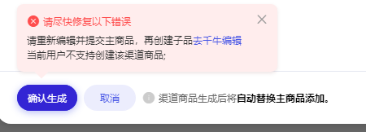

A：请自查是否为海外商家，主站侧不支持海外商家创建渠道商品，后续会增加针对海外商家创建进行屏蔽；如不是海外商家，遇到上面报错情况可在商家无界首页后台点击袋小蜜，联系人工客服。

Q：**为什么在搜索搜不到自己的主品（渠道商品）？**

A：当用户在搜索结果上，使用了不同的排序方式，对应生效的排序规则会有所不同。

1）**当选择“综合排序”：**以 365 天销量 （付款人数）展示销量，主品和渠道商品商品互穿，透出逻辑根据效率（主品和渠道商品谁高排谁）透出效率高的商品；
2）**当选择“销量排序”：**以 30 天收货人数排序，主品和渠道商品不互穿，透出逻辑根据 30 天收货人数，主品和渠道商品谁高透谁；

## **3：多目标出价****>>>点击了解详情**

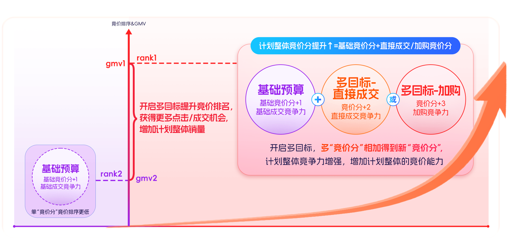

### **能力问题**

**Q：多目标能解决什么问题？**

**A：**多目标出价可以增强计划整体的竞争力，同时对于加购目标/直接成交进行增量探索，保障基础预算交付稳定的同时，进行增量探索，达到 1+1 ＞ 2 的效果；

**Q：****多目标优化直接成交的预算跟一键起量的预算，有什么区别？**

**A：**多目标直接成交优化为单品的直接成交；一键起量可以设置时段/地域，同时目标为优化整体成交，起量的效果包含直接成交+点击本品后成交的本店铺其他商品的间接成交金额 优化目标及可以调控的范围不同；

### **效果问题**

**Q：开启多目标出价后，在哪里可以看到多目标出价计划效果及增量数据？**

**A：**点击「计划」下的「投放调优」页面，在**投放调优右侧**的**投放调优数据**可进行查看多目标效果增量效果（加购/直接成交）

**Q：多目标出价可以看到实时数据吗？**

A：可以

**Q：多目标-直接成交金额如何计算？**

**A：**由于增加了多目标出价，提升计划整体竞争力获得了直接成交后，按总体出价下多目标的出资占比进行摊分；

**举例：**如基础出价为3元一个点击，多目标出价是2元一个点击，总出价是5元，总成交金额是108.8元，多目标出价帮助增加直接成交金额是总成交的2/5，即43.52元；

### **选品问题**

**Q：什么样的商品适合投放多目标？**

**A：有放量需求和多维增长的商家**

新品：新品建议开启**多目标出价-直接成交/加购**，增加新品的广告竞价能力，集中打爆新品没进行浅层成交蓄水；

潜力品：潜力商品建议开启**多目标出价-直接成交，**通过商品的用户特征及商品属性，挖掘预测未来有 GMV 增长空间的商品进行推荐，通过净成交出价交付确收 GMV，带动潜力品成交跃迁；

机会爆品：机会爆品商品建议开启**多目标出价-加购，**稳定销售的同时进行浅层成交蓄水，为大促爆发积蓄力量；

**Q：极简创编弹窗内的推荐商品选品逻辑是什么？**

**A：**推荐开启加购商品：历史 rol 交付优秀。**目前加购数低于类目排名核心单品平均值；**

推荐开启直接成交商品：历史 roi 交付优秀，**商品直接成交增量空间店铺排名 top5；**

### **预算问题**

**Q：预算设置多少更合理？**

**A：**为了更好的交付多目标，建议采纳平台推荐预算，实时监控效果后进行预算的调整，效果达成预期可以单次增加 20%预算；多目标预算不建议少于基础预算，基础预算消耗完成时，多目标消耗会暂停；增加预算为保障计划持续稳定放量，建议基础预算：多目标预算= 1:1

**Q：****先消耗目标预算还是基础预算？**

**A：**预算同时进行消耗，基础预算竞价能力与多目标竞价能力，同时合力进行竞价，提升计划整体的 gmv；当基础预算消耗完时候，多目标预算会停止消耗；

**Q：开启多目标出价后整个计划的预算是多少？**

**A：**开启多目标能力后，计划的预算为基础预算+多目标预算的和；例：基础预算为 500 元，多目标预算为 100 元，整体计划预算为 600 元；

### **其他问题**

Q：**全站多目标优化跟基础计划是不是分开跑的？会不会互相影响？**

A：是相互独立的预算，但是会有一定的相关性；基础预算消耗完成，为了更好的交付效果，会让多目标预算停止跑量；建议持续监测效果，少量多次的增加预算；

Q：**关闭多目标优化达到上限是什么原因？**

A：为了保障计划投放效果，多目标优化每日仅可开关3次。

## **3：多目标起量****>>>点击了解详情**

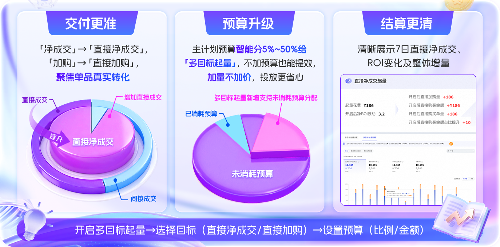

**操作问题**

**Q：多目标起量计划修改出价方式或ROI设置后，为什么预算设置会自动变成“推荐”？**

A：当您在「多目标起量」计划中手动设置了固定预算（如1000元），若后续修改了出价方式、ROI目标等，页面刷新后系统**可能会默认将预算来源切换为“推荐”模式**（例如显示为“当前计划：比例50%”）。

⚠️**请注意：**

A：每次调整出价或ROI后，请**务必检查“预算来源”是否仍为您期望的设置**。如需保持固定预算，请手动切回“自定义”并重新输入金额，再提交保存。

**Q：新建计划时，出现报错情况（如图示）是为什么？**

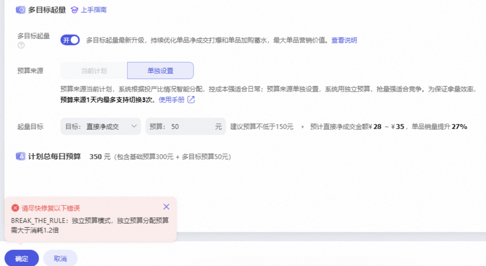

A：用户在设置控投产比投放时，选择了**「单独设置」多目标预算。**系统校验规则要求**「独立预算分配（即多目标预算）需大于总消耗的1.2倍」**。例如今日总消耗为66.32元，1.2倍为79.58元，而用户设置的多目标预算50元 < 79.58元，因此报错。

**计费规则**

Q：**「多目标起量」和原来的「多目标出价」「一键起量」有什么区别？为什么升级？**

A：本次升级将原「多目标出价」与「一键起量」能力深度融合，统一为 「多目标起量」。

出价目标升级：一键起量迭代为多目标起量，净成交迭代为直接净成交，加购迭代为直接加购**，聚焦单品交付优化；**

操作链路优化：**多目标和一键起量合并**，仅需3步（开启多目标起量→选择目标→设置预算）即可完成设置；

成效预估迭代：系统将结合商品阶段、售价及主计划预算，**智能推荐预算并预估增量价值。**

Q：**升级后的计费逻辑是否有变化？扣费原则是什么？**

A：计费逻辑不变。「多目标起量」仅为投放策略优化，不改变底层出价与扣费机制。

Q：**「主计划分配预算」是什么意思？怎么分配？预算不够怎么办？**

A：系统会根据 roi 交付从主计划预算中智能分配5%~50%用于「多目标起量」（可设上限）

若主计划预算较低，「多目标起量」分配到的预算相应减少，但不会导致主计划超支；

Q：**结算升级后的「增量展示」怎么理解？增量如何计算？**

A：「增量」指开启「多目标起量」后，相比未开启「多目标起量」所额外带来的成交或加购。具体增量数据可以通过以下方式进行查看： 计划管理页 -> 点击「多目标起量」-> 查看多目标起量数据（清晰展示7日带来的直接净成交、ROI变化及整体增量）

Q：**ROI 保障机制是否有变化？多目标起量是否还能稳定保障 ROI？**

A：主计划的 ROI 保障机制不变。开启多目标起量后：

若 主计划T-1 日 ROI交付 ≥ 70%（适合平销期稳增场景）：**建议使用 自动分配预算（从主计划中划拨 5%~50%）；**

▶ **操作路径：**计划编辑页 →【多目标起量】→ 选择“当前计划” → 设置预算比例上限；（建议优先采纳推荐预算X%）

若 主计划T-1 日 ROI交付 < 70%（适合大促抢量、强竞争场景）：**建议手动新增独立预算，避免影响主计划稳定性；**

▶ **操作路径：**计划编辑页 →【多目标起量】→ 选择“单独设置” → 输入具体预算金额。

更多操作细节，请查看上方操作指南— 投中模块

Q：**新的适用场景是什么？打爆单品、精准蓄水和高效起量分别怎么用？**

A：

打爆单品：选择「直接净成交」目标，集中预算冲刺高潜力商品销量；

精准蓄水：选择「直接加购」目标，稳定销售的同时进行浅层成交蓄水，为大促爆发积蓄力量；

高效起量：系统智能分配预算+采纳建议，快速测试商品潜力，适合新品冷启动或大促预热。

**操作入口**

Q：**如何开启/关闭多目标起量？内测阶段如何申请使用？**

A：开启/关闭 可查看上方操作指南— 投前模块的具体操作；暂不支持主动申请；

Q：**自定义时段、自定义地域、自定义预算等功能还能用吗？在哪里设置？**

A：不支持。请关注后期迭代。

Q：**切换多目标起量后，还可以切换回来吗？**

A：不支持切回。

**数据查看**

Q：**更清晰的增量展示在哪里看？****多目标起量的效果如何评估？有没有案例参考？**

A：

① 计划管理页 -> 查看开启「多目标起量」后数据；

② 计划管理页 -> 点击「多目标起量」-> 查看多目标起量数据；

③ 清晰展示7日带来的直接净成交、ROI变化及整体增量

目前暂无案例参考，后续可关注：

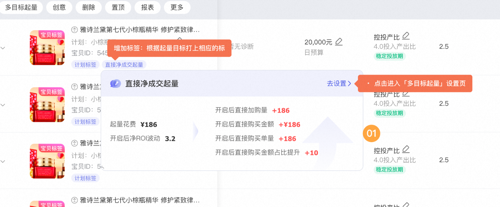

Q：**切换「多目标起量」后，何时查看数据最准确？**

A：因系统切换当日（T日）的历史数据暂不可见，且T+1日查看T日数据可能存在偏差，建议在切换后第三日（T+2日） 查看T+1日的数据，此时数据已趋于稳定，准确性更高。

**内测范围**

Q：**内测的灰度范围是什么？我为什么看不到这个功能？**

A：仅受邀商家可使用，暂不支持主动申请。

**历史计划迁移**

Q：**老的历史计划是否受影响？需要迁移到新版本吗？**

A：自动切换。老的历史计划因切换至「多目标起量」并优化数据口径，相关指标可能有所变动，属正常调整，请以更新后数据为准。

Q：**升级后原来的功能还能用吗？会不会被强制切换？**

A：不能。会。

# 七、关于结案问题

## **1：结案报表****>>>点击了解详情**

Q：**全站成交增长商品的全站成交额，和计划的总成交金额对不上？**

A：全站成交增长的商品全站成交额是对应时间内的该商品在店铺淘系维度成交额（包含通过货品全站推广计划带来的成交及私域等其他入口的成交）；
计划的总成交额是计划在货品全站推广渠道内的投放，在 15日效果归因口径下，直接的商品成交+店铺内的间接成交两个指标的口径不一样

## **2：「投放解读」功能**** ****>>>点击了解详情**

Q：**为什么我的货品全站推广结案里面没有****「投放解读」****？**

A：能力内测中，平台邀约制，暂不支持商家自主提报；

## **3：竞投助手****>>>点击了解详情**

Q：**为什么我的账户过了一段时间就看不到这个能力了？**

A：目前竞投助手面向的是有平台推荐商品的计划，如您的商品平台推荐掉标，可能会出现选品tab及竞争板块不展示情况

Q：**在投竞品的定义是什么？**

A：宝贝维度的同叶子同价格带且在投货品全站推广的商品，在hover页面仅展示一部分。

## **3：**「控全站费比」数据口径介绍 **>>>点击了解详情**

-待补充

# 八、其他功能问题

## **1：创意问题****>>>点击了解详情**

**Q：投了货品全站推广的白盒创意，会比鹿班智能创意优先展示吗？**

A：在投货品全站推广且创建白盒创意的计划，商家自主上传的白盒创意比鹿班展示优先级更高。

Q：**我为什么没有货品全站推广创意功能？**

A：4.1日起，货品全站推的推广素材要求跟关键词推广和人群推广保持一致。创意功能已开放三品一械入口，目前只能自定义创意，不再支持智能创意，投放素材需是广审图

老计划：

1、历史默认是智能创意，无需删除，平台会审核拒绝，不会扣分。

2、鹿班打标的搜索图（非广审图）会审核拒绝，无资质和无广审，目前都是拒绝，扣0分。其他风险扣分详见：https://rule.alimama.com/#/detail?&id=20002325&categoryId=1122

Q：**为什么足够多的素材是营销计划效益大幅提升的关键？**

A：智能创意会根据商品信息和消费者偏好，自动生成更具吸引力的、个性化的优质素材，我们从大盘营销算法优化结果发现，商家上传的原始素材越多，在营销计划优选效率上会有更大概率胜出！算法将有更大空间进行组合优选，生产更多高质量的营销计划，为您带来更高的投放效率。因此如果您希望您的投放效益大幅提升，一个创意推荐上传 12 个及以上的符合平台要求的原始素材；

Q：**为什么有些创意和素材数据对不上？**

A：当前部分创意中，素材数据之和不等于创意整体数据，主要由于部分素材数据有延迟、素材轮播重复计算等因素，相关功能升级中；

Q：**货品全站推广的创意，为什么没有花费、投产比相关的指标？**

A：货品全站推广创意披露展现量、点击量、点击率相关指标用于商家判断创意点击竞争力，总成交金额、总成交笔数、点击转化率相关指标用于判断创意转化竞争力。系统在计划维度优化商品在全站的整体投放效果，因此花费、投产比不支持按创意拆分，花费、投产比相关指标请在计划维度查看。

Q：**无界的创意报表为什么没有货品全站推广数据？**

A：货品全站推广创意数据请至货品全站推广场景计划创意抽屉内查看。

Q：**为什么智能创意无法删除？**

A：当前系统生成智能创意会根据不同场景智能优化，可最大程度保障用获得流量，删除后将无法有效的进行全局调控，可能会影响目标达成。

Q：**创意素材支持的尺寸有哪些？**

A：图片和视频素材支持的尺寸如下：

1）创意图片支持 1:1（宽高 800*800）、2:3（宽高 800*1200）、3:4（宽高 750*1000）

2）视频支持 1:1（宽高 800*800）、2:3(宽高 800*1200)、3:4（宽高 750*1000）、9:16（宽高 720*1280）的投放

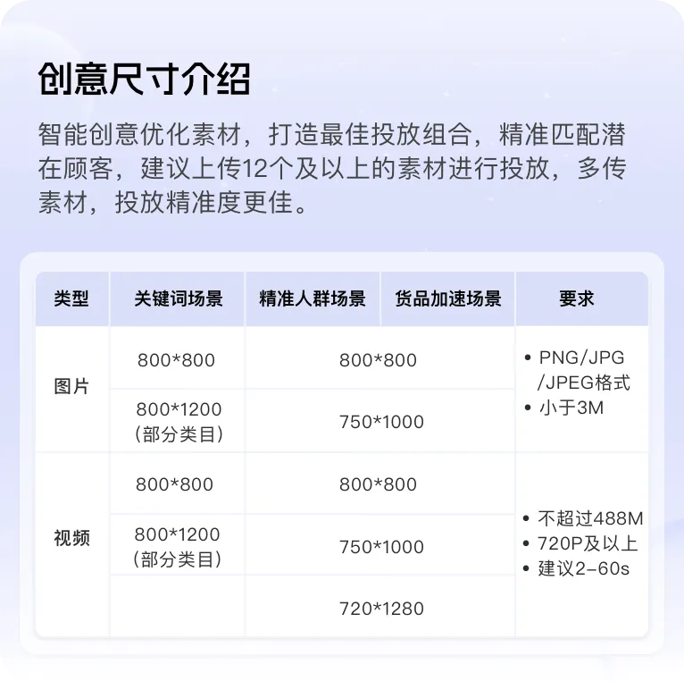

## **2：素材自动拉取问题****>>>点击了解详情**

Q：**自己怎么去选择哪些素材进行投放呢？**

A：操作路径：创意-高级设置-素材自动拉取-选择场景（货品全站推广）

若开关开启，则会自动拉取相应的素材；若关闭，则不会自动拉取；

Q：**为什么我关闭的计划创意素材还有显示？**

A：目前全站推场景，自动拉取开关除SKU图开关以外，均不支持对存量计划生效。

## **3：投放期功能解读问题****>>>点击了解详情**

Q：**为什么计划会进入****「效果调整期」？**

A：如当天有以下操作：暂停、调整 ROI 高于系统推荐三档 ROI 中的最高值、开启一键起量、切换出价方式操作，则从【数据积累期】切换为【效果调整期】

## **4：达摩盘回流能力问题****>>>点击了解详情**

Q：**如何获得达摩盘回流能力？**

A：1）打开达摩盘后台，进入**人群管理 tab**，选择**我的人群**板块；

2）选择**自定义人群；**

3）搜索框选择**万相台无界版回流再营销；**

4）**一二级场景**均选择**货品全站推广；**

5）根据运营诉求进行**可选项的编辑**后创建完成；

6）创建完成后可以进行后续的人群操作（**一键投放、画像透视等**），如下图

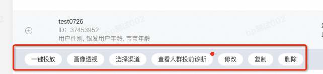

## **5：授权操作指南问题****>>>点击了解详情**

Q：**怎么授权获得****货品全站推广场景？**

A：1）用主账号登录无界后台；登录地址：https://one.alimama.com/index.html

2）主账号签署货品全站推广协议；

完成「货品全站推广服务协议」和「无界版软件服务协议」两份签署。协议签署后无法撤销，请您悉知。货品全站推广广及无界协议签署通知

Q：**为什么子账号没有货品全站推广场景？**

A：**授权子账号货品全站推广场景**

授权地址：https://zizhanghao.taobao.com/sub/home.htm?_redirect=1

完成授权后，您仅需在 one.alimama.com 网站内， 点击退出并重新登录，即可更新权限。请注意，如果您使用千牛客户端或者千牛网页版登录，请不要仅重新登录千牛，而是需要在浏览器中，进入 one.alimama.com 网站内，进行重新登录。确认授权更新后，可以重新使用千牛等入口操作。

## **6：营销雷达问题****>>>点击了解详情**

Q：**营销雷达有哪些诊断内容的类型和建议？**

A：【预算】预算不足；【出价】出价可优化 、建议起量 、建议修改出价方式；【宝贝】宝贝建议更换、建议提升宝贝价格力、建议优化宝贝信息质量；>>>点击了解详情

## **7：起投预算门槛问题****（仅限邀约商家）****>>>点击了解详情**

Q：**如何查看降低了门槛的商品？**

A：在宝贝选品页面，可看到如下“门槛降低”标签，存在标签的商品即为已降低门槛的商品。

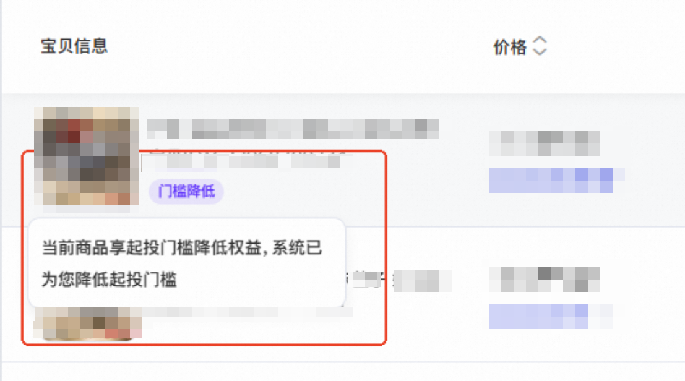

## **8：计划数上限问题****>>>点击了解详情**

Q：**计划数不够用怎么申请？**

A：货品全站推广消耗达到一定量级且投放商品数较多的商家，我们提供了计划数上限提升的通道，符合条件的商家，可以在货品全站推广后台右侧小袋鼠联系客服提交申请。>>>点击了解详情

## **9：货品全站推广投放门槛降低****>>>点击了解详情**

Q：**为什么我没有这个功能？**

A：本功能目前处于迭代阶段，该功能为邀约制，是仅向受邀商家开通的限时权益，暂不支持主动提报；如有更多问题，可扫描文档最后方二维码入群沟通；

Q：**无界其他场景与货品全站推广可同时投放后，在配合投放的策略上，有什么建议吗？**

A：货品全站推广已建设围绕货品生命周期建设新品、潜力品、机会爆品成长的能力，助力「新品」拿量速度更快、「潜力品」GMV增长更多、「机会爆品」流量增量更大；对于处于不同生命周期的货品，商家可以基于自身的投放诉求，参考以下的推荐出价和调优方向进行货品全站推广计划的设置，与其他场景配合投放；同时对于货品全站推广的控投产计划，请**尽可能采纳平台的推荐ROI进行设置****；**

| **货品生命周期** | **是否新品** | **推荐出价及投放调优** | **推荐理由** |
| --- | --- | --- | --- |
| 新品冷启期 | 是 | 最大化拿量 加购目标 | **新品加速**：当前商品处于新品阶段，推荐使用最大化拿量，并打开加购目标，实现成长跃迁 |
| 新品成长期 | 是 | 最大化拿量 加购目标 | **新品加速**：当前商品处于新品阶段，推荐使用最大化拿量，并打开加购目标，实现成长跃迁 |
| 新品爆发期 | 是 | 控投产 加购目标 | **新品加速**：当前商品处于新品爆发期，推荐使用控投产出价，并打开加购目标，提升成交爆发 |
| 成长期 | 否 | 控投产 直接成交目标 | **尖货打爆**：当前商品处于成长期，推荐使用控投产比出价，并打开直接成交调优，实现单品GMV增长，快速打爆 |
| 爆发期 | 否 | 控投产 加购目标 | **流量增长**：该商品为机会爆品，推荐使用控投产比出价方式，并打开加购目标调优，稳定爆品排名，撬动全域流量增长； |
| 平销期 | 是 | 控投产 | **稳定获量**：当前商品处于平销期，推荐使用控投产出价稳定利润延长生命周期 |

Q：**为什么解除互斥后新建货品运营计划仍然提示存在货品全站推广在投计划？**

A：本次解除互斥的范围仅包含货品全站推广与关键词推广场景和人群推广场景和互斥，因货品运营/全店智投/多目标直投场景已下线，本次解除互斥暂未做处理

Q：**我的其他店铺都已经可以全站推和人/词同时投放了，为什么我当前店铺不可以？**

A：本次需求为平台邀约值，经过平台圈选后按商家主账号维度逐一开放，未开通的店铺请耐心等待

Q：**货品全站推广的成交会跟其他工具重复计算吗？**

A：货品全站推广与无界其他场景均为末次触点归因，成交不会同时计算

Q：**解除互斥后，货品全站推广单品计划与全店模式是否互斥？**

A：是的，同一商品在整个货品全站推广场景下只能存在一条计划

Q：**超级短视频投放和货品全站推广能一起开吗？**

A：可以，无论是否开通本次解除互斥的功能，超级短视频和货品全站推广都可以同时投放

## **10：**货品全站推广「优质计划防拿量困难」**>>>点击了解详情**

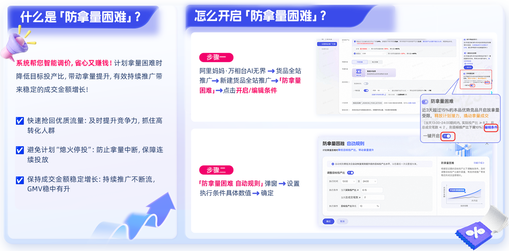

**Q：****系统符合规则后自动下调ROI会不会触发效果调整期？**

A：不会。上调ROI才会触发；

投放期阶段变化具体可查看文档：

**Q：****防拿量困难和小万护航那个投产比调控冲突吗？**

A：功能各自独立，执行优先级自动规则会优于小万护航，条件上自动规则满足会优先执行自动规则；

## **11：**万相台无界·全站推广互斥规则说明 **>>>点击了解详情**

**Q：****我的商品已经在全站推中投放，还能再建一个全站推计划吗？**

**A**：不可以。同一商品在同一账户的全站推范围内，只能在一个计划中投放。如果您想调整全站推的投放策略，建议修改现有计划，或暂停原计划后新建。

**Q：****我之前因为互斥限制暂停了一些计划，现在需要手动重启吗？**

**A**：是的。因互斥逻辑已暂停的计划，需要您手动重启。

## **12：**货品全站推广接入关键词升舱资源位 **>>>点击了解详情**

**Q：****如何有机会被系统选入接入关键词升舱？**

**A**：全站推计划接入关键词升舱目前已全量，符合资源位展示要求就有机会被选入

**Q：****我刷到过自己的计划在关键词升舱资源位的展示，我怎么做可以让计划更多在升舱资源位展示？**

**A**：符合上述准入条件的计划，无需商家单独做升舱设置，系统自动竞价，商家可以**设置有竞争力的目标投产比**（降低目标投产比），最大化拿量计划设置更高的预算，在实时竞价中会更有机会胜出

## **13：货品全站推广-商品先用后付服务折扣**（已下线)**>>>点击了解详情**

**因产品功能优化调整，本功能将于9月25日下线，后续上线时间待平台通知，感谢您的支持。**

即日起至9月25日前，有本功能权限的商家，可以在货品全站推广首页-权益中心-商品先用后付服务折扣自行点击关闭「先用后付在投商品自动开通」功能；9月25日前未关闭的，系统会统一关闭「先用后付在投商品自动开通」功能。「先用后付在投商品自动开通」功能的关闭，不影响您的店铺使用商品先用后付功能。

Q：**如何开通这个功能？**

A：在货品全站推广首页-权益中心-商品先用后付服务折扣，点击**去授权，签署先用后付协议并开启**「先用后付在投商品自动开通」** （仅支持商品推广，暂不支持全店推广）**

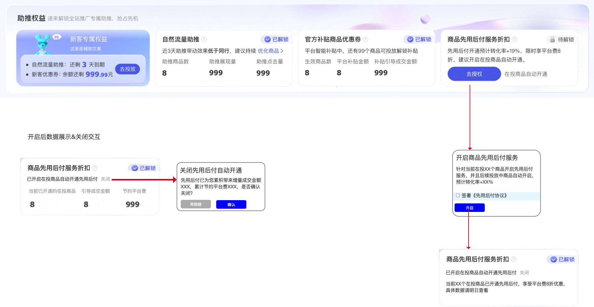

# 九、商家反馈渠道

Q：**货品全站推广相关问题怎么进行反馈？**

A：如您遇到产品使用问题或产品优化建议，可通过以下通道发起：

1）可前往无界首页后台点击袋小蜜，联系人工客服，提工单进行反馈；

2）扫码加入下方钉钉群，耐心等待工作人员的处理；

