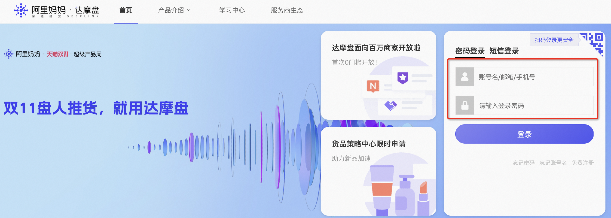
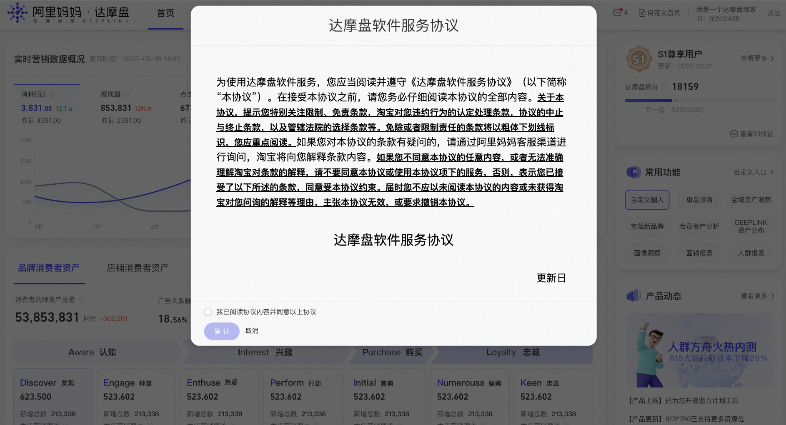

# 流量金卡人群定向能力需开通达摩盘权限

> 来源：https://alidocs.dingtalk.com/i/nodes/EpGBa2Lm8aZxe5myCErM5vAXWgN7R35y

商家您好，关键词推广-**流量金卡人群定向能力**依托于阿里妈妈·达摩盘的人群圈选与洞察能力，创建该金卡需开通达摩盘权限，开通后即可新建计划投放！

### **哪些商家可以申请？**

只要是在淘宝开店的商家（不区分BC店）且在无界有投放账户即可申请开通！

### **开通流程****（仅需两步：登陆+授权）**

第一步、点击此网址进行登录：https://dmp.taobao.com/login.html

第二步、第一次登录则会出现以下内容，需要签署一个**【达摩盘软件服务协议】****点击授权****即可开通达摩盘权限，可立即开始使用达摩盘能力！**

**申请规则：**是阿里妈妈客户，有妈妈投放账号（包括原已开通直通车、引力魔方、万相台、万相台无界等）。注意：功能开通后，如近60天内未登录不符合标准，进行权限关闭，请商家经常使用起来哦~

### **什么是达摩盘？**

作为阿里妈妈的数据管理平台（DMP），达摩盘为商家提供海量标签，支持商家自由组合，快速有效圈定目标人群，同时为商家提供精细化人群画像洞察功能，联动多渠道进行投放，还可追踪人群投放的后链路数据，助力全链路消费者运营。在此基础上，近年来达摩盘着力在各域构建营销方法论产品，在**消费者、货品、渠道**、**市场**等场景为客户提供系统的洞察分析和策略建议，一起帮助商家在阿里妈妈实现数智化运营。
