# 📣【高效拉新】高效做拉新，简单提增长！

> 来源：https://alidocs.dingtalk.com/i/nodes/G1DKw2zgV2KnvL4kF13wN5ZoJB5r9YAn

店铺人群运营（原人群方舟及拉新快）焕新升级为「高效拉新」「常客转化」

答疑请加钉群：81935042661

🤔 升级后不会用？ 推广页右下角点击**【操作指引】**，5个步骤就可以轻松学会！

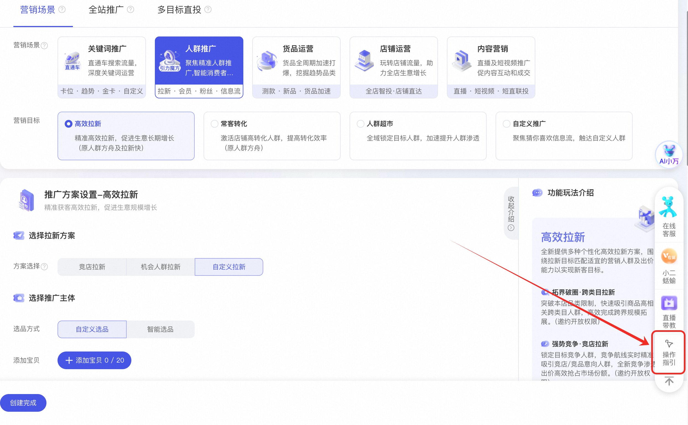

| **🔥 ****高频 QA：****不理解新版人群推广优化目标、出价方式与旧版的对应？** **请看👉** | **🔥 ****高频 QA：****我感觉新版人群推广效果变差？** **本次升级仅对过去新建计划的超～长～选项进行精简和组合，****未做技术底层调整，不会影响投放效果****。请您不要恐慌～ 如不熟悉新版使用，可根据左侧文档辅助您投放。** |
| --- | --- |

---

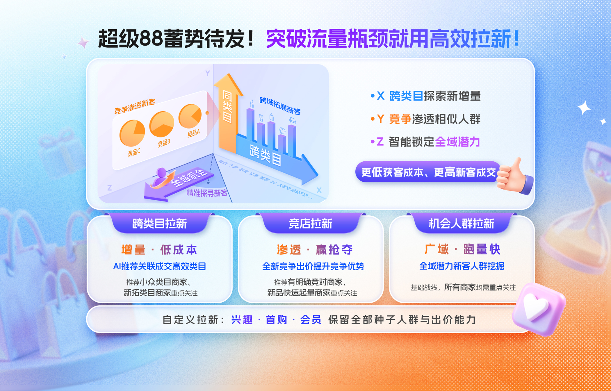

| **场景通览** | 竞店拉新 New | 跨类目拉新 New | 机会人群拉新 New | 自定义拉新 |
| --- | --- | --- | --- | --- |
| **适用商家****HOT** | 1.类目竞争激烈，消费者爱多店/多品对比 2.有明确对标商家/商品 3.新品需快速起量，锚定竞对人群投放 | 1.小众类目商家 2.成熟店新拓类目商家 3.知名度TOP商家 | 1.有拉新诉求但没有明确新客画像的商家 2.初次探索人群运营的商家 | 1.有明确新客画像、人群运营较为成熟的商家 2.对加购新、首购新、入会新等不同新客指标有不同推广诉求的商家 |
| **开放范围****HOT** | **妈妈等级m3以上自动开放** **填写问卷申请权限** | **妈妈等级m5以上自动开放** **填写问卷申请权限** | **全量开放** | **全量开放** |
| **方案特点** | **锁定竞店/竞品互动人群，以竞对人群画像养成本店/本品的人群资产，逐步抢占市场份额。** | **突破本店品类限制，快速吸引商品关联成交的跨类目人群，轻松实现跨界拓展。** | **捕捉商品机会人群，聚焦潜力消费者直挖隐藏商机，高效勘探市场机会人群。** | **全面自主掌控，自定义投放灵活调整，实现个性化高效拉新目标。** |
| **拉新范围** | **支持新客范围及频次控制** | **支持跨类目范围控制**** ****New** | **支持新客范围及频次控制** | **支持兴趣新客/ ****首购新客**** ****HOT****/ 会员拉新** **支持新客范围及频次控制** **支持全域/同类目/跨类目****（细分至叶子类目）****范围选择**** ****New** |
| **种子人群** | **竞争定向推荐·竞争航线** **默认智能竞店/竞品人群** 支持**自定义****竞店/竞品人群** | **跨类目定向推荐**** ****New** **默认推荐拉新成本低且效果好的跨类目人群** 支持**自定义跨类目人群** | **机会人群推荐****（同行常用人群挖取）**** ****New** **默认使用“智能人群”** 支持**自定义机会人群** | **默认使用“智能人群”** **支持自定义人群** |
| **屏蔽人群** | **自动屏蔽****店铺老客** **也可以自行添加屏蔽人群** | **自动屏蔽****所选类目老客** **也可以自行添加屏蔽人群** | **自动屏蔽****店铺老客** **也可以自行添加屏蔽人群** | **自动屏蔽****店铺老客** **也可以自行添加屏蔽人群** |
| **出价能力** | **新增强势竞争出价** **竞争人群渗透**** ****New** | **稳定新客投产比** **扩大新客规模** **提升新客加购** | **稳定新客投产比** **扩大新客规模** **提升新客加购** | **智能出价（稳定新客投产比**/**扩大新客规模** **/提升新客加购/****竞争人群渗透**** ****New****）** **手动出价** |
|  | **出价目标解读：** **稳定新客投产比：**优化拉新投产比，确保投资回报稳定，长周期提升拉新效益（——原控投产比出价） **扩大新客规模：**面向目标意愿人群，扩大新客成交规模，高效拉新增长（——原最大化拿量；若设置成本则为手动出价） **提升新客加购：**促目标新客加购，增加购买行为意向，长周期新客转化（——原最大化拿量；若设置成本则为手动出价） **竞争人群渗透 New：专攻竞争新客，贡献更多新客成交**（——新增智能出价；若设置成本则为手动出价） **手动出价：**仅自定义拉新支持手动出价 |  |  |  |

### **操作指引**

**1、选择营销目标：**人群推广-高效拉新。

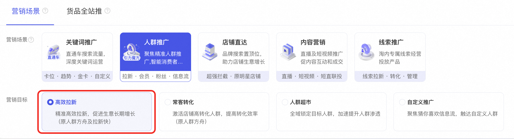

**2、选择拉新方案：**根据上述拉新方案特点，结合推广商品特性，选择跨类目 / 竞店 / 平台机会的目标进行人群拉新。

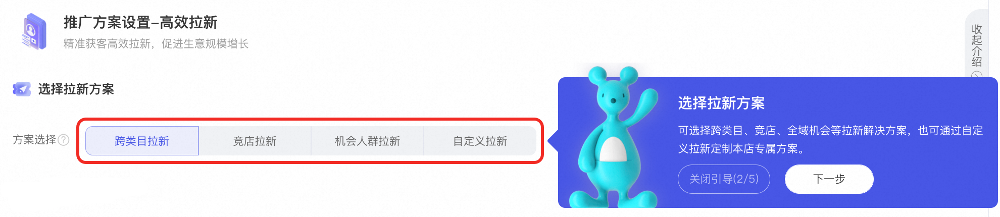

注：如您想要投放**原店铺人群运营-首购新客**，可以在**「自定义拉新-首购新客」**中找到该方案。

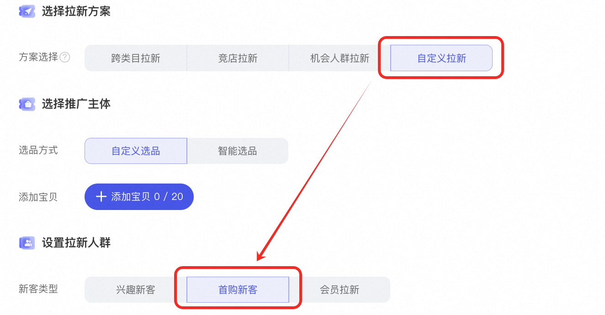

**3、选择推广主体&设置拉新人群：根据不同的拉新方案选择您的推广宝贝和拉新人群**

**如果您选择了跨类目 / 竞争 / 机会拉新，建议您采纳根据选品推荐的人群或者定向能力。**

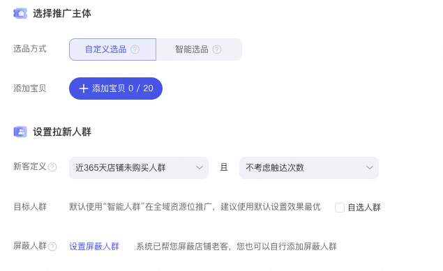

**如果您选择了「自定义拉新」，支持您使用****全域智能人群****或者****自定义种子人群****。**

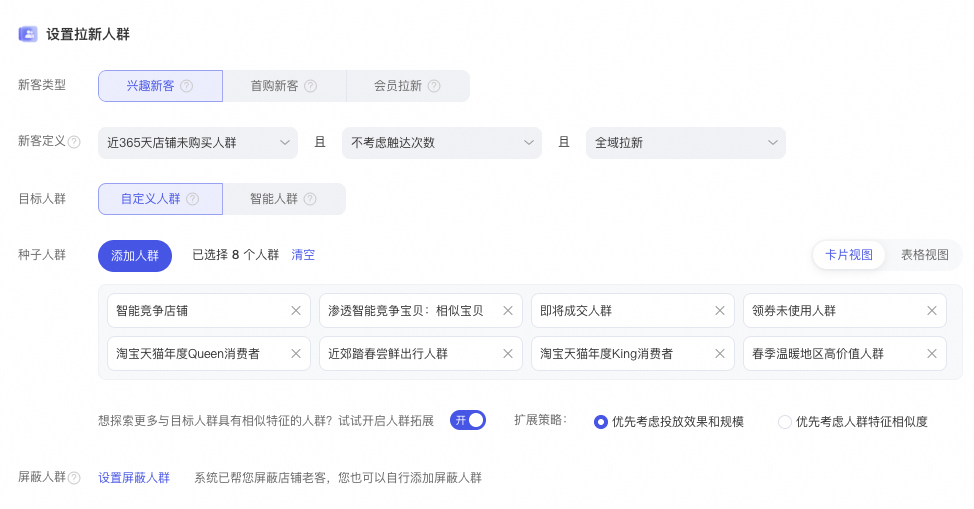

**4、设置预算与出价**：**根据您的新客营销目标（投产、成交规模、加购量）选择相应的出价方式，如您需要手动控制可勾选设置新客平均点击成本开启手动出价。**

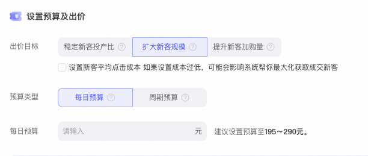

**👉 ****邀您参加新版人群推广满意度调研，我们将结合您的反馈不断进行优化：****https://survey.taobao.com/apps/zhiliao/FMeBdEIV_**

**FAQ**

**1、为什么我没有跨类目拉新、竞店拉新？ ****邀请制，您可填写问卷申请：****https://survey.taobao.com/apps/zhiliao/lw_Os8T5j**

**2、首购新客去哪里了？ ****还在！在自定义拉新中选择新客类型**

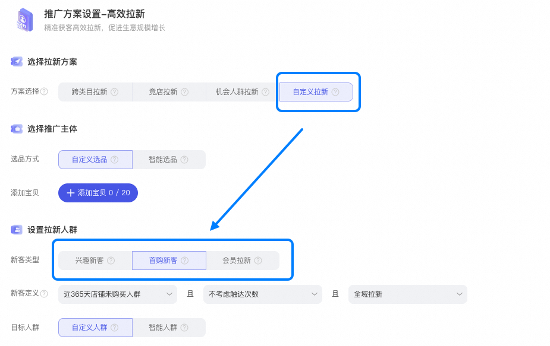

**3、最大化拿量、手动出价不见了？****还在！！叠加营销目标拉新能力更强**

| **扩大新客规模 默认=最大化拿量+新客成交** **提升新客加购量 默认=最大化拿量+新客加购** | **若您打开****设置新客平均点击成本** **扩大新客规模=****手动出价****+新客成交** **提升新客加购量=****手动出价****+新客加购** |
| --- | --- |

**4、为什么我的投产比出价不可选择？***为保障投放效果，该出价方式需要先开启人群扩展*

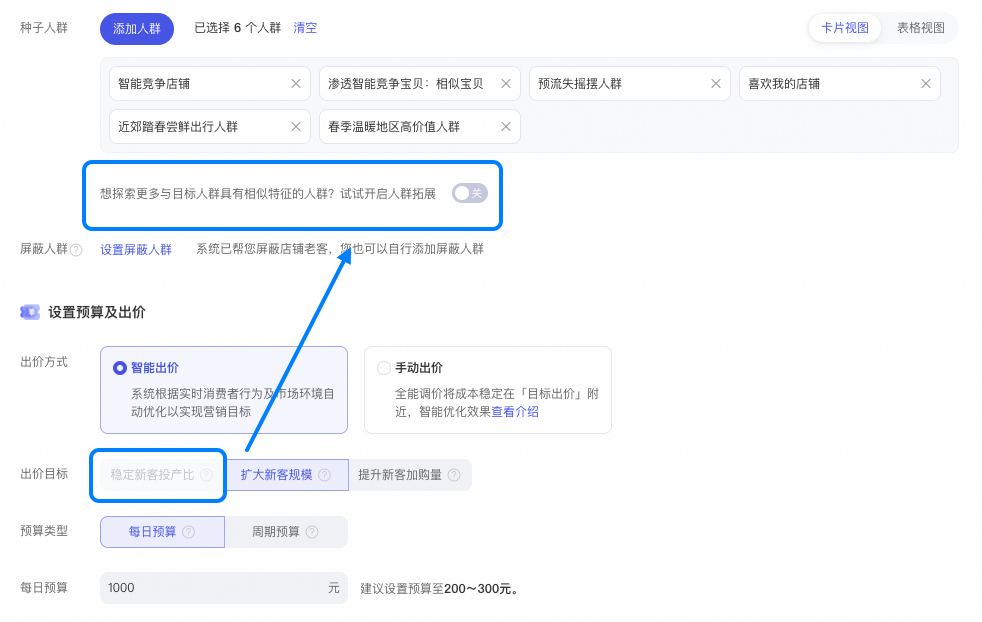

**5、有竞店拉新后还能在自定义拉新里使用首购新客+竞争航线吗？ ****可以！您可以在自定义拉新中选择种子人群继续使用竞争航线**

**6、跨类目拉新选择不同跨类目人群显示人群添加失败？****没有选择****消费等级****，导致「类目消费金额分层」标签无法生效。**

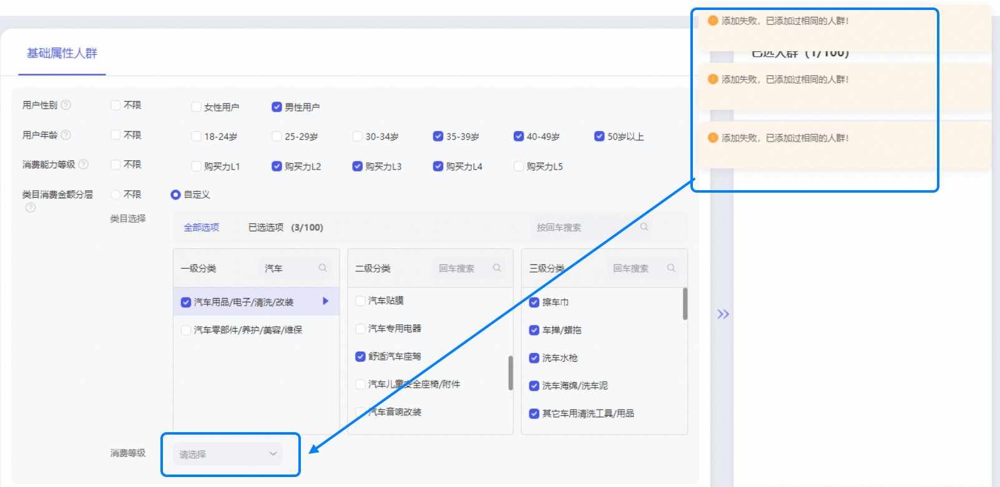
