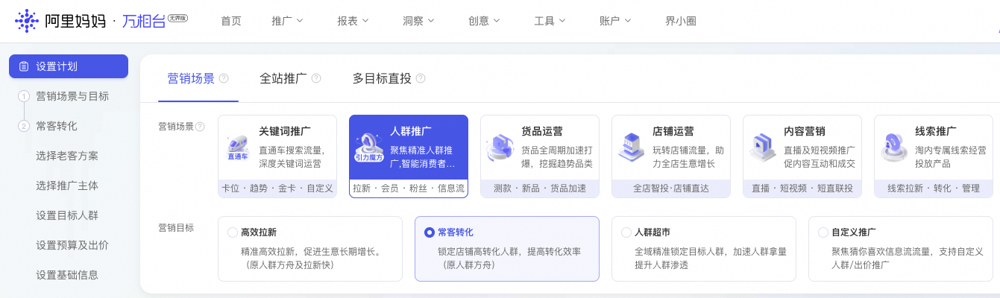
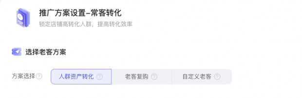
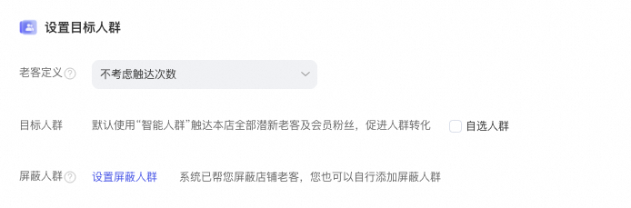
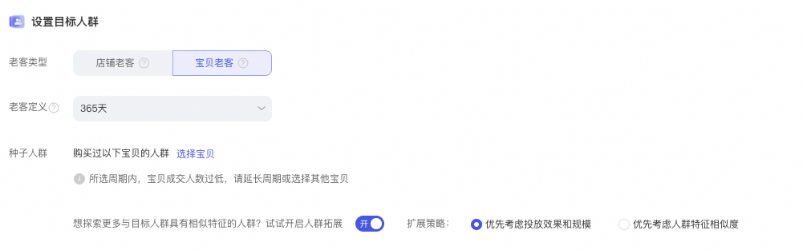
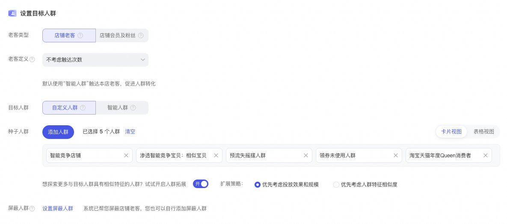
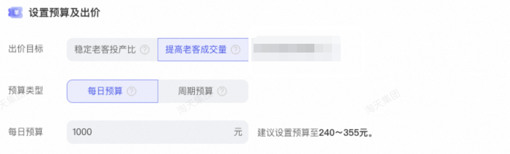
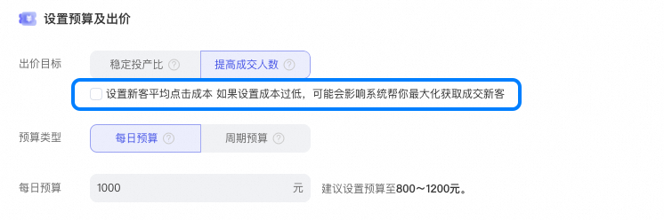
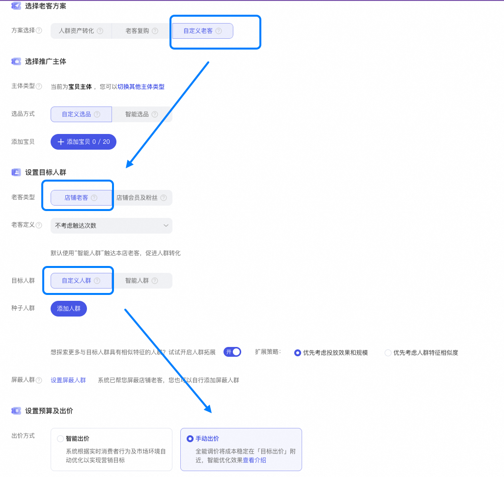
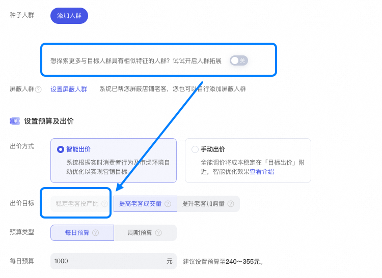

# 📣【常客转化】深耕常客价值，经营店铺人群资产核心阵地

> 来源：https://alidocs.dingtalk.com/i/nodes/G1DKw2zgV2KnvL4kF1jP2nZAJB5r9YAn

# **常客转化投放方法论**

常客价值升级阶梯

持续提升店铺常客购买力和忠诚度，构建从“泛”到“精”再到“核心”的常客升级路径，实现常客价值升级

|  | 常客运营阶段4-破局·引爆通过「核心资产打爆」场景，利用高忠诚度/高购买力老客作为“种子用户”，帮助新品/潜爆品/趋势品快速精准获得优质可转化人群。 常客运营阶段3-固本·提频通过「复购人群召回」，持续提升常客购买频次与忠诚度 常客运营阶段2-提质·提价通过「购买力升级」，提高人群资产客单价，提高人群资产购买力水平和质量。 常客运营阶段1-筑基·扩量通过「人群资产转化」全域触达兴趣人群，做大店铺人群资产底池。 |
| --- | --- |

| 常客方案 | 人群资产转化 | 购买力升级 NEW | 复购人群召回NEW | 核心资产打爆NEW |
| --- | --- | --- | --- | --- |
| 常客运营方法论 |  |  |  |  |
| 方案核心价值 | 全域触达店铺兴趣人群，实现大规模高效成交，持续扩充人群资产蓄水池 | 优选高消费力潜客，推荐高价值进阶商品，持续拉升客单价，实现人群资产价值跃升 | 精准激活已购老客，提升回购频次与忠诚度，筑牢店铺基本盘 | 撬动高消费力核心忠实人群资产，反哺新品成长与爆款打造，挖掘人群价值极限 |
| 投放目标人群 | 全域兴趣人群（支持自选人群定向） | 商品常客：触达商品兴趣人群，推荐选择爆品/引流品定向 店铺常客：系统智能定向触达店铺兴趣人群 品牌常客：系统智能定向触达品牌及相似品牌兴趣人群 | 商品常客：触达商品兴趣人群，推荐选择高复购频次商品定向 店铺常客：系统智能定向触达店铺365天已购老客，锁定复购周期内人群 品牌常客：系统智能定向触达 品牌已购人群 | 商品常客：触达商品兴趣人群，推荐选择爆品定向，为潜力品精准导流 店铺常客：系统智能定向触达店铺365天复购店铺忠实人群 品牌常客：系统智能定向触达品牌 高频购买人群 |
| 投放渠道 | 支持信息流全域+信息流人群追投 | 支持信息流全域+信息流人群追投 | 支持信息流全域+信息流人群追投 | 支持信息流全域+信息流人群追投 支持提升信息流核心资源位（首猜及购中后等）触达频率 |
| 投放推荐选品 | 店铺潜力品/爆品 | 高价值，高连带购买率商品 | 高复购率，高复购频次商品 | 潜力新品，潜力爆品 |

# **投放SOP**

# **更多操作指引**

## **计划如何开启“提升信息流核心资源位触达频率”功能**

**注意**

提升信息流核心资源位触达”频率功能仅在「核心资产打爆」常客方案可设置

该能力会提升投放商品在首页猜你喜欢和购中后猜你喜欢等信息流核心资源位的触达概率

使用该能力后，可能会引起投放计划ppc一定程度上涨

| 操作步骤 | 具体指引 |
| --- | --- |

| STEP 1:选择常客转化-核心资产打爆 |  |
| --- | --- |

| STEP 2:根据投放诉求，选择定向常客类型 | 仅「店铺常客」和「品牌常客」支持提升常客核心资源位 |
| --- | --- |

| STEP 3:勾选「提升常客核心资源位触达」按钮 |  |
| --- | --- |

---

# **老版常客转化**

店铺人群运营（原人群方舟及拉新快）焕新升级为「高效拉新」「常客转化」

答疑请加钉群：81935042661

🤔 升级后不会用？ 推广页右下角点击**【操作指引】**，5个步骤就可以轻松学会！

| **🔥 ****高频 QA：****不理解新版人群推广优化目标、出价方式与旧版的对应？** **请看👉** | **🔥 ****高频 QA：****我感觉新版人群推广效果变差？** **本次升级仅对过去新建计划的超～长～选项进行精简和组合，****未做技术底层调整，不会影响投放效果****。请您不要恐慌～ 如不熟悉新版使用，可根据左侧文档辅助您投放。** |
| --- | --- |

---

| **场景通览** | 人群资产转化 New | 老客复购 New | 自定义老客 New |
| --- | --- | --- | --- |
| **开放范围** | 邀约制开放 | 老客复购能力 全量开放 | 全新老客自定义能力 全量开放 |
| **方案特点** | 仅触达本店高意愿人群、高价值人群，大促高效促转化，实现高效收益增长 | 激活店铺老客刺激复购，增加人群忠诚度，长效稳固店铺成交。 | 全面掌握自主权，自定义投放策略，灵活调整方案，实现个性化老客营销目标。 |
| **设置目标人群** | **智能定向高转化人群 New ** 默认使用“智能人群”触达本店全部高转化潜新老客及会员粉丝，促进人群转化。 亦支持 **自定义高转化人群**，为您挖掘**同行常用高转化人群类型 New ** | **定向店铺老客**：投放在本店有过购买行为的忠实老客。**支持购买类目及价格带选择** **New ** **定向宝贝老客**：投放有购买过所选本店宝贝的忠实老客人群。 | 支持 **店铺老客/店铺会员及粉丝** 选择 **支持老客范围及频次控制**** ****New ** **支持店铺老客价格带及类目选择** **New ** 支持 自定义种子人群 或者 纯智能定向 |
| **屏蔽人群** | 系统已屏蔽不符合优化目标的人群，建议使用默认设置效果最优 |  |  |
| **预算及出价** | **稳定投产比** **提高成交人数** **竞店重合人群渗透**** ****New** | **稳定老客投产比** **提高成交人数** | **智能出价（稳定老客投产比**/**扩大老客成交量/****竞店重合人群渗透**** ****New****）** **手动出价** |
|  | **出价目标解读：** **稳定老客投产比：**优化复购策略，确保投资回报稳定，提升老客长周期价值（——原控投产比出价） **提高成交人数：**增强高意愿人群覆盖，最大化提升转化潜力，实现生意资产增长（——原最大化拿量；若设置成本则为手动出价） **扩大老客成交量：**激活更多沉睡老客，扩大复购人群，实现持续销售增长（——原最大化拿量；若设置成本则为手动出价） **竞店重合人群渗透 New：稳扎本店成交，拦截老客流出竞店**（——新增智能出价；若设置成本则为手动出价） **手动出价：**仅自定义老客支持手动出价 |  |  |

### **操作指引**

**1、选择营销目标：人群推广-常客转化**

**2、选择老客方案：根据上述常客转化的方案特点，选择适合您当前营销目标的转化方案。**

**3、选择推广主体&设置目标人群：根据不同的转化方案选择您的推广宝贝和目标人群。**

** 如您选择的方案是「人群资产转化」，建议您直接使用智能人群，已默认帮您选择****本店高转化人群****。**

**如您选择的方案是「老客复购」，支持您定向 ****本店铺老客**** or ****任一宝贝老客**** 定向过往成交人群。**

**如您选择的方案是「自定义老客」 ，支持您定向 本店铺老客 or 本店铺会员及粉丝的同时 ****进行自定义人群&智能人群的自由控制。**

** 4、设置预算与出价**：

**智能出价：根据您的转化营销目标（投产、成交规模）选择相应的出价方式**

**手动出价：**

**人群资产转化/老客复购使用链路：勾选设置点击成本**

**自定义老客使用链路：选择店铺老客-自定义人群**

**FAQ**

**1、为什么我没有人群资产转化？邀请制！！适配不同商家投放能力开通**

**2、最大化拿量、手动出价不见了？还在！！叠加营销目标转化能力更强**

| **扩大老客成交量 默认=最大化拿量+老客成交** **提升老客加购量 默认=最大化拿量+老客加购** | **打开设置新客平均点击成本** **扩大老客成交量=手动出价+老客成交** |
| --- | --- |

**4、为什么我的投产比出价不可选择？***为保障投放效果，该出价方式需要先开启人群扩展*

**5、还能在常客转化里使用竞争航线投放本店人群或者本店宝贝吗？ 可以！您仍然可以在自选种子人群继续使用竞争航线**
