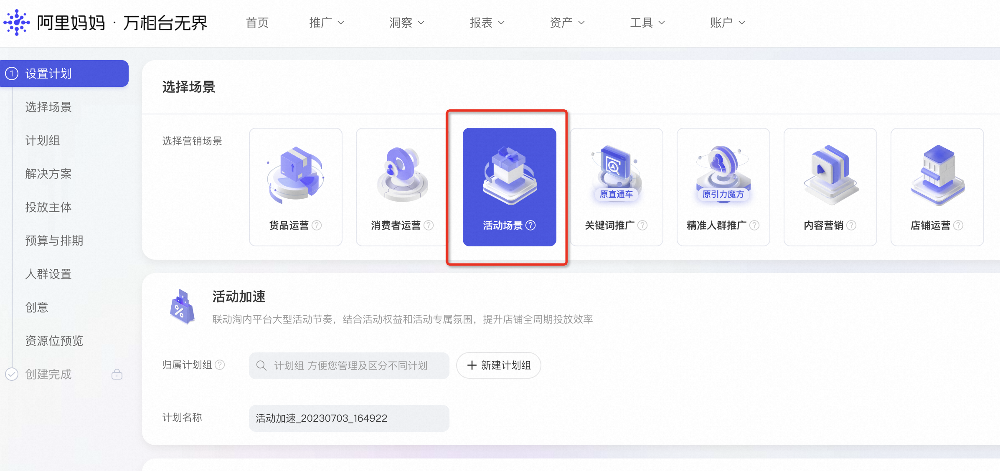
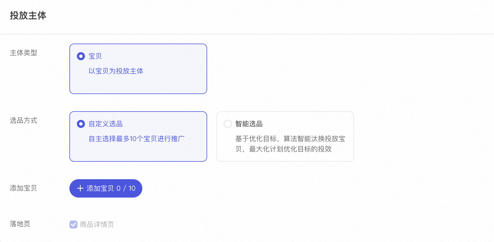
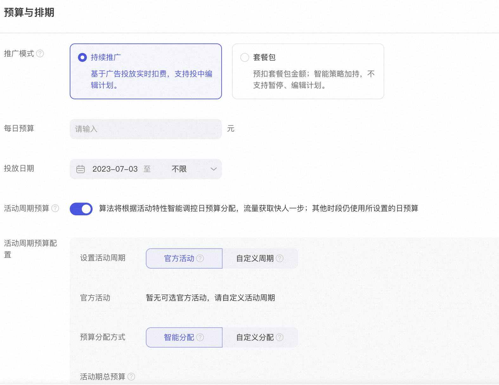
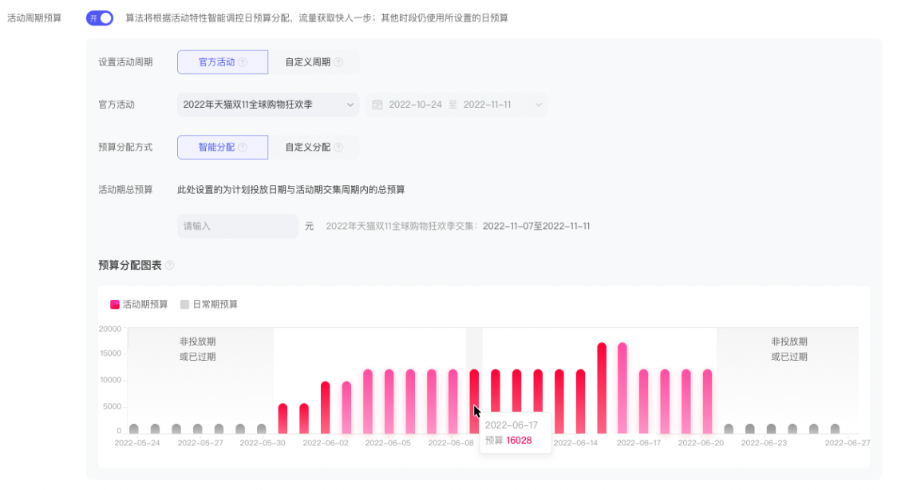

# 05-1-活动爆发

> 来源：https://alidocs.dingtalk.com/i/nodes/G1DKw2zgV2KnvL4kF1jPnxPDJB5r9YAn

**原语雀文档链接：**https://yuque.antfin.com/chenchun.chen/gqhty9/kwse9gqh956u6z32

---

# 操作介绍

（欢迎进入活动场景官方答疑群，专属小二答疑）

## 活动爆发

### 1.选择场景

首页选择“新建推广计划”，并在营销场景中选择“活动场景 - 活动爆发”

### 2.选择「自定义商品」或「智能选品」

*每个客户仅能投放一个「智能选品」计划，投放成功后「智能选品」将被置灰并显示“已有一笔在投计划，无法再次新增此次计划”

### 3.设置「日预算」金额或「活动周期预算」

#### 3.1 日预算

*智能选品目前仅支持“促进成交”的优化目标

#### 3.2 活动周期预算

*设置「活动期总预算」，算法会在活动期内实时调控预算分配比例；支持智能分配或自定义分配

*非活动期（日常期）使用“日预算”自主设置的金额

***需设置完“日预算”和“活动期总预算”才会显示预算分配曲线**

###

##
