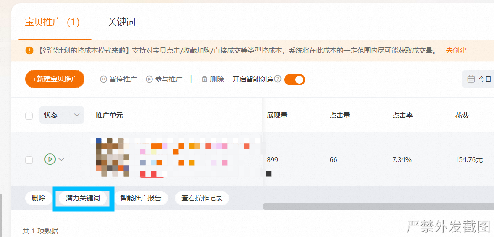
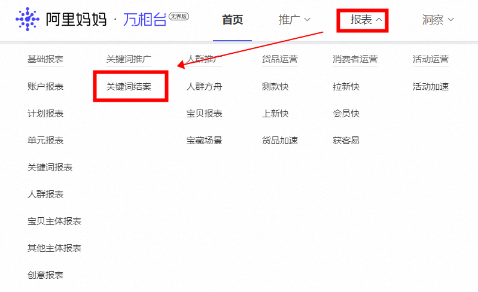
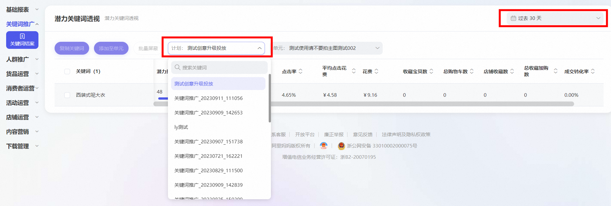
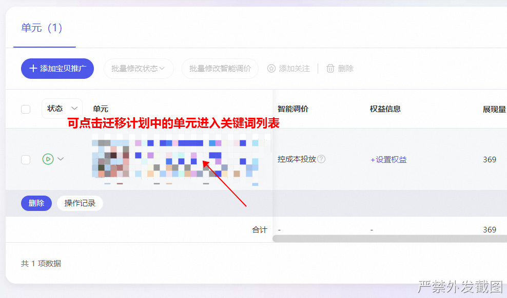
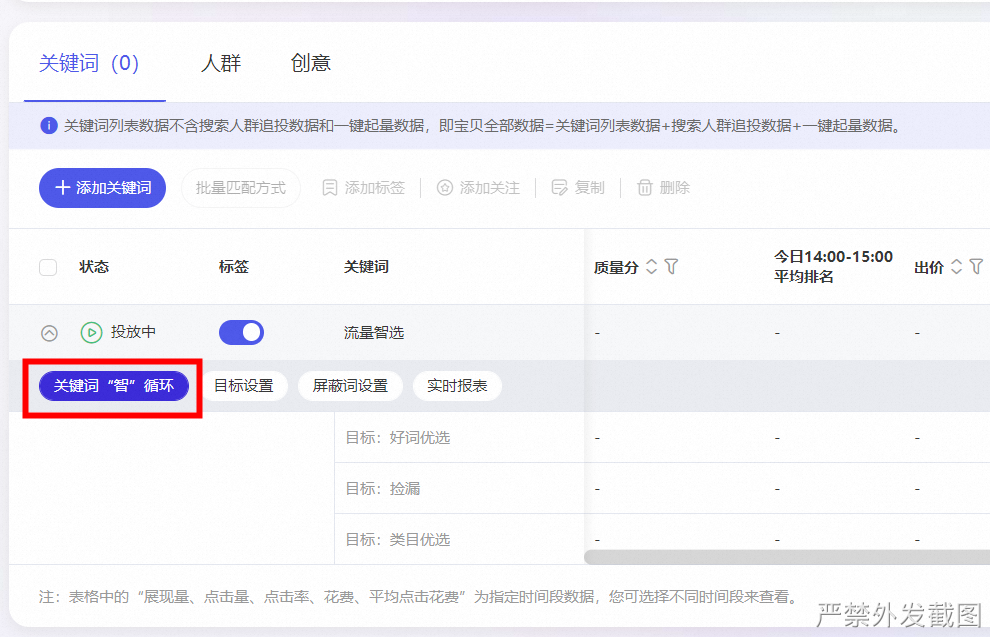
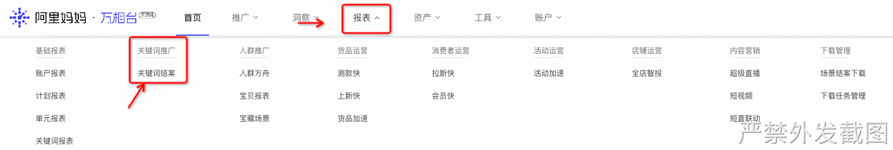

# 迁移后智能计划如何进行调整？

> 来源：https://alidocs.dingtalk.com/i/nodes/Gl6Pm2Db8DMGQKRatEw91v1pWxLq0Ee4

**原语雀文档链接：**https://yuque.antfin.com/chenchun.chen/gqhty9/nt3fft4rdlylhruv

---

从**原直通车**迁移至**万相台无界**后，有些商家存在这样的疑惑：“迁移后怎么没办法创建智能计划了？”，“智能计划效果不错，可是迁移后智能计划好像没办法调整了”？

真相是，迁移后原直通车智能计划不仅支持关键词屏蔽的操作，还能够在计划中添加关键词！让原有的智能计划效果更为可控！

那么问题来了：迁移后的直通车智能计划，到底如何进行调整？

很简单，在新“流量智选”中操作即可，具体流程见下方。

​

## 具体差异与操作：

原“潜力关键词”功能通过“关键词报表-关键词结案”/“流量智选”来实现。可以进行关键词的查看与屏蔽。屏蔽词单计划上限为50，请各位掌柜谨慎操作！

​

## 1.定位差异

关键词结案 = 原潜力关键词 = 查看系统投放的关键词，选择效果较差的词屏蔽；

新流量智选 = 消费者搜索词 = 发现市场/消费者搜索趋势，建议选词添加至计划；

## 2.操作差异

### 2.1 原操作

原直通车智能计划中，大家通过“潜力关键词”来查看智能计划中关键词投放的效果，并进行屏蔽。

​

### 2.2 新操作-关键词结案

迁移后，可以在报表——关键词报表——关键词结案处，选择相应的计划进行关键词查看。

筛选时间、筛选计划，查看相应的关键词，进行相应的屏蔽操作即可。

### 2.3 新操作-流量智选

迁移至无界中的智能计划，点击单元进入关键词列表，在“流量智选”模块，选择**关键词“智”循环**，实现关键词的查看、添加以及屏蔽（该功能设计初衷为发现消费者趋势词）。

可以选择流量智选中，较好的词单独添加至关键词列表！

​

同时，在这里大家也可以发现本次升级的另一个变化点，**原来的智能计划可以“添加关键词”了，通过这种方式，智能计划可以变得更为可控！！**

**​**

## 3.高频问题FAQ

### Q1 迁移后潜力关键词报告在哪里看？

潜力关键词报表已经上线了！只需一步即可查看。

操作路径：点击报表-关键词结案

### Q2 屏蔽词数量上限还会提升么？

当前万相台无界版单计划精准词屏蔽上限已统一至50个。原直通车因引擎压力问题已经限制为单计划30个。

核心为随着智能计划使用客户数与屏蔽词数量的持续增加，引擎压力过大，为保障功能的正常使用，目前平台对精准词的屏蔽做了相应的数量限制，老计划已屏蔽的关键词仍生效，但超过30/50词则无法继续添加。请客户审慎操作屏蔽。后续是否提升我们还会持续评估。
