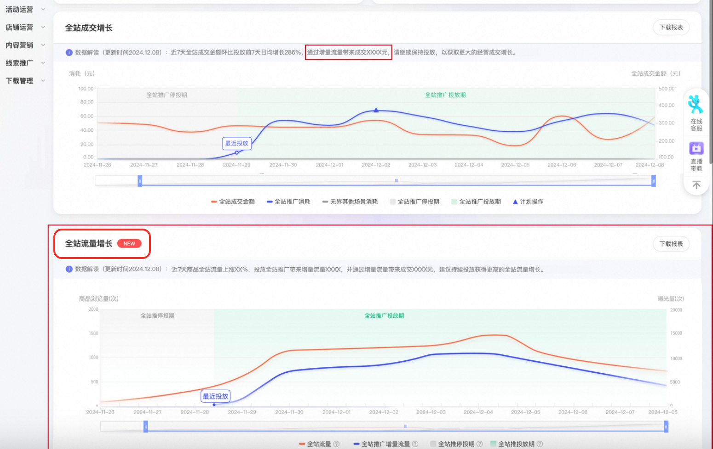

# 「重磅升级」货品全站推广「全站增长」结案

> 来源：https://alidocs.dingtalk.com/i/nodes/Gl6Pm2Db8DMGQKRatEw9NP1AWxLq0Ee4

## 一、功能升级点

货品全站推广报表结案部分新增**「全站增长」模块**，呈现店铺宝贝投放货品全站推广前后数据情况，生意增长更清晰！平台算法根据淘系整体生意情况及同行商品表现，智能诊断当前投放货品全站推广数据效果，**建议商家参考优化建议及时调整，****提高商品在淘系竞争力，提升全站拿量效果！**

**适合谁看？**
不知道货品全站推广是否带来生意增量，投放全站生意下滑找不到原因，负向操作可能影响计划竞争力

**该怎么看？**
全站增长提供的是商品在店铺淘系维度成交额（包含通过货品全站推广计划带来的成交及私域等其他入口的成交），可以对比商品投放货品全站推广前后（投放期vs停投期）全站成交金额及消耗的变化，来判断投放货品全站推广是否带动商品全站成交提升

**看后怎么做？**
若数据解读（详见下文说明）提示货品全站推广投放数据正常，建议继续保持投放，观测后续效果；若数据解读提示需调整优化，说明投放存在优化空间，建议参考系统建议进行调整，提升宝贝竞争力

## **二、投放优化调整**

商家可以根据系统提供的数据解读判断当前宝贝在货品全站推广投放是否存在问题，并参考优化建议及时调整，提高商品竞争力，提升全站拿量效果。

注：系统将结合数据的稳定性进行效果判断，因此投放货品全站推广的宝贝必须同时满足以下条件，可以触发数据解读，否则将显示「当前宝贝暂不满足数据解读判定条件，原因是不在投放稳定期或消耗、成交笔数较少，请继续保持投放积累数据。」

​

**数据解读判定条件：**

1、当您的货品全站推广计划处于投放第1天～第7天时，需要满足如下判定条件才可以触发数据解读：

| **持续投放** 从开始投放起保持 每天持续投放 | **计划状态** 当前状态需要处在 「稳定投放期」 | **计划消耗** 从最新开始投放至今 累计消耗≥200 | **宝贝成交** 从最新开始投放至今 累计成交笔数≥3 |
| --- | --- | --- | --- |

2、当您的货品全站推广计划连续投放大于7天时，查看数据当天需要满足如下判定条件才可以触发数据解读：

| **计划状态** 该计划当日状态处在 「稳定投放期」 | **计划消耗** 当日该计划 消耗≥100 | **宝贝成交** 该计划投放宝贝 当日成交笔数≥3 |
| --- | --- | --- |

| **投放状态** | **数据解读展示** |
| --- | --- |
| 当宝贝的数据解读展示右侧文案，说明目前货品全站推广投放数据正常，**建议继续保持投放，观测后续效果** | 近x天/当日全站成交金额环比(投放)前7天日均增长XX%，请继续保持投放，以获取更大的经营成交增长 |
|  | 近x天/当日全站成交金额日均可达XXX，请继续保持投放，您也可以适当下调目标出价以获取更大的经营成交增长 |
|  | 近x天/当日全站成交金额环比(投放)前7天日均下降，系统评估属于正常波动范围，建议投放继续观察 |
| 当宝贝的数据解读展示右侧文案，说明投放存在优化空间，建议参考系统建议进行调整，**提升宝贝竞争力** | 近x天/当日全站成交金额环比(投放)前7天日均下降，系统评估跌幅主因为**同类宝贝竞争力增强**，建议优化投放宝贝 |
|  | 近x天/当日全站成交金额环比(投放)前7天日均下降，系统评估跌幅主因是**私域成交下跌**，建议继续观察并注意私域流量承接 |
|  | 近x天/当日全站成交金额环比(投放)前7天日均下降，系统评估跌幅主因是**时令、节促等影响**，建议适当降低出价获取更多流量或继续保持投放并关注变化 |
|  | 近x天/当日全站成交金额环比(投放)前7天日均下降，系统评估跌幅主因是时令、节促等影响，同时存在投放负向操作（原因：xxx）建议适当降低出价获取更多流量或继续保持投放并关注变化 **近期计划存在暂停导致投放中断** **日预算撞线导致投放中断** **修改出价，影响投放稳定性** **目标投产比设置过高** |
|  |  |
|  |  |
|  |  |

**新增（内测中）****new**

**新增【全站流量增长】，原全站增长调整为【全站成交增长】**投放货品全站推广可以带动增量流量，带来全站流量和全站成交的上涨。全站流量与生意参谋商品浏览量口径相同，货品全站推广增量流量的含义为，投放货品全站推广付带来的增量点击

## **三、操作流程指南**

| 操作问题 | 产品图示 |
| --- | --- |
| **1、这个功能位于哪里？** 全站增长功能模块位于「万相台无界」-「报表」-「货品全站推广结案」页面 |  |
| **2、如何更换查看宝贝？** 点击全站增长板块右上角按钮，即可切换宝贝进行查看，也可以通过商品ID进行搜索 |  |
| **3、如何选择数据查看时间？** 点击日期下方滑块两侧，左右移动即可选择希望查看的日期 |  |
| **4、如何下载数据？** 右侧下载报表支持数据下载 |  |

Q：全站成交增长商品的全站成交额，和计划的总成交金额对不上？
A：全站成交增长的商品全站成交额是对应时间内的该商品在店铺淘系维度成交额（包含通过货品全站推广计划带来的成交及私域等其他入口的成交）；
全站推广计划的总成交额是计划在货品全站推广渠道内的投放，在15日效果归因口径下，直接的商品成交+店铺内的间接成交
两个指标的口径不一样
