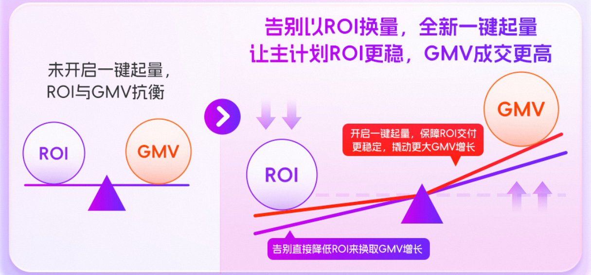
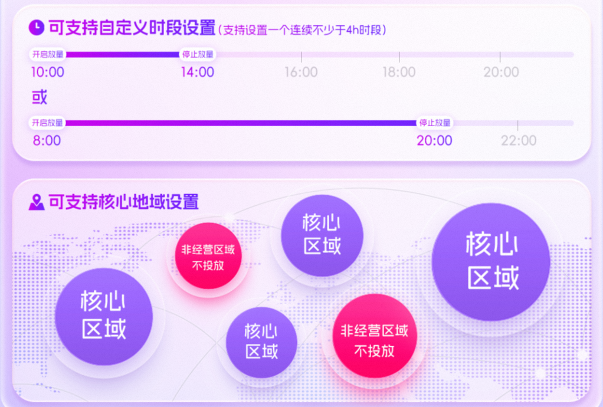
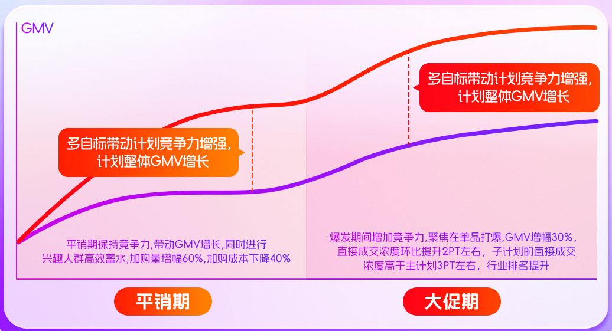

# 🔥「投放调优」双11大促操作建议&场景

> 来源：https://alidocs.dingtalk.com/i/nodes/KGZLxjv9VGkoG9YwH4jKE49kV6EDybno

# 「货品全站推广-投放调优」双11大促操作建议&场景分享

## 一、大促必看操作建议

| **大促投放** **（运营动作）** | **平台建议** | **为什么** |
| --- | --- | --- |
| **如何选品** | 1、**节促必投商品：** 投放全站推高预算商品 （预算 top10 必投） 2、** 建议商品：**遇到增量困难的商品均可投放； | 1、 **必投：**高预算商品承担更多的GMV目标，开启多目标可以有效的带动核心计划的竞争力，抓住大促的成交爆发； 2、**建议投：**增量遇到困难的商品，短期难以增加产品基础分，建议开启多目标/起量增加竞价能力，短期内提升 GMV，突破瓶颈期； |
| **如何设置预算** | 主体逻辑为，少量多次的增加预算，从10%的基础预算逐步增加至 30%预算；**核心现货期及爆发日当天，必投** | 突然设置较高的投放调优预算，会导致对于预算使用率低的计划造成较大的ROI交付波动，**少量多次的预算增加**，可以更有效的探索增量空间 |
| **如何监控效果** | 1、 **在哪里看效果：**在投放调优板专属效果板块监控投放效果； 2、 **如何判断效果：**关注计划整体的GMV变化及计划整体的消耗变化，大促适当降低对ROI/PPC 的波动关注，抓住GMV增长 | 投放调优是助力商家在产品分无明显波动的情况下（质量分及价格均无变动规划），广告侧竞争力可以通过**投放调优增加，带动主计划增长**，同时交付个性化指标（加购/直接成交/起量） |
| **小 tip** | 爆发日当天建议把**「投放调优」的预算设置在基础预算的 30%**； | 大促期间流量激增，同时竞争激烈，**避免下午临时增加预算，系统调控时间较短导致放量困难** |
|  | 不要**频繁切换「投放调优」优化方向** | 切换会让系统进行调整，错过大促爆发流量增幅 |

## 二、大促各场景操作分享

# 基础预算放量困难

**Q：想要高 ROI，又想要 GMV 增长，降低 ROI 后放量还是困难，怎么办？**

开启一键起量，主计划预算与起量预算为相互独立的预算；主计划部分预算可以**追求 ROI 稳定交付**，单独起量部分预算可以进行**成交的增量探索**，同时子计划可以增加计划整体的权重增加计划整体的成交阈值，真正做到 ROI 稳定交付的同时，探索成交增量；

**A：操作指南如下**

**预算设置：**开启一键起量，设置预算为昨日消耗的 10%，期间监控效果逐步增加预算至 30%-50%；

**监控效果：**关注计划整体的 GMV 的增长，开启后会导致 ROI 波动，因为持续在探索产品成交边际，预算越高导致 ROI 波动越大，建议商家从低预算逐步尝试，直至自己可以接受的盈亏平衡；

**历史效果：**开启一键起量后 GMV 整体增幅在 30%，当日即可看到效果，ROI 波动因产品而异，建议实时关注 GMV 增长情况及 ROI 波动情况，少量多次的增加预算；

# 经营地域个性化设置

**Q：货品全站推广太智能，太黑盒，希望按照自己的个性化运营进行提效，如何操作？**

**A：**本质商家朋友第一追求是为了 ROI 的高交付，第二追求是为了 GMV 的增长；

商家朋友认为晚上的流量是无效流量，这个观念正确吗？是不正确的，全站推会用合适的价格拿到合适的流量，每一个流量都有对应的成交值，没有差流量，只有用合适的价格拿到合适的流量；

部分商家朋友有确定的经营范围，投放非经营区域，属于无效投放；

一键起量支持商家设置**放量时段/支持地域设置**，商家朋友希望投放 10 点、1 点、6 点时段，可以设置 9-10 点，覆盖你心里的核心时段；屏蔽非发货地域，避免无效点击扣费；

# 新品快速度过冷启动

**Q：新品无成交基础，放不出去量，ROI 又不高，GMV 又不高，怎么办？**

新品初期对于 ROI 的预期相对较为宽容，本周期的核心目标是快速积累销量数据，达到潜力品/爆品周期；

**A：操作指南如下**

**开启最大化拿量出价方式：“**进行最大化成交探索，快速积累销量数据，最大化拿量相对不可控，建议商家逐步增加预算，达到自己心里的盈亏平衡点；

**如果觉得最大化拿量风险较大，怎么办？**

**开启一键起量：**一键起量主计划预算与起量预算为相互独立的预算；主计划部分预算可以**追求 ROI 稳定交付**，单独起量部分预算可以进行**成交的增量探索**，同时子计划可以增加计划整体的权重增加计划整体的成交阈值，真正做到 ROI 稳定交付的同时，探索成交增量，天然适配新品期；

**开启多目标出价：**在基础预算下可以设置「加购」、「直接成交」 的多维目标，可以在保障基础预算 roi 交付下进行多维增量探索，开启多目标增强计划整体竞价能力，**让计划效果 "1+1>2"，解决商家因为竞争力不足而无法放量的问题**，增加 gmv 同时进行增量指标的交付，满足多种场景的运营需求

# 增量放量能力，平销期间高效蓄水，大促期单品打爆

| **增强放量能力，预热期进行加购蓄水** **Q：****平销期希望不降低 ROI，追求更高的 GMV，同时还可以高效的进行兴趣人群的获取，如何操作？** **A：****操作指南如下** 开启加购，设置加购预算，基础预算设置为昨日消耗的 10%，根据目标和效果逐步增加至 30%； 关注计划整体的 GMV 增长，加购量变化； | **增强放量能力，爆发期聚焦单品打爆** **Q：****大促期间希望要更高的成交，同时希望打爆品，快速让商品行业排名提升，如何操作？** **A：****操作指南如下** 开启直接成交，设置加购预算，基础预算设置为昨日消耗的 10%，根据目标和效果逐步增加至 30%； 关注计划整体的 GMV 增长，直接成交变化； |
| --- | --- |

# <具体介绍请钉钉扫码查看>

| **"一键起量"详情看这里↓** | **"多目标出价"详情看这里↓** | **"最大化拿量"详情看这里↓** | **货品全站推广答疑来这里↓** |
| --- | --- | --- | --- |
