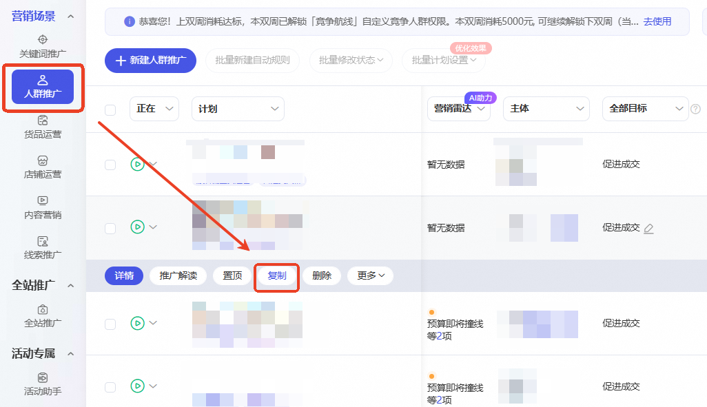
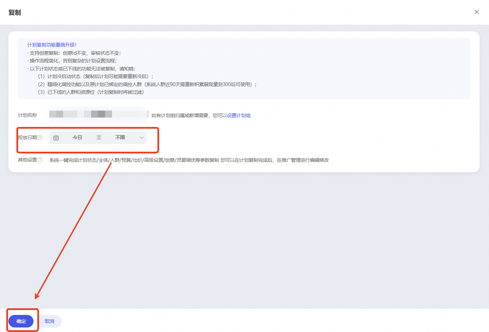

# 🎉复制计划功能全新上线

> 来源：https://alidocs.dingtalk.com/i/nodes/KGZLxjv9VGkoG9YwH9R1G0NrV6EDybno

**原语雀文档链接：**https://yuque.antfin.com/chenchun.chen/gqhty9/umn7o8aglut5vf8d

---

### 一、产品背景

*各位商家朋友在复制计划时是否遇到过这个问题，*

*“人群场景复制计划创意无法同步，和新建计划有什么区别？”*

---

❗❗❗人群场景复制计划功能全新上线❗❗❗

**⚠升级前**复制计划时不支持复制创意、复制计划设置流程较为复杂

**🔥升级后****复制计划支持创意一同复制**，告别手动添加，创意id不变、审核状态不变**操作流程更简化**，仅需两步，即可完成复制计划

**更多问题欢迎进群咨询： 113920003138**

### 二、产品入口

营销场景下选择【人群推广】，选择想复制的计划，点击【复制】按钮，设置投放时间后，点击完成，即可完成计划复制

### 三、常见问题

**1、复制的新计划冷启动状态是怎样的？**

复制后计划可能需要重新冷启

**2、复制计划后，精细化调控功能以及原计划已绑定的调控人群有什么变化？**

系统人群近90天需重新积累展现量到300后可使用

**3、计划中已下线的人群和资源位还会被复制吗？**

已下线的人群和资源位在计划复制时将被过滤
