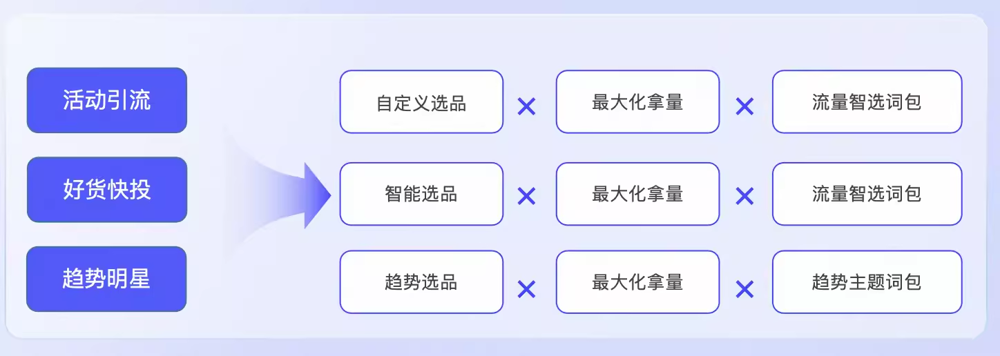
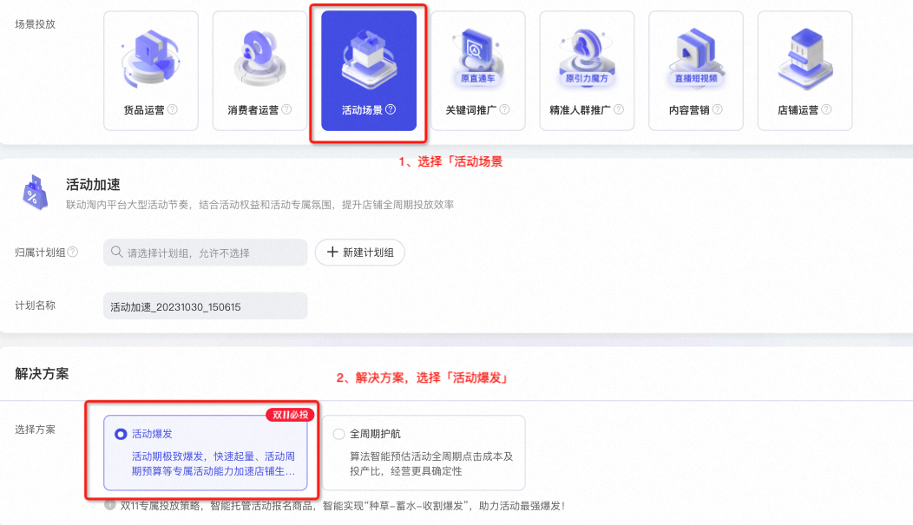
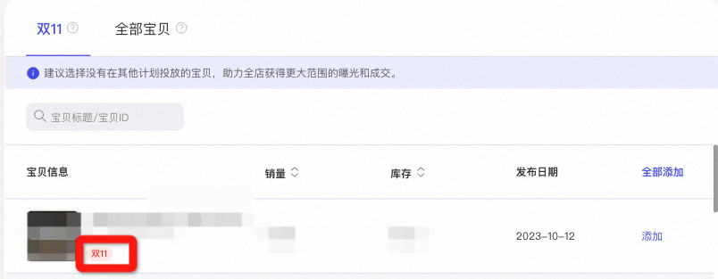
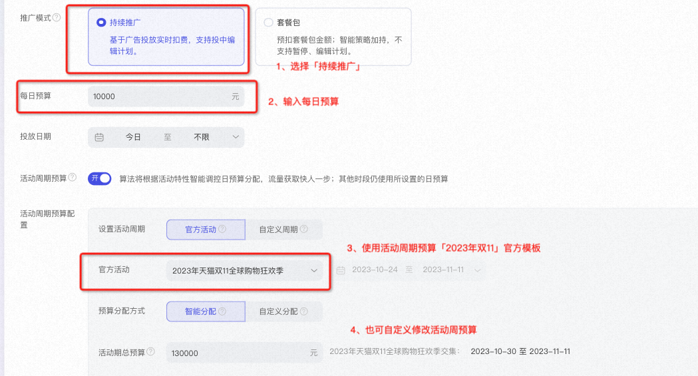
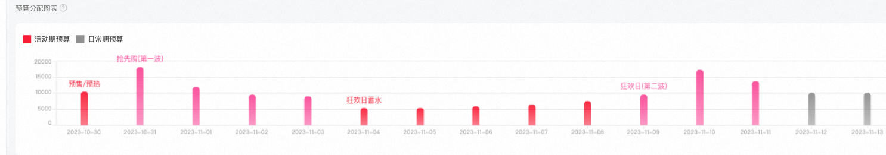
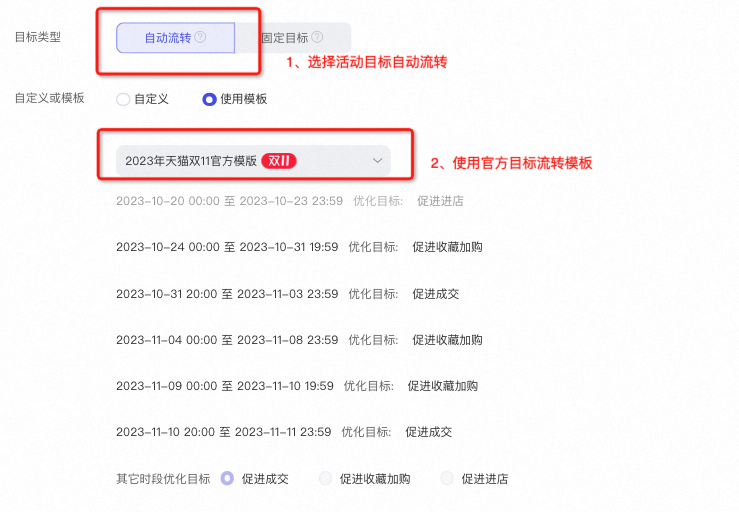
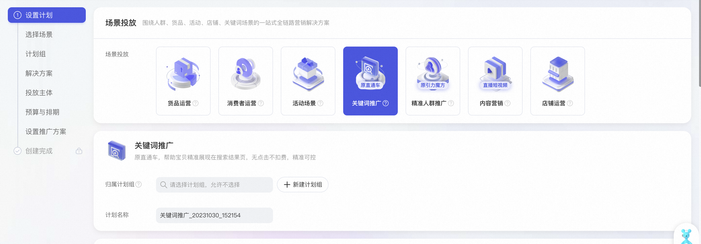
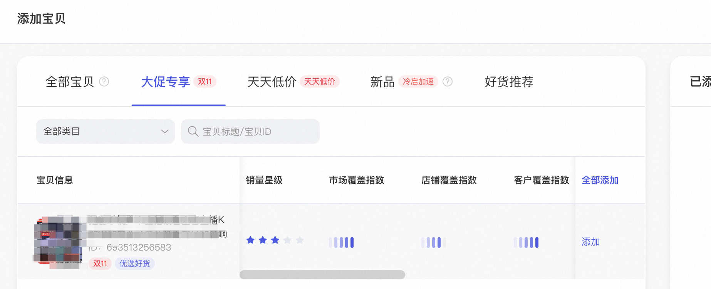
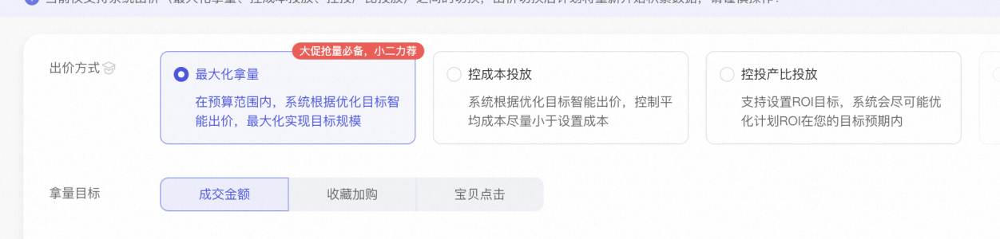
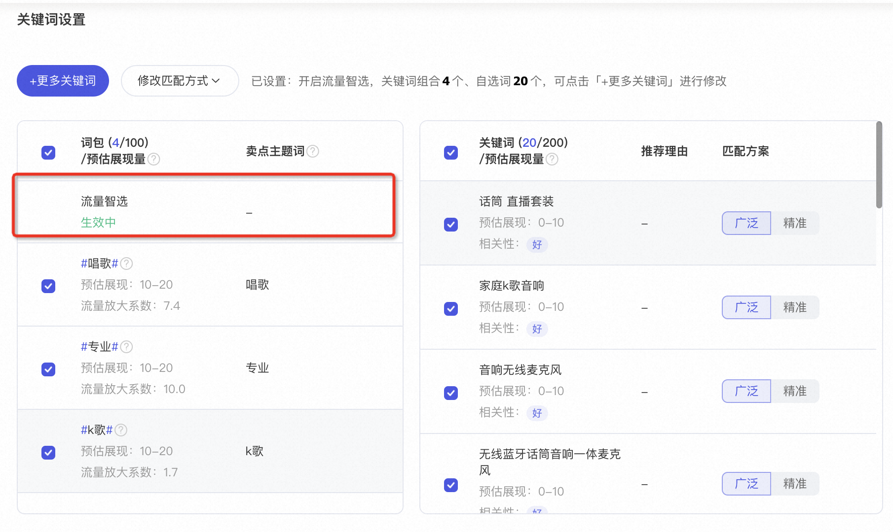

# 原「直通车-活动引流」计划双11投放建议

> 来源：https://alidocs.dingtalk.com/i/nodes/KGZLxjv9VGkoG9YwH9R1G953V6EDybno

**原语雀文档链接：**https://yuque.antfin.com/chenchun.chen/gqhty9/lzalmldggzsmvhfv

---

# 一、背景

小二听到不少商家在怀念直通车“活动引流”计划，其实，在无界也是可以建“活动引流”计划的！只是需要一点小窍门。

# 二、投放建议

## 2.1、选择「活动运营」新建活动爆发计划

### 2.2.1、投放链接：https://one.alimama.com/index.html#!/main/index?bizCode=onebpAdStrategyYuRe

### 2.2.2、投放sop

#### 2.2.2.1：选择「活动爆发计划」

#### 2.2.2.2：选择「活动爆发计划」--建议优先选择双11报名打标商品

#### 2.2.2.3：选择「活动周期预算」--建议使用大促官方模板

#### 2.2.2.3：选择「目标自动流转」--建议使用大促官方模板

# 2.2、选择「关键词推广」

### 2.2.1、投放链接：https://one.alimama.com/index.html#!/main/index?bizCode=onebpSearch

### 2.2.2、投放sop

#### 选择关键词推广

#### 选择带大促标宝贝

#### 选择最大化拿量出价

#### 开启流量智选词包

完成计划创建即可

三、激励
