# 🎁「本店核心人群」重磅升级

> 来源：https://alidocs.dingtalk.com/i/nodes/KGZLxjv9VGkoG9YwH9R1yA7XV6EDybno

## **‼️**** 「本店核心人群」现已全量开放 ****‼️**

🤕 淘系大促节奏调整，周期短频次高，迫切需要**“短平快”高转化？**

速来推广**「本店核心人群」**！

人群推广**「店铺/宝贝人群」**重磅升级！**细拆消费行为，分层精准触达！**

**该能力现已全量开放，答疑请加钉群：****94570008612**

---

## 一、优秀案例

| **「本店核心人群」**新增 **频繁搜索、即将成交、摇摆预流失** 三大主题人群 直击**与您店铺、宝贝最密切关系**的消费者群体，**超高转化，轻松拿下**！ 已有众多品牌借力本店核心人群，在双11第一波爆发期打出亮眼战绩： |  |  |
| --- | --- | --- |
| **她研社*频繁搜索宝贝人群** | **skii *预流失摇摆人群** | **tineco添可*即将成交人群** |
| **🤓 ****花点时间，深入学习一下课程吧～** |  |  |

## 二、人群逻辑

**店铺人群：**按消费者进店的互动程度进行分层；新增**频繁搜索人群****、****即将成交人群****、****预流失摇摆人群****，**细分更详细消费行为，匹配不同程度的消费意图；您可参照**「推荐理由」**结合不同商品的推广诉求进行人群抉择～

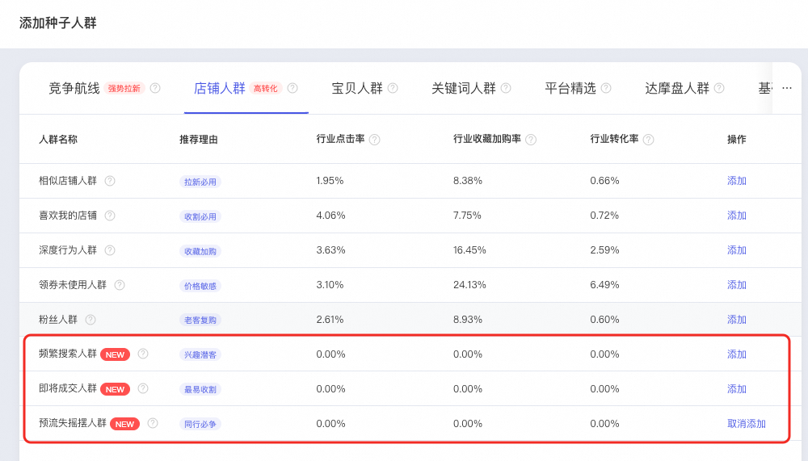

| 🔍 *全部***「店铺人群」***逻辑解读～* |  |  |
| --- | --- | --- |
|  |  |  |
| **人群名称** | **应用场景** | **人群逻辑** |
| 相似店铺人群 | **拉新必用** | 近期对本店所在主营类目（含相似店铺）的多店铺均有进店、搜索、收加等对此类目十分感兴趣的潜在人群 |
| 喜欢我的店铺 | **收割必用** | 近期及实时对本店铺有进店、搜索、收藏加购、订阅店铺、浏览内容、购买等行为的人群，或与上述人群有相似特征的人群 |
| 深度行为人群 | **收藏加购** | 近期及实时对本店宝贝有收藏、加购等深度行为的人群 |
| 领券未使用人群 | **价格敏感** | 已领取本店铺优惠券（未过期）且未使用的人群（包含店铺优惠券、商品优惠券、包邮券） |
| 粉丝人群 | **老客复购** | 圈选淘内全域粉丝人群（包括店铺粉丝、主播粉丝、达人粉丝） |
| 即将成交人群**NEW** | **最易收割** | 已经对收藏或加购本店宝贝，同时近期对其他同款或相似商品有互动，正在最终比价的人群 |
| 频繁搜索人群**NEW** | **兴趣潜客** | 多次搜索本类目商品，将本店或本店宝贝搜索出并来进行点击、进店等互动行为的人群 |
| 预流失摇摆人群**NEW** | **同行必争** | 曾与本店有高频互动但近期对竞争及相似店铺开始有互动的人群 |

**宝贝人群：**按消费者与宝贝的互动程度进行分层；新增**频繁搜索我的宝贝***人群***、****收藏加购我的宝贝***人群。可选择宝贝数量也大幅提升，支持选择***20个***宝贝*～更新增**“人群规模指数”**与**“消费者购买热度”**指标以供参考～

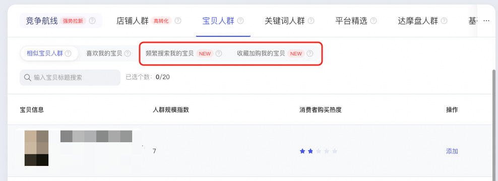

| 🔍 *全部***「宝贝人群」***逻辑解读～* |  |
| --- | --- |
|  |  |
| **人群名称** | **人群逻辑** |
| 喜欢相似宝贝 | 近期及实时对与指定宝贝具有竞争关系且风格、功能、单价等相似的宝贝有过互动行为的人群 |
| 喜欢我的宝贝 | 近期及实时对指定宝贝发生过点击、浏览、搜索、收藏加购等互动行为的人群 |
| **频繁搜索我的宝贝****NEW** | **多次搜索本类目商品，将指定宝贝搜索出并来进行点击、浏览等互动行为的人群** |
| **收藏加购我的宝贝****NEW** | **近期及实时对指定宝贝有过收藏、加购等深度行为的人群** |

## 三、投放指引

### 1-新建计划

⚠️：若您已适应新版场景推广方式，推荐您直接跳转至STEP 3，查看新增人群解读。

​

**STEP 1：优化目标&推广主体**

您可选择**店铺人群运营**下的原方舟优化目标（除去会员、粉丝以外均可）or **自定义推广**下的任意优化目标——设置要推广的宝贝；

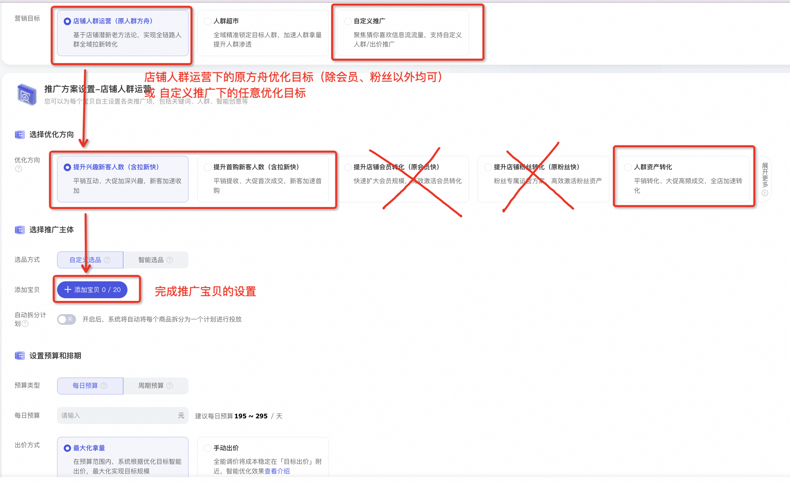

**STEP 2：出价设置**

完成计划预算的设置及出价方式的选择，需注意若您此处选择**手动出价**，后续需对**各人群完成单独出价**；

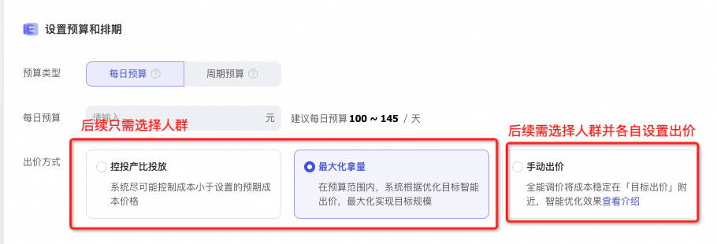

**​**

**STEP 3：人群设置**

**​**人群设置——**自定义人群**——**种子人群；**您可于推荐列表看到算法优选的高转化人群（匹配优化目标、推广宝贝），亦可进入种子人群侧滑窗，手动新增更多符合诉求的店铺人群、宝贝人群；

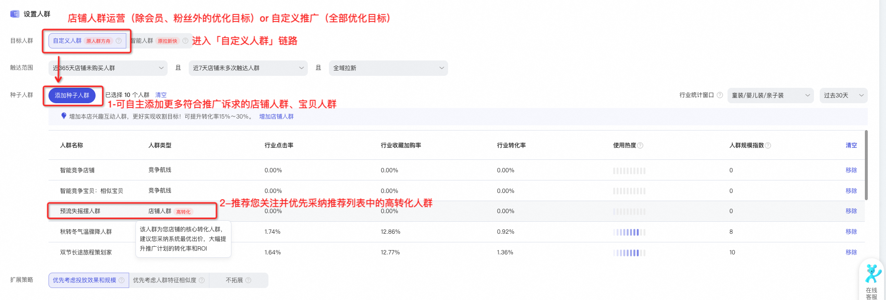

种子人群侧滑窗，您可看到店铺人群和宝贝人群的**新增细分人群**，及**其他升级细节**：

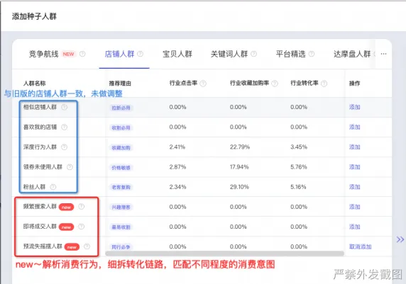

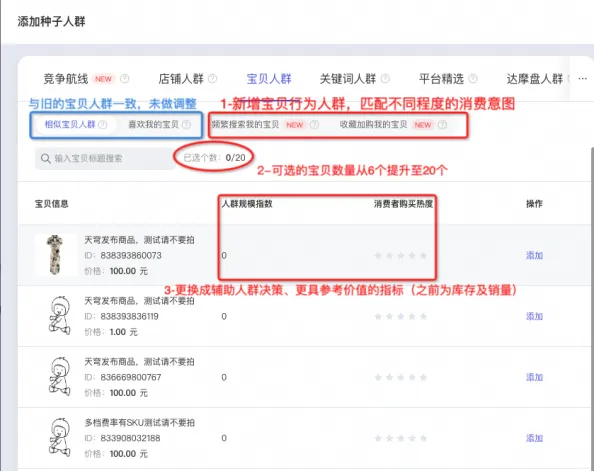

**快速添加「店铺人群」入口：**为优化计划转化效果，小二建议您每条计划配置**2个以上的本店核心人群**，优化计划的**转化率**与**ROI**；*当计划的本店核心人群过少时，会提示您可增设店铺人群，可通过快速添加入口：***增加店铺人群*** **跳转至店铺人群页。*

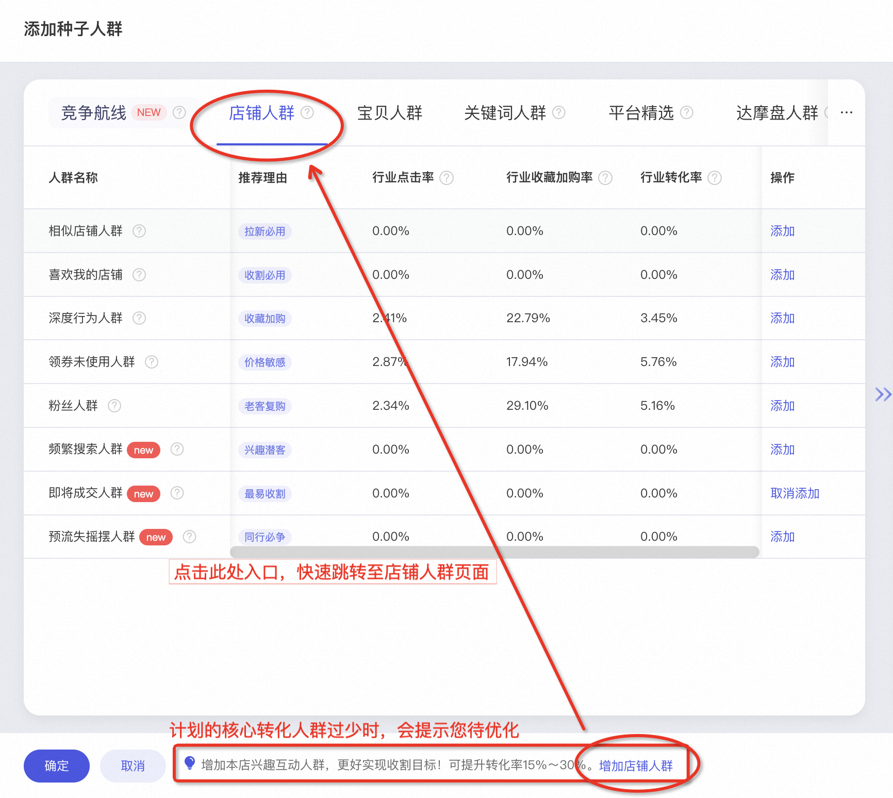

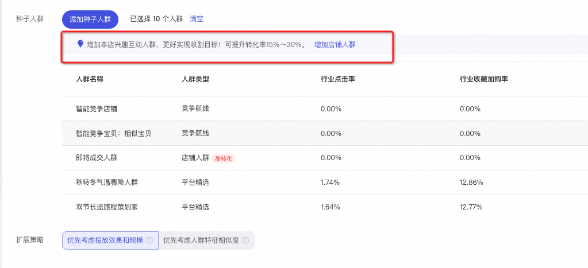

---

### 2-计划管理与添加人群

**批量添加「本店核心人群」**

**操作步骤1：**推广管理页——人群推广——**营销雷达**，找到本店核心人群入口。

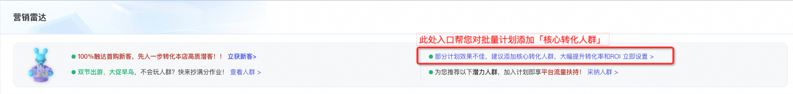

**操作步骤2：**进入**新增人群页面**，默认选中全部8个店铺人群，您也可自行更换；完成人群设置后进入【批量计划选择】与【出价设置】。

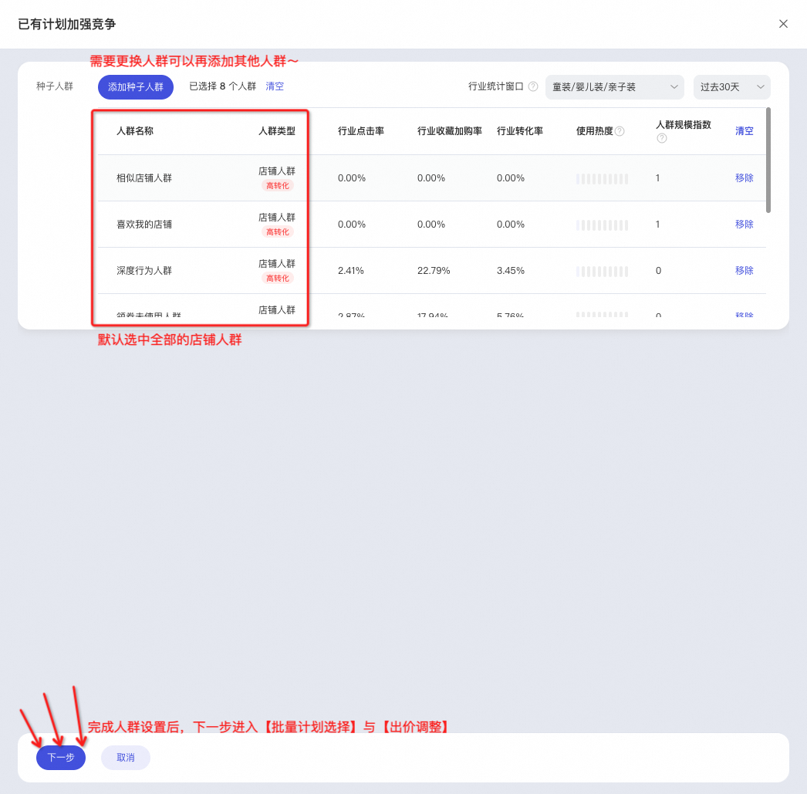

**单个添加「本店核心人群」**

**操作步骤1：**推广管理页——人群推广——计划详情页，找到需要添加人群的计划，点击 详情 ；

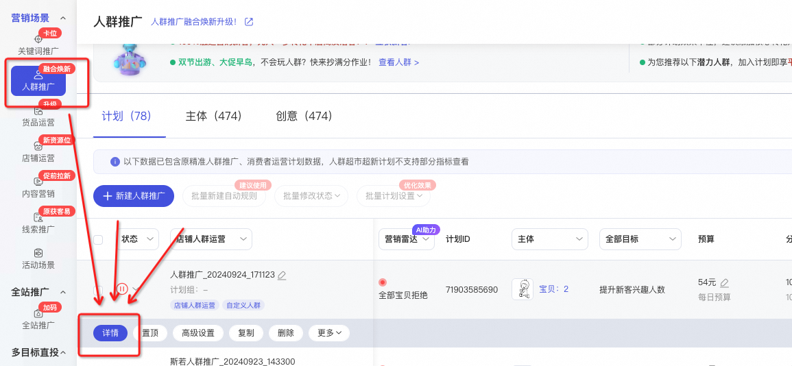

**操作步骤2：**进入计划管理侧滑窗，点进 **定向数据** 页面，选择 新增定向 。

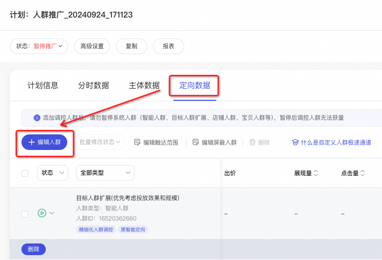

**操作步骤3：**进入种子人群侧滑窗，可通过本店核心人群**快速添加入口**：**增加店铺人群**，对该计划增加店铺人群与宝贝人群。

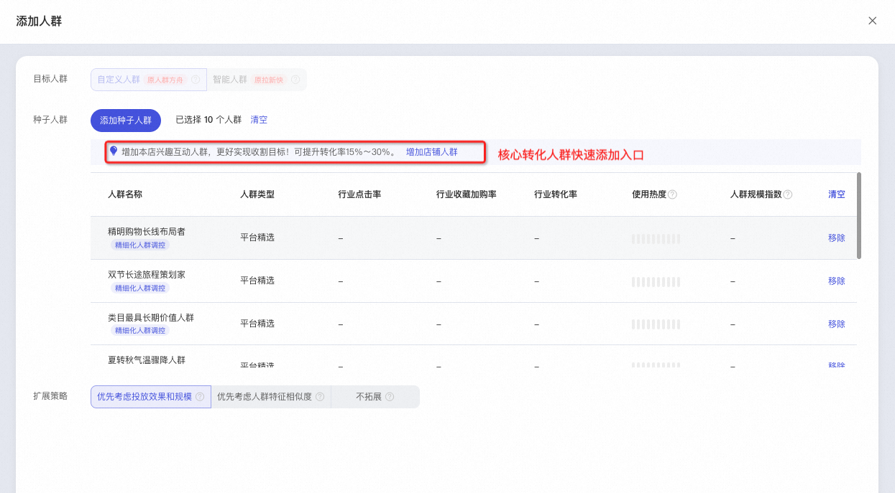
