# 【线索推广】商家常见问题

> 来源：https://alidocs.dingtalk.com/i/nodes/KGZLxjv9VGkoG9YwH9bxBZxKV6EDybno

产品整体介绍：

投放操作请看：

新客调优指南：新手玩法指南

线索推广是专门为家装、大家电、文教、汽车、企业服务、数字生活等行业商家提供的【全域流量触达—引导咨询私信开口—获取留资/电话号码】一站式全链路解决方案，帮助获取潜在高价值C端客户/大宗采购人群，提升用户开口率与主动发起电联的转化效率，帮助获取更多的生意增量。

>>线索推广产品入口<<

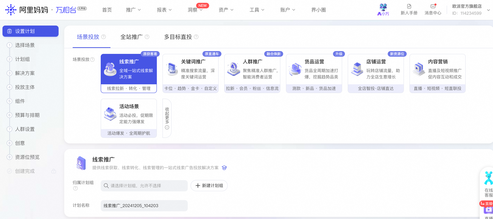

# **一、基础问题**

### **怎么开通线索推广场景权限？**

报名问卷**小二将在周一、三、五下午4-5点统一帮您开通，只要您有获取咨询/客资的诉求，均可以提报。**** **《线索推广场景报名问卷》

查看是否开通：

### **为什么名单里已开通但是没有入口？**

首次需主账号登录。https://one.alimama.com/index.html#!/main/index?bizCode=onebpAdStrategyLiuZi

注：千牛打开看不到入口，需浏览器打开独立网址，再登陆主账号

### **旺旺留资卡片怎么开通？**

已开通线索推广新建「旺咨计划」计划产生消耗>0，且没有新零售工作台的权限

次日12：00之后到妈妈客户工作台【线索管理】-【设置】－【留资渠道】页面。在旺旺留资卡片下

点击【确认开通】即可完成开通。https://business.alimama.com/#/login

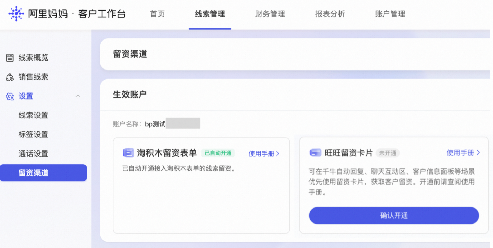

旺咨卡片具体介绍：

### **旺旺留资卡片怎么开通后又消失了？**

系统将根据商家近180天在线索推广中的投放消耗情况，智能判断并自动回收旺咨卡片的使用权限。若商家连续180天未在线索推广产生消耗，卡片权限将暂时回收，待后续重新投放后可再次激活使用。

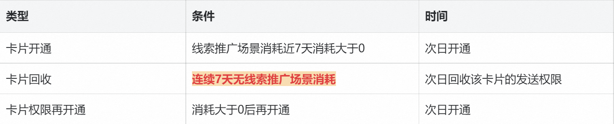

**权限回收之后，又满足开通条件了，还需要去后台点击开通按钮吗？**

需要

### **线索推广的资源位有哪些？**

覆盖搜索+推荐+互动城+短视频+点淘等淘系核心流量，一站式智能触达，解决搜索拿量天花板问题，搜索大概占60%，剩余20%-30%在推荐，少量外投流量，算法智能调配。

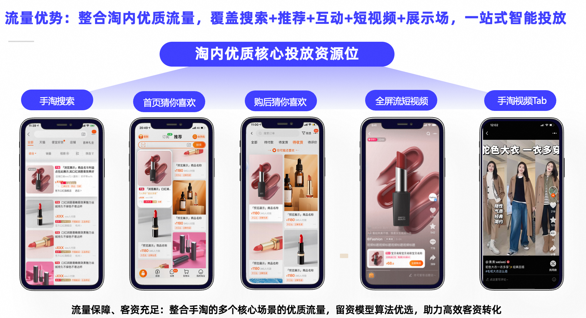

### **线索推广的留资形式有哪些？**

支持旺旺咨询、商品下单、表单引导3种留资形态，利用多样化留资组件，可有效降低咨询/客资成本

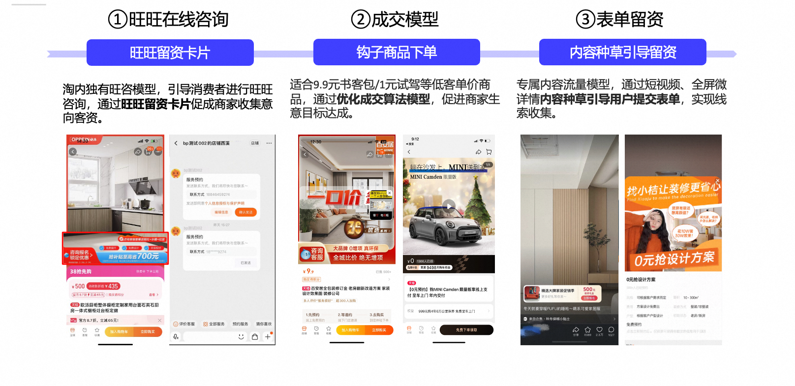

### **线索推广跟直通车/精准人群推广相比的区别是什么？**

（1）重点交付指标不一样

直通车、人群推广、全站推主要交付线上B2C成交商品的GMV、ROI，线索推广主要交付指标为咨询成本、线索成本。

（2）算法模型不一样

直通车、人群推广算法打分公式参考GMV、成交转化率，线索推广会将旺旺咨询率、留资率计入到算法打分公式中，帮助线上GMV偏低的商品，但咨询率/留资率更高的商品，获得更多商品排序加权。

### **8.为什么我线索我无法查询明文线索？**

为更好地保障您的账号安全，防范潜在的信息风险，阿里妈妈客户工作台将针对部分高风险类目，逐步加强账号权限的管理与保护措施。

针对**以下类目的C店商家**，我们将进行权限优化调整：

若您属于以下类目，C店，此前已通过线索推广获得过客户线索（即有留资记录）：
您将保留隐私号外呼权限，可继续通过平台安全外呼功能联系消费者；但线索的明文信息查看权限将进行回收，以进一步降低数据暴露风险。

若您属于以下类目，C店，此前未通过线索推广获取过客户线索（无留资记录）：
为保障新商家的合规使用， 外呼及明文查看权限均不开放。

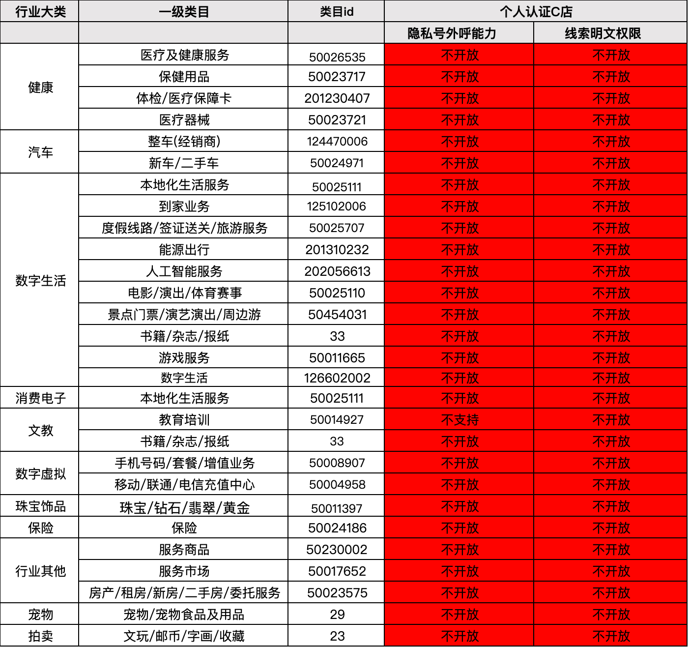

其中游戏服务、数字生活、教育培训、宠物活体是所有C店不可用，其余类目商家，则可正常进行隐私号外呼、明文查看，若您的店铺没有明文查看权限，请填写问卷进行开通。线索推广报名问卷 （每周一、三、五下午开通权限。）

# **二、产品功能类**

## **【旺旺留资卡片】**

旺咨卡片产品介绍：

目前淘宝网正在严格治理“诱导第三方”违规行为，后续将不允许在旺旺种引导发送微信、电话、外部链接，请各位商家自行排查。线索推广提供官方留资渠道（智能单品页、旺旺留资卡片），消费者通过这些渠道留下的手机号，全部签署过消费者信息授权协议，均为合规获取。只有使用线索推广的旺咨卡片/智能单品页，不会命中处罚，其余直接在旺旺语聊里直接要微信、电话均有违规风险！

### **1.为什么我的旺咨卡片展示的是「快捷留资」？**

快捷留资为新零售的卡片，针对新零售商家，行业要求不支持使用线索推广的留资卡片。但是如果是从广告点击进来，使用新零售卡片的数据，会同步记录到妈妈客户工作台后台的。

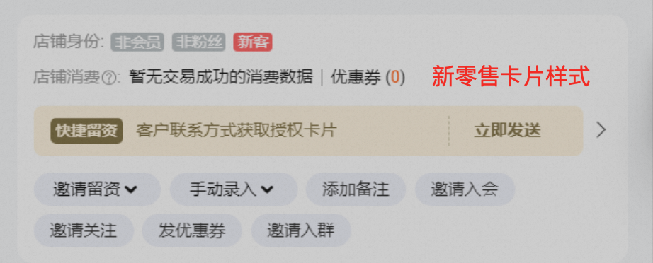

### **2.**线索推广留资卡片开通后，语聊右侧卡片为邀请留资&邀请关注？点击刷新即可

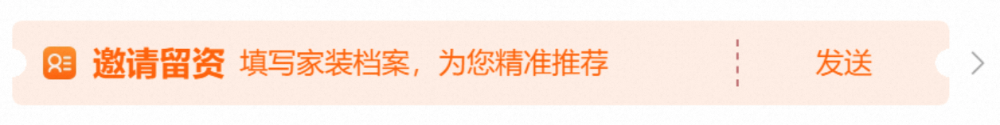

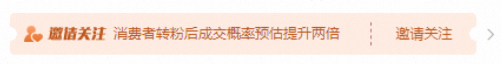

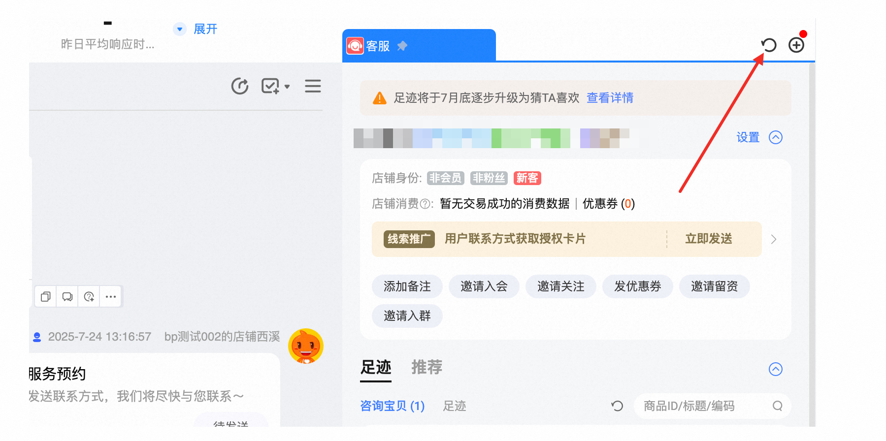

### **3.是否支持在千牛手机端发送卡片？**

目前暂不支持，目前已经在做迭代

### **4.旺旺留资卡片留资后，商家怎么查看留资？**

消费者发送完线索后，商家可以在**千牛工作台**确认留资情况，在**阿里妈妈客户工作台**使用留资线索。

**千牛工作台**

如果消费者刚刚留资，右侧面板需要刷新才能显示留资结果

**客户工作台**

### **5.消费者留资后是否有消息提示？**

目前还未做相关能力，正在规划中，建议商家打开妈妈客户工作台/在千牛聊天页面进行定向监控。

**6.不使用线索推广能否用旺咨卡片？**

不可以，旺旺留资卡片是线索推广提供的专属能力，必须在线索推广场景有消耗才可以开通使用。

## **【智能单品页】**

具体产品文档：

### **为什么在手机上看不到我的智能单品页广告？**

目前智能单品页投放场域有搜索、推荐，但是客户不一定能在前端100%看到，原因是：

1、广告流量本身占比比较少，必须从广告坑位点进去

2、如果商家同时有关键词、人群、线索推广好多计划同时在投，不确定是哪个计划竞得了这个流量坑位展现给了消费者

3、如果商家在同一个计划里，同时设置了智能单品页和商详页，算法会基于预估转化率优选逻辑进行落地页的透出。

### **线索推广计划如何添加智能单品页，为什么在淘积木搭建好了同步不到后台？**

只能用线索推广-「智能留资页」这个模板创建的才可以同步到线索推广后台，其他模板暂不支持。

这里面没有线索推广专属的智能单品页，所以绑定不上：

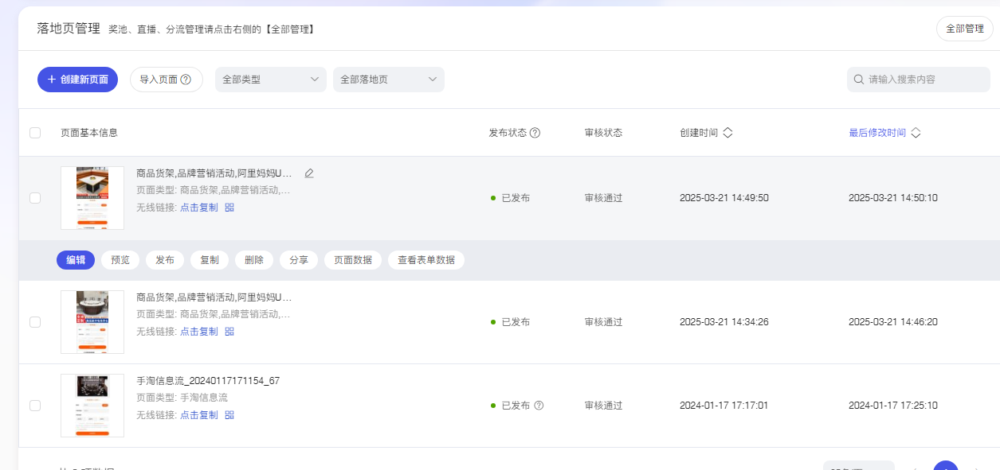

### **智能单品页和商品详情页应该投哪个？**

商家可采用下列方案进行测试，验证**智能单品页**和**商品详情页**哪个投放效果更好。

**方案一：**创建两个计划，一个只有商详页，一个只有智能单品页，测试7天，将投放效果较差的计划关停，同时加大另一计划的预算。

**方案二：**创建一个计划，同时包含商详页和智能单品页，测试7天，将投放效果差的落地页类型关停。

### **目前什么优化目标支持投放智能单品页？**

线索推广 仅「优化下单获客」不支持淘积木智能单品页，其他优化目标都支持淘积木智能单品页，并且**目前线索推广是无界唯一一个可以在搜索、推荐场域投放自定义落地页的投放场景。**

### **我只想要旺咨、表单来的线索，不想要下单来的线索，怎么办？**

如果只想要表单、旺旺留资，落地页形式可以全部都用智能单品页

### **为什么我的单品页都没有曝光呢，主要还是详情页曝光？**

由于智能单品页是一个新页面，冷启时间较长。若还是出现抢量问题，可以先尝试将计划中的商详页暂停。

## **【妈妈客户工作台】**

### **如何查看客户留资？**

线索报表直达：https://business.alimama.com/#/report/pages/adLeadDetail

妈妈客户工作台「报表分析」【投放线索明细】报表，明确展示由线索推广广告投放所带来的线索明细。

**注意：该报表仅展现【线索推广】场景带来的线索数据（不包括自然流量和其他场景）**

线索量数据包含旺旺语聊、旺旺留资卡片、淘积木表单、商品订单四个渠道的线索明细（分开展示留资卡片留资、旺旺语聊留资两种形式的旺旺内留资行为）。

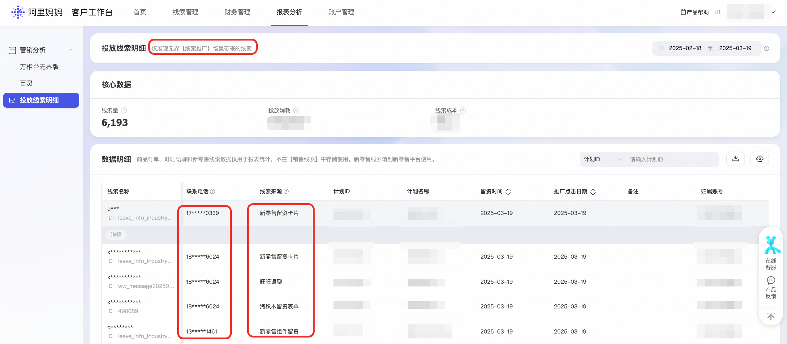

### **为什么我的线索是暗文？**

目前，旺旺语聊留资是消费者直接发送手机号到聊天页面，客服可以看到，所以也相当于是明文。

旺咨卡片留资、淘积木表单留资，这两个消费者签署过授权协议，可以去妈妈客户工作台-线索管理-销售线索-明文中查看。

其他商品订单建议去千牛后台查看，具体是否明文由行业进行管控，旺旺语聊留资，客服能直接看到手机号码，建议自行记录。

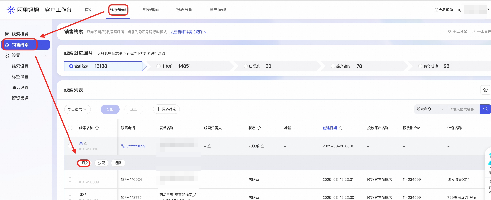

链接：https://business.alimama.com/#/lead/pages/index

### **线索量怎么定义？**

线索量=拍下订单笔量+表单提交量+旺旺留资量（旺旺留资量=留资卡片留资+旺旺语聊留资）+行业留资量（新零售定制组件、新零售留资卡片、喵店留资数据）

其中：拍下订单数包括未下单、0元订单、有价订单，成交订单数为有价商品母订单数，子订单（是赠品）没有alipay，所以不会包含在成交笔数里。

### **为什么添加员工时，显示邀请协作者必须是主账号？**

目前是主子账号同权，子账号登陆妈妈CRM目前看到的信息，跟主账号相同，如果想进行线索分配，邀请员工，需要填写员工自己的淘宝账号。

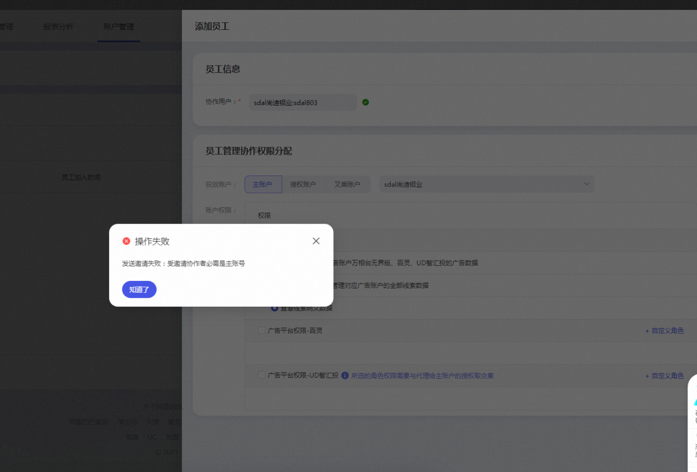

### **智能外呼功能如何使用？隐私号认证需要多少？**

应运营商要求，手机号码必须先完成实名认证和报备，才可以正常使用外呼，否则会被运营商拦截导致呼叫失败

目前通话实名认证，需要商家填写姓名、证件号码、身份证、证件照进行认证，具体审核时间不确定，由政府管控，审核状态为「审核中」「审核通过」均可使用外呼功能，只有「审核失败」不可以。

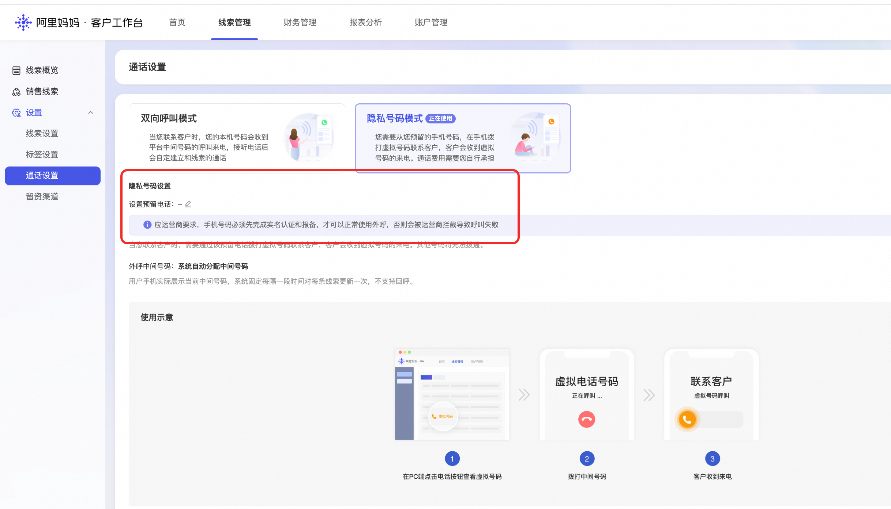

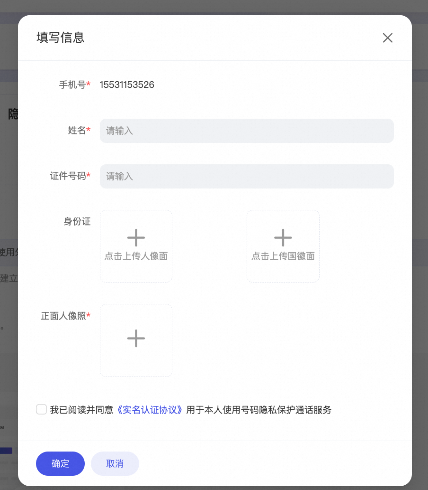

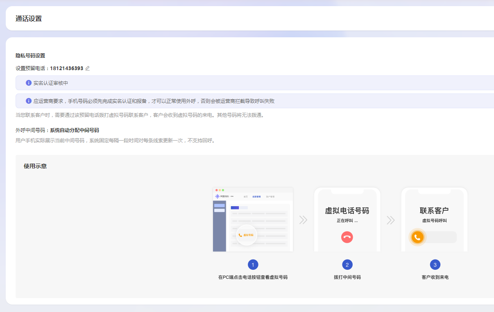

# **三、投放效果类**

### **为什么我设置的预算都花不完？**

请自行排查是否使用了控成本出价，目前整体控成本出价计划预算使用率只有50%-60%，建议您拔高出价或者提升日预算，或者直接改用最大化拿量去跑。

### **线索套餐包可以支持续投吗？**

暂时还不支持～目前还没做续投功能，可以先改用持续推广，创意/人群/预算/出价可调整的空间更大一些。

### **优化留资成本和优化旺咨成本有什么区别？**

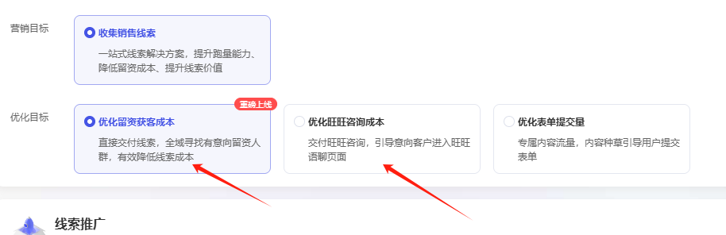

【优化留资获客成本】是重点优化线索成本的，【优化旺旺咨询成本】是重点优化旺旺咨询成本的。如果您要低的旺旺咨询成本，就投「优化旺旺咨询成本」优化目标；如果要低的线索成本，就投「优化留资获客成本」优化目标，请有效取舍哦～

### **线索推广和直通车/人群推广同时开会有影响吗？**

会有，但日预算低于2k的情况下几乎微乎其微，目前同一个坑位中，算法池里所有同类目计划一起竞价，只有遇到同一个关键词、同一个消费者、同一个坑位才会有竞争的可能性。

### **5、为什么没有灰盒互动人群了？**

灰盒人群（自动迭代人群）本质的逻辑是基于店铺/类目历史收藏、点击、加购行为的数据进行人群标签的探索，（相当于是一部分白盒人群+算法人群），所以整体数据都拆分到白盒人群、算法智能算法人群中分别展示，数据口径的变化，不影响实际投放。

### **6、算法智能人群能关闭吗？**

现在暂时不支持，因为有时候黑盒人群的转化效率可能比白盒人群还好。而且我们是智能场景，黑盒人群是我们的一个通用能力～如果觉得黑盒人群和店铺历史行为人群有偏移的话，可以用达摩盘白盒人群进行校准。还有一个原因是，如果关闭的话，白盒人群触达范围是有上限的，可能会存在放不出量的情况。算法黑盒人群会从全网帮你捕捉更多潜客的。

算法黑盒人群主要作用是全网帮你捕捉更多潜客，所以在人群探索上会更加偏激进一些，但是如果只投白盒人群会有放不出去量的风险，并且测试下来整体达摩盘人群成本比黑盒人群其实更高。白盒人群放不出去量主要一是因为商品基础权重差，在预算/出价较低的情况下，竞得不到这部分优质流量。

### **7、为什么我的计划放不出去量？**

原因之一，有可能是因为您的出价太低啦，严格控成本会导致放量受限哦，可以适当提高出价/提升预算加速放量！建议出价使用系统推荐的旺咨成本！

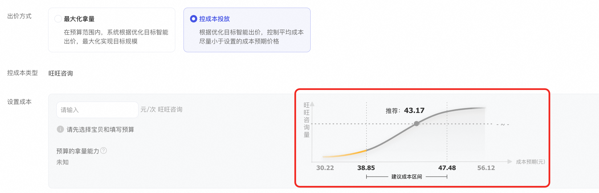

原因之二，您的触达的人群还不够多，可以通过添加达摩盘-已保存人群的方式加速放量哦～这里小二给您推荐一些人群包，可以去达摩盘自行进行设置～**（达摩盘人群量级最好需要设置在500w以上，打满8个，才有放量效果！）**

👉**类目行为人群、类目咨询人群**

可根据自己的产品内容添加类目选择。搜索点击、收藏、加购人群，剔除已购人群，或直接选择类目咨询人群即可

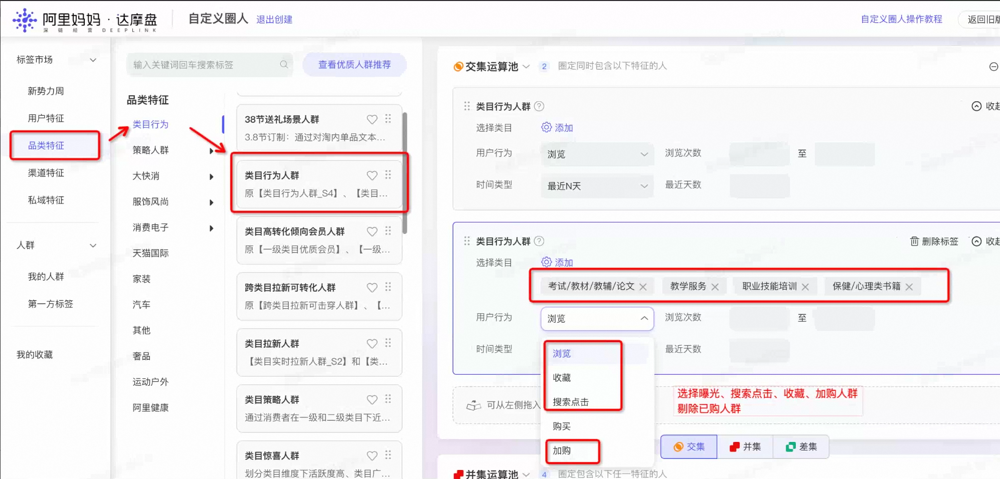

**👉关键词圈选兴趣人群**

可根据自己的产品内容添加关键词

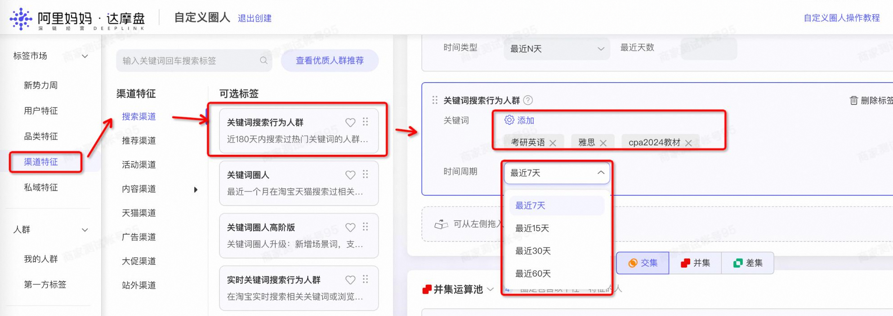

**👉属性人群**

用户特征（用户年龄、城市等级、教育程度、消费力等级 都可以根据产品受众进行自定义） 可以达摩盘通过MVP系列标签、城市等级、人生阶段、职业等标签自行组包

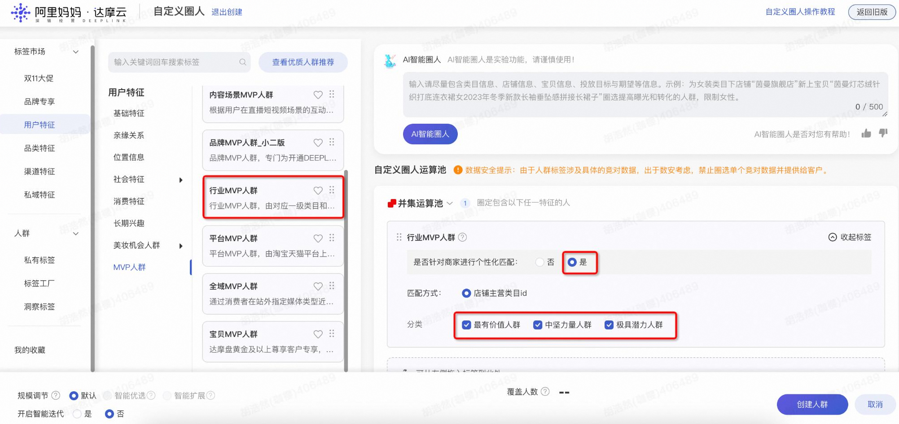

### **8、为什么我的ppc很低/很高？**

线索推广是按CPC扣费，但是最终交付的是咨询/线索成本。不用实时盯着点击成本，重点关注咨询成本。

PPC过高可能是因为算法模型认为此人有100%概率咨询，正好此人也是竞对的高转化用户，那模型会出很高的价格来和竞对抢夺，所以点击成本会变高，但这个人抢下来会给你带来更多生意的增量。竞得的流量更有价值，一般来说主要是集中在搜索域，流量更精准也更贵。

PPC过低可能是因为自身商品、店铺权重较低，预估转化率不足，同时预算和出价较少的情况下，导致抢不到这部分搜索优质流量，算法只能去推荐或其他场所拿量，ppc就会低。

优化方法：ppc过高不用过分关注，ppc过低需要提高商品自身权重、预算、出价的方式提升拿到优质流量的概率。

### **9、有一些咨询很像打广告的，要怎么处理？**

基于此前商家反馈的部分咨询广告案例，经排查发现近30%来自于自然流量，其他30%来源于人群推广等其他场景，少部分来源于线索推广。在目前的打广告类型中，主要分为：

**类型一：批量发送商品链接**

**这部分目前主站风控已做消息撤回处理，妈妈反作弊团队针对这部分无效点击进行了自动返款（商家无感知），如果遇到未做撤回处理，请及时找阿里妈妈客服提工单，并附上发送人+接收人+发送时间的截图**

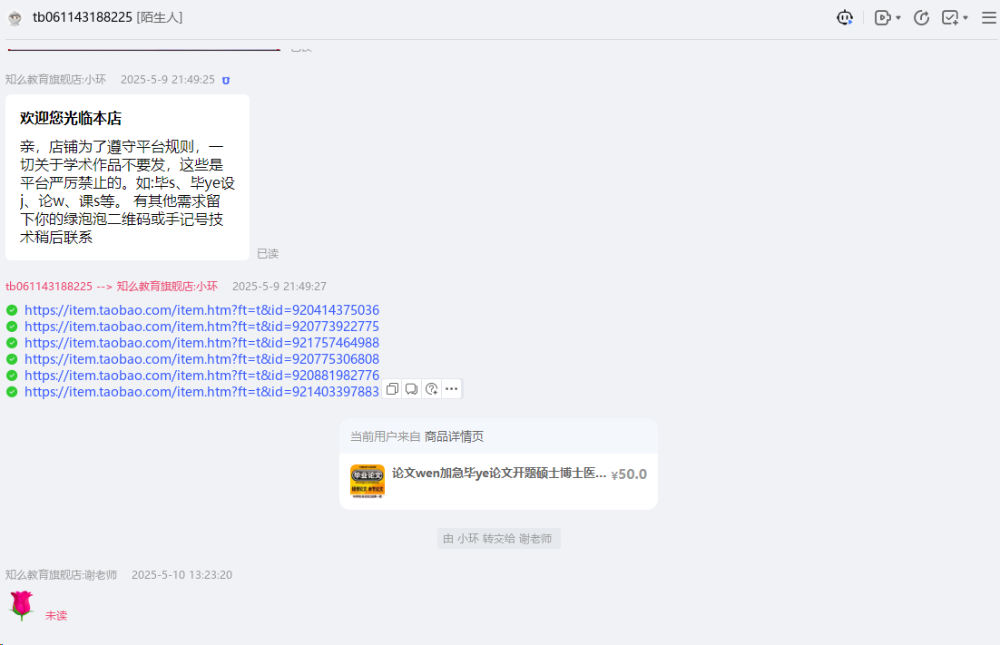

**自动返款的逻辑：比如今天8点、10点、15点消耗金额为20、40、60，在离线判定为无效点击后，会把这部分无效点击进行自动返款，比如无效点击涉及金额为10块，15点实际扣款金额为50*

**类型二：****发送刷单/开发票/+vx/服务商、代理商等广告信息**

**这部分主站风控团队已经在做治理，针对开发票的情况目前在做撤回+禁言处理，消费者引导+vx如果属于垃圾账号也会被处理，如遇到此类情况，建议商家选择屏蔽消息并向千牛客服进行账号举报/投诉。**

代运营目前属于淘宝服务市场的正常业务诉求，所以不会专门针对这些消息撤回，从风险角度，如果是恶意的或者已经被商家举报的，主站才会做撤回和禁言处理，建议向千牛进行举报。

**类型三：写手/招聘信息**

由于目前都是写手个人 一个一个去找商家聊的，主站目前仅针对无法做撤回消息处理，而且她们说此前没有收到相应的客户投诉，没有引起注意。建议商家遇到这种情况，直接找千牛客服进行投诉和举报，并且把账号进行屏蔽。

**建议使用「优化留资获客目标」**

# **四、营销活动类&其他**

### **我消耗达标了，为什么没有补流量，是不是计算出错了？**

假设今天是3月19日，3月18日花了1068，为什么只给我补贴了15%的流量？

请看一下数据更新时间是不是当天「3月19日」，如果是昨天说明是昨天数据还没有更新。

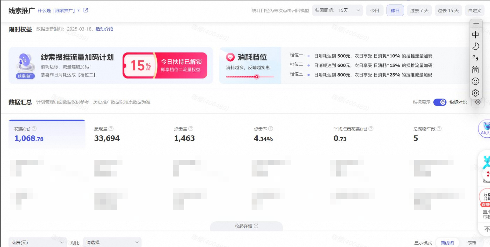

### **智能创意怎么关闭？**

新建计划的时候不勾选，就只有自定义创意了。同时您也可以点击计划列表，在「智能创意等设置」中点击关闭即可。

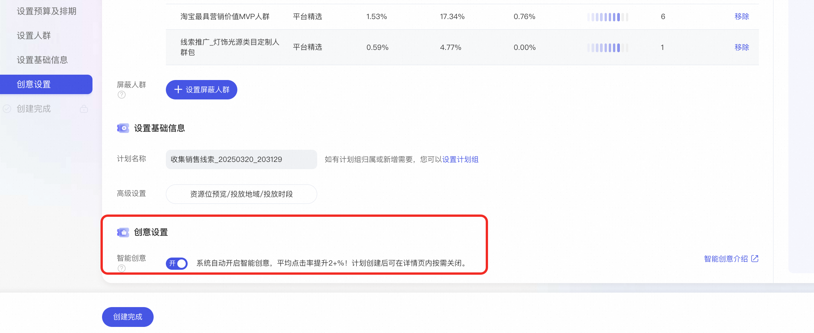

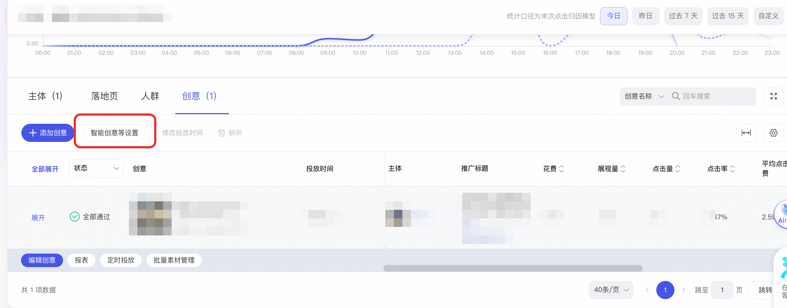

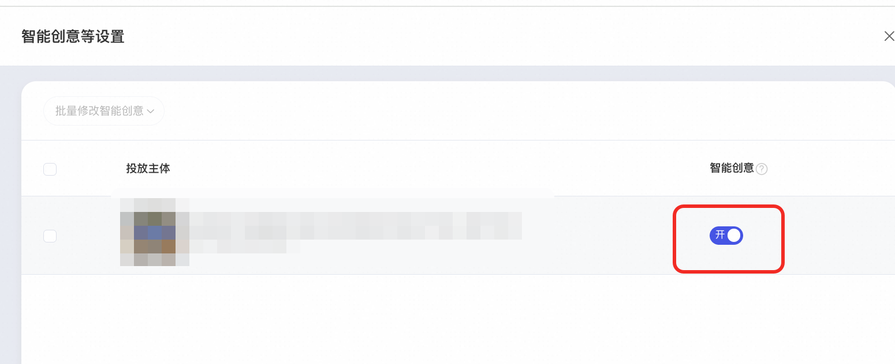
