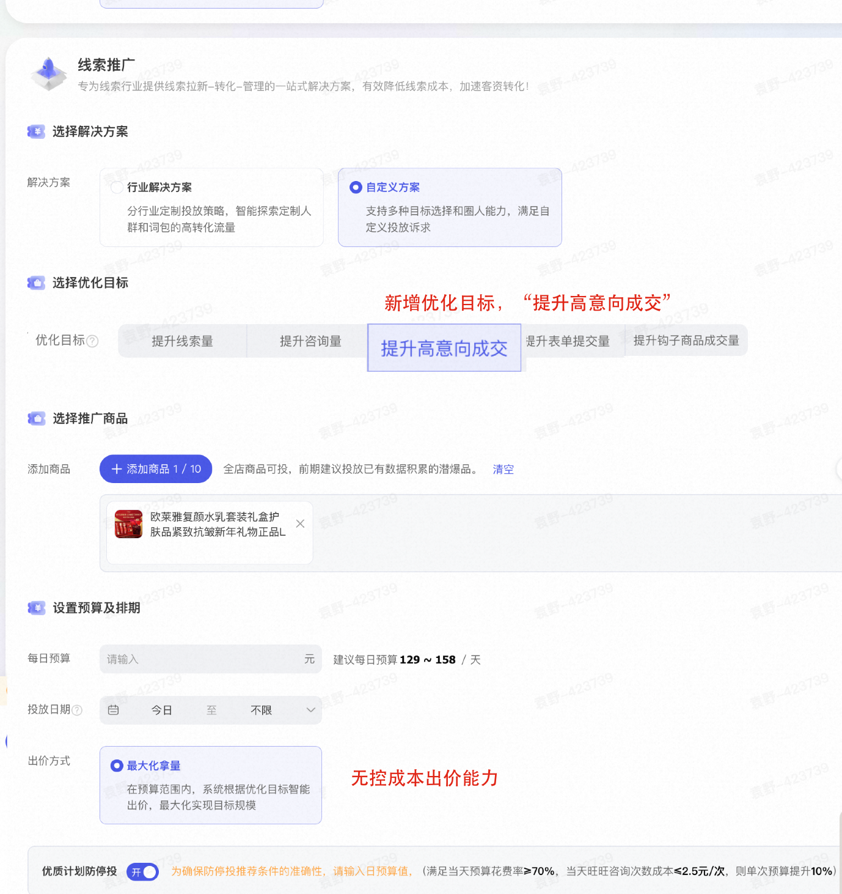

# 【提升高意向成交】上线—— 让每一次咨询，都成为成交的强力引擎(1)

> 来源：https://alidocs.dingtalk.com/i/nodes/KGZLxjv9VGkoG9YwHY7E16YnV6EDybno

致各位商家伙伴：

阿里妈妈线索推广场景重磅上线全新优化目标——**【提升高意向成交】**；智能识别高意向咨询人群，主动提纯客户池，显著提升咨询用户占比；深度归因“深度咨询”行为，精准定位离成交最近的优质线索，实现高效结案，达成咨询即种草，沟通即转化。

# **一、功能详解：全流程升级，效果一目了然**

**产品价值**

数据显示，在线索推广场景下产生售前咨询的用户，其客单价与点击转化率（CVR）显著高于直接下单或未咨询人群，咨询不是成本，而是高价值的“种草”过程。【**提升高意向成交】目标依托阿里妈妈独有的旺咨模型（强 CWR 交付能力），精准识别“售前”高意向人群，提升售前咨询人群占比，从而提升门店客单价及交易额**；并通过定制化投放结案，向您清晰展示咨询带来的实际成交贡献，让您看到的每一个咨询数字，都是离成交更近一步的真实商机！

### **🚀 步骤一：计划创建——一键开启高意向模式**

在万相台无界版·线索推广新建计划时，您将在优化目标中看到全新选项：【提升高意向成交】
系统提示：智能识别高意向售前人群，深度归因咨询对成交的贡献，适合高客单及定制类商品。

### **📊 步骤二：投后结案——专属报告，见证价值闭环**

对于该类型的计划，我们在计划列表页特别新增了**「投放结案」**按钮。点击即可从右侧弹出专属的深度分析报告，包含三大核心数据模块：

##### **📈 模块一：场景优势验证——为什么选线索推广？**

数据对比：直观展示**「本计划咨询率」VS「行业大盘咨询率」**。
核心洞察：数据将有力证明，通过线索推广专属模型触达的人群，其咨询意愿显著高于大盘平均水平。
话术引导：“看，我们的算法帮您找到了更爱‘开口问’的优质客户，这是成交的第一步。”

#### **💰 模块二：人群价值深挖——咨询人群 vs 非咨询人群**

多维对比：针对您所属类目，横向对比两类人群的核心指标：
触达规模：覆盖了多少潜在买家？
客单价 (AOV)：咨询人群的客单价通常高出 XX%（数据动态展示）。
点击转化率 (CVR)：咨询后的下单转化效率如何？
**核心洞察：用真实数据打破“咨询无效论”，证明咨询是提升客单价和转化率的关键杠杆。**

#### **🛒 模块三：成交归因实录——咨询带来的真金白银**

追踪周期：聚焦最近 15 天的转化表现。
核心指标：展示亿触达的售前咨询人群在该类目下的最终成交行为：💵 总成交金额 (GMV)、🧾 成交 笔数、👥 成交人数、🏷️ 最终客单价

**核心洞察：**直接展示“咨询人群在同类目下竞品店铺的成交情况”，基于售前咨询人群的成交价值，优 化门店客服承接话术及效率，提升门店成交效率及交易额。

| 报表入口（必看！！！） | 报表解读（必看！！！） |
| --- | --- |
|  |  |

# **三、给商家的行动建议**

🌟 谁应该立即尝试？

客单价较高，用户决策谨慎的行业（家装、建材、大家电）。

服务非标、需要深度沟通定制方案的行业（教育培训、定制行业、本地生活）。

目前面临“有咨询无成交”困惑，急需验证推广效果的商家。

💡 运营小贴士：

**配合客服承接：**开启此目标后，流量会更偏向“爱问的人”，请确保您的客服团队响应速度和专业度，接住这波高意向流量。

**关注结案报告：**不要只看计划投放数据，务必查看「投放结案」中的售前咨询人群近15天成交数据，你会发现长尾转化的惊喜。

**大胆扩量：**一旦验证了“咨询->成交”的正向循环，请果断增加预算。线索推广的优势在于能**依托阿里妈妈独有的旺咨模型（强 CWR 交付能力）**在全域流量挖掘“具备咨询意愿及强购买力”的客户。

在存量竞争时代，“聊出来”的生意往往比“搜出来”的生意更稳固、客单更高。

阿里妈妈线索推广【提升高意向成交】目标，愿做您生意增长的加速器。让我们用数据说话，让每一次真诚的沟通，都转化为实实在在的订单！

👉 立即登录万相台无界版，新建计划，选择【提升高意向成交】，开启您的高质增长之旅！
