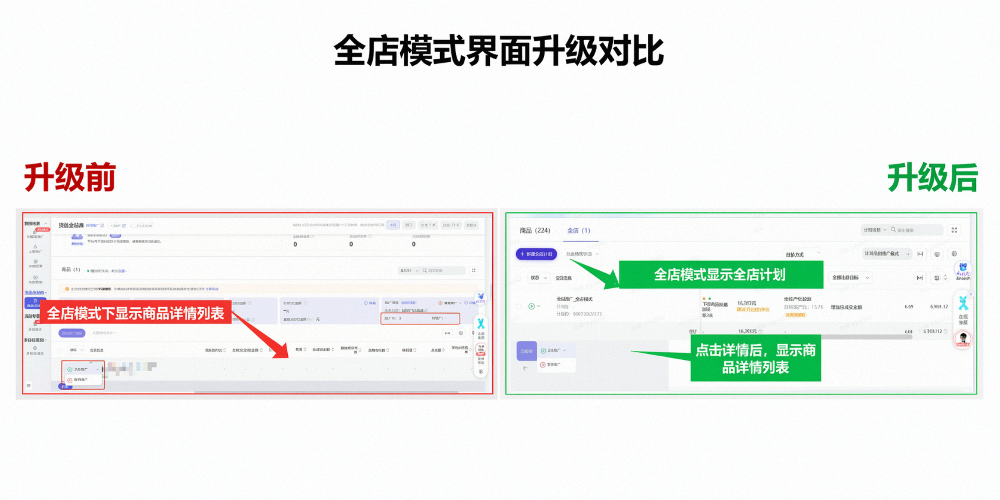
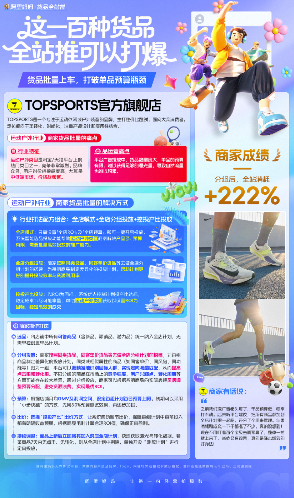

# 【全店模式】分组投放重磅上线，一键设置多个计划组，分类推广效率更高

> 来源：https://alidocs.dingtalk.com/i/nodes/KGZLxjv9VGkoG9YwHY92rQeDV6EDybno

**功能说明**

**全店-分组投放上线，**支持商家创建多个计划组，每个计划组下可按需添加商品，并为这个计划组设置对应的出价（控投产比设置ROI/最大化拿量）和预算；

升级后，全店模式场景会由展示**宝贝列表切换到展示计划列表**，商家可以进入原来的全店智能托管计划详情，查看原智能托管计划中投放的全部宝贝；

同时，商家的全店模式计划可以从原来的1个智能托管计划，变成**1+10个计划**（1个智能托管计划+10个分组投放计划）

**投放流程**

| 流程 | 图示 | 说明 |
| --- | --- | --- |
| 进入全站推-计划横向管理-新建分组计划 or 进入全站推-全店模式-新建分组计划 | 新建分组： 进入分组弹窗： | 新建计划支持推广方式选择**「分组托管」** 全店模式最多可创建**1个「**智能托管」计划，**10个**「分组托管」计划 第一次新建时系统会默认创建推荐分组及推荐商品，可手动删除分组，修改分组内商品 分组计划支持修改预算和出价方式 一个分组计划最多添加500个商品，至少添加3个商品 |
| 投中-计划列表 | 注意： | 全店计划按列表展示，第一条默认为全店智能托管计划 点击计划名称可跳转计划详情 计划名称支持自定义修改 计划支持开启、暂停 分组托管支持删除，智能托管不支持删除 支持修改计划预算、出价方式 ***注意：****分组投放升级后，计划横向管理展示页面会随之升级，全店模式的宝贝列表查看位置从推广页改为计划详情页，若需要查看商品完整数据，需点击计划详情进入查看** |
| 分组-计划详情-分组商品 |  | 支持添加商品（一个分组计划最多添加500个商品，至少添加3个商品） 支持删除在投商品 |

**使用场景**

服饰、饰品、图书等多链接商家，按不同商品**利润分组投放**，设置不同出价

**新品批量测款**，按品类或上架时间批量分组管理

店铺在架商品多，全店**智能托管屏蔽额度不够**，可以通过分组投放少量商品尝试全店模式

店铺内多人负责不同商品，智能托管没法满足按运营人员分别批量投放，分组托管可支持

智能托管一个预算和出价，会有个别品占用过多预算，设置ROI不敢设太低；分组托管可分多个组隔离预算，毛利高的组可设置更有竞争力的目标投产比，提升商品拿量能力

**商家案例**

**商家原声：**之前我们投广告老头疼了，单品预算低，根本打不动。后来听平台建议，把所有商品都加到全店计划里一起跑，还分了个组来管理。结果消耗和成交一下子都涨了不少，真的没想到！现在不用盯着每个宝贝去调预算了，整体一拉

就上来了，省心又有效果，真的是降本增效的好办法！

**快来探索你的专属分组投放方式吧！**
