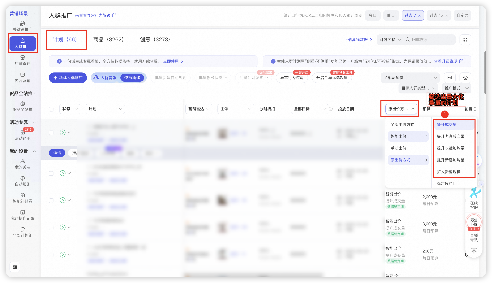
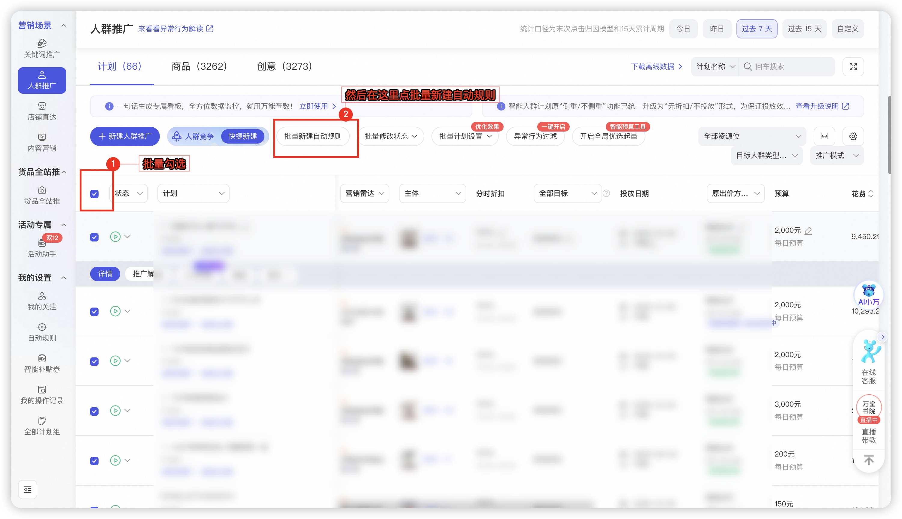
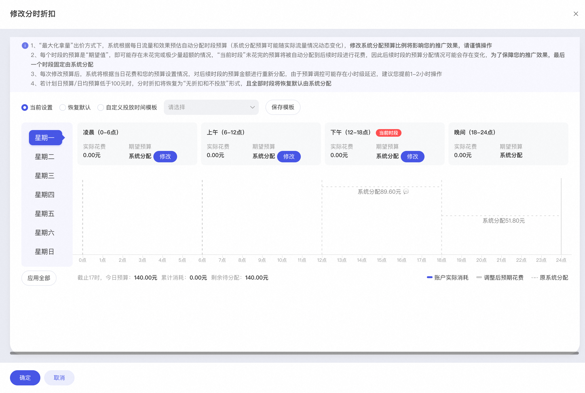
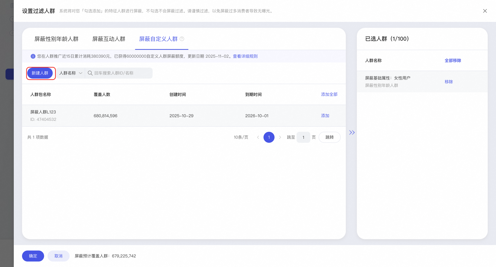
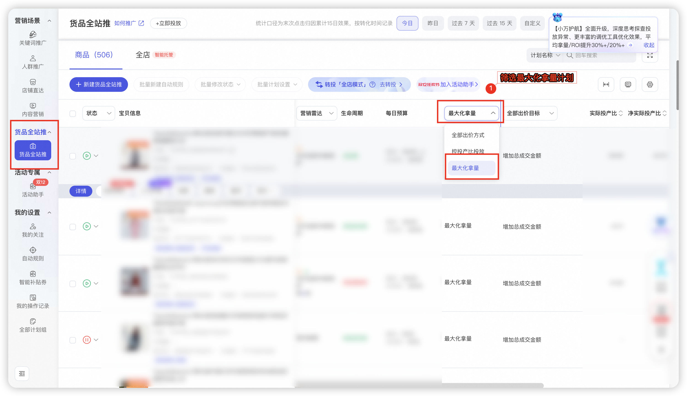
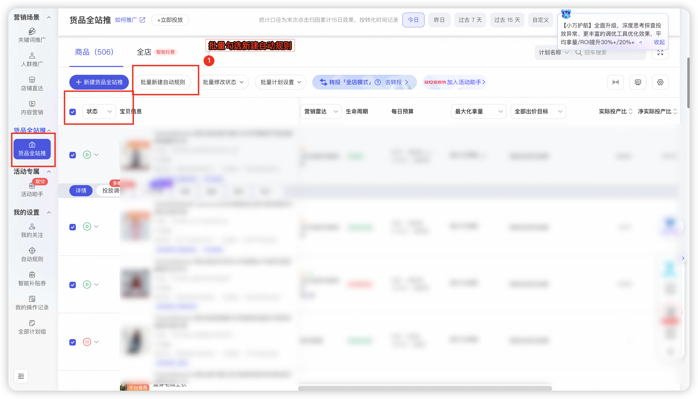
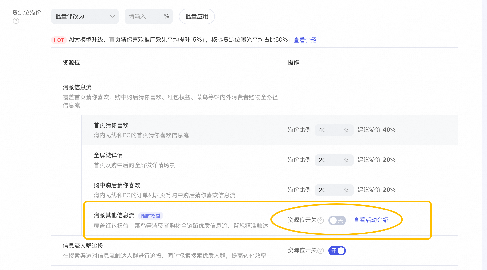
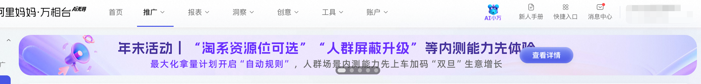
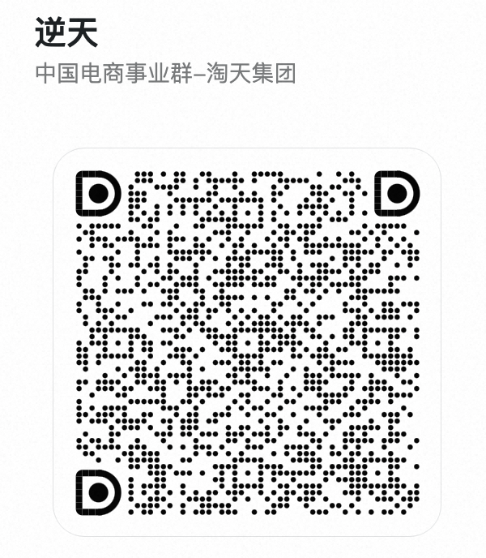

# （已结束）年末活动｜上车预算“自动规则”，人群推广权益加码生意增长🛫

> 来源：https://alidocs.dingtalk.com/i/nodes/MNDoBb60VLYDGNPyty0rLlEZJlemrZQ3

前情提要：本次活动权益功能属于人群推广当下三大内测期邀约制功能，功能还未可直接全量，欢迎本次活动激励邀约的商家提前解锁～

## **一、先看权益介绍：**

| **“最大化拿量预算分时折扣”** 为保障商家朋友们在人群场景**最大化出价下**，预算可以根据自己的各时段投放诉求进行**精细化管理**，可以在“修改分时折扣”下进行设置，让生意跑的更稳定！ 开启后，该计划会根据设置好的规则放预算去竞争流量。 备注：在自定义分时段折扣的时候，需要结合投放情况合理低频调控，避免计划受影响放不出去量 | **“淘系其他信息流”投放可选** 为方便商家朋友在人群场景下更易获取**“首页猜您喜欢”、“购中后猜您喜欢”**的优质流量，若您选择**“手动出价”**模式，则这条计划的**“淘系其他信息流”资源位变为投放可选！** 让宝贝精准锁定核心流量曝光；告别分散投放、效果难控的困扰，让预算消耗更聚焦； 开启后该计划只会投放到：“首页猜您喜欢”、“全屏微详情”、“购中后猜您喜欢**”** | **“自定义人群屏蔽支持自主圈选”** 为满足商家在投放中更精细化做人群管控，屏蔽选项更灵活更多样，**支持达摩盘人群标签自主圈选屏蔽。** 商家朋友们可以在高效拉新常客转化自定义推广三大营销目标可使用新升级人群屏蔽能力 能力详细介绍： |
| --- | --- | --- |

## **二、再了解下具体活动详情：**

### **1、活动说明：**

助力“双十二”+“双旦”活动，人群推广场景联动开展权益赠送激励活动！活动周期内计划达成“自动规则”启用比例，即可获得人群推广“预算分时折扣升级版”,"淘系其他信息流"投放可选等权益。

#### **自动规则是什么？为什么要引导大家上车“自动规则”**

**——简单介绍：**就是根据您预设的预算自动增加规则，当今天的推广符合预期的情况下，系统会根据规则增加预算，来保障生意的持续增长，解放您的双手无需时刻盯盘。👇一个小案例带您理解：

**使用案例：当计划roi大于5且日预算花费超过80%时，日预算增加1000元，每天最多执行3次**

规则解读

触发规则：当天计划预算花费达到80%，并且计划的投入产出比((ROI)大于5

自动执行：计划提升日预算1000元

限制要求：每天最多执行3次，或计划日预算最高不超过1000元

**——为什么要引导上车**：极大减小您的操盘成本，同时增加对于营销机会的捕捉，不错失生意机会。**年末加把🔥，我们一起把生意经营再往上走一步。** *更多“自动规则”详细介绍：*

### **2、活动规则：**

#### **1）活动规则&权益介绍：开启“最大化拿量”计划下的自动规则，即可参与权益激励🎁！**

**激励1**：**人群推广场景下****批量开启“最大量拿量”计划的自动规则，即可获得****“分时段预算”能力及“****自定义人群屏蔽支持自主圈选”**

**why：**最大化拿量计划可以满足商家在大促、新品等不同场景放量诉求，且在预算使用率几乎拉满的情况下可以帮助商家拿大更多成交。

但商家们会担心预算的集中消耗不可控，所以我们给大家准备了“分时段预算”能力，可以保障您更稳更可控的持续获得生意份额，增加您的投放信心；

同时还支持自定义人群屏蔽升级，可以给智能计划的人群做纠偏，跑的更符合预期。

**权益门槛**：最大化拿量计划自动规则开启率达25%。（最大化拿量计划数不低于10个）

——补充说明：门槛非硬性，如商家开启核心计划（高消耗）的自动规则，也会作为评估赠予权益

——开启率说明： 比如账户有40个最大化拿量的计划，那需要至少10个计划开启自动规则设置，至于最终自动规则运行了几条不做要求

操作路径：无界 →人群场景 → 筛选最大化拿量计划 → 批量开启自动规则

**领取权益：**我们会每天监控商家前一天的达成情况和权益赠予

**激励2****：****全站推场景下****批量开启“最大量拿量”计划的自动规则，即可获得人群场景ecpc****“淘系其他资源位”可选能力****”**

**why****：**本次邀约的商家里在全站推也有生意经营，而全站推最大化拿量下我们发现在预算相对充足的情况，整体的达成表现会比稳定投产比更好（今年大促前中后，最大化拿量的roi均大于稳定投产比），因此我们期望商家可以有信心积极在全站最大化拿量下的增加预算规则做好生意经营，同时给予人群场景下ecpc的**“淘系其他资源位”可选能力**

**权益门槛：**最大化拿量计划自动规则开启率达25%（最大化拿量商品数不低于10个）

——补充说明：门槛非硬性，如商家开启核心计划（高消耗）的自动规则，也会作为评估赠予权益

——开启率说明： 比如账户有40个最大化拿量的计划，那需要至少10个计划开启自动规则设置，至于最终自动规则运行了几条不做要求

**操作路径：**无界 →全站推场景 → 筛选最大化拿量计划 → 批量开启自动规则

**领取权益：**我们会每天监控商家前一天的达成情况和权益赠予。

#### **2**）活动时间：

——权益赠予结束时间：12月19日12：00，在活动期内达成的商家均可获得权益赠予。本次权益赠予正常不回收，但如发现商家计划自动规则的开启率由明显下降，会酌情回收权益。

#### **3）哪些商家可以参与活动？**

——活动属于邀约制，邀约客户即可参与。（邀约信息：以您在无界人群场景看到的活动邀约banner为准）

#### **4）活动权益赠予是否有回收机制？**

——活动期符合门槛会赠予场景权益，后续会定期看商家自动规则启用率波动情况，如未达门槛差很大，会考虑回收权益；

——自动规则设置过于苛刻，权益会考虑回收，如自动规则的运行成功率很低或几乎没有运行过。

####

## **四、有问题这里可以找我**

有任何活动规则疑问或者权益发放疑问，可以私聊我或者在本文档留言哈～

