# AI点睛—您的搜索投放“外挂”，让精准流量“一语即达”

> 来源：https://alidocs.dingtalk.com/i/nodes/N7dx2rn0JbxOaqnACQ5kRDGvWMGjLRb3

在关键词推广中，您是否也面临这些难题？

❌ 手动出价拿不到量，智能计划又怕跑偏？

❌ 计划想获取定制化词*人流量，不知如何获取？

❌ 投完不知道效果为何波动，更不知如何优化？

**现在，关键词推广应用通义千问最新大模型能力，上线「AI点睛」新一代搜索投放体系，从词人匹配升级到搜索需求匹配，**AI 为您精准识别、智能拓流、深度复盘——真正实现 **“投手画龙，AI点睛”**，让每一次投放都高效、可控。

商家群群号：146095004567

## **一、为什么选择AI点睛**

消费者当前不再是单纯的搜索某个产品，而是通过“场景化需求表达”来实现更好的需求解决，「AI点睛」正是为了帮助商家在这一变革中，从“卖货者”转型为“场景解决方案提供者”，通过三大核心升级，抢占早期意图红利：

**更广的词理解：跨越行业，捕捉场景化需求**

突破边界：融入通识知识与推理能力，结合淘内行为数据，不再局限于字面意思。

场景捕获：例如用户搜“露营装备”，AI 能联想到“便携咖啡机”或“氛围灯”，即使它们不属于同一狭义类目，也能被精准捕捉，修正用户模糊的真实需求，跨越行业限制

**更准的人群锁定：透视动机，锁定高潜需求**

同词不同意：识别同一搜索词背后的差异化动机。比如搜“跑步鞋”，有人是为了“专业马拉松”，有人是为了“日常锻炼舒适”。

精准分层：AI 点睛能精准区分并锁定那些真正具有高转化潜力的细分人群，避免无效曝光。

**更深的商品理解：立体画像，构建“能力肖像”**

多维解析：不仅看标题，更结合属性、卖点、评论等多源数据。

立体匹配：为每个商品构建立体的“能力肖像”，确保推荐的商品不仅能被看到，更能解决用户的具体痛点（如“透气性好”、“耐磨”等隐性需求）。

「AI点睛」不再是简单的关键词扩量工具，而是构建了一个动态的“用户画像 - 搜索需求 - 商品特征”三维匹配矩阵。

→ 结果：从“人找货”的被动等待，升级为“货懂人”的主动触达，真正收割意图红利。

| 维度 | 传统模式 | **AI 点睛模式** |
| --- | --- | --- |
| **匹配逻辑** | 匹配字词 | **匹配需求** |
| **覆盖范围** | 有限关键词列表 | **全链路场景化需求** |
| **精准度** | 依赖人工经验筛选 | **AI 自动识别高潜动机** |
| **效率** | 手动调整，滞后响应 | **实时推理，动态最优解** |

## **二、适用场景**

**追求差异化流量目标**：新品要测款打标？AI 点睛让你轻松表达流量偏好，智能匹配优质流量。

智能出价计划效果波动？让AI 点睛帮你**调整流量策略，投放更稳，效果更优**。

手动出价计划拿量困难？用AI 点睛**解锁更多目标关键词及人群流量，提升拿量效率**。

## **三、核心功能-**让每一次投放都高效、可控、有依据

🔆**「AI点睛」**基于通义千问最新的大模型分析、推理等能力，精准解析商品背后需求，以及商家通过自然语言自主表达的流量诉求，AI高效匹配搜索精准流量，实现投手「画龙」，AI「点睛」，为每位投手提供一个专属的搜索外挂！

💡**「AI点睛」“智”能化升级，重塑关键词推广新方式**

**1、****投前：精准锁定目标搜索流量 —— “读心术”实时意图识别**

**「AI点睛」借助通义千问大模型强大的意图识别能力**，系统即刻理解您的：

**商品特征**（基于深度商品理解）

**人群特征**（基于动机识别）

**使用场景**（基于跨行业推理）

→ 自动匹配高相关搜索需求流量。同时支持您自主表达流量诉求，比如商家投放"婴儿连体衣"商品时，表达目标人群：“我想触达‘孕期至宝宝出生0-3个月’的新手父母”，系统不仅锁定该人群，还会自动覆盖“哈衣”、“爬服”、“新生儿礼盒”等关联场景词，解决传统模式下流量覆盖不足、精准人群不可控的难题！

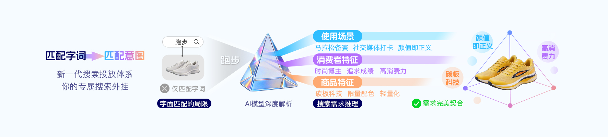

相较传统模式，AI点睛能更精准识别和找到意图流量

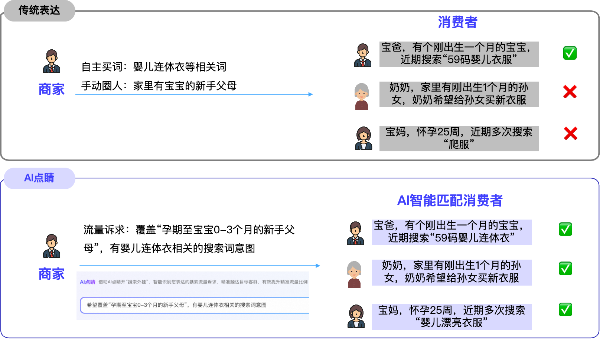

**2、投中可控，“投手掌舵+AI智驾”模式**

担忧AI找的流量不准？不怕，**商家可以通过关键词、人群等自然语言指令灵活调控投放方向**，向系统表达想要哪些流量，控制AI扩展流量的方向和准度；**同时计划仍然支持计划时段、地域设置，此外升级屏蔽词生效到计划粒度。**系统AI智驾，投手把控方向，精准控制AI扩展的范围和准度，确保每一分投入都有的放矢。

**3、投后解读复盘**

每天 5 分钟，看清钱花在哪、人从哪来。AI 基于**商品立体肖像**与**用户真实意图**，持续推荐更优策略：

**披露买家搜索需求**：看到用户真实的搜索语境，而非仅仅是关键词。

**全面展示搜索人群画像**：了解高潜人群的动机分布。

**提供搜索词数据**：验证意图匹配的准确性。

→ **让每一次优化都有数据支撑、有逻辑可循。**

「AI点睛」是为每位投手配备一位懂搜索、会思考、能执行的AI搭档——**您指方向，AI点睛**；简单表达，精准拿量。立即开启「AI点睛」，让关键词推广从此更智能、更高效、更省心！

## **四、投放指南**

**使用建议**

**1、**** 表达要“具体”，别太“宽泛”**

避免说：“我要投女装”

建议说：“主推职场女性通勤连衣裙，希望投放30-40岁人群”

→ 越具体的描述，初期AI越能精准理解您的目标人群和商品定位，匹配更高转化流量。

**2、善用“自然语言”主动干预**

投放过程中发现流量不符合预期，立刻通过指令微调，比如：

“重点覆盖有母婴购物行为的用户”

“增加‘冰丝’‘抗皱’相关词”
→ 您的每一次干预，都会让AI学习得更懂您

**3、定期查看投后报告，闭环优化**

建议每天花5分钟查看系统生成的投放分析，了解买家搜索需求、搜索词及人群画像，及时调优

### ** 一、 商品卖点补充：让AI“读懂”消费者真实偏好**

AI不仅看标题，更会抓取详情页、评价区、社媒笔记中的**消费者原生表达**。补充未被标题覆盖的“真实购买驱动力”，可显著提升流量匹配精度。

标准公式：`场景/人群 + 具体功效/属性 + 消费者高频词`

| 信息源头 | 提取规则 | 转化示例（AI可读格式） |
| --- | --- | --- |
| 商品评论区 | 提取高频功效词/场景词，过滤情绪化表达 | `原评论：“吃了半个月终于能睡整觉了” → 补充卖点：助眠安神/改善入睡困难` |
| 商品详情页 | 补充参数之外的体验型价值 | `详情页：“含柠檬酸镁” ` `→ 补充卖点：温和吸收/肠胃无负担` |
| 外部种草帖 | 提取跨场景关联词 | `小红书：“出差带它防焦虑”` ` → 补充卖点：差旅情绪安抚/便携独立包装` |

**注意**：仅补充与商品强相关、且标题未明确写出的卖点，避免堆砌无关词干扰AI意图识别。

---

### **二、 精准流量诉求表达**

标准公式=`【目标人群画像】+【行为及日期】+【产品/服务】+【核心诉求/客单价预算/场景】`

1、行业示例

| 行业 | 推荐表达 | AI解析逻辑 |
| --- | --- | --- |
| **服饰** | 针对25-35岁一二线城市职场女性，近14天搜索“早春通勤衬衫”“抗皱免烫”，偏好简约质感，客单价预算300-600元 | 映射：性别/年龄/城市×意图词×材质偏好×价格带 |
| **母婴** | 针对0-3岁新手父母，近30天高频搜索“纯棉婴儿连体衣”“A类无荧光”“新生儿防惊跳”，关注安全认证，客单价预算150-400元 | 映射：育儿阶段×安全标准词×场景痛点×转化门槛 |
| **3C数码** | 近7天搜索过“降噪耳机”“通勤隔音”，关注佩戴舒适度与长续航，预算800-1200元的上班族 | 映射：时效意图词×功能偏好×使用场景×决策周期 |
| **家装建材** | 新一线城市近30天搜索“环保板材”“全屋定制”，正在比价阶段的装修业主，客单价接受1-3万/套 | 映射：地域×高意向词×决策阶段×客单阈值 |

建议：先跑宽，后收紧，自主表达的流量诉求避免过窄

---

### ** 三、 避坑指南：3类常见错误表达**

| 错误类型 | ❌ 错误示例 | ✅ 优化建议 |
| --- | --- | --- |
| **模糊表述** | “很多人喜欢”“质量好”“性价比高” | 替换为可量化/可搜索的词：`“搜索过‘抗起球’‘垂感好’的通勤族”` |
| **矛盾诉求** | “既要高端定制又要9.9包邮”“ 目标学生党但要求高消费力” | 拆分测试：明确最优先的流量诉求 |
| **过度限制** | “仅投搜索过‘XX品牌+XX型号+XX颜色’的28岁女性” | 保留产品核心词，放开长尾：`“搜索过‘XX型号’，关注‘静音/节能’的 homeowners”` |

---

### ** 四、 负向案例说明：什么是“不相关”？如何用于系统纠偏？**

AI投放无法完全屏蔽排除流量，可以通过表达流量倾向实现

| ❌ 负向表达（不推荐） | ✅ 正确操作 |
| --- | --- |
| “不要下沉市场”“不要价格敏感人群” | `减少低消费力转化人群` |
| “不要搜过竞品A的”“不要看过差评的” | `“聚焦搜索本品核心功效词的人群”`，AI自动稀释竞品意图 |
| “不要泛流量”“只要精准客资” | `“仅保留行业核心成交词”` |

注意：屏蔽词需要手动添加，AI点睛的屏蔽词生效在计划维度

## **五、操作步骤**

**第一步：进入关键词推广-自定义推广**

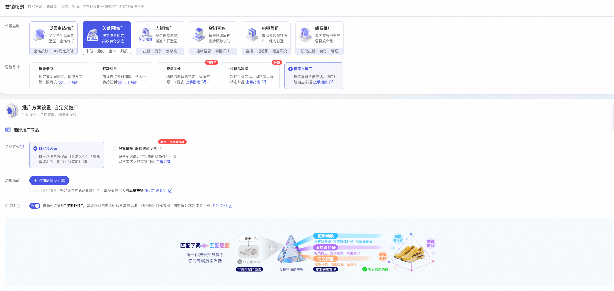

**第二步：添加希望投放的商品，开启AI点睛，此时AI点睛会自动解析商品标题、历史数据等，结合消费者端行为实时解析商品背后的搜索需求，您可以自主选择希望投放的需求**

*注意开启后仅支持智能出价*

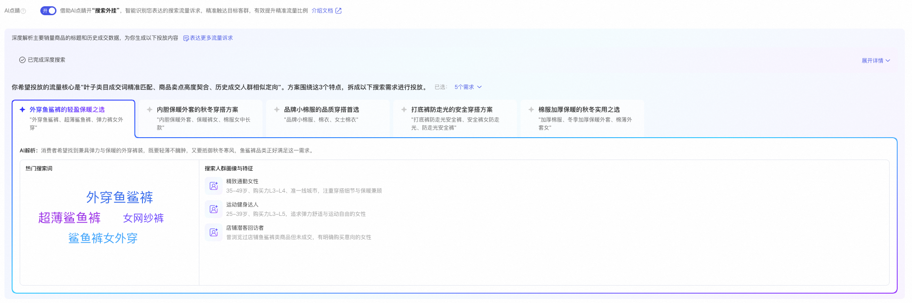

**第三步：在系统自动解析的基础上，商家可以点击“表达更多流量诉求“**

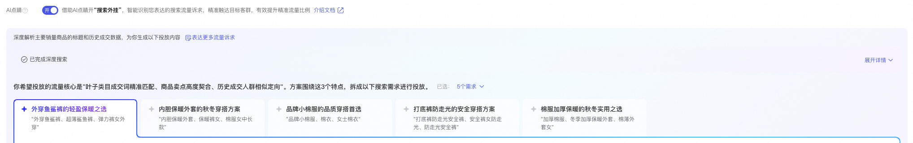

点击后，**可以手动输出想要的流量范围，然后进行方案解析；也可以选择模板快速应用**

**此外，点击“🌟”后，支持对自己输入的流量诉求进行保存，并应用到其余计划设置**

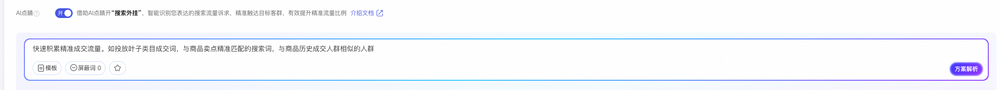

**第四步：查看AI点睛的功能设置，修改流量表达和搜索需求，可以在计划列表点击“AI点睛设置”**

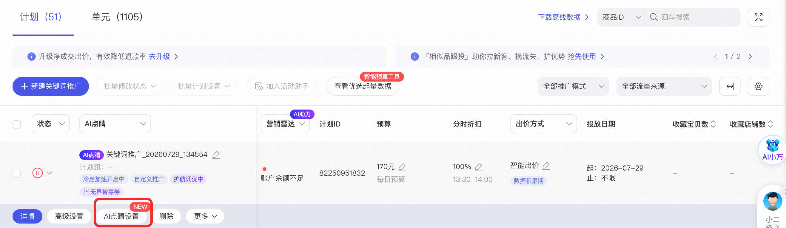

**第五步：点击计划名称，可以进入计划详情页，查看计划投后的搜索需求数据，点击“投放报告”，可以查看搜索词和人群数据**

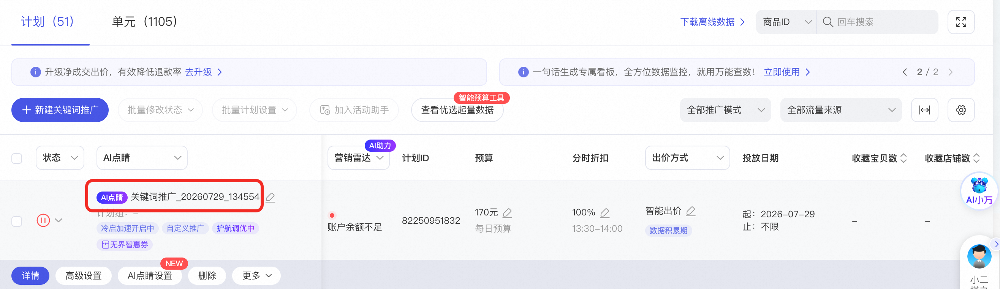

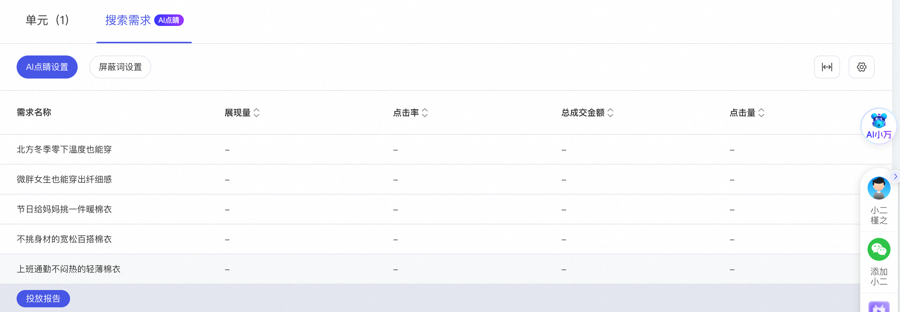

**第六步：如果您对投放数据有优化诉求，可以修改AI点睛设置**

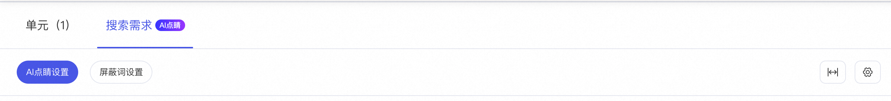

如果希望针对生成新的搜索需求并选择投放，可以在每次搜索需求列表里勾选并点击保存，然后再次输入流量诉求解析，此时已经保存的搜索需求仍会在列表里

**如何选择、修改和删除搜索需求？**

1、新建时，勾选想要投放的搜索需求

操作入口：关键词推广-自定义推广

操作步骤：

1）添加商品后，AI点睛自动解析

2）可以根据业务目标与受众画像，勾选想投放的搜索需求（支持多选/全选）；建议新建时聚焦 3-5 个核心需求，便于模型快速学习

3）确认后保存计划，系统将自动匹配对应搜索需求流量

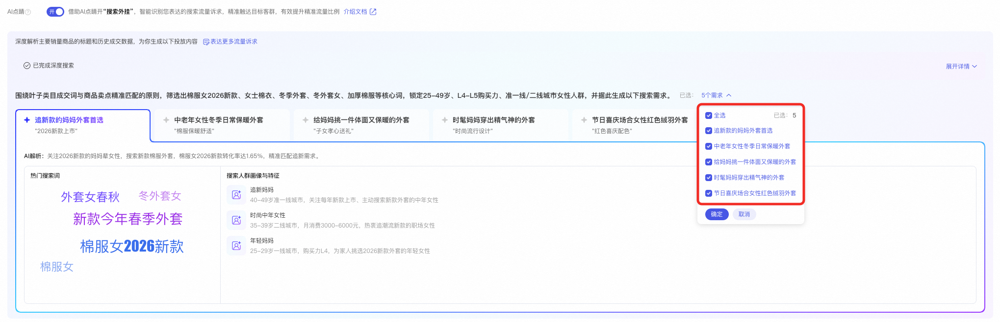

2、计划希望新增搜索需求

点睛“表达更多流量诉求“，在原有模板内容后，输入想要的目标流量“新增XX”，点击方案解析

**操作入口**：计划详情 → AI点睛设置→ 「表达更多流量诉求」输入框
**操作步骤**：

1）找到原有投放模板内容，在末尾追加输入目标流量

2）点击右侧「方案解析」按钮，系统将自动解析意图并匹配新增的搜索需求；

3）解析完成后，新增需求将实时加入当前计划。

**核心说明**：该功能用于动态拓展流量边界。追加后建议观察2～3天数据，避免频繁修改干扰模型稳定期。

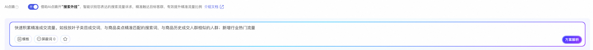

3、删除搜索需求

投放3天后，根据搜索需求数据，进行搜索需求优化和删除，此外支持设置屏蔽词（计划粒度生效）

**操作入口**：计划详情页 → 搜索需求→ 投放报告

**操作步骤：**

**1）数据评估**：计划投放满 3 天后，进入报表查看各搜索需求的消耗、转化、ROI 及点击率；

**2）优化/删除**：对长期低效、偏离目标或负向反馈的需求，进入计划AI点睛设置取消搜索需求勾选；

**3）设置屏蔽词**：在「计划设置」→「屏蔽词管理」中添加排除词，屏蔽词仅在**当前计划粒度**生效，不影响其他计划。

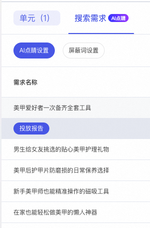

## **六、常见问题**

**Q2：存量计划是否可以使用**

A：可以切换，仅限自定义推广-智能出价

**Q3：是否支持屏蔽关键词**

A：支持；需要注意，AI点睛的屏蔽词生效在计划粒度，无需每个单元重复添加

**Q4：我一句话描述需求，AI真能理解得准吗？会不会乱投？**

A：可点击「方案解析」查看AI对您描述的理解情况。AI点睛会优先执行您的指令，并综合商品和相似商品的自然搜索和历史投放数据，自动学习并扩展相关优质流量。如果发现流量方向有偏差，可随时通过自然语言指令实时纠偏，实现“AI执行 + 您掌舵”的双重保障。

**Q5：用了AI点睛，还需要我自己选关键词/人群吗？**

A：不需要手动穷举，但建议您“给出引导”。系统会自动挖掘高相关词和人群，大幅降低操作门槛；但如果您对目标客群有明确判断（比如“主攻一二线城市新妈妈”），建议告诉AI，它就能优先投放这类流量，效果更优。
👉 简单说：您负责“定方向”，AI负责“找路径”。

**Q6：和现有的智能出价计划有什么区别？**

A：核心差异在于 “理解力 + 控制力 + 洞察力”三重升级：

理解更深：传统智能计划依赖历史数据，而「AI点睛」能理解您用自然语言表达的新诉求（如新品、新卖点）

控制更强：支持实时通过自然语言干预扩流范围，加强可控性

洞察更细：独家提供买家真实搜索词、人群画像分布、竞品流动分析，帮您看清“钱花在哪、人从哪来”

**Q7：适合新手商家用吗？**

A：如果商家对当前计划最适合投放的流量还不够清楚，建议先使用「推荐」模版，交给系统自动优化，投后再根据搜索词和人群效果情况，在AI点睛中设置特定指令，如搜索词列表发现和冰丝相关的词拿量偏少但是转化很不错，可以增加指令「加大力度触达冰丝相关词」。

**Q8：投放效果不好怎么办？能快速调整吗？**

A：可以！「AI点睛」支持实时策略迭代：结合每日更新的投后分析，您能快速定位问题，针对性调优。

**Q9：为什么搜索词的数据和计划汇总会对不齐？**

A：一是，目前搜索词数据只是为了帮助客户调整计划流量方向，仅披露有点击的优质搜索词，因此会存在搜索词汇总少于计划汇总的情况，请以计划维度的数据为准。二是，搜索词的实时数据产出时间可能有一定延迟，如计划已有数据但搜索词未产出，请耐心等待，一般不超过5分钟。

**Q10：「关键词报表」和「人群报表」为什么找不到AI点睛的数据？**

A：关键词报表中将AI点睛的数据记录为单元汇总数据，人群报表中不记录ai点睛的人群数据。

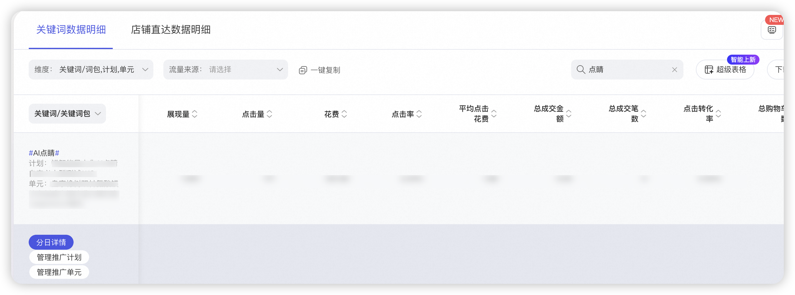

**Q11：如何关闭AI点睛功能**

A：针对新建计划，点击关闭按钮即可；针对存量AI点睛计划，功能无法关闭，可以优化搜索需求描述，如果效果持续不符预期，可以进行计划暂停

**Q12：计划最多可以选择多少个需求**

A：一次生成最多是10个，一个计划最多20个
