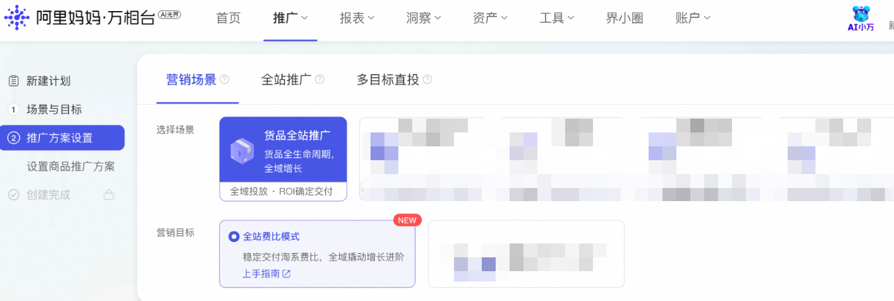
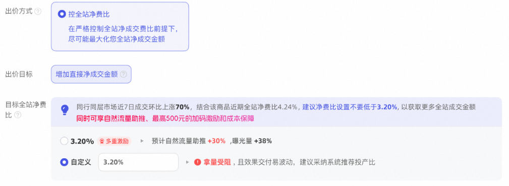

# 「控全站费比」重磅上线 稳定控商品全站净成交（预告版）

> 来源：https://alidocs.dingtalk.com/i/nodes/N7dx2rn0JbxOaqnACZ95vRBDWMGjLRb3

**即将开启，定向邀约，目前不支持申请开白**

## 什么是「全站费比模式」？

**「全站费比模式」是货品全站推广全新推出的营销目标，在****原有控投产比出价****的基础上，升级为****控商品全站净成交费比**，帮助商家更稳定地管理推广成本，同时撬动淘系全域（公域+私域）成交增长。

*原控投产比&最大化拿量会收拢到全站标准模式内

## ** 核心升级点**

**费比更可控**** **以全站净成交费比为核心控制目标，系统AI智能优化出价，实际费比达成更稳定，告别成本忽高忽低的困扰；

**成交更全面** 优化目标对齐淘系全站净成交，覆盖搜索、推荐等公域流量及购物车、订单复购、消息中心等私域流量，让每一分投入都带来全域生意增量；

**算账更清晰** 控全站费比模式下，优化投放商品的直接成交，报表中的成交数据均为直接成交口径（非全店或全引导口径下的成交），让每一件商品的成交都明明白白；

**操作更简单** 仅需设置目标费比和预算，系统智能匹配全域流量，投放链路简洁高效，降低操作门槛。

## ** **视频介绍 快速上手

## ** **适用场景与商家

**适用商品** 建议优先选择带有**「平台推荐」**标签的商品进行投放；

**推广模式**** **当前支持**单品模式**投放；

**适用商家** 希望稳定控制推广成本、同时追求**全站成交最大化增长**的商家。尤其适合以下场景：

对推广费比有明确控制诉求，希望成本更确定、更透明；

希望借助平台能力撬动全域流量（公域+私域），不再局限于搜索和推荐；

追求操作简化，减少手动调优频次，让系统稳定交付效果。

## ** **核心能力详解

### ** ****出价方式：控全站净费比**

**优化目标： 增加直接净成交金额**

**（**在稳定控制商品全站净成交费比的前提下，尽可能最大化推广商品的全站净成交金额。系统围绕您设置的目标费比进行智能出价优化，让实际投放费比更接近您的预期）

**目标全站净费比=花费 / 推广商品的直接净成交金额**

花费：广告推广费用

推广商品的直接净成交金额：包括搜索、推荐、购物车、订单复购、消息中心，也包括直播、联盟、百补和秒杀的商品直接净成交金额

| **控全站净费比 vs 控投产比** |  |  |
| --- | --- | --- |
|  | 控投产比 | **控全站净费比** |
| 出价方式 | 目标投产比 | **目标费比** |
| 成交统计范围 | 公域（搜索+推荐）成交 | **淘系全站净成交（公域+私域+其他）** |
| 费比控制 | 投产比波动可能较大 | **系统严控费比达成，更稳定** |
| 预算策略 | 手动设置 | **建议不限预算，释放全域增长潜力** |
| 成交金额口径 | 全引导成交金额（默认设置下） | **投放商品的直接净成交金额** |

### ** 预算设置**

**支持预算类型：** 不限预算 & 每日预算

**推荐设置：** 系统默认选中「不限预算」，建议保持不限预算以充分释放全站成交潜力。在预算充足的前提下，系统能够更智能地分配全域流量，最大化您的成交增长。

**预算建议：** 系统会根据您的商品历史数据和同类目投放情况，智能推荐合理的预算范围，帮助您快速上手。

### ** **出价建议与成效预估

**费比推荐值：** 系统根据同行同层级的竞争水平，结合您商品的历史数据，智能推荐目标费比值。建议参考系统推荐值进行设置，以获得最佳投放效果。

**成效预估：** 当您设置的费比达到推荐水平时，系统将预估为您带来的净成交、点击、曝光增量，让投放效果提前可视。

**设置预警：**

若设置费比过低，系统将提示当前费比过低，拿量受阻，不利于全站成交增长，并提供一键采纳推荐值；

若设置费比合理，系统将展示预期增量提升幅度。

### ** **数据指标与报表

**专属数据看板：** 全站费比模式在推广管理中拥有独立的数据看板，与全站标准模式分开呈现，确保数据清晰、不混淆。

**核心数据指标：**

**全站费比：** 您的实际推广费比（消耗/全站净成交金额）

**全站成交金额：** 投放期间产生的淘系全站净成交金额

**消耗：** 推广计划产生的广告消耗

**核心位置数据：** 搜索、推荐等核心资源位的展现量和点击量

## ** ****「控全站净费比」**成本保障（赔付已上线，提示卡片待上线）

全站费比模式升级了成本保障机制，赔付门槛接近商家俗气松，让您投放更安心：

**保障条件：**

计划需达到成本保障基础条件

置信状态：计划累计消耗需高于单笔成交成本

控费比超成本比例：实际投放费比＞费比设置值*1.4%，ROI归因周期15天

**赔付金额：**赔付金额=实际消耗-[实际15天归因成交金额/（目标控费比*1.4)]，计划当日多次调价的，系统按当日设置的最高费比值*1.4为保障目标

温馨提示： 计划当日多次调价的，系统按当日最高费比设置值 / 0.X 为保障目标。建议投放稳定后避免频繁调价，以获得更好的保障效果。

## ** **一键切换：从控投产比到全站费比

为方便已在使用控投产比计划的商家快速体验全站费比模式，我们提供**一键切换**能力：

**切换流程：**

| **Step1**** ** 进入货品全站推广 > 推广管理 > 全站标准模式Tab； **Step2** 勾选需要切换的计划，点击**「转投全站费比模式」**； **Step3**** ** 在引导弹窗中确认商品列表和费比设置； **Step4** 系统将为您批量创建新的控费比计划，同时暂停原有计划； **Step5**** ** 切换完成后，可在「全站费比模式」Tab中查看和管理新计划。 |  |
| --- | --- |

**切换说明：**

系统将基于您选择的商品自动创建新的控费比计划，原计划暂停（新旧计划互斥）；

出价方式自动切换为「控全站净费比」，预算默认引导为「不限预算」；

支持批量筛选和编辑，单次可切换多个计划。

## ** **快速上手指南

| **步骤** | **图示** |
| --- | --- |
| **Step 1：新建计划 或 标准计划转投** 进入货品全站推广 >全站费比模式 新建计划，选择营销目标为「全站费比模式」 进入货品全站推广 > 全站标准计划 > 勾选需要转投计划 > 批量计划设置 > 切换成「全站费比模式」 | 新建： 转投： |
| **Step 2：选择推广商品** 选择您要推广的商品，建议优先选择带有「平台推荐」标签的商品，享受成本保障权益。 |  |
| **Step 3：设置目标费比** 参考系统推荐值设置目标全站费比。费比设置越高，拿量竞争力越强；建议从推荐值开始尝试。 |  |
| **Step 4：设置预算** 建议选择「不限预算」，充分释放全站成交潜力。如需控制日消耗，可设置每日预算，建议不低于系统推荐值。 |  |
| **Step 5：开启投放** 确认设置后点击「完成创建」，系统即可开始为您智能投放，撬动淘系全域流量，加速成交增长！ |  |

## 商家热问榜

**Q1：全站费比模式和全站标准模式是什么关系？**

A1：两者是货品全站推广下的两种营销目标。全站标准模式即当前线上已有的控投产比投放模式和最大化拿量模式；全站费比模式为全新推出的营销目标，以控制全站成交费比为核心，覆盖更广的成交范围。两种模式的数据独立呈现，同一商品同一时间仅允许在一种模式下投放。

**Q2：全站费比模式支持全店模式吗？**

A2：一期仅支持单品模式，全店模式暂不支持，敬请期待后续升级。

**Q3：全站费比模式的覆盖资源位有哪些？**

A3：投放覆盖淘系全域流量，包括搜索结果页、首页猜你喜欢信息流、购中/购后猜你喜欢等公域资源位，以及购物车、订单复购、消息中心等私域场景。系统会智能匹配最适合成交的流量渠道，无需手动设置。

**Q4：为什么选择「不限预算」？**

A4：不限预算可以让系统在投放期间充分捕捉全域成交机会，避免因预算限制错失私域成交。系统在严控费比的前提下智能分配预算，预算充足的商家建议优先选择不限预算，以获得最大化的全站成交增量。

**Q5：切换为全站费比模式后，原计划的数据还在吗？**

A5：原计划数据保留不变，可在「全站标准模式」Tab中继续查看。新创建的费比模式计划数据在「全站费比模式」Tab中独立呈现。

**Q6：全站费比模式支持多目标出价和一键起量吗？**

A6：一期暂不支持多目标出价和一键起量能力，后续版本将逐步升级，敬请期待。

**Q7：全站费比模式下如何查看创意数据？**

A7：全站费比模式一期采用智能创意，暂不支持自定义创意添加和创意维度数据查看。后续版本将提供更多创意能力支持。

**Q8：费比设置有什么建议？**

A8：建议参考系统推荐值进行设置。费比设置过低可能导致拿量受限，建议保持推荐值或略高于推荐值，以获得稳定的成交增量。投放稳定后，不建议频繁调整费比，每次调整幅度不宜过大。

## 温馨提示

全站费比模式的消耗数据会计入货品全站推广场景报表，但其他基础报表（如计划报表、人群报表等）暂不包含该模式数据，请在专属Tab中查看；

推广管理中的**「权益中心」与「营销雷达」**暂不支持全站费比模式，后续版本将逐步适配；

如需了解更多关于货品全站推广的能力介绍，请查看[「货品全站推广」操作指南]。

产品最终呈现以万相台无界广告后台样式为准

## 商家答疑反馈群

如您对以上有任何疑问，可向阿里妈妈小袋鼠客服咨询或者钉钉扫码进群咨询（8月开启）；

