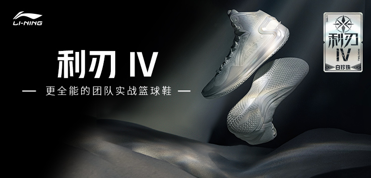
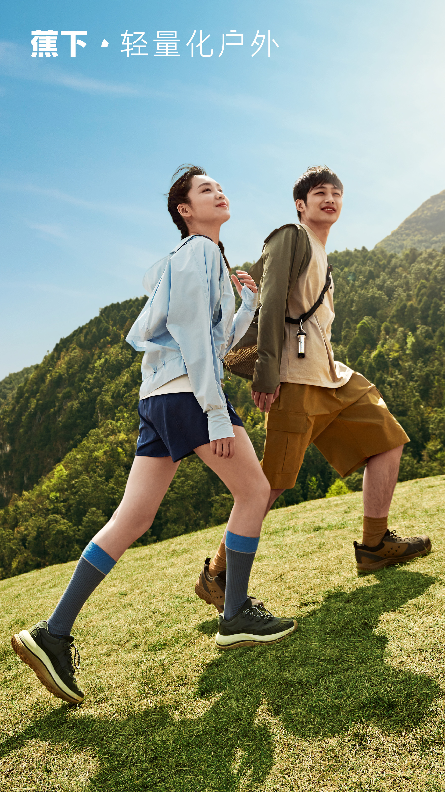

# 👏人群运营优秀投放案例

> 来源：https://alidocs.dingtalk.com/i/nodes/N7dx2rn0JbxOaqnACvz27L9xWMGjLRb3

**原语雀文档链接：**https://yuque.antfin.com/chenchun.chen/gqhty9/um8qt16ay77ckid9

---

从引力魔方到万相台无界-精准人群推广，人群方舟上线至今，产品使用客户成绩斐然。相较普通计划，人群方舟计划的：

**新客流转**超**50%**，**获客成本**降低超**30%**；

**CVR**提升**42%**，**ROI**提升**35%**。

人群方舟的产品能力也在不断优化和升级：

**「竞争航线」****突破店铺自身圈层人群，聚焦全域关注店铺挖掘增量人群**

**「精细化人群调控」**持续升级，覆盖**全部系统定向人群画像洞察**，更多标签灵活调控支持。

**「人群资产转化」**告别"只加购不转化"，ROI平均提升**35%**，低转化**资源位屏蔽比例超**60%**。

小二总结了至今的优秀商家经营案例，供掌柜们学习参考，助力您在人群营销战略上全面提效！

---

| **雷士照明：****618用「方舟」** **雷士照明**借助**「人群方舟」**高效承接流量，实现人货资产大丰收。在618抢先购阶段触达人群超278W，获客成本效率全渠道TOP1，ROI同比增长111%。 | **罗莱家纺：****618用「方舟」** **罗莱**通过**「人群方舟」**计划针对店铺**DEEPLINK**不同阶段人群需求，围绕核心TA触达，实现精准营销。对比去年618同期加购成本-15%，ROI+105%。 | **松下洗衣机：****618用「方舟」** **松下**通过**「人群方舟」**精准定位高营销价值家装人群，新品快速起量。在618第一波段，加购率提升20倍，ROI提升4倍，有效实现品牌关键人群资产积累。 |
| --- | --- | --- |

---

| **珂润：双11用「方舟」** **全周期人群策略爆发成交** | **斯凯奇：双11用「方舟」** **触达多链路人群为成交供源** | **水星家纺：双旦用「方舟」** **人群深触达助推业绩创新高** 面对降温所带来的商机，恰逢双旦之际，水星家纺借势突出重围 通过使用**人群方舟「品牌人群运营」定制的专属摇摆人群包**，在二次触达品牌核心人群的同时，面向未触达的高营销价值人群和摇摆人群精准触达，**CPC同比降低20%，ROI同比提升30%**，助力单品在双旦期间业绩创新高。 |
| --- | --- | --- |

---

## 品牌案例-李宁

**【策略组合】货品成长清晰规划，人群资产收割转化**

**李宁**，中国体育用品行业领军品牌，产品线涵盖运动鞋、服装、器材、配件等多个领域。科技创新突破、追求用户体验、表达国潮文化，李宁不断突破自我，为消费者带来更多运动生活方式新选择，将“一切皆有可能”贯穿始终。

618大促前期蓄水阶段，李宁对一款潜力新品运动鞋投放了人群方舟的**「提升兴趣新客人数」**计划。通过开启【智能定向】，结合【最大化兴趣新客数量】出价，并将预算设定在系统建议区间，**系统最大程度智能抓取高价值潜新客，同时持续优化新客获客成本**。整个大促蓄水阶段，该条计划的宝贝**收藏加购率超20%**。人群方舟助力李宁成功打爆该款新品。

在提升兴趣新客资产的同时，李宁还在蓄水期对多款成长期潜品投入了人群方舟的**「提升首购新客数量」**，优化平销期成交人群规模，持续为大促生意增长引流。面向【全域拉新人群】开启【智能定向】，结合【自定义出价/智能调价】灵活调控资源位溢价，李宁的**首购新客资产明显得到提升，人群流转漏斗全链得以优化**。值得一提的是，智能定向与自定义出价的结合还可开启**精细化人群调控**功能，从而**对智能定向投放的标签画像进行溢价调控，以提升特征标签的拿量能力**，兼顾规模与精准。

大促开始后，李宁挑选多个明星爆品开启**「人群资产转化」**，对前期蓄水人群进行高效收割。【智能定向】结合【最大化成交量】出价，算法持续从蓄水人群池与同行高转化率人群捞选目标画像进行定位与触达。大促期间李宁的**「人群资产转化」类计划的平均ROI超其他计划约100%，平均CVR超其他计划约300%**，助力李宁高效优质达成大促经营目标。

---

## 品牌案例-蕉下

【人群资产转化】**控投入产出比出价，最大化拿量兼顾优异ROI**

蕉下，专业的轻量化户外品牌，主打年轻女性消费者防晒、出行等户外需求，搭建出覆盖服饰、伞具、饰品等多元化轻量化产品组合。

618大促期间（05.26-06.03），蕉下重点投入引力魔方**「人群方舟-人群资产转化计划」**。系统结合蓄水预热阶段消费者的行为偏好，帮助蕉下进行大规模人群收割。蕉下此次大促期间的人群收割效果表现十分优异：**人群资产转化 ROI 超其他计划 ROI 约36%；人群资产转化 CVR 超其他计划 CVR 约42%。**

今年618，蕉下还主推了一款新品防晒衣，该防晒衣在防紫外线的基础功能之上，追求轻薄透气、高弹凉感、潮流外观和时尚配色等户外新需求。为凝聚高转化人群流量，助力新品快速起量，蕉下针对此款商品开启**「人群方舟-人群资产转化」**计划，并使用**控投入产出比**进行出价，在**最大化拿量的同时兼顾优异 ROI**。

**在「人群方舟-人群资产转化」的助力下，该新品的「人群资产转化计划」在大促期间的 ROI 为11.60，转化率高达13.20%，最终该新品成功打爆，成为当前店铺防晒衣类目下销量 TOP 1。**

---

## 3. 品牌案例-某海外顶级护肤品牌

**【策略组合】大促经营战略多样，人群方舟组合承接**

某海外顶级护肤品牌，全线护肤品以保湿及抗衰老功效见长；彩妆线品类丰富亦受众多消费者青睐。

今年618大促前期蓄水阶段，该护肤品牌对一款明星单品开启了人群方舟**「提升兴趣新客人数」**计划。通过【自定义定向】圈选品牌/店铺/宝贝深度行为人群进行精准触达，结合【自定义出价/智能调价】，实现**全链拉新灵活可控，为店铺新客资产带来可观增量，辅助人群转化漏斗持续流转**。

在蓄水阶段，该护肤品牌还着重对会员专享购物金投入了人群方舟的**「人群资产转化」**，开启【智能定向】结合【最大化成交量】出价，将计划的拿量能力放开到极致，系统智能对店铺人群资产及同行高转化率人群*进行广域高效收割。算法**对高转化人群的精准抓取让转化率维持在10%以上，同时带来了30+的优异ROI**。而通过购物金提前锁定消费者购买行为的经营决策，也为该护肤品牌在大促期间的经营打下牢固基建。

**：人群方舟「人群资产转化」在平销期核心触达本店铺高转化率人群，大促期则不局限于本店铺人群，触达更多同行高转化率人群，点击转化率平均提升30%。*

在大促期内，该护肤品牌选择对一款超级爆品开启**「人群资产转化」，**打响人群收割之战。通过【自定义定向】精准抓取目标人群，开启【自定义出价/智能调价】根据人群标签差异化出价。该品牌在此次618大促期间的人群收割效果表现十分优异：**人群资产转化 ROI 超其他计划 ROI 约270%；人群资产转化 CVR 超其他计划 CVR 约240%****。**

**在人群方舟的助力下，该护肤品牌完美实现平蓄促收，人群资产规模提升明显，行动人群持续流转加深。而丰厚的人群资产积蓄在未来也将为该品牌生意增长持续做出贡献。**

---

## 4. 品牌案例-某智能家居品牌

**【策略组合】新品打爆分步走，新客流转促加深**

某智能家居品牌，多款智能家居产品长期高居天猫榜单热销榜，核心技术不断创新迭代，引领现代家居生活新风尚。

今年618大促期间，该品牌对主推新品投放了多个人群方舟计划。大促前期蓄水阶段着重投放**「提升品牌首购人数」**计划，通过【自定义人群】对关键词兴趣类人群进行精确定位，结合【最大化首购人群数量】出价，并提高预算上限。算法在屏蔽品牌购买人群的基础上，不断抓取目标人群进行触达，帮助品牌优化新客规模，促进更多新客在大促期流向转化。

而在大促期内，该品牌对此款主推新品还开启了**「人群资产转化」**。通过【智能定向】结合【控投入产出比】出价，**系统高效竞争优质流量，同时保障效果ROI不低于目标值**。

整个618大促期间，人群方舟为此款主推新品带来**2.5w+新客资产增量，首购新客获客成本较其他计划降低约19%，CVR较其他计划提升约90%，ROI较其他计划提升约20%**。以人群增长撬动生意爆发，人群方舟助力品牌推动新品迅速成长，逐步走上类目销量TOP爆品序列。

---

---

## 5. 品牌案例-某淘宝粉丝女装店

**【人群资产转化】人群出价自定义，目标效果高可控**

某淘宝300w+粉丝女装店铺，主打潮流舒适少女风，回头客10w+，店内30+商品月销量过千。

今年618，该店铺在第一波大促前期蓄水预热阶段，对销量靠前商品使用「**人群方舟-提升兴趣/首购新客」**进行拉新预热，**提升收藏/加购率；**大促期间（05.26-06.03），则重点投入「**人群方舟-人群资产转化计划**」，人群收割效果显著：人群资产转化 ROI 3.09，超其他计划 ROI 约219%；人群资产转化 CVR 1.45%，超其他计划 CVR 约499%。

该店铺围绕5.31尾款日上新计划，选取一款主打「元气满满多巴胺少女风格」并兼顾「防晒」功能的新品，对其投放**「人群方舟-人群资产转化计划」：**

使用**自定义人群**，聚焦关键词兴趣人群（如【t恤 长袖 防晒】、【夏季 度假风 甜美】等）、店铺相关人群（如【喜欢我的店铺】、【深度行为人群】等）、宝贝相关人群（如【相似宝贝】、【喜欢我的宝贝】等）进行定向，并开启**目标人群扩展**；

使用**自定义出价**，分定向人群进行出价并设置资源位溢价区间。

全程白盒自定义，实现每一次广告点击**高可控性**。

**在「人群方舟-人群资产转化」的助力下，该「新品-人群资产转化计划」在大促期间的 ROI 为7.97，转化率高达4.23%，新品上线至今销量已达2k+，当前店铺销量 TOP 5，一跃进入爆品序列。**

---

---

## 6. 品牌案例-**某高山红茶品牌店**

**【人群资产转化】主推商品齐收割，智能定向高效达成推广目标**

某天猫10年茶叶老店，主打高性价比高山好茶，收获百万茶友粉丝和近10万回头客。

今年618第一波大促，该店铺主打**通过爆品进行人群收割**，对销量top4商品开启「**人群方舟-人群资产转化计划」**：

使用**智能定向**人群，通过大数据智能推广高转化大促人群；

结合**最大化成交量**出价，在预算范围内尽可能获取更多的优质流量。

**在「人群方舟-人群资产转化」的助力下，该「多款主推商品-人群资产转化计划」的 ROI 为3.53，转化率高达6.62%，远超同期其他计划 ROI（0.80）和 CVR（0.89%）。**
