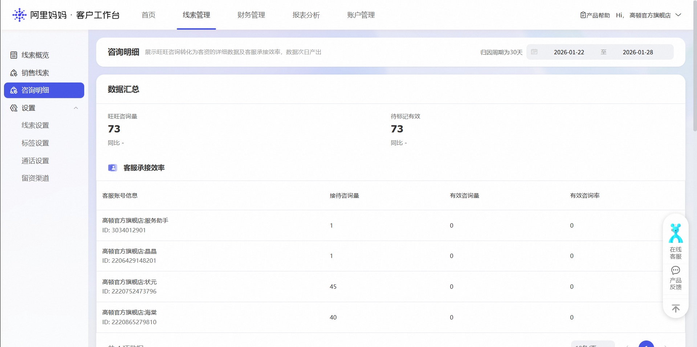
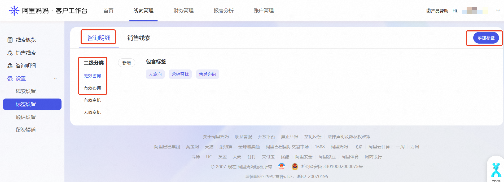
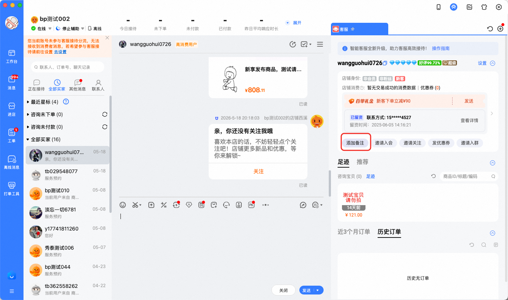
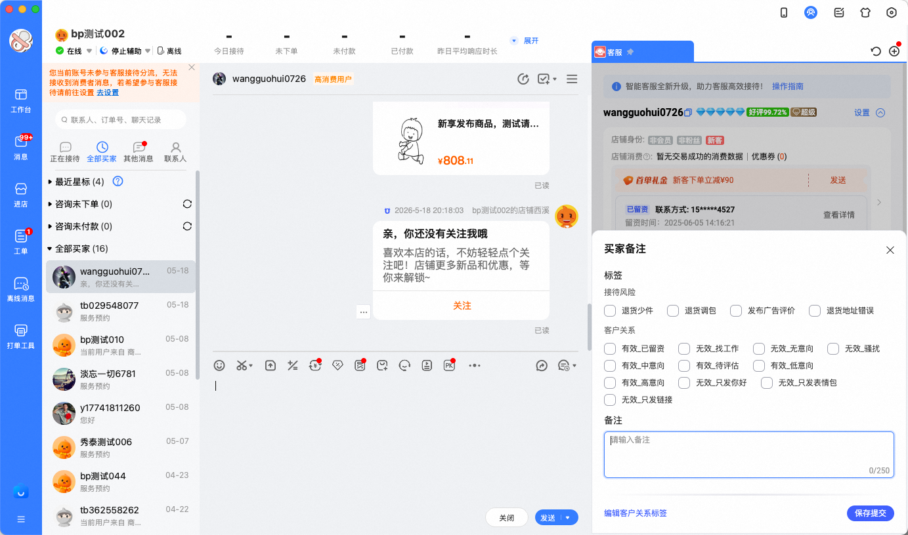
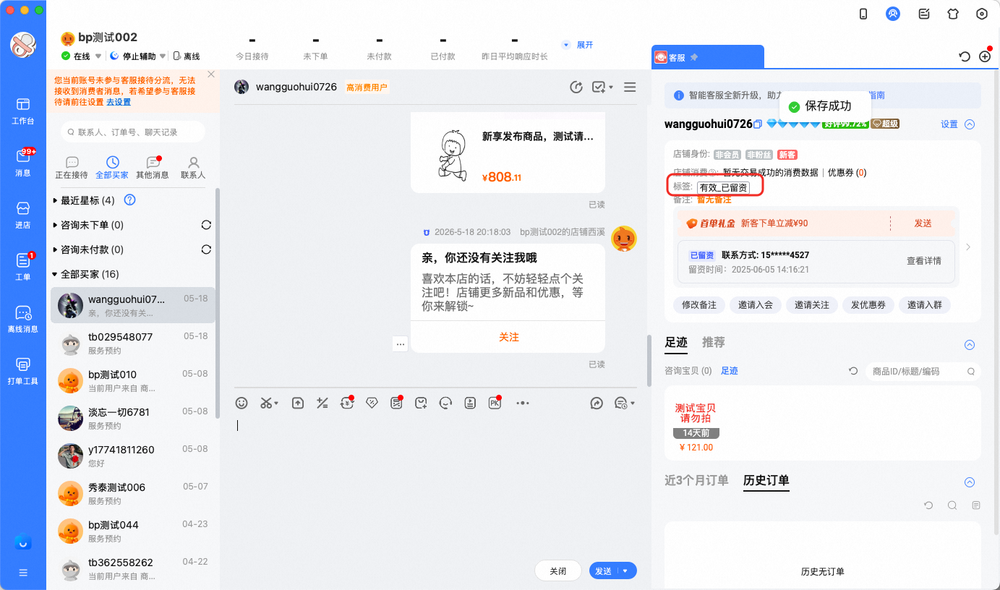
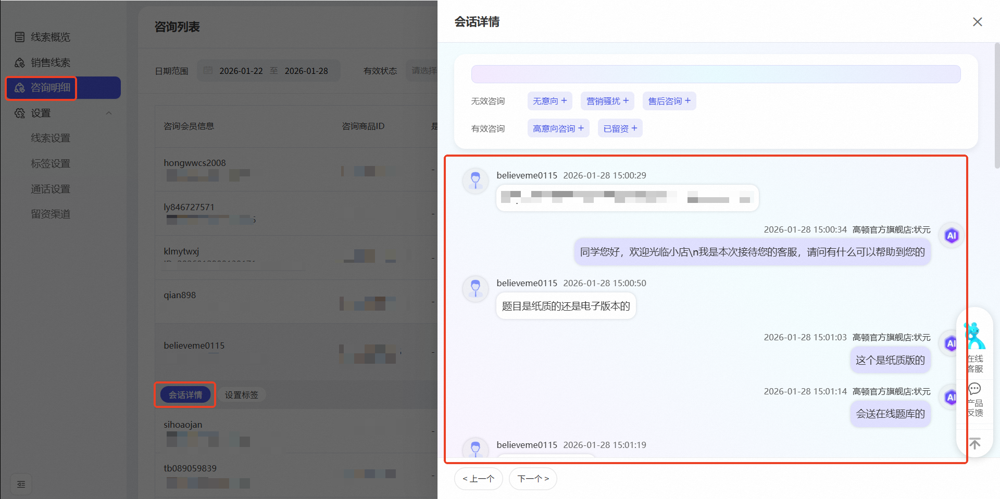
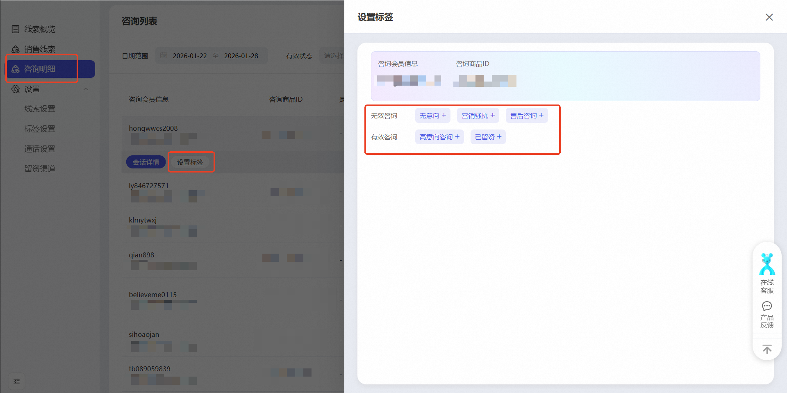
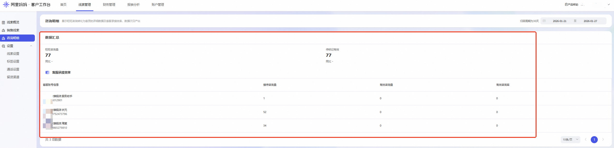
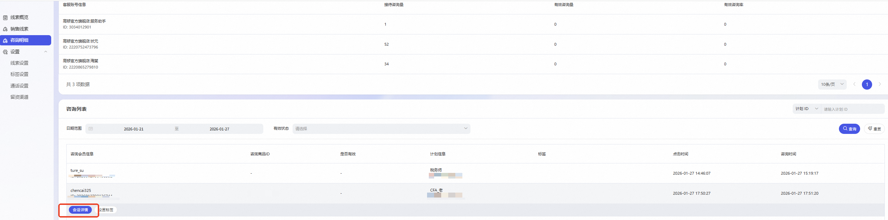

# 线索推广-咨询明细&咨询有效打标

> 来源：https://alidocs.dingtalk.com/i/nodes/Obva6QBXJwxNZoMOC6RGQBz38n4qY5Pr

“打标不难、见效快、权限灵活、数据安全——每天花10分钟，让您的线索推广越投越准。”

---

## 一、产品功能：有效咨询打标

### 1. 功能描述

“有效咨询打标”是**商家主动参与线索推广算法模型训练**的核心工具。商家可为每条旺旺咨询/留资打上“有效”、“无效”或其他自定义标签，平台可沉淀高质量正向人群与负向样本，针对商家线索推广持续个性化优化线索推广算法模型，实现**“越打标，模型越懂你；越训练，线索越精准。”**

**🎯产品优势**

**看得清转化、教得会模型**——让每一分推广预算都花在真正有效的客户上。

**🔥转化全链路一目了然：**支持按客服维度拆解接待量、有效咨询量、转化客资数，支持按计划ID、商品ID查询对应咨询，并且展示会话记录详情，完整还原**“旺旺咨询 → 客服承接 → 客资转化”**路径，帮助商家精准评估服务效能；且T+1 数据自动更新，30天归因周期保障分析完整性。

**🔥有效性打标反哺模型：**平台为每一条旺旺咨询/留资线索提供有效、无效标签，商家也可依据行业业务判断及实际语聊情况设置对应正/负向标签，并依据客服语聊详情进行有效性打标，**打标数据实时反哺营销模型，实现“投得越久，人群越准，模型越用越聪明”。**

**🔥正负向训练降本增效：**通过沉淀正向高营销价值的人群与识别负向无效标签的用户行为（骚扰人群、空号、无意向用户）打造商家个性化数据池，无效/骚扰人群自动化过滤减少预算浪费，同时沉淀高营销价值的人群画像以精准放大优质咨询及线索，**提升客服转化效率，驱动营销模型精准学习**，形成**“服务提效+推广提效”**的正向循环，实现降本增效双驱动，ROI持续提升。

### 2. 商家端操作流程

**操作平台：千牛平台——客服旺旺语聊页面：****添加备注**

**操作平台：阿里妈妈客户工作台——线索管理：****新增咨询明细**

#### 第一步：设置标签体系

平台提供**预设标签模板**：“有效”、“无效”2个分类；

商家可基于自身业务场景，**在预设标签模板下自定义添加自定义正向/负向标签**（例如：“空号/拒接”、“无意向”等）；**！！！所有正向标签及负向标签必须分别归入有效、无效分类下，否则营销算法模型将无法分析及应用；除“有效/无效”两个分类外，其他分类均不生效！！！**

标签支持分组管理，便于长期维护。

**操作路径：线索管理——标签设置——咨询明细——在有效咨询/无效咨询二级分类下添加自定义标签**

#### 第二步：对咨询记录打标

**支持****千牛客服端一键打标****和****客户工作台打标****两种方式****，同一个咨询使用一种打标方式即可****。**

**千牛客服端一键打标****预计6.25上线。**

**第一种方式：****千牛客服端一键打标**

**功能开通入口：****第一次使用，必须进入【阿里妈妈·客户工作台】—【线索管理】—【留资渠道】—【客服咨询打标工具】，点击【确认开通】。**

**千牛平台-旺旺语聊页面：****当消费者发起旺旺咨询时，客服可在千牛平台的旺旺语聊页面右侧，客户信息下方的****【添加备注】****侧进行打标。点击后，浮层展示您在客户工作台设置的有效与无效标签，勾选对应标签后点击保存提交即可完成咨询打标。打标成功后，客户信息将增加标签项，显示您已打标签。**

**第二种方式：****客户工作台打标**

**查看明细-操作路径：**在**咨询明细**列表中，点开任意一条咨询记录，并**点击“会话详情”**——系统右侧弹出**浮层——展现用户咨询客服的详细聊天记录**

**咨询打标-操作路径：**在**咨询明细**列表中，点开任意一条咨询记录，并**点击“设置标签”**——系统右侧弹出**浮层**——商家/客服**选择对应有效/无效咨询标签**，一键完成打标，操作高效无负担。

### **3.打标数据算法应用**

**一期能力****（已上线）****：聚焦打标基建，启动数据沉淀**
当前阶段，平台优**先开放咨询打标功能**，支持商家对每条旺旺咨询手动标记“有效”或“无效”标签，并可自定义符合自身业务的正向有效（如“已加微”“高意向”）与负向无效（如“空号”“非目标客户”）样本。
**核心目标：帮助商家主动积累高质量训练数据，逐步构建专属的有效人群数据池。**

**二期能力****（已上线）****：模型升级，智能提效**
产品能力：平台将基于一期积累的历史打标数据 + 后续实时新增打标，全面升级“有效咨询”智能识别模型。模型训练后随实时打标数据即时生效，系统将自动：

减少对低效/无效人群的曝光；

优先触达高转化潜力人群；

提升商家推广计划整体有效性。

**📌 关键行动呼吁：**

**阿里妈妈CRM：请务必启动咨询明细打标并持续！**
模型效果高度依赖前期数据积累——打标越早、样本越全，二期模型越精准。建议至少连续打标2周以上，确保模型收敛稳定，充分释放二期智能投放红利。

**万相台·AI无界·线索推广：必须开启【提升有效咨询量】推广**。商家操作手册见>>

## 二、新增报表：咨询明细

### 1. 功能描述

“咨询明细”模块全面还原客户从点击到旺旺咨询、再到转化为有效客资的完整链路。通过结构化数据展示，帮助商家清晰掌握**客服承接质量**与**转化效率**，为优化客服策略与投放计划提供决策依据。

本模块展示两大核心数据：

**咨询概览明细**：展示全店咨询行为与客资转化结果，并按客服维度拆解接待表现，量化服务效能。数据每日更新，**T+1产出**（即昨日数据今日可见），确保时效性与可操作性。

**咨询列表：**支持按每条咨询进行打标，并可展现单条咨询下详细聊天内容，完整还原客户咨询——客服承接——留资转化全链路。具体可展现：咨询会员名、咨询商品、是否有效、计划信息、料条内容、点击时间、咨询时间、标签等详细信息。

### 2. 操作权限

**适用账号**：店铺主账号及子账号均可登录使用。

**客服效率分析**：在“客服承接效率”模块中，支持按**具体客服人员**筛选，查看其对应的：

接待咨询总量

有效咨询量（产生实质沟通）

转化客资数（成功留资或进入销售流程）

✅ 帮助管理者识别高效率客服，优化排班与培训重点。

### 3. 数据总览规则

默认展示**最近30天**的汇总统计数据（采用30天归因周期，确保转化行为完整归因）；

支持自定义时间范围（如7天、15天、自定义区间），灵活适配不同复盘节奏；

所有指标均支持导出，便于线下分析与团队同步。

## 三、价值总结

| **功能** | **核心价值** |
| --- | --- |
| **旺旺咨询明细** | 透视客服转化漏斗，量化服务效能，驱动团队优化 |
| **有效咨询/线索打标** | 让营销算法模型“学会”识别你的理想客户，降低无效花费，提升ROI |

**立即行动建议**：

每日查看“客服承接效率”，总结高转化客服承接流程及话术，优化客服服务效能；

每日对线索、旺旺咨询进行有效性打标，持续喂养模型，精准放大优质线索。

结合30天趋势数据，调整推广定向与客服话术。

通过“看数据 + 打标签”双轮驱动，让每一次曝光都更接近成交！

## **四、常见QA**

###### **为什么在线索管理平台看不到明文手机号？**

答：自9月1日起，针对部分违规风险较高的类目进行外呼/线索明文查看的权限回收。针对**部分类目的C店商家**，进行以下优化调整：

**若您属于以下类目，C店，此前已通过线索推广获得过客户线索（即有留资记录）：**
您将保留隐私号外呼权限，可继续通过平台安全外呼功能联系消费者；但线索的明文信息查看权限将进行回收。

**若您属于以下类目，C店，此前未通过线索推广获取过客户线索（无留资记录）：**
为保障新商家的合规使用， 外呼及明文查看权限均不开放。

其余类目商家，则可正常进行隐私号外呼、明文查看，若您的店铺没有明文查看权限，请填写问卷进行申请。https://survey.taobao.com/apps/zhiliao/VENIUcIwa （每周一、三、五下午开通权限。）高风险类目自查文档：

###### **我打了标，真的能提升转化效果吗？多久能看到变化？**

答：一期能力优先支持商家做咨询/线索打标，积蓄商家有效人群数据池，2月底平台将对应升级“有效咨询”模型能力，历史打标数据与实时打标数据将进入模型训练，系统将逐步减少无效曝光，提升有效线索占比；建议持续打标2周以上，模型收敛更稳定，ROI提升更显著。

###### **如果打错标签了，会影响模型吗？**

答：影响有限，且可修正。模型具备一定抗噪能力，少量误标不会导致方向性偏差；支持随时修改或删除标签，系统会动态更新学习样本；建议结合聊天记录判断，提升打标准确率。

###### **现在线索管理-销售线索模块线索数据并不完整，打标有用吗？**

答：有用，所有咨询/线索行为越早打标越能积累有效正向数据，可帮助算法模型越早生效；并且平台后续将会调整销售线索列表可见线索范围扩大至全量线索，与报表分析数据拉齐，将新增旺旺语聊、新零售组件留资、新零售卡片留资、商品订单等渠道线索。届时，商家可对通过线索推广收集的所有旺旺咨询与留资线索进行统一打标。

###### **平台预设的标签不符合我们行业，能自定义吗？**

答：完全可以！平台支持商家/客服创建自定义正向/负向标签（如“已到店”“预算<5万”等）；标签可分组管理，适配不同业务线；自定义标签同样参与模型训练，贴合您的真实转化标准。

###### **如果我不打标，会有什么损失？**

答：模型将“盲投”，导致：①无效线索比例高，浪费预算；②无法识别高营销价值的人群，错失精准放大机会；③长期来看，ROI低于同行，竞争力下降。

###### **为什么我在千牛客服聊天页面没有看见备注打标功能**

答：该功能为2026年6月新上线功能，预计6月底完全覆盖。6月底之前部分商家不可见。

*本功能由阿里妈妈智能营销平台提供，如有疑问，请联系负责小二：曳曳。*
