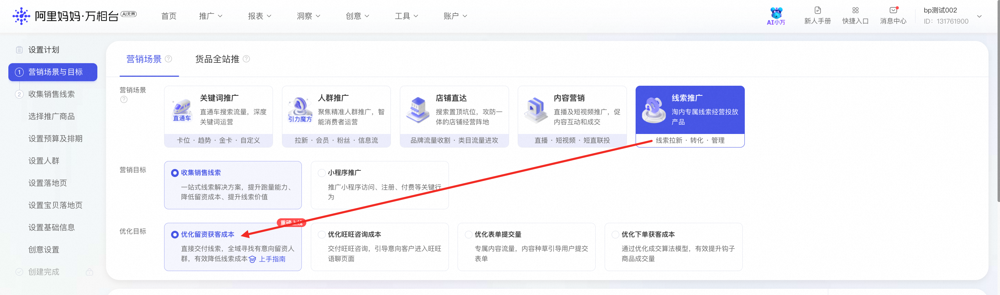
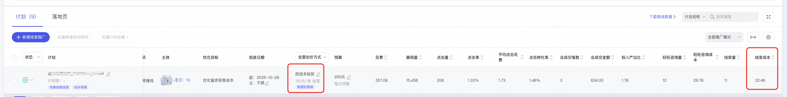

# 「成本保障」权益活动

> 来源：https://alidocs.dingtalk.com/i/nodes/Obva6QBXJwxNZoMOCReaRP6p8n4qY5Pr

## 1、活动简介

活动周期内（10.31～11.14），在线索推广**新建****控留资成本计划**的商家，可参与成本保障权益活动

## 2、参与活动要求

计划要求：10.31～11.14新建的控线索成本计划

消耗要求：

活动周期内，**线索场景消耗环比活动前15天（10.16～10.30）至少提升20%**

单个控线索成本计划计划在活动周期累计消耗≥3000元

## 3、保障说明

若控线索成本计划周期内成本超出商家设置的1.2倍，则针对超出消耗给予保障激励，每个账户最多返一次，**单个商家投放保障金额上限1000元**

保障周期内计划操作要求:

计划进入二阶段稳定投放期（7日累计10个线索可进入二阶段）

计划每天不暂停、不删除、不切换出价方式

计划若修改线索出价，修改后成本不低于活动周期初始设置成本，**且不低于推荐值80%**

参与保障的金额测算逻辑：

活动激励金额=【计划实际消耗-计划预期消耗】，【计划预期消耗=设置线索成本*1.2*线索量】，计划在活动期间多次调成本的，系统按最高线索成本为保障目标

示例：设置线索成本100元，实际获取了10个线索，花费1400元，则活动激励金额=【计划实际消耗-计划预期消耗】=【1400元-100元*1.2*10】=200元

## 4、保障券发放说明

代金券类型为满折券，可50%比例抵扣线索推广费用，仅限于线索场景使用

11.30日前发放到账，自发放后30日有效

## 5、操作指引

#### 怎么创建控线索成本计划，点击直达：创建控线索成本计划

#### 怎样查看计划成本是否达成？

计划列表里选择时间周期后，查看线索成本，与设置的线索成本相比较

#### 怎样计算**活动激励金额？**

1、找到控线索成本计划，查看活动周期内计划实际消耗

2、计算计划的预期消耗=计划设置线索成本*1.2*计划线索量

3、活动激励金额=【计划实际消耗-计划预期消耗】
