# 🔥「商品打爆」放大直播间互动权益，上新打爆、主推热卖！🔥

> 来源：https://alidocs.dingtalk.com/i/nodes/Obva6QBXJwxNZoMOCgk2GZoe8n4qY5Pr

**原语雀文档链接：**https://yuque.antfin.com/chenchun.chen/gqhty9/cnkw4vgp81869ys2

---

**产品介绍**（核心定位、底层逻辑、功能入口、视频课程）

**核心优势**（对比直播间推广、传统商详页推广的升级点）

**优秀案例**（快消/消电/家居等品牌在各类营销节点案例）

投放激励（投放达到一定金额，最高反哺6w广告流量）

**操作指南**（含选品建议、预算建议、自定义创意、报表）

**常见问题**（投不出去、消耗过快、效果不好等问题解法）

（👆🏻点击上放蓝色文字，可快速跳转至对应内容👆🏻）

### 产品介绍

商品打爆是「阿里妈妈超级直播」全新上线的**直播间单品推广工具**，用于商家主播在直播期间，**迅速打爆直播间内的高潜商品、爆款商品、重磅新品**等。

其投放逻辑为：投手创建商品打爆计划时，**选择要打爆的直播间商品**后，算法会**将预算使用在所选品上**，以**半屏商详/直播讲解**的形式**投放至搜索/推荐等优质公域渠道**，将**对所选品更感兴趣/有成交潜力的用户**引入直播间，从而**为所选品带来更多的直播间流量和成交**。

*该功能位于：超级直播PC端——直播间投放——持续投放模式——商品打爆***​**

**投放沟通交流 请加钉钉群：****99520002800**

**投放入口（万相台无界）：***https://one.alimama.com/index.html#!/main/index?bizCode=onebpLive&defaultSettingStrategyType=onebpLive&defaultSettingStrategyId=sceneLiveItem&lite2SourceCode=fastLiveConsole&xsourcefrom=yuque*

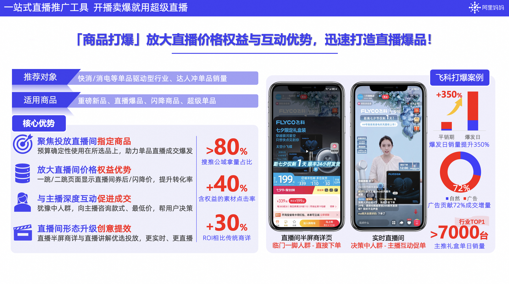

https://wxtwjbkj.yuque.com/wfndi7/kmeqln/cnkw4vgp81869ys2

### 核心优势

**相比于直播综合推广：**

**将推广预算聚焦投放在指定商品****，助力直播新品冷启加速，利用闪降品/爆品引流带动成交爆发**
直播间综合推广会将预算按效率分配在各个品、各个渠道，智能度高但可控性低；
商品打爆可以将预算聚焦投放在指定商品，既可以定向助力有潜力但缺乏历史数据的新品快速度过冷启动，又可以利用闪降款/引流款/热卖款引流用户到直播间，带动直播间GMV爆发！

​**提供商品维度数据报表****，交付指定商品在直播间内成交订单量、成交金额**
直播间综合推广交付整计划ROI，不提供分商品报表；
商品打爆可以查看指定商品在直播间内的成交订单量、成交金额，帮助商家更好地复盘投放效果。

**相比于传统单品推广：**

**将用户引入直播间而不是商详页****，加深用户与主播的互动/咨询，促进决策中用户成交**
传统单品推广只能将用户引入商详页，对于消费电子、美妆护肤品等决策链路较长的商品，用户流失率较高；
商品打爆可以向用户展示「直播间半屏商详」，有确定性购买需求的用户，可以直接下单；犹豫中的用户，可以直接在直播间内向主播咨询各个款式之间的性能、色彩、参数对比，并咨询怎么购买最优惠，大幅提高转化率。

**放大直播间价格权益优势****，一跳、二跳显示直播间券后价 / 闪降价，促进点击转化**
许多直播间专属价格权益（例如“今日闪降”），不会在传统商详透出，更无法通过传统单品推广工具投放到搜索、首猜等资源位。而通过商品打爆模式投放，将会在搜索推荐结果一跳、二跳展示直播间专属价/闪降价，以低于店铺的价格，吸引用户点击、下单！

​

### 🔥天猫双11 · 让好货 更热播🔥

#### “热播好货”功能介绍

「超级直播-商品打爆」推出**直播间好货识别与一键下单**功能，助力商家**激发更多优质货品的成交潜力**，利用直播间热销氛围优势**提升货品转化ROI**，实现**更多货品热销爆卖**！双11期间投放“热播好货”，可享受最高**50万PV**的超直券流量奖励！

**什么是“热播好货”？**

系统为您优选出 “直播间内近7天销量和GMV达到一定标准，并且在直播渠道转化表现更出色，同时剔除了购物金、小样、赠品等链接” 的商品，这些商品具有较强的货品力和营销潜力。

**为什么要投放“热播好货”？**

一个直播间可能会有数十件甚至上百件商品，分散营销不利于发挥 “拳头产品” 的竞争力优势。投放“热播好货”可以将预算集中在竞争力最强的10~20款商品上，提升引流效率与成交转化！

**我已经投放了3~5款核心货品，为什么要投放更多“热播好货”？**

单一货品的潜在购买人群是有限的，过度的预算集中可能会带来ROI的下滑。投放更多“二梯队货品”，充分激发营销潜力，能够为直播间带来显著的ROI提升与成交增量！

#### “热播好货”投放指南

方法一：进入超级直播首页，根据下方提示创建计划。直达链接>>

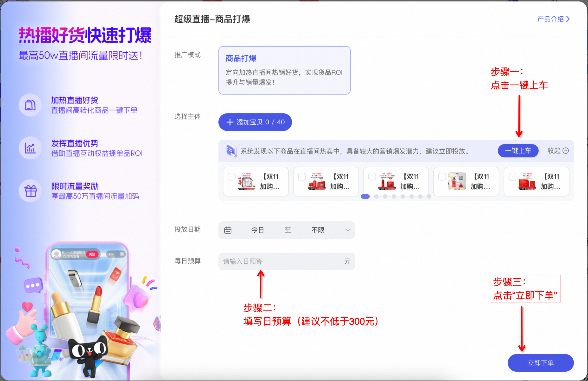

方法二：进入超级直播计划创建页，根据下方提示创建计划。直达链接>>

#### 双11“热播好货”投放奖励（即将上线）

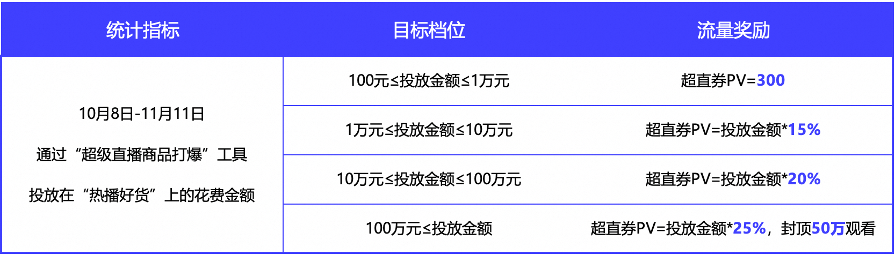

【活动时间】10月8日-11月11日

【面向人群】直播间内至少有1件 “热播好货” 的天猫商家（淘宝商家及达人需单独申请开白）

【参与方式】本活动无需手动报名，满足条件的商家自动参与，活动钉群99520002800

【活动入口】万相台无界版-超级直播首页

【入口链接】https://one.alimama.com/index.html#!/manage/content

【活动规则】10月8日-11月11日，通过超级直播商品打爆工具，投放“热播好货”：

金额满100元，发放超直券PV=300观看

金额满1万元但小于10万元，发放超直券PV=投放金额*15%

金额满10万元但小于100万元，发放超直券PV=投放金额*20%

金额满100万元，发放超直券PV=投放金额*25%，封顶奖励50万PV

【奖励说明】

发放时间：达成目标后，平台将在11月20日前发放超直券奖励，有效期30天。

发放形式：超直券是超级直播面向商家发放的「流量激励卡」。商家通过完成各类投放任务，可以获得任务对应面额的超直券奖励。商家开播期间，在超级直播后台花费1元下单使用超直券，即可向直播间引入面额对应的观看量，2小时内引流完毕。超直券流量以泛精准种草人群为主，有助于提升场观数、直播间互动。

注意事项：①由于客户未开播、提前下播等主观原因导致超直券投放结束，未释放的流量不退还；②逾期未使用的超直券将自动作废，平台不予补发。

​

​

### 投放案例

#### 双11狂欢案例

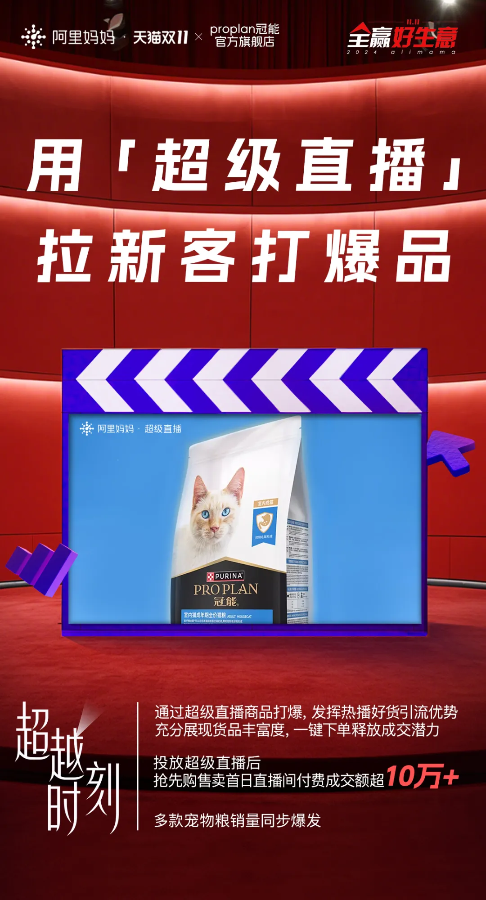

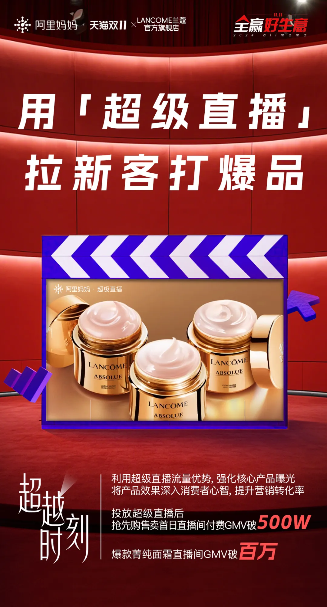

#### 38焕新周案例

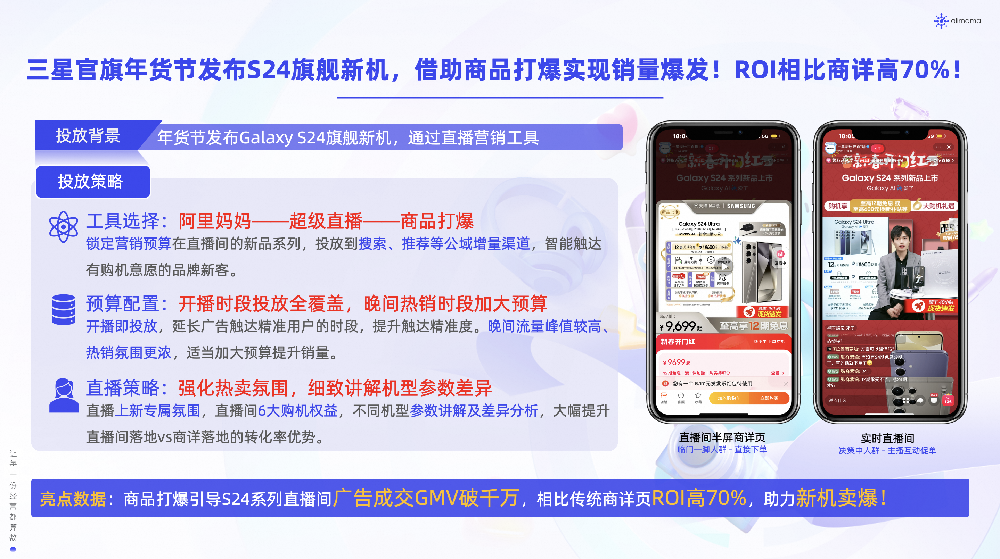

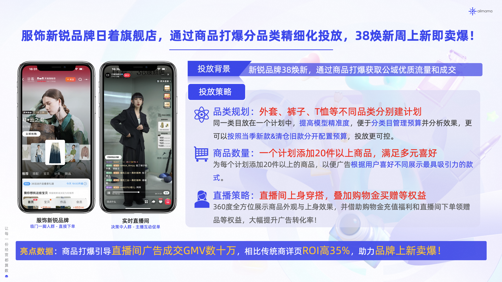

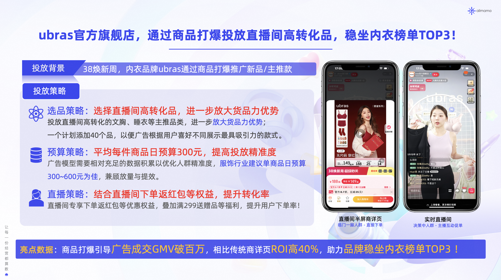

#### 双11精彩案例

本次双11，**数千位头部品牌**使用商品打爆，让直播间主推款**一爆再爆**，让**闪降品/闪赠品的价格权益**透出在搜索推荐等公域以提升转化效率，让**腰部商品拿到高额成交**、**卡位品类词获得确定性增量**！

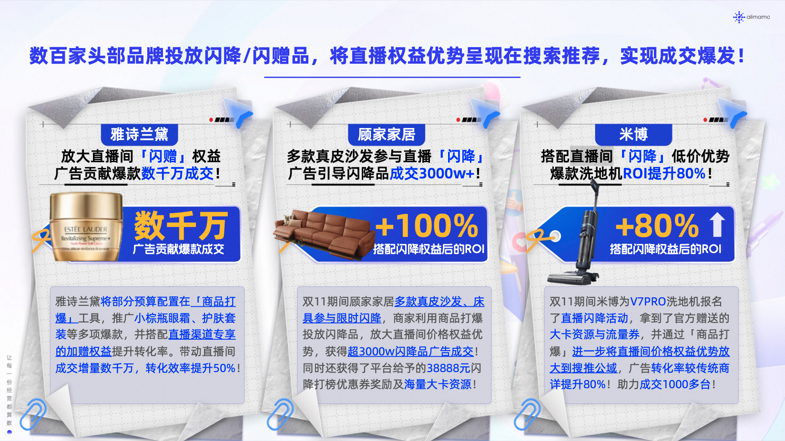

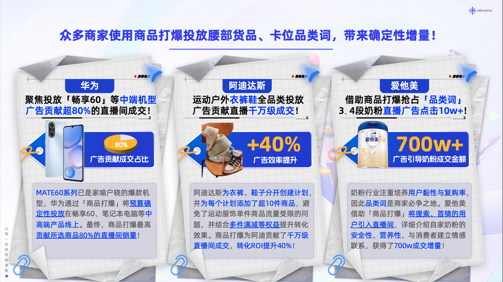

**烈儿宝贝·预售爆发**🔥

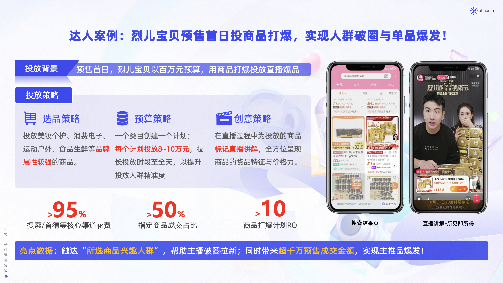

#### 更多往期案例

**飞科官旗·七夕爆发**🔥

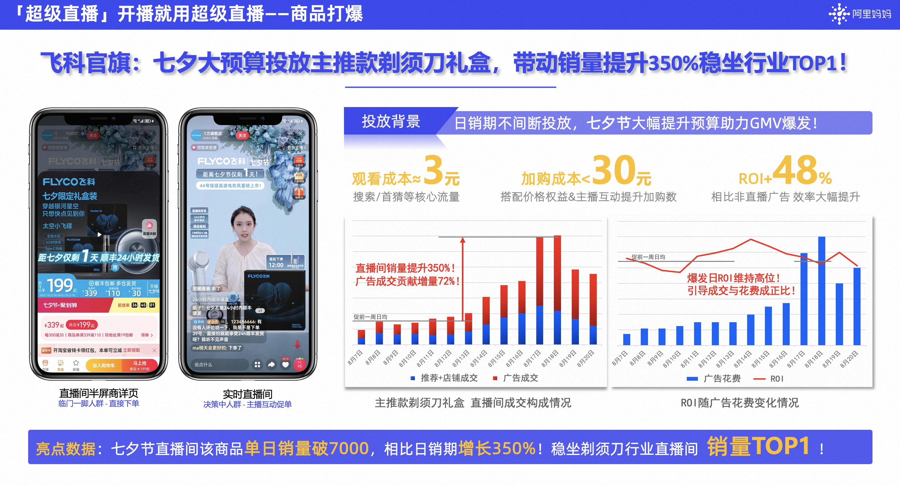

**案例背景**：**飞科官方旗舰店**，从5月份起一直使用商品打爆投放，确定性推广直播间指定品。**本次七夕，飞科希望通过广告与自然流量双重增长，带动主推款剃须刀礼盒GMV爆发**！

**选品策略**：选取了客单价在170~500的多个**剃须刀套装**，其中大部分预算放在主推款FS891剃须刀礼盒上，一个计划一个品。

**计划设置**：**促销前日预算2~5w/天，爆发日预算10~20w元**，均匀投放，仅选择智能推荐人群，采用自动生成创意。

**投放结果**：

**相比促前一周，该商品的直播间销量暴涨350%，其中商品打爆广告成交 贡献了增量部分的72%，稳坐剃须刀行业TOP1！在预算规模大幅提升的同时，广告ROI始终维持高位，展现出了极强的爆发力！**

**​**

**卡姿兰官方旗舰店**

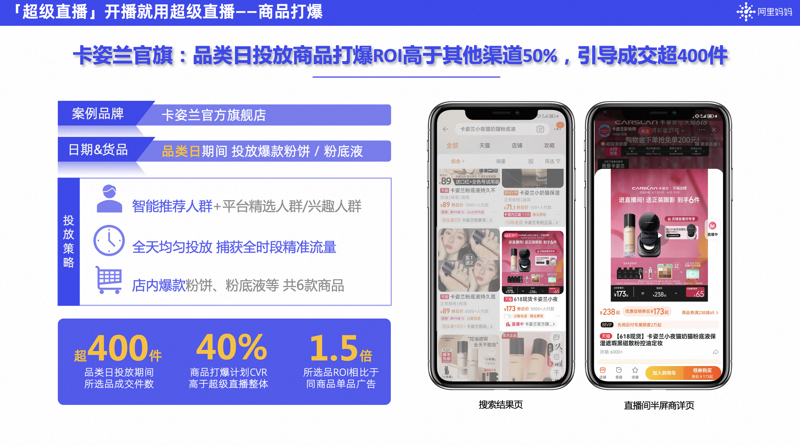

**石头电器旗舰店**

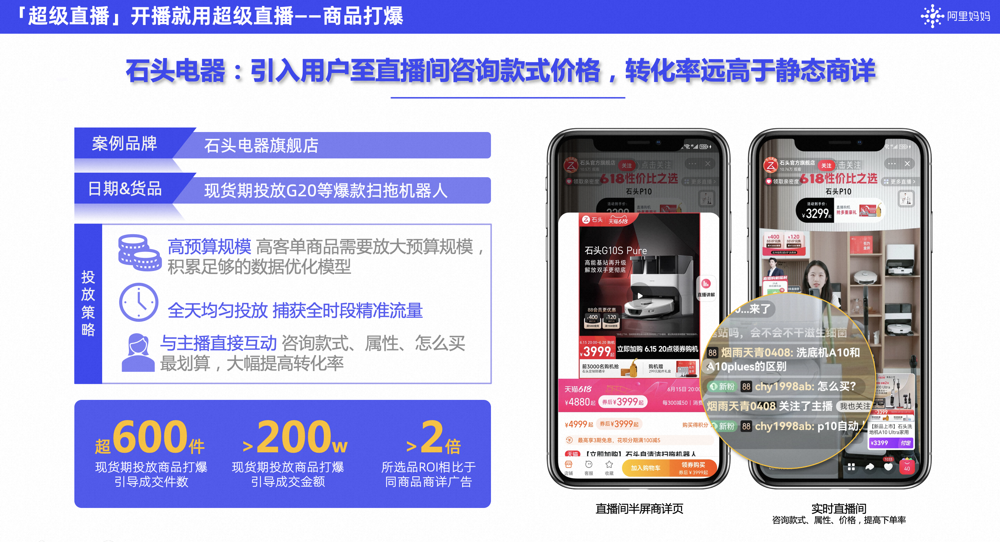

### 预算建议

**双11狂欢日核心爆发节点，手淘流量vs平销期+200%，手淘转化率vs平销期+40%！**

**建议使用「超级直播-商品打爆」，投放直播间新品、爆品、权益品！核心爆发日建议：**

单商品预算值不低于“基础预算”，以提升广告模型精准度，优化投放效率；

头部商品建议设置在“推荐预算”以上，充分借助货品力优势，确定性爆发！

*立即创建计划：**https://one.alimama.com/index.html#!/main/index?bizCode=onebpLive&defaultSettingStrategyType=onebpLive&defaultSettingStrategyId=sceneLiveItem&lite2SourceCode=fastLiveConsole&xsourcefrom=yuque*

| **一级行业** | **二级行业** | **单商品-基础预算** | **单商品-推荐预算** | **参考ROI** |
| --- | --- | --- | --- | --- |
| **快消** | **美妆** | 1500以上 | 30000以上 | 5 |
|  | **个护** | 1500以上 | 20000以上 | 3 |
|  | **母婴** | 600以上 | 5000以上 | 6 |
|  | **家清** | 1000以上 | 10000以上 | 3 |
| **服饰时尚** | **女装** | 300以上 | 1000以上 | 15 |
|  | **内衣** | 1000以上 | 10000以上 | 4 |
|  | **箱包服配** | 1500以上 | 20000以上 | 6 |
|  | **男女鞋** | 400以上 | 2000以上 | 8 |
|  | **手表眼镜** | 400以上 | 2000以上 | 8 |
|  | **男装** | 500以上 | 3000以上 | 8 |
| **大家电** | **冰箱** | 1500以上 | 6000以上 | 30 |
|  | **空调** | 1500以上 | 10000以上 | 20 |
|  | **其他** | 1000以上 | 5000以上 | 15 |
| **3C数码** | **手机** | 1000以上 | 10000以上 | 50 |
|  | **影音数码** | 2000以上 | 10000以上 | 20 |
|  | **其他** | 1000以上 | 5000以上 | 10 |
| **小家电** | **居家清洁** | 5000以上 | 40000以上 | 15 |
|  | **个人护理** | 2000以上 | 20000以上 | 6 |
|  | **其他** | 1000以上 | 5000以上 | 6 |
| **健康** | **器械** | 3000以上 | 20000以上 | 8 |
|  | **保健滋补品** | 4000以上 | 20000以上 | 2 |
|  | **其他** | 500以上 | 50000以上 | 3 |
| **家装** | **-** | 500以上 | 5000以上 | 15 |
| **家居** | **-** | 500以上 | 5000以上 | 6 |
| **珠宝饰品** | **-** | 400以上 | 1000以上 | 30 |
| **运动户外** | **-** | 600以上 | 4000以上 | 10 |
| **食品生鲜** | **-** | 500以上 | 4000以上 | 5 |
| **其他行业** | **-** | 1000以上 | 5000以上 | 5 |

### 投放激励

商品打爆推广激励活动**7月1日-9月30日期间：累计使用超级直播商品打爆模式投放满300/1K/3k/1w/3w/10w/30w元，累计反哺超直券300/1000/2000/5000/12000/30000/60000观看！**参与方式：全量超级直播商家可参与，无需报名，不限商品不限时段，总消耗达成目标后自动获得奖励。奖励说明：1）奖励流量通过「超直券」发放。超直券是超级直播面向商家发放的「流量激励卡」，花费1元，即可向直播间引入100至10w不等的观看量，2小时内引流完毕。2）奖励于完成相应档位后的3天内到账。例如，8月1日达成了消耗300元的目标，可于8月4日之前拿到300观看超直券奖励。3）每档到手面额=本档奖励额-已发放面额。例如，完成了300元档位，可得到300观看；完成了1000元档位，再得700观看。

万相更新 · 直播闪降打榜赛（已结束，可点击左侧小箭头查看活动详情）

**为帮助商家放大****直播间价格权益优势****，提升****闪降/闪赠商品成交爆发力****，阿里妈妈面向直播商家重磅发布「商品打爆 · 今日闪降打榜赛」，最高反哺****68888现金****券激励！**

**参与方式**：10月20日-11月11日，商家主播**在广告后台报名活动**，即可参与打榜！

**具体规则**：系统将根据双11**【闪降/闪赠商品的“超级直播商品打爆”总花费】**对报名各榜单的商家进行排名，并向最终入围的客户根据最终排名发放超级直播广告优惠券奖励（叠加享受AI内容助燃返最高8%返点奖励），**答疑群：24175019987**。具体榜单信息如下：

**报名链接**：
**1）旧版万相台**：https://adbrain.taobao.com/indexbp.html#!/club/index?menuView=bangdan&challengeTab=course；
**2）万相台无界**：https://one.alimama.com/index.html#!/club/activity?menuView=bangdan&isTmallShop=0&isOriginYbz=1

**指标说明**：商家/主播在**10月24日-11月11日期间**，针对**自建闪降/官方闪降/闪赠活动**的商品，于对应的**活动时段内**，通过**超级直播商品打爆**广告产生的总花费金额。

---

**活动介绍**

「万相更新 · 直播闪降打榜赛」是由阿里妈妈官方发布的广告投放激励活动。商家主播报名参与后，平台会根据该账户的打榜因子为商家打分并排名，最高给予商家主播68888元现金优惠券激励！

**活动时间**

报名时间：10月20日至11月11日

打榜时间：10月24日至11月11日

**活动入口**

1）旧版万相台：https://c.tb.cn/F3.bgocJS；2）万相台无界：https://c.tb.cn/F3.b5GL4G

万相台——账户——妈妈CLUB——营销激励榜——报名打榜赛活动

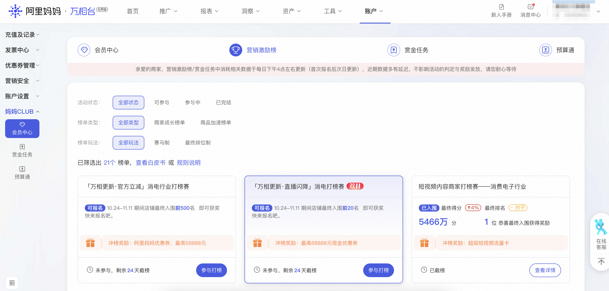

**打榜因子**

商家/主播在**10月24日-11月11日期间**，针对**自建闪降/官方闪降/闪赠活动**的商品，于对应的**优惠生效时段内**，通过**超级直播商品打爆**广告产生的总花费金额（下文简称“统计金额”）。

举例：某商家报名打榜赛后，创建了一条商品打爆计划，投放时间为10月25日16点-24点，选择投放A商品+B商品（其中A商品不参与活动，B商品参与官方闪降，时间为当日20点-24点），最终统计20点-24点花费在B商品的投放金额。建议商家主播针对闪降商品单独创建投放计划，以确保预算使用在活动商品的活动时间内。

**打榜权益**

本次活动设置快消、消电、服饰+运动、其他综合行业4条赛道，并对每条赛道榜单排名TOP20~30的客户给予1888~68888元优惠券奖励，具体榜单信息与奖励额如下：

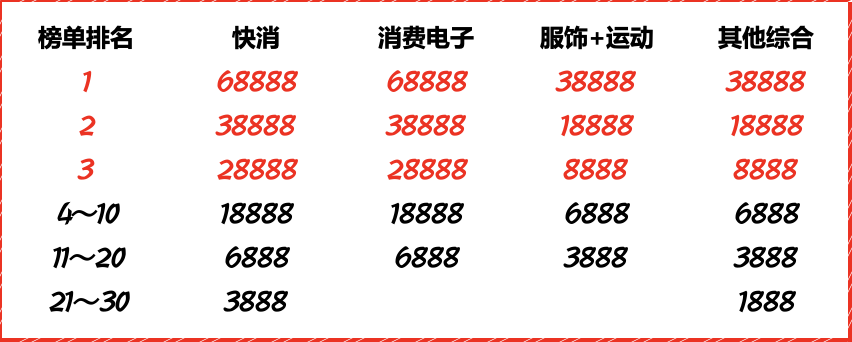

备注：最终拿到的奖励金额，不可超过您的统计金额。

举例：某消电商家的统计金额为10000元，在消电行业排名第6，原本应该拿到18888元投放奖励，但由于奖励金额高于统计金额，所以最终可拿到的奖励金额为10000元。

**奖励说明**

2023年11月24日前发放，优惠券名称为「万相更新·直播闪降」打榜赛优惠券，优惠券有效期至2023年12月31日，过期将无法使用。

优惠券可在万相台·无界版帐户-优惠券管理-我的优惠券（已生效/已失效）或 「操作记录」 中查看。

本活动奖励为「直播场景专属优惠券」，仅限超级直播下，直播间成长、商品打爆、内容人群资产场景使用。

优惠券折扣比例为5折，即账户产生100元消耗，优惠券抵扣50元，现金支付50元。

优惠券无需手动使用，它将在推广产生花费后，系统自动按照指定折扣比例抵扣推广花费的金额。

### 操作指南

进万相台无界版（https://one.alimama.com/index.html#!/home/index），新建计划

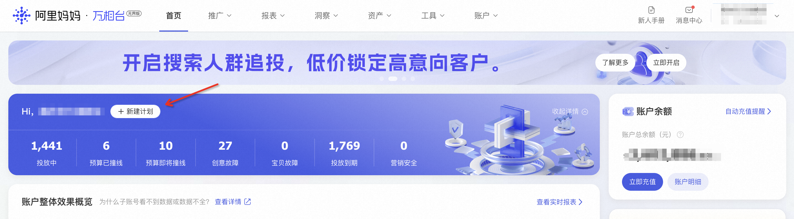

选择「内容营销——超级直播」

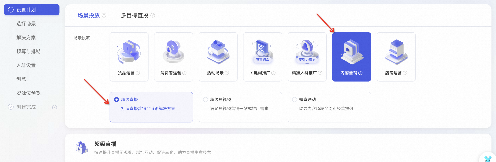

选择商品打爆模式，并点击添加商品

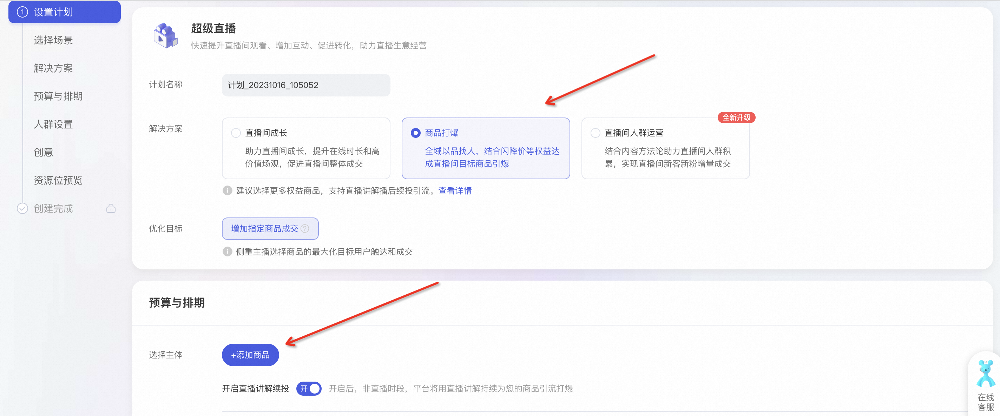

**添加您要投放的商品**

直播中的商品：当前直播间宝贝口袋内的商品（未开播时段创建订单，不展示此分类）

全店在销商品：请确保您选择的是将要在直播间上架的商品，否则开播后将不对该商品产生花费

**闪降品：包含自建闪降、官方闪降商品，投放时将以闪降价在公域透出，提升广告转化率！**

备货审核的商品（达人独有）：在淘宝直播中控台备货审核通过的商品

货品选择建议：

选择同一品类的1-5个商品，避免多品类放在同一计划中影响模型精准度

**闪降、超单、主推款优先选择，放大货品力、价格力优势**

选择后尽量不要调整商品，否则会影响品维度报表的数据结案

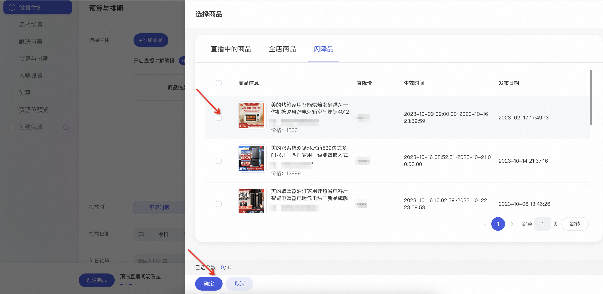

添加自定义讲解，并开启直播讲解续投（非必选）

完成商品添加后，可以继续针对该商品添加1~2条精心录制的直播讲解，以提升广告转化效率（自定义讲解、最新标记的讲解、直播间半屏商详卡，三者将由系统优选展现）

添加直播讲解后，需要打开直播讲解续投开关，即可在下播后也继续投放，持续获取优质流量。

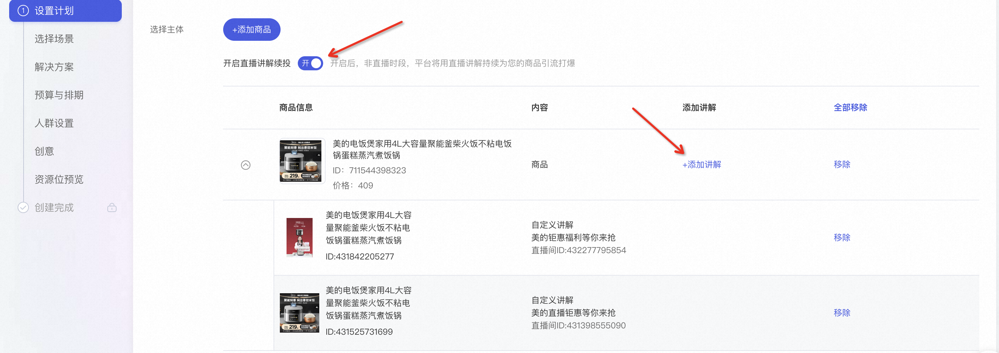

设置您的投放时间、日期，日预算、投放速度等。

常规计划建议不限时段、不限日期；闪降激励计划，建议选择活动对应的日期和时间投放。

不同于传统的直播间推广计划，商品打爆计划需要足够高的预算，才能在优质渠道拿到足够多的流量，并提升模型精准度，日预算建议3000元以上，最低不要低于1000元。

投放速度方面，建议选择均匀投放模式。

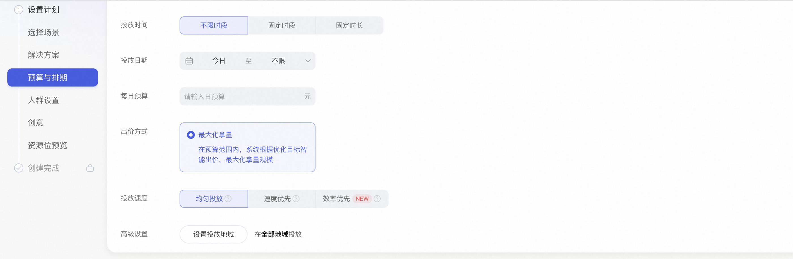

完成人群与创意设置（建议保持默认），完成计划创建。

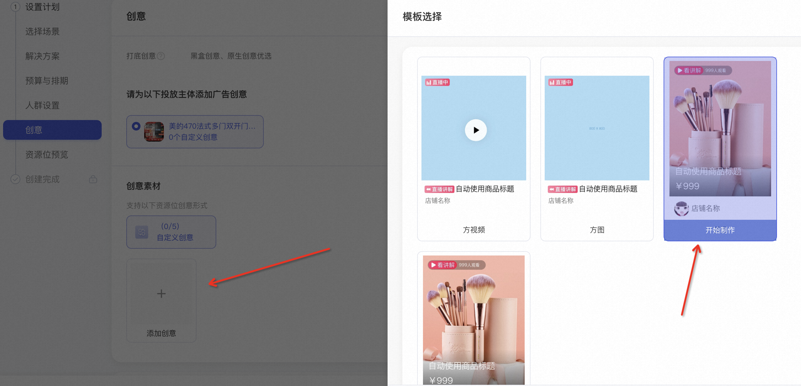

​

5、报表——计划列表——点击该计划，查看商品维度数据（仅展示已选择商品成交量、成交金额等）

1、整计划成交金额大于等于所选品成交金额的总和，因为会有用户点击本商品的广告后，成交在了其他品上；

2、品维度数据仅展现直接成交量、直接成交金额，不展示品维度花费、观看数据；

3、直接成交金额=推广引导的用户，在转化周期内带来的当前场次直播间所选商品成交金额。

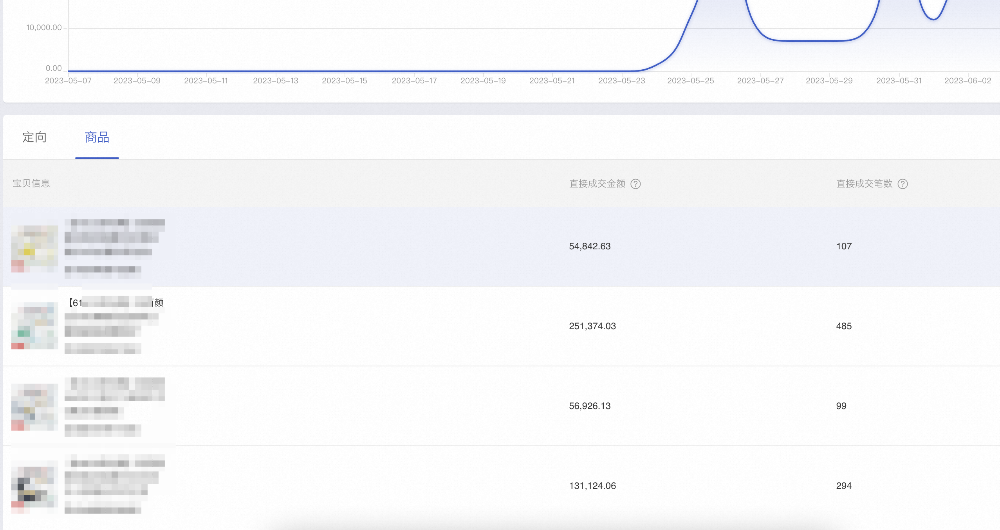

### 创意优化

创建「商品打爆」计划时，商家可以针对每一个所选单品，添加不同的自定义创意素材：

提升广告创意点击率：通过商家自定义素材，表达直播间专属优惠、限时红包、抽奖秒杀、总裁直播等营销玩法，吸引消费者进直播间下单！后台数据显示，商家自定义创意vs系统智能创意点击率提升30%！

解决“三品一械”类目投不出去/效果差问题：三品一械类目开展直播间推广，必须通过商品打爆上传“广审通过并打上广审标记”的素材，**方图和竖图都必须上传！**从而能够在搜索、首猜等核心电商场景正常过审，提升投放效率！

**STEP1——通过资质管理上传广审样件**

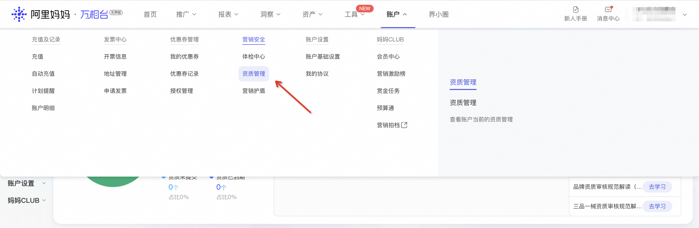

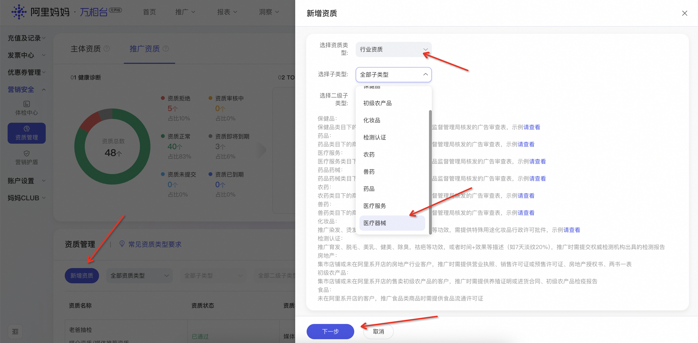

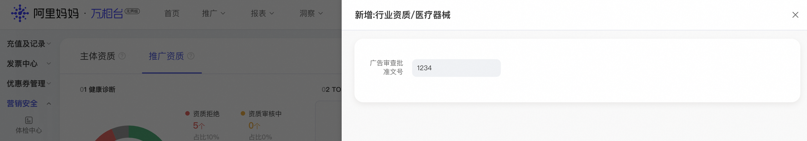

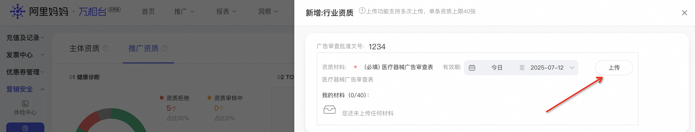

**STEP2——新建商品打爆计划并添加商品**

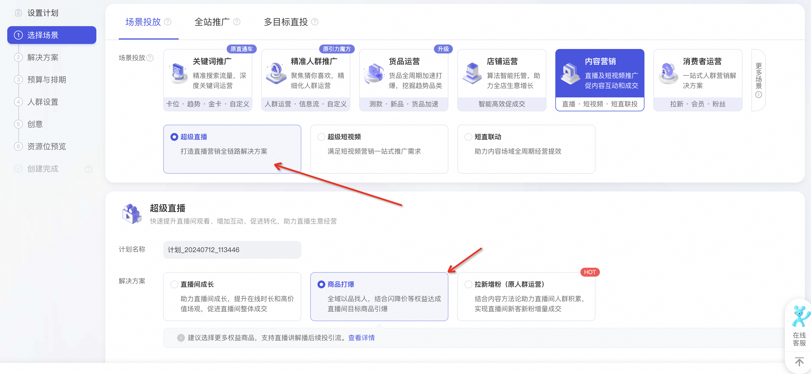

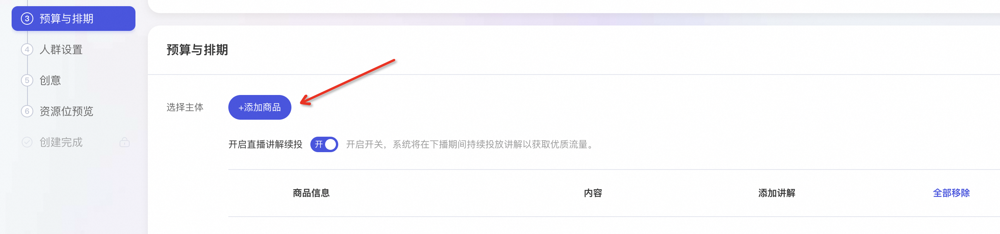

**STEP3——针对商品上传自定义创意**

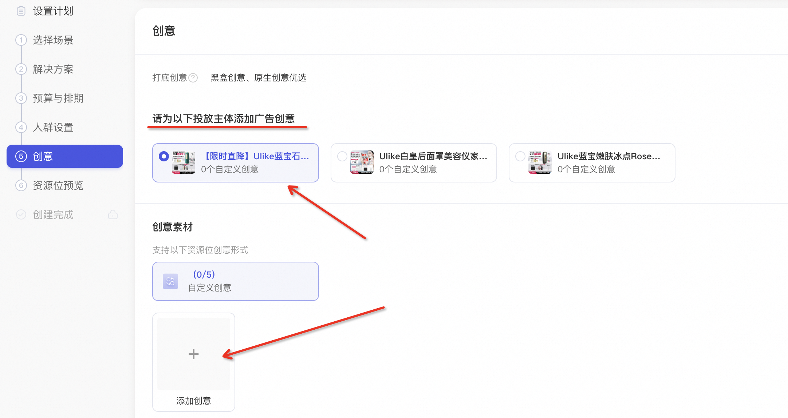

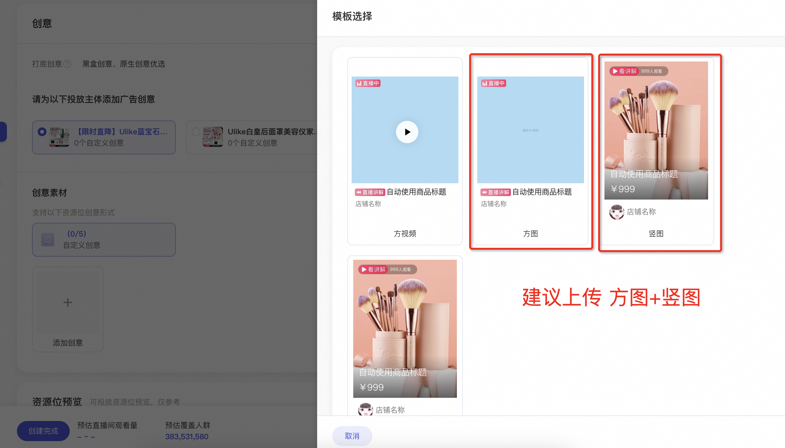

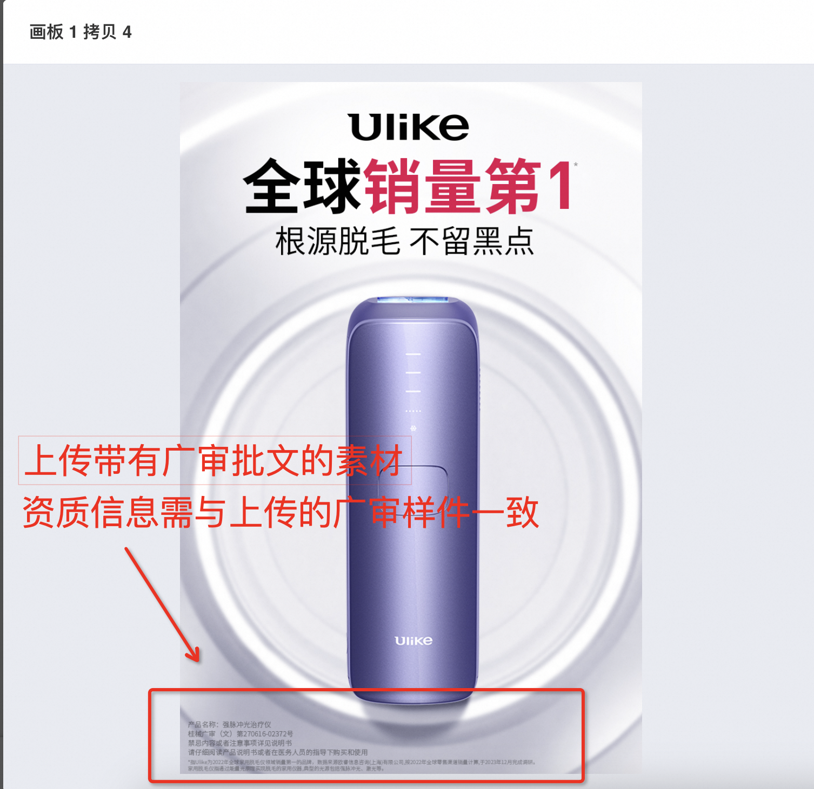

​

### 提效建议

**调整所选商品**：选择同一品类的3-5个商品，避免多品类放在同一计划中影响模型精准度；选择更具货品力、价格力的商品。

**放宽投放时段**：若计划设置的投放时间太短，则这段时间内实时搜索/浏览/点击该宝贝的用户量会非常少，导致预算无法花在精准用户上。所以尽量保持开播即投放，使投放覆盖开播全过程。

**标记直播讲解**：开启投放之后，主播在中控台对爆品进行直播讲解标记，计划将会把直播讲解与半屏商详一同投放在公域混竞，提升投放效率。若该直播讲解不是在开启投放之后标记的，将无法参与混竞。

**提高计划预算**：不同于传统的直播间推广计划，商品打爆计划需要足够高的预算，才能在优质渠道拿到足够多的流量，并提升模型精准度，日预算建议300元以上。

### 报表升级

**一、超级直播成交口径说明**

末次点击归因**：**超级直播所有成交相关指标，均采用“末次点击归因”，不与其他广告产品重复计算。（例如：先点击超级直播广告进入直播间，后来又点击了货品加速广告并成交，则这笔成交仅计入货品加速，不会计入超级直播成交金额）。

---

超级直播总成交金额=通过超级直播广告进入直播间，后续带来的直播间成交+未计入直播间的成交。

超级直播直接成交金额=通过超级直播广告进入直播间，后续带来的直播间成交。例如：进直播间后立即下单、进直播间加购次日下单、观看历史场次的直播讲解片段后下单等等。（超级直播报表中显示的所有“直接”效果，均表示“直播间内”的效果，这与关键词推广等其他场景有所不同。其他场景的“直接”，一般就表示成交在所选商品的笔数或金额。）

超级直播间接成交金额=通过超级直播广告进入直播间，后续带来的未计入直播间的成交。例如：进直播间时点击了A商品，后续进入店铺页成交了B商品，则这笔订单不会计入直播间业绩，也不会计入直接成交金额。

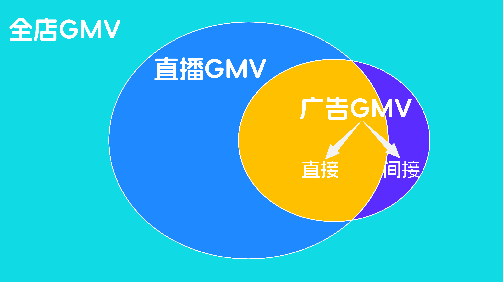

**二、商品打爆宝贝数据说明**

商品打爆帮助直播商家将营销预算确定性花费在所选品上，投放到搜索、推荐等核心资源位，并借助直播间的价格权益与互动氛围，提升广告转化效率。为助力商家更清晰地复盘商品投放表现、优化商品策略，商品打爆推出了新版宝贝数据报表，披露更多商品明细数据，让每一份经营都算数！

​

新版报表链接：https://one.alimama.com/index.html#!/report/live_migrate？rptType=live_migrate&bizCode=onebpLive&strategyOptimizeTargetIn=1055

​

**花费**：该商品广告被点击后，产生的花费。

**该商品直接成交金额**：该商品广告被点击后，产生的该商品直播间成交金额。既不包含成交在其他商品的金额，也不包含“通过点击其他商品进入直播间后 最终成交在该商品的金额”。

**直接成交金额**：该商品广告被点击后，产生的直播间总成交金额。包含了成交在其他商品的金额，但不包含“通过点击其他商品进入直播间后 最终成交在该商品的金额”。

**该商品加购数/收藏数**：该商品广告被点击后，产生的该商品加购量或收藏量。不包含直播间内其他商品的加购或收藏。

**三、报表相关常见问题**

**为什么超级直播后台当天的“直接成交金额”大于中控台后台的“实时直播业绩”？**

超级直播带来的直接成交金额，包含“历史直播间讲解切片带来的成交”，这笔成交会记在中控台的“含回放累计数据”，但是并不会计入实时直播业绩表现，因为消费者观看的素材并不源于实时直播间。

**什么情况下的成交金额会计入“总成交金额”而不计入“直接成交金额”？**

常见情况1：用户通过广告进入直播间后，未点击直播间内任何商品，直接进入店铺买买买。

常见情况2：用户在搜索渠道点击了A商品的直播广告，进入直播间后自动吊起A商品后用户未购买，直接进入店铺买了B商品。

常见情况3：用户点击广告后并未在店铺直播间购买，而是进入了达人直播间成交了本店宝贝。

​

**为什么宝贝数据明细报表的分商品花费（或直接成交金额）加起来不等于计划总花费（或直接成交金额）？**

超级直播是跨渠道智能投放产品，投放渠道涵盖搜索、推荐、直播广场、直播间上下切等丰富渠道。系统会将商品打爆计划的一小部分预算投放在直播广场、直播间上下切等纯直播渠道，为直播间带来更多的观看和成交。这部分的花费、观看、成交均不在“宝贝数据明细”披露，因此会产生分商品数据汇总后小于计划整体的情况。

**四、宝贝数据查看路径**

超级直播报表页——计划列表——商品打爆计划——宝贝数据

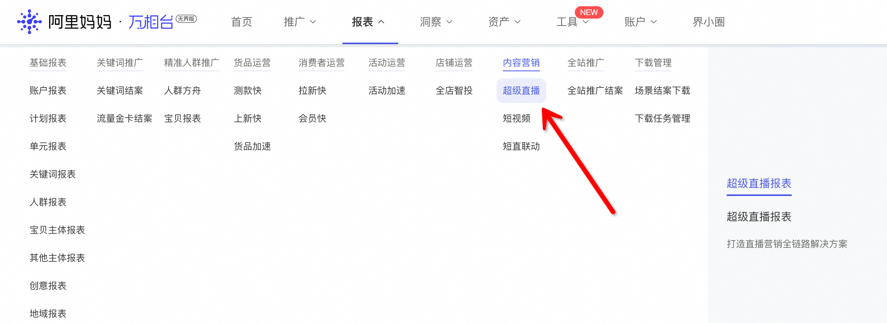

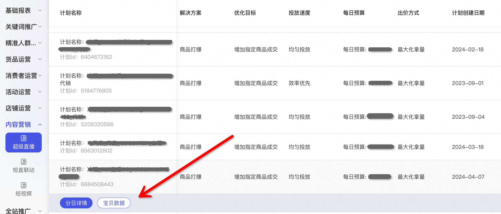

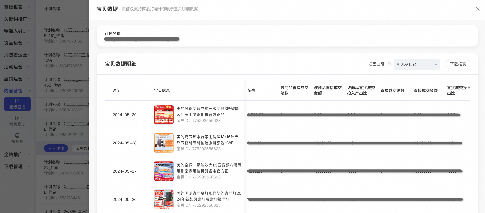

### 常见问题

**几乎无消耗/投不出去 如何排查和解决？**

**帐号身份检查**：如果您属于达人身份账号，例如垂类主播、品牌子直播间、服饰珠宝达人号、猫超矩阵号、淘工厂矩阵号等，需要申请开通白名单才能正常投放，申请钉钉群：24175019987。

**推广商品检查**：首先检查您的商品是否为直播间在播商品。其次请检查您的商品是否属于三品一械等限制推广类目，例如药品、营养保健品、美容仪等，将会导致商品审核不通过，需要申请开通白名单，并上传“送审通过并打上广审标的自定义创意”，才能正常投放。

**图文素材检查**：如果您的商品图/商品标题包含低俗信息、使用绝对化用语、涉及虚假夸大宣传等情况（例如美白产品宣称“白到发光”），将会导致素材审核不通过，需要按照广告法要求修改图文内容。

**其他情况**：请通过**蓝袋鼠提交工单反馈**，或加钉钉群24175019987反馈。

​

**短时间爆量/消耗过快 如何排查解决？**

**放量模式**：请检查您的计划是“均匀投放”还是“效率优先”，如果是后者，可能会出现“实际消耗进度略快于期望消耗进度”的情况，这是因为系统会在白天竞价低峰时段拿更多量，提升投放效果。

**小预算订单**：由于商品打爆会在搜索、推荐等流量更贵但效果更好的公域拿量，所以小预算订单可能会出现“10~20次点击就花掉一半以上预算”的类似情况，适度提高日预算有利于优化拿量稳定性。

**修改日预算**：当日预算大幅调高时，系统将感知到“当前投放速度不及预期”，小概率会造成短时间内过快消耗。如果爆量情况严重，请通过蓝袋鼠提交工单反馈，申请赔付。

**系统性问题**：在各类消耗过快问题中，系统问题（非客户原因）导致的情况最为常见，此时您可以通过蓝袋鼠提交工单反馈，申请爆量赔付。系统会在数个工作日内，按照“实际花费金额-期望花费金额”，赔付至您的账户余额中。

​

**投放效果不及预期 如何排查解决？**

如果计划不存在短时间集中消耗的情况，建议商家主播从以下角度优化推广计划，提升投放效果：

**调整选品策略**：美妆、快消、家电、数码、家居等类目的商品受众广、爆发力强，非常适合投放商品打爆；运动户外、食品生鲜、服饰风尚等类目的单品爆发力较弱，主要由货品丰富度驱动，建议一个计划中添加不低于5个同一类目的商品。

**放宽投放时段**：若计划设置的投放时间太短，则这段时间内实时搜索/浏览/点击该宝贝的用户量会非常少，导致预算无法花在精准用户上。所以尽量保持开播即投放，使投放覆盖开播全过程。

**标记直播讲解**：开启投放之后，主播在中控台对爆品进行直播讲解标记，计划将会把直播讲解与半屏商详一同投放在公域混竞，提升投放效率。若该直播讲解不是在开启投放之后标记的，将无法参与混竞。

**提高计划预算**：不同于传统的直播间推广计划，商品打爆计划需要足够高的预算，才能在优质渠道拿到足够多的流量，并提升模型精准度，日预算建议300元以上。

若以上优化手段均未解决投放效果过差的问题，例如同一个商品通过商品打爆推广的ROI远低于直通车/引力魔方等渠道，请加钉钉群24175019987反馈。

​

**半屏商详卡和直播讲解分别是什么？它们的展现逻辑是什么？**

**半屏商详卡**：画幅占比75%的商品详情页+实时直播间背景。本就有明确购买需求的用户 / 习惯在传统商详页浏览下单的用户，可以直接在此处下单，并享受直播间专属价格或赠品权益；还在犹豫决策中的用户，可以直接点击背景进入直播间，向主播咨询商品参数、款式差异、怎么买最优惠，从而提升素材转化率。

**直播讲解**：历史直播间的本商品讲解切片。主播可以围绕对应商品，从产品外观、参数、颜色、优惠活动等方面，精心录制一条言简意赅的精彩讲解。用户所见即所得，而且能够全方位展现商品，提升广告点击率。

**展现逻辑**：系统会在半屏商详卡、手动选择的讲解、当场直播间实时讲解中，千人千面地智能优选出效率最高的一条素材展现给用户，大幅优化投放效果。

**为什么会在搜索结果中刷到商品打爆没有选择的直播间商品？**

直播间推广、内容人群运营、合约套餐包等模式下，算法会智能优选出转化率较高的直播间商品，以半屏商详卡或直播讲解的形式在搜索、推荐等渠道拿量，以提升计划整体投放效果。与商品打爆的差别在于：

商品打爆在搜索、推荐等公域优质渠道的拿量占比较高；

商品打爆会将预算确定性花费在所选商品上，不会将预算花费在未选择的商品上；

商品打爆交付品维度数据结案，例如所选商品成交金额、所选商品成交件数等。

​

**商品维度数据报表如何查看？**

直播间商品打爆计划，应关注整计划数据+品维度数据：

整计划**总成交金额**：对应转化周期内，末次点击渠道归因下，产生的**全店引导成交金额**。不区分是否为所选爆品上的成交，也不区分是否为直播间直接成交金额。

整计划**直接成交金额**：对应转化周期内，末次点击渠道归因下，产生的**本场直播间成交金额**。不区分是否为所选爆品上的成交，但是不包含「未在直播间点击宝贝口袋中的对应商品，以致于未能计入直播中控台成交的部分」。

**商品维度成交金额**：对应转化周期内，末次点击渠道归因下，产生的**所选品在本场直播间直接成交金额**。首先，该数据必定是成交在所选品上的数据，不包含点击本商品广告后，成交在其他商品上的数据；其次，该数据必定是直播间成交数据，若用户未点击宝贝口袋中的该商品，则不计入该字段。

​

**商品打爆计划如何选品，能否修改或新增商品？**

选择同一品类的1-5个商品，避免多品类放在同一计划中影响模型精准度

直降款、爆款、主推款优先选择，放大货品力、价格力优势

选择后尽量不要调整商品，如果删除了某一商品，其品维度数据将从商品数据报表中删除，影响数据结案。
