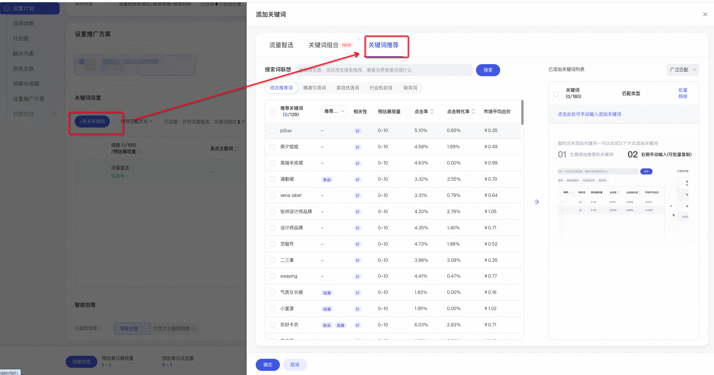
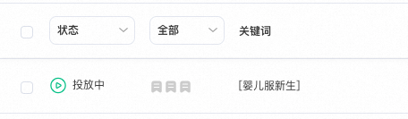
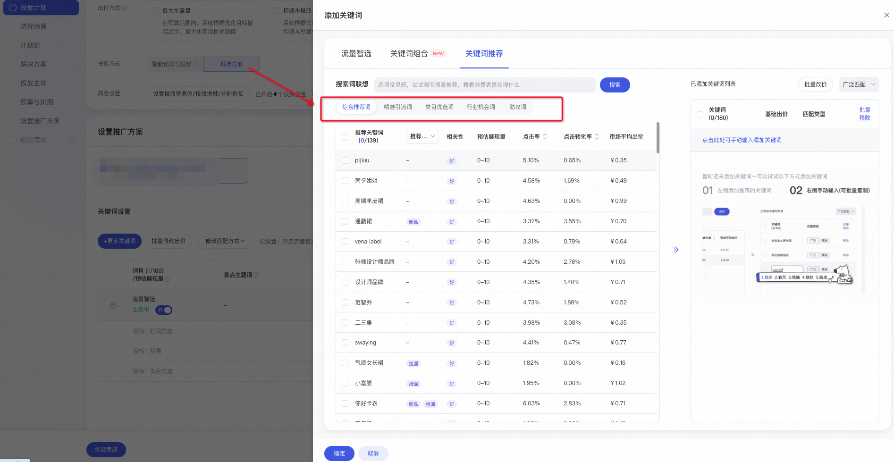
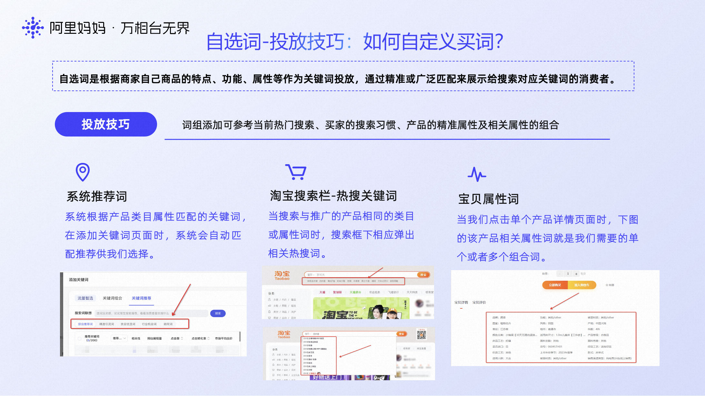

# 关键词推广-自选词（广泛匹配vs精准匹配）

> 来源：https://alidocs.dingtalk.com/i/nodes/Obva6QBXJwxNZoMOCgk2jAGe8n4qY5Pr

**原语雀文档链接：**https://yuque.antfin.com/chenchun.chen/gqhty9/chic2usikgavssc1

---

# 一、功能入口

**操作路径：**万相台无界版-关键词推广-添加更多关键词-关键词推荐

# 二、概念解释

### 1、匹配方案：精准匹配 vs 广泛匹配

**（1）精准匹配：**后台显示带中括号如 [女连衣裙]，搜索相同词（例：“女连衣裙”）或同义词（例：“女式连衣裙”）才能展现。

**（2）广泛匹配：**后台显示不带中括号如 女连衣裙 ，搜索包含词（例：“新款女连衣裙”）或相关较高的词（例：“碎花女连衣裙”）都能展现。

### 2、5种词的推荐逻辑

##### （1）综合推荐词

系统推荐出的与您的宝贝相关性较高，且预估添加后效果较好的词。

##### （2）精准引流词

包括所选宝贝在手淘搜索场景的进店引流词，以及与宝贝相关性较高的店铺进店引流词。

##### （3）类目优选词

与您的宝贝二级类目相同，属性、价格类似的关键词推广的广告商品，添加的点击或转化效果较为优质的关键词。

##### （4）行业机会词

行业上搜索热度较高或搜索趋势上涨或竞争度较小，且与您的宝贝相关性较高的机会词。

##### （5）助攻词

搜索助攻词，转化周期内按照MTA多触点归因方式，在用户所有的搜索行为中，能为关键词推广最后一次广告触达带来成交/收藏加购等贡献的所有搜索词，称之为搜索助攻词。

# 三、投放技巧

