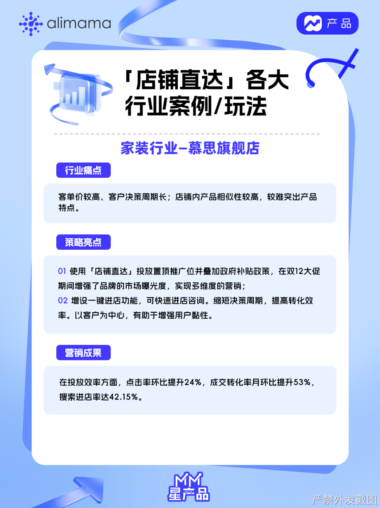
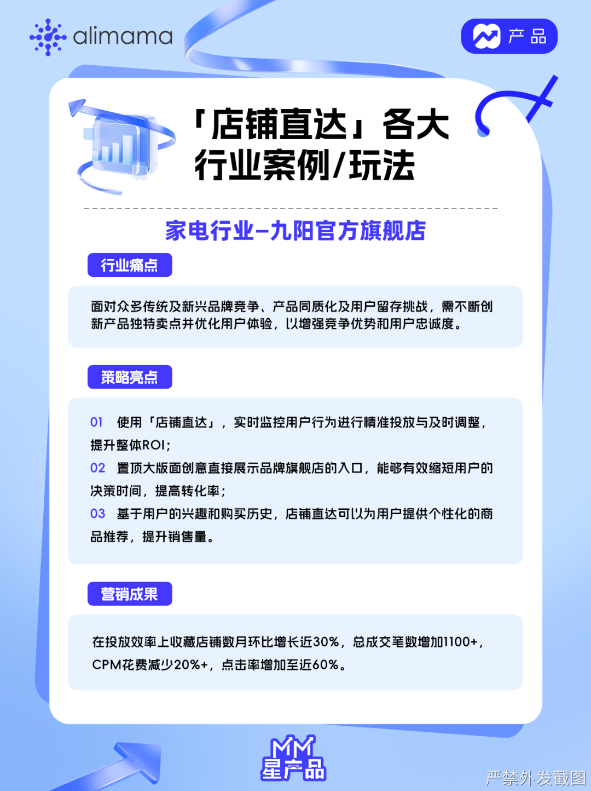
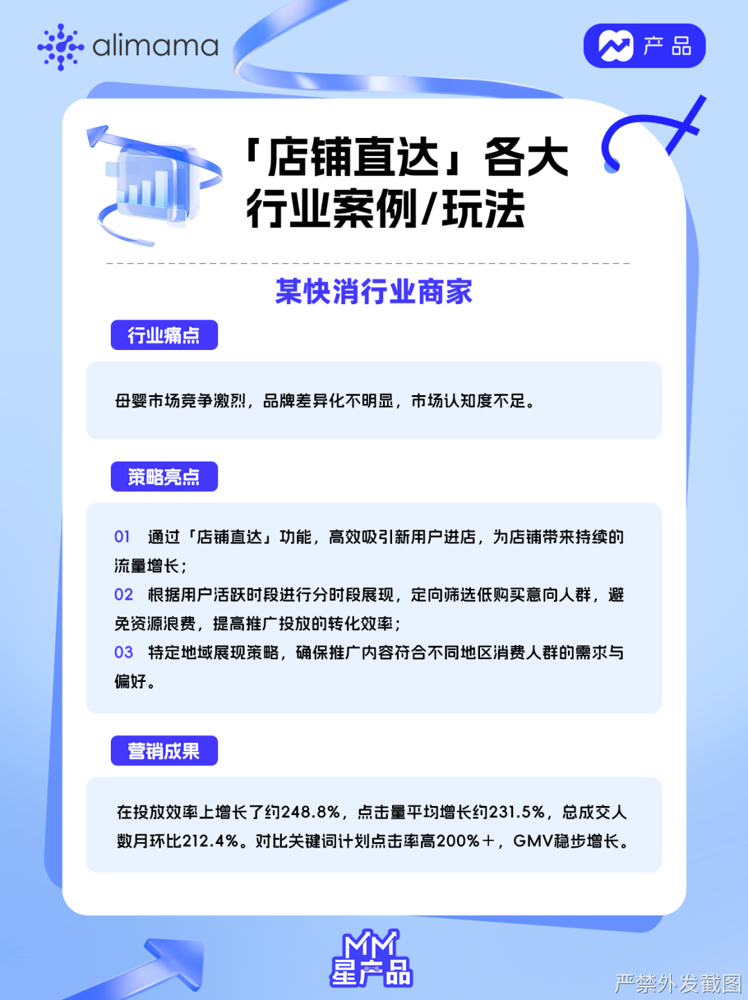

# 【🔥】行业案例/同行玩法

> 来源：https://alidocs.dingtalk.com/i/nodes/P7QG4Yx2Jpx4OolYC5vgKbnnJ9dEq3XD

**原语雀文档链接：**https://yuque.antfin.com/chenchun.chen/gqhty9/zru09kkv9vez5fy8

---

💡**「店铺直达」优势一：搜索结果页—置顶展示推广位**

独有搜索置顶0坑位置聚集全域店铺流量，在搜索页的“官网入口”、快速高效的店铺流量转化中心。通过实时竞价、展现扣费获取淘内优质展位，展现店铺品牌调性、打爆店铺单品。

💡**「店铺直达」优势二：高效转化精准搜索流量，助力GMV提升**

实验数据显示，品牌及品牌品类词流量下店铺竞得【店铺直达推广】，预计带来GMV平均提升100%+!在纯品牌词下更能带来GMV平均提升200%+。

