# 智能计划-【流量智选2.0（原搜索超车）】

> 来源：https://alidocs.dingtalk.com/i/nodes/QG53mjyd800agdlKHQbyy5Qv86zbX04v

# **NEW！流量智选2.0**

关键词推广-智能计划下新功能【流量智选2.0（原搜索超车）】

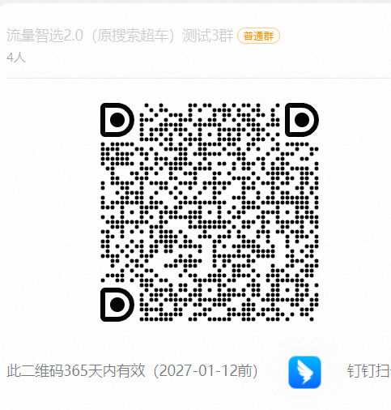

## **3/17流量智选优化迭代，不再依赖流量智选创意**

**注意：只是不再依赖创意，流量智选2.0能力依旧保留**

预估3/17开始至4月初，商家流量智选会逐步升级，不需要再依赖流量智选创意

**升级后，老流量智选单元：**

流量智选创意将转为常规创意投放，您可进行解绑删除或保留；流量智选创意标识将于4月初左右陆续删除（创意保留）。具体请查看推广单元创意模块信息

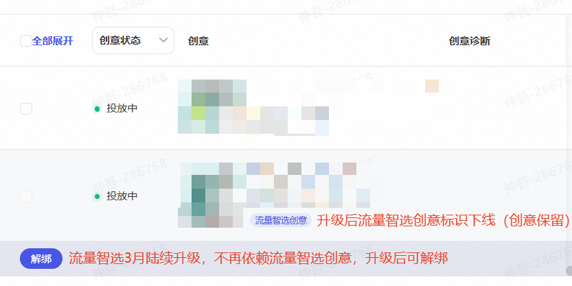

**升级后，新建流量智选单元：不再生成流量智选创意**

## **原搜索超车商家看这里：升级说明**

历史搜索超车商家已于1月7日晚上升级完成为流量智选2.0，搜索超车词包已下线，如单元已开启其他流量智选词包（**好词优选、捡漏、类目优选均已继承搜索超车能力**），商家无需操作；如历史单元只开过搜索超车词包的，建议商家开启其他词包（**好词优选、捡漏、类目优选词包任一开启即可**）

存量有流量智选2.0功能的商家及新开流量智选2.0商家，后续新建单元/存量单元打开任意流量智选词包即生效原搜索超车能力

搜索超车已完成阶段性测试，期间获得商家广泛好评。为进一步满足商家对全部流量智选词包生效搜索超车相关能力的诉求，平台已全面升级该能力，推出流量智选2.0，即原有搜索超车词包下线，**搜索超车作为底层能力覆盖到好词优选、捡漏、类目优选词包。**

**1月7日已对现有搜索超车商家完成升级**。升级前后核心差异如下（*注：后续将进一步迭代优化，流量智选2.0不再依赖流量智选创意，届时流量智选创意将下线*）：

| 推广单元类型 | 原搜索超车商家 | 搜索超车商家自动升级为流量智选2.0商家 |
| --- | --- | --- |
| 存量推广单元 | 同时开启搜索超车词包及其他流量智选词包 | 下线搜索超车词包，其他词包维持原有状态；搜索超车创意更新为流量智选创意，创意暂不支持商家解绑（关闭全部词包后可解绑） |
|  | 仅开启搜超车词包 | 下线搜索超车词包，搜索超车创意更新为流量智选创意，创意支持商家解绑；针对这部分推广单元，**建议****商家可以提前打开流量智选其他词包，或者升级后打开流量智选其他词包** |
|  | 未开启搜索超车词包，开启其他词包 | 下线搜索超车词包，其他词包维持原有状态；针对部分优质推广单元新增流量智选创意，创意暂不支持商家解绑（关闭全部词包后可解绑） --三品一械不支持，详情见下方答疑模块 |
|  | 未开启任意词包 | 不做调整，仅下线搜索超车词包 |
| 新建推广单元 | 默认开启搜索超车词包，新增搜索超车创意，创意暂不支持商家解绑（关闭搜索超车词包后可解绑） | 默认开启流量智选词包，新增流量智选创意，创意暂不支持商家解绑（关闭全部词包后可解绑） |

注意：搜索超车升级到流量智选当天：

1）搜索超车词包出现无法调整的情况，通常是升级中，预估几小时完成，完成后词包下线；

2）搜索超车创意将逐步升级为流量智选创意，升级需要时间，可能出现搜索超车词包已下线，搜索超车创意依旧存在的情况，预估1-2天内升级完成；

3）推广单元下实时报表搜索超车词包下线后不再投放，同时其他词包如已开启则生效搜索超车能力继续投放，搜索超车词包实时数据不再展现，后一日可通过离线报表查看搜索超车词包数据 ；历史报表搜索超车数据不做变更

4）操作记录中会出现搜索超车词包删除的记录

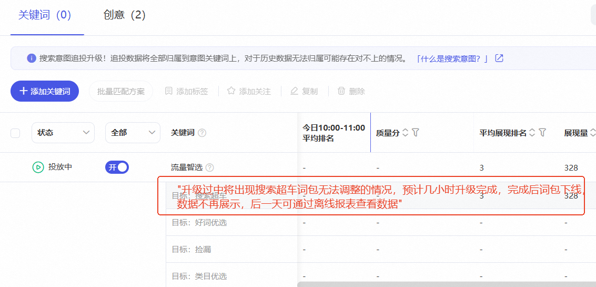

搜索超车词包删除操作记录

##

## **新流量智选商家看这里**

新流量智选2.0商家推广单元会逐步生效流量智选2.0能力，生效后会生成流量智选创意；商家也可自行开启任意流量智选词包或新建部分智能计划生效相关能力

### **核心能力介绍**

依托LMA大模型升级对商品每一个流量进行精细化管理，系统精准识别并提高优质流量获取，全面激活店铺增长动能。

强力拿量、高效转化，开启后拿量提升12%-15%，转化提升8%-12%，适合高拿量品获取更多转化，中游高转化品获得更多流量

更多流量：依托大模型强大算力，精细化管理每个流量，充分挖掘拿量潜能。

更高转化：精准识别每个流量特征，智能匹配适配商品，实现高效转化。

### 面向对象

计划：**目前仅支持智能计划（含趋势明星、好货快投、部分金卡，不含搜索卡位、相似品跟投）**，不支持手动计划，相关能力较为复杂，规划后续支持

单元：功能内嵌在单元维度，即最细维度针对推广单元（宝贝）开启；三品一械类宝贝不支持投放（类目见下方答疑），目标开启后无效建议关闭

### **如何开启**

#### **存量推广单元开启：**

##### **单个开启**

计划-单元-关键词页面-流量智选-目标设置，针对单个推广单元（宝贝）开启任一流量智选词包（均生效历史搜索超车能力）；

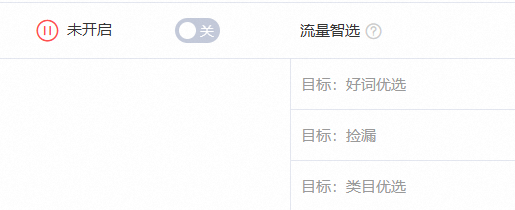

#####

#### **新建推广单元开启：****点击创建**

新建关键词推广计划-智能计划（含趋势明星、好货快投、部分金卡，不含搜索卡位、相似品跟投）-关键词设置-添加自选词-流量智选（**默认开启**）；开启后计划下全部推广单元都生效，可在单元-关键词页面设置关闭

**趋势明星、好货快投计划新建时默认开启，无设置入口，可在推广单元页面进行管理**

**自定义推广-智能出价-获取成交量/增加收藏加购量/增加点击量/稳定投产比均支持（见下图）**

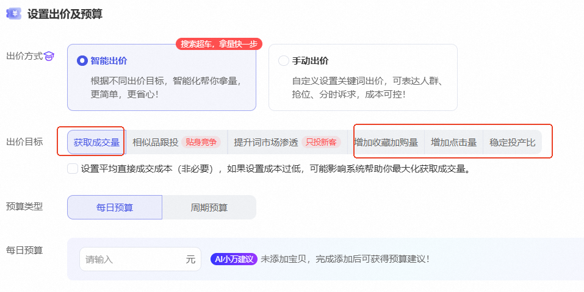

设置开启：设置宝贝推广方案-添加关键词-更多关键词-流量智选

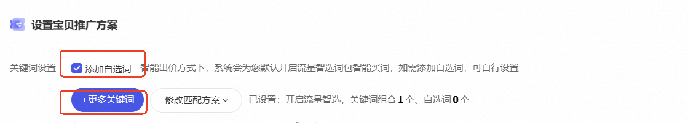

###

### **其他说明**

创意：为保障投放效果，开启流量智选2.0后将自动生成主图创意（创意数据与词包数据独立），且不支持编辑；关闭流量智选全部词包后，可自行解绑创意（*注：后续将进一步迭代优化，流量智选2.0不再依赖流量智选创意，届时流量智选创意将下线*）

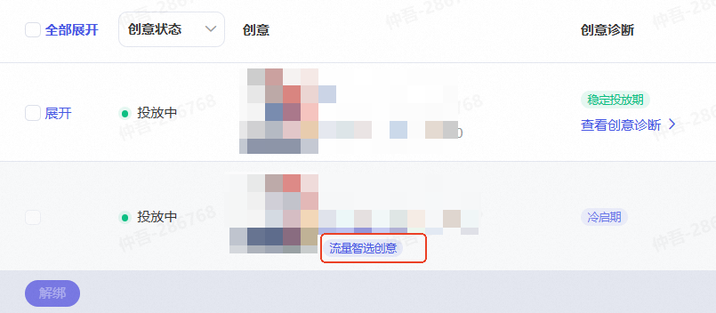

屏蔽词：流量智选设置的屏蔽词依旧生效

流量智选报告：优质词表现数据依旧披露

投放位置：同其他词包一样均投放到关键词推广常规资源位：搜索结果页下综合、销量、天猫、店铺、上新tab等

### **答疑**

为什么我没有开通这个功能？

本功能目前处于迭代阶段，该功能为平台邀约制，是仅向受邀商家开通的限时权益，暂不支持主动提报；如有更多问题，可扫描文档最后方二维码入群沟通

为什么会生成主图创意即流量智选创意

为了保障投放效果，让消费者在点击宝贝后看到的图片体验是一致的；（*注：后续将进一步迭代优化，实现全部创意图投放流量智选2.0的能力，届时流量智选创意将下线*）

为什么只在智能计划生效

相关能力较为复杂，当前优先在智能计划生效，有规划适配到手动计划

如何查看流量智选2.0效果

可在单元页面，查看对应词包的数据表现，另流量智选词包结案会披露优质词表现数据

为什么有的推广单元有流量智选创意，有的没有

有流量智选2.0功能的商家：**新建部分**智能计划时默认开启流量智选且生成流量智选2.0创意；**存量**推广宝贝，投放产生一定数据后会开启流量智选并生成流量智选创意

为什么我的搜索超车词包不见了

为进一步满足商家对全部流量智选词包生效搜索超车相关能力的诉求，搜索超车升级为流量智选2.0，搜索超车词包下线，搜索超车作为底层能力对好词优选、捡漏、类目优选词包生效；历史的搜索超车数据可通过离线报表查看

搜索超车升级为流量智选过程中有哪些变化

注意：搜索超车升级到流量智选当天：1）搜索超车词包出现无法调整的情况，通常是升级中，预估几小时完成，完成后词包下线；2）搜索超车创意将逐步升级为流量智选创意，升级需要时间，可能出现搜索超车词包已下线，搜索超车创意依旧存在的情况，预估1-2天内升级完成；3）推广单元下实时报表搜索超车词包下线后不再投放，同时其他词包如已开启则生效搜索超车能力继续投放，搜索超车词包实时数据不再展现，后一日可通过离线报表查看搜索超车词包数据

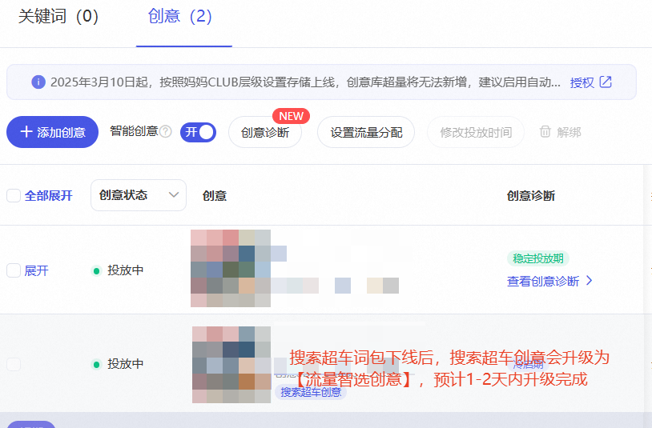

哪些类目无法投放

三品一械类目无法投放；具体为：

医疗器械、OTC药品/国际医药

疫苗服务、医疗及健康服务、处方药、体检/医疗保障卡

隐形眼镜/护理液 >> 隐形眼镜 、国际隐形眼镜/护理液、 彩色隐形眼镜

成人用品/情趣用品、计生用品

传统滋补营养品 且是保健食品

保健食品/膳食营养补充食品 >> 蓝帽子保健食品 全部带蓝帽子标的保健食品、特殊医学用途配方食品

# **原搜索超车（2026年1月7日升级为流量智选2.0）**

### **核心能力介绍**

依托LMA大模型升级对商品每一个流量进行精细化管理，系统精准识别并提高优质流量获取，全面激活店铺增长动能。

强力拿量、高效转化，开启后拿量提升12%-15%，转化提升8%-12%，适合高拿量品获取更多转化，中游高转化品获得更多流量

更多流量：依托大模型强大算力，精细化管理每个流量，充分挖掘拿量潜能。

更高转化：精准识别每个流量特征，智能匹配适配商品，实现高效转化。

### 面向对象

计划：**目前仅支持智能计划（含趋势明星、好货快投、部分金卡，不含搜索卡位、相似品跟投）**，不支持手动计划，相关能力较为复杂，规划后续支持

单元：功能内嵌在单元维度，即最细维度针对推广单元（宝贝）开启；三品一械类宝贝不支持投放（类目见下方答疑），目标开启后无效建议关闭

### **如何开启**

#### **存量推广单元开启：**

##### **单个开启/关闭**

计划-单元-关键词页面-流量智选-目标设置，针对单个推广单元（宝贝）开启/关闭；

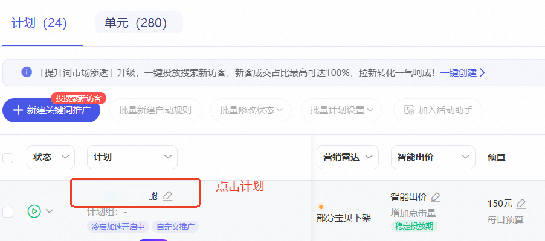

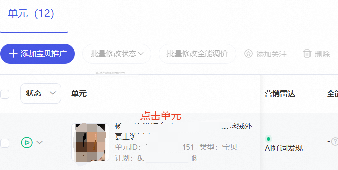

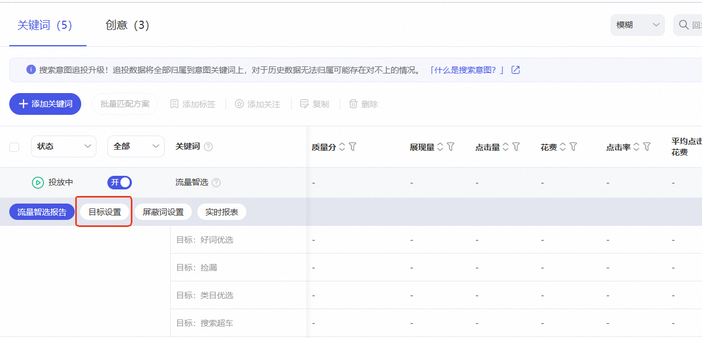

##### **批量开启**

目前无界后台会弹出关键词推广-单元批量开启搜索超车弹窗，系统已默认挑选部分1）拿量不错但转化率处于店铺中游的商品，开启后可提升转化率 2）高转化率但拿量能力欠缺的商品，开启后可提升拿量。

**另外，关键词推广计划页，营销雷达、计划列表页置顶蓝条模块已新增批量开启入口（下图红框内）**

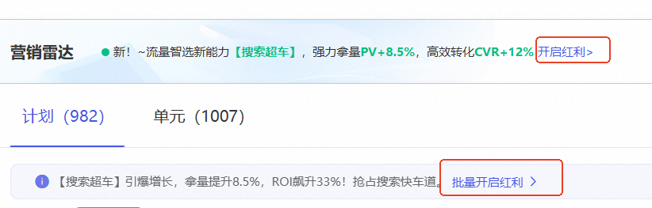

弹窗见下图，可点击编辑单元，通过宝贝搜索自主添加想要开启的宝贝，如出现无单元的情况表明商家当前推广单元未命中可开启的智能计划（含趋势明星、好货快投、部分金卡，不含搜索卡位、相似品跟投）

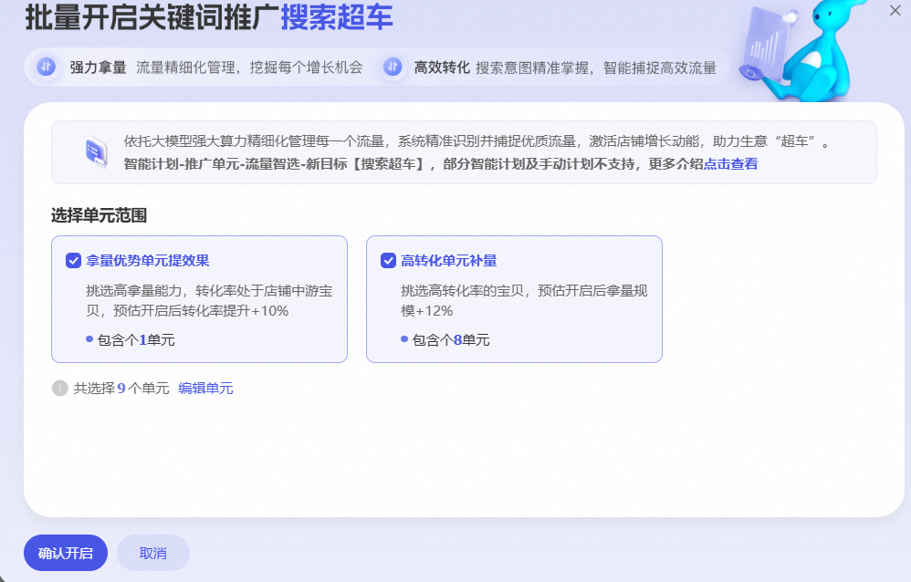

如批量开启出现以下报错（个例现象），可选择只开启一个批量单元（拿量、转化）类型开启，后续再开启另外一个类型

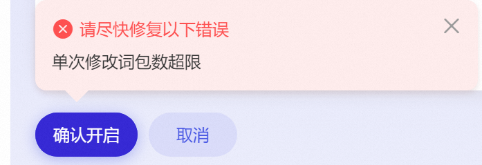

#### **新建推广单元开启：****点击创建**

新建关键词推广计划-智能计划（含趋势明星、好货快投、部分金卡，不含搜索卡位、相似品跟投）-关键词设置-添加自选词-流量智选（**默认开启**）；开启后计划下全部推广单元都生效，可在单元-关键词页面设置关闭

**趋势明星、好货快投计划新建时默认开启，无设置入口，可在推广单元页面进行管理（参考上述存量推广单元开启）**

**自定义推广-智能出价-获取成交量/增加收藏加购量/增加点击量/稳定投产比均支持（见下图）**

设置搜索超车：设置宝贝推广方案-添加关键词-更多关键词-流量智选

### **其他说明**

创意：为保障投放效果，开启搜索超车后将自动生成主图创意（创意数据与词包数据独立），且不支持编辑；关闭搜索超车后，可自行解绑创意

屏蔽词：流量智选设置的屏蔽词对搜索超车生效

流量智选报告：搜索超车同其他词包一样产出结案，披露优质词表现数据

买词优先级：搜索超车词包和其他智能词包一样，商家自主买词会优先于搜索超车词包

投放位置：同其他词包一样均投放到关键词推广常规资源位：搜索结果页下综合、销量、天猫、店铺、上新tab等

### **SHOWCASE**

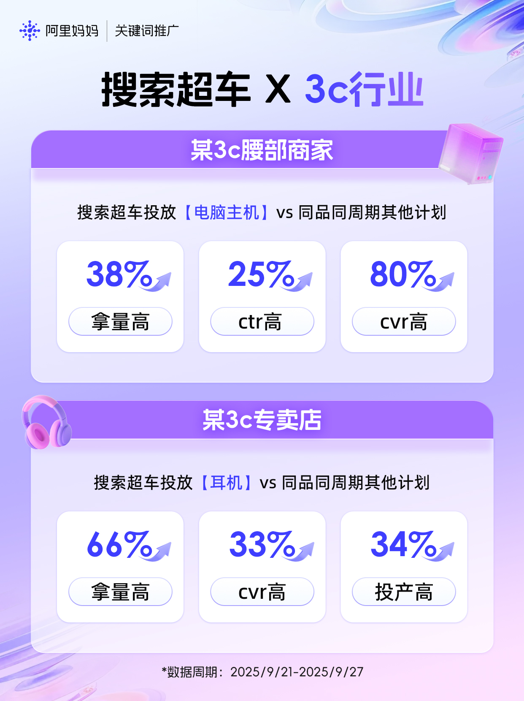

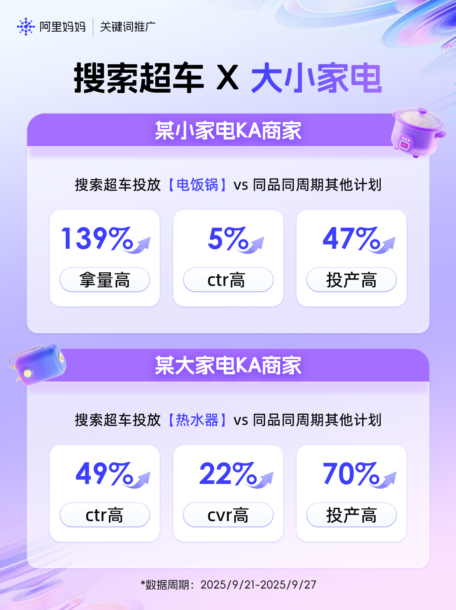

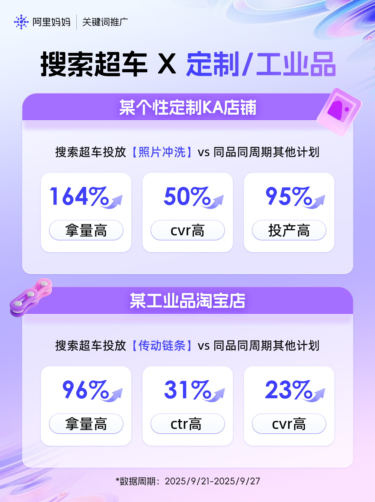

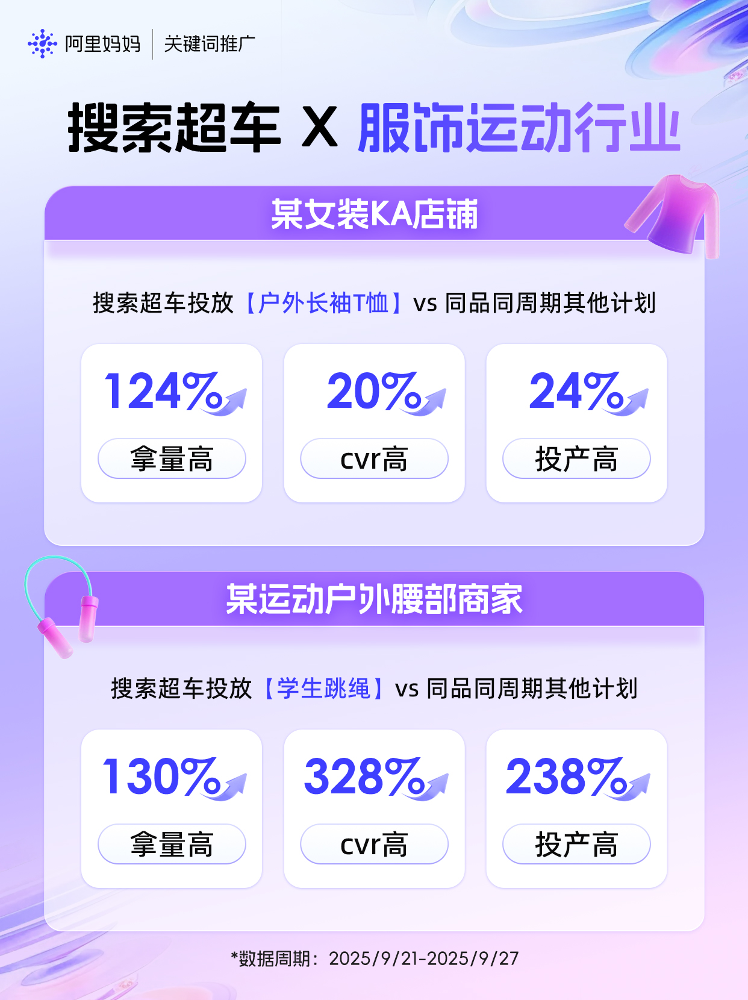

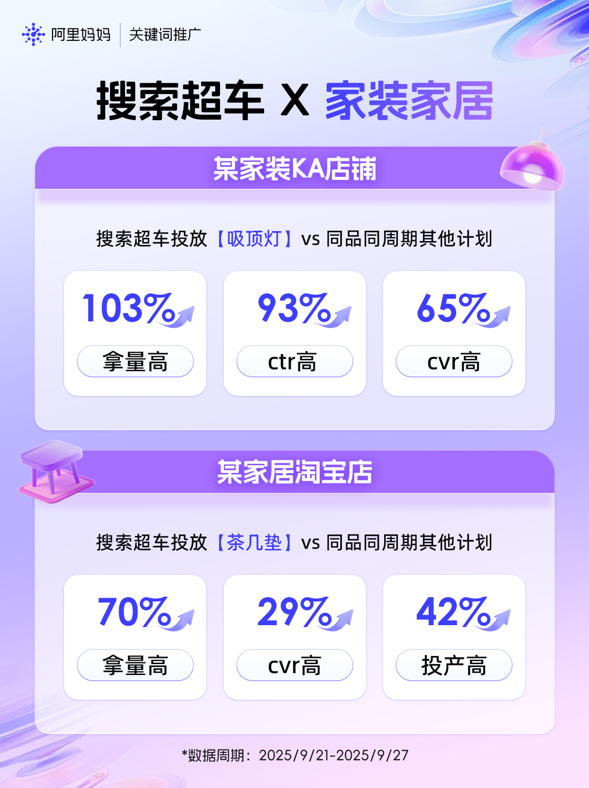

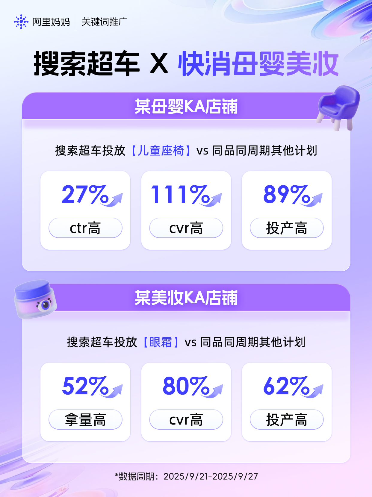

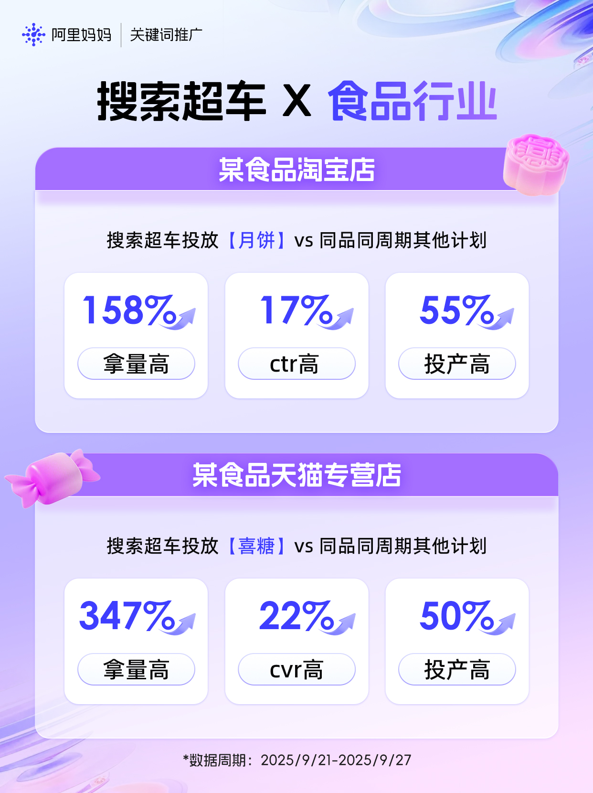

商家近7天搜索超车表现，roi超过全店60%（个别商家表现不代表功能整体表现）

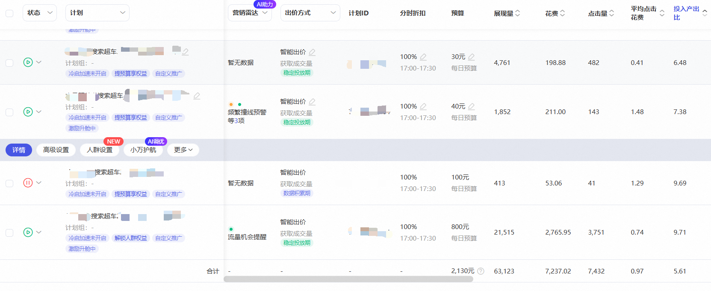

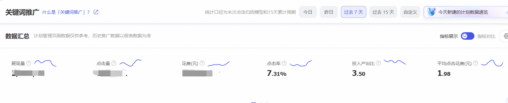

### **答疑**

为什么我没有开通这个功能？

本功能目前处于迭代阶段，该功能为平台邀约制，是仅向受邀商家开通的限时权益，暂不支持主动提报；如有更多问题，可扫描文档最后方二维码入群沟通

为什么会生成主图创意

为了保障投放效果，让消费者在点击宝贝后看到的图片体验是一致的

为什么只在智能计划生效

相关能力较为复杂，当前优先在智能计划生效，有规划适配到手动计划

如何查看搜索超车效果

可在单元页面，查看词包【搜索超车】的数据表现，另流量智选词包结案会披露优质词表现数据

批量开启报错：如批量开启出现以下报错（个例现象），可选择只开启一个批量单元（拿量、转化）类型开启，后续再开启另外一个类型

哪些类目无法投放

三品一械类目无法投放；具体为：

医疗器械、OTC药品/国际医药

疫苗服务、医疗及健康服务、处方药、体检/医疗保障卡

隐形眼镜/护理液 >> 隐形眼镜 、国际隐形眼镜/护理液、 彩色隐形眼镜

成人用品/情趣用品、计生用品

传统滋补营养品 且是保健食品

保健食品/膳食营养补充食品 >> 蓝帽子保健食品 全部带蓝帽子标的保健食品、特殊医学用途配方食品

### **钉钉群**

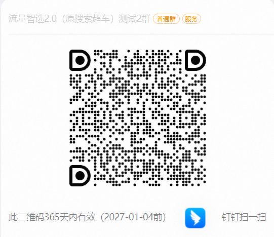
