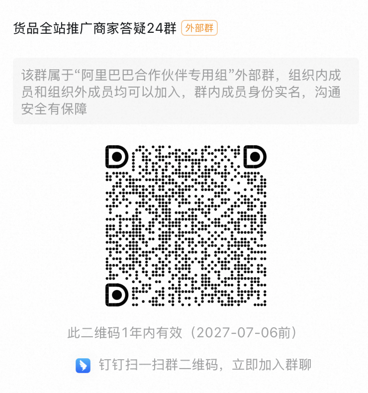

# 投放门槛降低（邀约制）

> 来源：https://alidocs.dingtalk.com/i/nodes/QG53mjyd800agdlKHdoZGPAv86zbX04v

【重要通知】商品支持「货品全站推广」与「其他场景」同时投放！

为助力商家高效增长，万相台无界-货品全站推广现面向受邀商家限时开放「货品全站推广投放门槛降低」权益！6月2日起，受邀商家的商品**可开启「货品全站推广」计划，与「其他场景」计划同时投放**，满足商品多渠道投放的运营诉求！

核心变化抢先看

1.无界多场景可同时投放：商品**可开启「货品全站推广」计划，与「其他场景」计划****同时投放****; **

2.即刻投放货品全站推广，即享**「**货品全站推广**」**升级红利：围绕货品生命周期建设新品、潜力品、机会爆品成长的能力，助力「新品」拿量速度更快、「潜力品」GMV增长更多、「机会爆品」流量增量更大**; **

3.商品起投门槛降低：货品全站推广投放最低门槛全面降低！全部商品**起投门槛降至50元****;**

# **Q&A：**

Q：为什么我没有开通这个功能？

A：本功能目前处于迭代阶段，该功能为平台邀约制，是仅向受邀商家开通的限时权益，暂不支持主动提报；如有更多问题，可扫描文档最后方二维码入群沟通

Q：无界其他场景与货品全站推广可同时投放后，在配合投放的策略上，有什么建议吗？

A：货品全站推广已建设围绕货品生命周期建设新品、潜力品、机会爆品成长的能力，助力「新品」拿量速度更快、「潜力品」GMV增长更多、「机会爆品」流量增量更大；对于处于不同生命周期的货品，商家可以基于自身的投放诉求，参考以下的推荐出价和调优方向进行货品全站推广计划的设置，与其他场景配合投放；同时对于货品全站推广的控投产计划，请**尽可能采纳平台的推荐ROI进行设置****；**

| **货品生命周期** | **是否新品** | **推荐出价及投放调优** | **推荐理由** |
| --- | --- | --- | --- |
| 新品冷启期 | 是 | 最大化拿量 加购目标 | **新品加速**：当前商品处于新品阶段，推荐使用最大化拿量，并打开加购目标，实现成长跃迁 |
| 新品成长期 | 是 | 最大化拿量 加购目标 | **新品加速**：当前商品处于新品阶段，推荐使用最大化拿量，并打开加购目标，实现成长跃迁 |
| 新品爆发期 | 是 | 控投产 加购目标 | **新品加速**：当前商品处于新品爆发期，推荐使用控投产出价，并打开加购目标，提升成交爆发 |
| 成长期 | 否 | 控投产 直接成交目标 | **尖货打爆**：当前商品处于成长期，推荐使用控投产比出价，并打开直接成交调优，实现单品GMV增长，快速打爆 |
| 爆发期 | 否 | 控投产 加购目标 | **流量增长**：该商品为机会爆品，推荐使用控投产比出价方式，并打开加购目标调优，稳定爆品排名，撬动全域流量增长； |
| 平销期 | 是 | 控投产 | **稳定获量**：当前商品处于平销期，推荐使用控投产出价稳定利润延长生命周期 |

Q：为什么解除互斥后新建货品运营计划仍然提示存在货品全站推广在投计划？

A：本次解除互斥的范围仅包含货品全站推广与关键词推广场景和人群推广场景和互斥，因货品运营/全店智投/多目标直投场景已下线，本次解除互斥暂未做处理

Q：我的其他店铺都已经可以全站推和人/词同时投放了，为什么我当前店铺不可以？

A：本次需求为平台邀约值，经过平台圈选后按商家主账号维度逐一开放，未开通的店铺请耐心等待

Q：货品全站推广的成交会跟其他工具重复计算吗？

A：货品全站推广与无界其他场景均为末次触点归因，成交不会同时计算

Q：解除互斥后，货品全站推广单品计划与全店模式是否互斥？

A：是的，同一商品在整个货品全站推广场景下只能存在一条计划

Q：超级短视频投放和货品全站推广能一起开吗？

A：可以，无论是否开通本次解除互斥的功能，超级短视频和货品全站推广都可以同时投放

# **问题反馈：**

