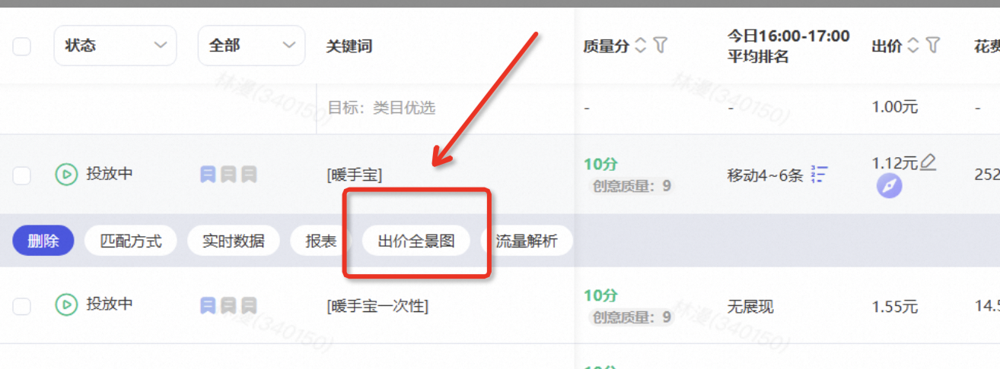
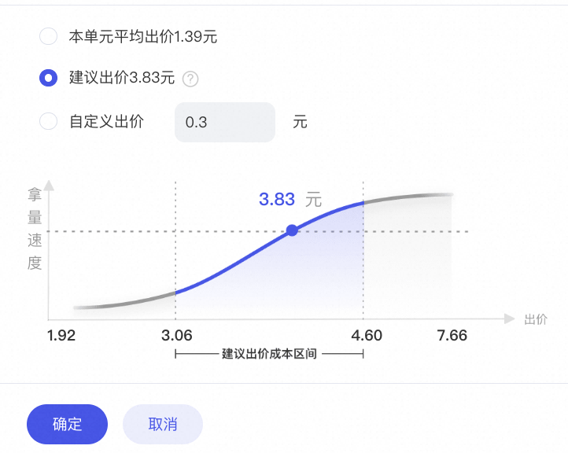
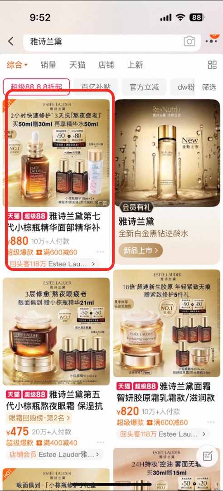
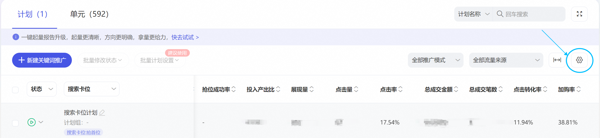
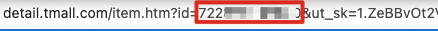
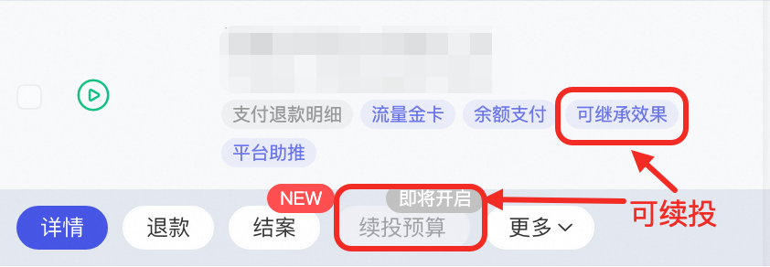
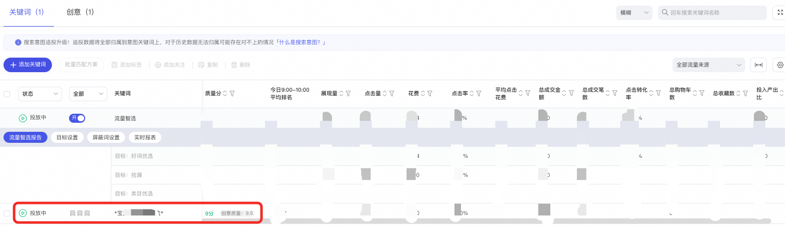
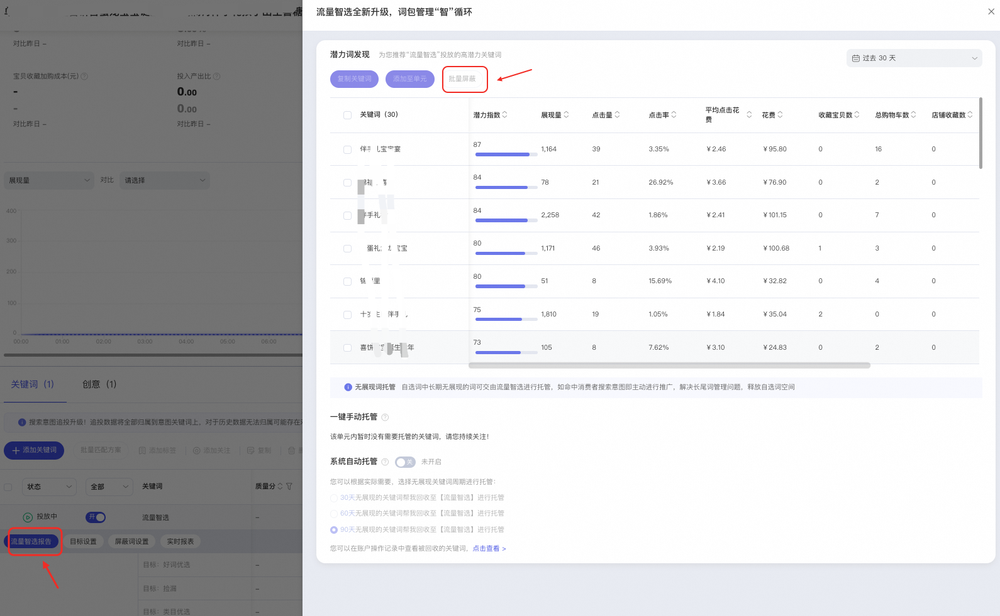
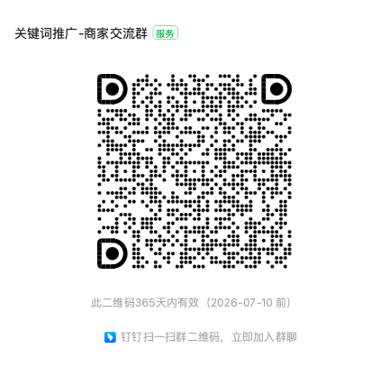

# 「关键词推广」百大QA

> 来源：https://alidocs.dingtalk.com/i/nodes/QG53mjyd800agdlKHdvrLv4O86zbX04v

# ** 一、关于关键词推广综合问题 **

### **关键词推广投放基础逻辑问题**

Q：**什么是关键词推广？**

A：关键词推广是一种精准的搜索投放产品，它通过拿捏全淘搜索场域流量，实现精准拦截与策略引流，帮助您的商品在搜索结果页精准展现。关键词推广采用无点击不扣费的模式，让营销推广更加精准可控，满足您多样化的推广需求。

Q：**关键词推广排名逻辑****？**

A：关键词推广的排名逻辑主要基于以下几个因素：

（1）关键词出价：关键词的出价是影响排名的重要因素，出价越高，排名越有可能靠前。

（2）质量得分：质量得分是另一个关键因素，它综合考虑了关键词的相关性、推广质量、落地页质量等因素。

（3）买家综合维度：买家的综合维度也会影响排名，这包括买家的搜索意图、购买历史等。

（4）人群特征：关键词推广可以设定精准人群展示，展示会受到人群的特征、地域竞争、环境等因素的影响。

（5）实时竞价：系统会根据您设置的关键词以及行业情况实时竞价排名展现给消费者。

若您希望提高排名，建议优化关键词质量分，并适当加价或设置抢位策略。同时，针对搜索人群进行溢价也是一个有效的策略。

**Q：关键词推广扣费逻辑？**

A：扣费逻辑：关键词推广的扣费模式是点击才产生扣费，展现是不扣费的。只有当买家在搜索的推广展位上点击了我们的宝贝，才会产生扣费。

竞价排名：关键词推广是通过对关键词进行出价，结合质量分去实时竞争排名获取推广位。消费在推广位上进行点击，扣除点击费用。

**Q：****关键词推广与其他产品相比有何不同之处？**

A：关键词推广：主要针对通过搜索流量获取用户，商家为特定宝贝设置关键词，当买家通过搜索这些关键词时，宝贝会根据出价和质量分综合展现。关键词推广允许一个宝贝添加最多200个关键词，建议选择与宝贝相关性较好的行业热词进行推广。

精准人群推广：针对特定用户群体进行定向推广，商家可以利用精准人群推广工具，结合用户的行为数据，如浏览、收藏、加购、咨询等，以及关键词实时搜索人群，来实现更精准的营销。

全站推广：覆盖全网流量，适合广泛曝光。全站推广通过付费与免费联动机制激活淘宝平台上的全局流量，确保淘系全站的投资回报率（ROI），促进商品成交额的全面提升，并推动业务规模的增长。

**Q：关键词推广与自然流量的关系是什么？**

A：关键词推广与自然流量之间并没有直接关系。关键词推广主要是通过精准的关键词匹配来提升宝贝在搜索结果页的展现机会，而自然流量则是指不通过付费推广而获得的流量。推广虽然不能直接带来免费流量，但可以通过提升产品销量和增长速度间接影响自然流量。例如，如果一个新产品在初期通过推广迅速积累销量，这样的销量增长会更容易吸引搜索引擎的注意，从而带来更多的自然流量。因此，关键词推广与自然流量之间的关系是间接的，通过提升产品表现来影响自然流量的获取。

**Q：关键词推广不同营销目标有什么区别？（搜索卡位、趋势明星、流量金卡、自定义推广）**

A：搜索卡位：是一种关键词推广的投放方式，主要目的是在搜索结果中占据有利位置，以提升推广的曝光率，目前支持商家针对搜索首条、前三、首页等高优位置进行卡位，计划卡位成功率高达100%

趋势明星：是利用算法分析淘内外趋势热榜和热词流量变化，挖掘热点趋势，并智能推荐店铺宝贝所在行业的趋势榜单，自动匹配趋势宝贝，帮助商家借势营销热点，获取流量高地。

流量金卡：是能够智能买词出价、满足不同货品周期、不同行业定制解决方案的套餐包，不需要复杂的操作，就能够投放优质高转化流量，提供多种买词、冲量、提效解决方案，不与现有计划冲突，只拿纯增量！

自定义推广：支持个性化定制投放策略，商家可以确定选品方式、设置预算和出价方式，并支持一键应用多宝贝设置项，同时提供关键词和人群设置功能，以实现精准可控的投放。

### NEW ！关于手淘搜索结果展示逻辑变更（搜索SKU意图词展示SKU图片和标题）对于关键词推广影响同步

范围：消费者明确表达SKU意图的搜索结果

影响：以ipone 17pro512G 举例 ，标题和图片优先展示该型号，相对的消费者需求和搜索结果**匹配度更高点击转化概率更高**

建议：品类多SKU且消费者偏好SKU意图搜索的商品，建议配置SKU素材

其他影响答疑

原先商品维度展示，现在SKU维度展示，会不会增加推广竞价商品的数量

不会；消费者搜索带SKU意图词时，只有有相关SKU的商品参与竞价，竞价商品数量不会发生变化

SKU图片会乱显示吗

不会；会以SKU素材为主，通过智能创意生成的更吸引消费者点击SKU图片，提升图片点击概率

SKU维度显示的点击对于推广数据的积累会发生变化吗

不会；SKU维度和商品维度的展示对于推广的数据积累是等效的

# ** 二、出价/预算问题 **

### **1.出价**

**Q：关键词平均出价公式****是什么？**

**A：**关键词的平均出价公式=关键词出价*分时折扣最大值*（1+人群溢价最大值）*（1+商家自己设置的全能调价溢价）

注：全能调价的单次PPC是波动的，但是长期数据看，单次PPC会趋近于关键词的平均出价

**Q：为什么平均点击比最终出价高？**

**A：**查看是否开启全能调价，辛苦客户点击【出价全景图】，查看具体的出价计算公式

从全能调价的产品逻辑来看，商家设置溢价比例后，系统会根据流量质量、竞争环境等进行动态出价调整，短期看单次报价可能会高于溢价，但是长期看整体溢价水平谁趋于稳定，但是不确保一定会低于商家设置的溢价比例，也不一定都会高于商家设置的溢价比例，需要结合具体的流量环境看。如果您实在无法接受超出溢价，建议关闭全能调价，通过调整关键词出价、人群溢价、分时折扣等其他操作实现出价的调控。

**Q：****建议出价依据原理是什么？出价越高，代表流量越优质？**

A：①系统建议出价会根据推广宝贝成交情况不同做判断，系统会考虑您输入的预算值自动给出成本建议，一般会考虑在预算恰好花完的情况下给到最优的成本设置建议。

②是的，只是出价/成本决定流量大小，成本设置后的效果预估是在**不考虑日预算限制**的情况下（即预算无限大）成本与效果的关系，输入的成本设置越高，拿量能力也就越强

**Q：直通车是否有限制，出价开很高，推广中展示是否都是我的产品？**

**A：**千人千面，若推广不同的宝贝相同关键词只能展现综合排名靠前的2款宝贝

### **2.预算**

**Q：为什么我的消耗超出了日预算？**

**A：**①查看操作记录是否修改过日预算

②查看是否设置自动规则追加预算，若设置：客户该计划设置了自动规则投放，根据投放效果逐步追加预算，并未出现投放问题

**Q：花费达不到设置的每日预算怎么办？**

**A：**点击营销雷达里的“拿量可调优”，可以进行投放优化

**Q：什****么是日均预算？为什么我的扣费大于设置的日限额？计划开启日均预算后，暂停又开启，周期哪天开始算**

**A：**①日均预算是根据每天流量变化以及投放效果，系统智能分配每日预算，保障7天每日平均花费不超过日均预算设置值，同时获得投放效果提升。单日花费最高不超过日均预算值的1.5倍。更多介绍参考：

②计划预算变更后，日均预算重置为第一天

# ** 三、投放效果类问题 **

请自查：

### **展现/点击/消耗（无&少展现、展现波动、消耗慢）**

调优及排查手段：

| 1.检查预算是否充足 | 预算不足，后期才充值余额，从无余额状态变为有余额状态，由于人为干扰了系统平稳投放，均会导致流量波动，建议商家日常保持预算充足、不要频繁调整预算，并持续关注后续稳定投放的数据 |
| --- | --- |

| 2.检查计划/单元是否暂停/开启过 | 人为干扰了系统稳定投放，在您暂停/开启计划后，系统可能会在重新开启瞬间流量波动，建议您不要频繁调整，并持续关注后续稳定投放的数据 |
| --- | --- |

| 3.检查是否修改过日预算/分时折扣 | 商家频繁调整日预算/分时折扣后，人为干扰了原先系统平稳投放的路径，系统需要根据新的设置重新规划投放，前期会出现流量波动，建议商家不要频繁修改计划设置，并持续关注后续稳定投放的数据 |
| --- | --- |

| 4.检查是否删除/暂停/屏蔽过关键词或词包 | 根据您的操作记录，您暂停/删除/屏蔽过关键词，该操作导致可投流量较少，进而导致展现/点击/消耗下降，建议您增加买词或开启流量智选词包，提升可投词的流量范围 |
| --- | --- |

| 5.**手动出价** （1）质量分 （2）是否低于出价建议 （3）是否调整过出价 | （1）质量分较低，会影响关键词的展现机会，请根据系统提示优化质量分 （2）①出价指导工具：若出价低于出价指导建议，说明您的出价低于建议出价，词的竞价能力较弱，建议调整出价 ②流量解析工具：在流量解析中，查看该词近期的市场均价如何，如果商家出价低于市场均价，建议商家继续提升出价 （3）调整降低关键词出价，会导致该词竞价能力下降，进而出现展现/点击/消耗下降，建议您结合自身经营需求，适当提升关键词出价 |
| --- | --- |

### **常见展现问题**

| 1.无展现的情况 | 可能原因： （1）除**医疗、药品、医疗器械推广**外，禁止其他任何推广涉及疾病治疗功能，并不得使用医疗用语或者易使推销的商品与药品、医疗器械相混淆的用语。请您对照规则解读内容进行修改！ （2）**流量智选无展现**：提交【阿里妈妈/万相台无界/效果/关键词推广/展现问题（无&少展现、展现波动、消耗慢）】进行干预 （3）**淘宝搜索不到推广的宝贝**：目前展现数据会受人群特征、地域、竞争环境等因素的影响，不同的人搜索展现的宝贝会不一样，不同买家搜索的结果相对不同。无法保证买家一直可以自己搜索到自己的宝贝。个性化的展现主要是为了帮助您提高推广流量的准确度，让符合店铺宝贝目标群体的精准买家快速找到自己的宝贝。把推广费用花在刀刃上。 有展现就说明没有问题，像这种搜索不到的问题，有可能上万人搜索几百次 才会出现1次 （4）**关键词被标记为无展现：**由于长期无展现导致关键词都被系统标记为无展现词。若过去拿量正常，则可能是由于计划、单元长期下线、账户长期没有余额导致，建议您微调出价以更新关键词信息。若一直拿不到量，请尝试更多关键词、打开智能词包或提高出价以提高拿量能力。 |
| --- | --- |

| 2.展现量突增 | 由于市场情况、社会热点、手淘内的搜索词推荐引导等因素影响，会导致消费者对部分词的搜索激增，带动相关投放计划的展现激增。 ①这部分激增流量不影响质量分，因此商家不用担心因为展现量提升、点击率下降影响质量分/计划投放，或自然搜索流量。 ②建议商家针对搜索需求激增的情况，优化创意、商品详情等，提高流量承接率。 ③平台同时在不断优化投放能力，提高整体投放效率。 |
| --- | --- |

| 3.人群包投放下来没有展现/流量有波动 | 1、投放是针对有消费者搜索词时进行推广，用户搜索有波动，因此投放起量慢的情况属于正常情况。 2、商家基础出价太低。即使高人群溢价、也会在竞价时处于弱势、无法获得更多流量。 3、关键词的人群溢价是基于商家买词基础上，筛选过人群后在圈人。买词的词决定了目标人群拿量多少。 因此建议商家扩充买词、提高出价来加速拿量。 |
| --- | --- |

### **常见消耗问题**

| 1.计划/单元暂停后、关键词删除后仍产生消耗 | 正常情况，系统统计点击量是按照 点击时间记录的， 计划/单元暂停前、关键词删除前 散出去的pv 可能 过了很久产生点击，就会出现这种情况 |
| --- | --- |

| 2.消耗集中问题/为什么早上时间段出现消耗集中？ | 推广过程中展现量的波动属于正常现象，主要受以下客观因素影响：市场热点趋势（如新品发布、社会事件、平台大型活动等）会导致用户关注点转移，消费者搜索行为变化；平台算法会根据实时数据进行动态调整（如竞品投放策略变化引发的流量竞争环境调整、用户点击反馈数据驱动的投放排序优化）。 尽管用户手机使用时间碎片化，但受到社会节奏（早起用户）、技术推送（新闻推送）、商家策略（活动推动）等影响，部分用户形成早上浏览习惯，上午可能会出现流量集中的情况 |
| --- | --- |

| 3.未投放时间内产生花费 | 少量扣费可能是由于在计划在投时间段商品触达到消费者，但消费者的点击行为在不在投时间进行的。比如昨晚12点消费者搜索了某个品，您的品做了展示，但该消费者在第二天早上6点才进行点击，该扣费会发生在早上六点，即使您的计划在6点没有投放。 |
| --- | --- |

### **ppc/投放成本上涨问题**

| **1.手动出价** 检查是否提升了关键词出价/人群溢价/智能调价溢价比例/分时折扣 | 提升关键词出价/人群溢价/智能调价溢价比例/分时折扣，竞价默认系统可以更高的成本竞得更多优质流量，进而带来PPC上涨。建议商家不要只关注PPC，可结合拿量情况、点击率/转化率/roi等指标综合查看 |
| --- | --- |

| **2.智能出价** 检查是否修改过投放成本/分时投放阶段 | ①提高了投放成本默认允许系统在更高价值的流量上出更高的价格，所以可能会导致ppc上涨， ②修改了分时投放阶段，相当于人为改变了能够获得流量的分布，会导致一定波动，建议商家不要频繁修改计划设置、并持续观察系统稳定投放后的数据变化 建议客户关注展现、点击和成交等最终数据，只要拿量稳定或者ROI稳定，建议客户不必过于看重投放成本（自动出价的逻辑是根据流量质量自动出价，质量高出价高，反之亦然） |
| --- | --- |

### **5.精准匹配和广泛匹配**

**Q：精准匹配和广泛匹配的区别？**

**广泛匹配**：当用户的搜索词与您投放的关键词相同或者与其相关时，您的推广内容均有机会展现。这种方式可以帮助您覆盖更多潜在消费者的搜索意图，提升曝光可能性。广泛匹配适合用于需要拓展流量的小词，可以覆盖更多潜在用户群体。

**精准匹配**：精准匹配则严格限定在与您设置的关键词高度一致的搜索条件下触发推广展示。这种方式适合应用于热门词或大词，能够有效提升核心关键词的展示效果。精准匹配适合提高转化率。

简而言之，广泛匹配更注重覆盖面和曝光量，而精准匹配则侧重于关键词的精确匹配和转化效果。选择哪种匹配方式取决于您的推广目标和策略。

**Q：广泛匹配不精准怎么调优？**

广泛匹配不精准，可以考虑以下方法来优化：

**调整匹配方式**：您可以进入关键词推广页面，对关键词的匹配方式进行设置或修改。精确匹配可以确保买家搜索词与您设置的关键词完全相同或为同义词时，您的推广宝贝才会展现。

**关键词优化**：检查并优化您的关键词列表，确保它们与您的宝贝高度相关。广泛匹配虽然能带来更多流量，但可能包含不相关的搜索词。

**智能匹配调整**：如果您启用了智能匹配功能，系统会根据宝贝特点自动选择关键词。如果发现匹配的词与宝贝无相关性，可以考虑关闭智能匹配或进行人工调整。

**人群溢价设置**：如果您希望针对特定人群进行精准推广，可以设置人群溢价，这样即使关键词匹配不够精准，也能通过人群溢价来吸引目标用户。

**Q：精准匹配成本高？**

A：精准匹配的关键词通常会带来更高的点击成本。这是因为精准匹配能够确保推广只展示给搜索了完全相同或同义词的用户，从而提高了推广的相关性和点击率

您可以参考推广初期的策略，先选择精准匹配的关键词，然后在第二阶段选择广泛匹配的关键词，最后再次选择精准匹配的关键词，以此来提高关键词的精准度，降低推广费用，提高推广效果，为了平衡成本和效果，您可以考虑以下几个策略：

**选择合适的关键词**：不要盲目选择系统推荐的所有关键词，而是选择在后台推广或自然流量中表现良好的关键词。

**测试和优化**：通过测试不同关键词的效果，逐步优化匹配策略，找到性价比最高的关键词。

# ** 四、关键词推广权益问题 **

## **1：计划数权益**

Q：如何提升关键词计划数权益**？**（以下是新版规则，目前在逐步上线，预计7月底之前全部商家上线完毕）

A：计划数容量是指账户中可同时存在的最大在投计划数(包含正在投放，暂停投放计划，不包含已结束计划)。若账户计划数触顶(即在投计划数=账户计划数容量)，账户将无法继续新建计划。为解决现阶段平台较多客户计划数已触顶的问题，本次推出的新规则将根据客户当前**在场景的近30天累计消耗**确定**该场景的计划数容量**。若**近30天场景累计消耗**达到下一计划数容量门槛，则第二天自动升档；若客户在该场景的计划数容量升档，则在升档之日起**消耗连续30天未达当前档位门槛**，计划数容量将按照近30日内该场景的累积消耗**降低至对应的最大档位**。降档后若账户内在投计划数>计划数容量，则**无法再新建计划**，在投计划不停止依然可以调整。

近30天消耗门槛与对应的计划数容量规则如下：

| 近30天消耗要求(元) | 计划数容量 | 开通方式 |
| --- | --- | --- |
| 无 | 50 | 消耗达标，自动扩容 消耗不达标，自动降挡 |
| ≥1,000 | 100 | 消耗达标，自动扩容 消耗不达标，自动降挡 |
| ≥10,000 | 200 | 消耗达标，自动扩容 消耗不达标，自动降挡 |
| ≥100,000 | 300 | 消耗达标，自动扩容 消耗不达标，自动降挡 |
| ≥500,000 | 500 | 消耗达标，自动扩容 消耗不达标，自动降挡 |
| ≥1,500,000 | 1000 | 消耗达标，自动扩容 消耗不达标，自动降挡 |
| ≥2,000,000 | 1500 | 消耗达标，自动扩容 消耗不达标，自动降挡 |

更多权益开通门槛，请查询：

# ** 关键词推广-搜索卡位问题 **

## **1：什么是搜索卡位**

**告别关键词固定匹配方式的束缚，搜索卡位新增支持****精准匹配和广泛匹配****，灵活适配各类关键词卡位霸屏诉求，无论是广泛覆盖潜在用户，还是精准触达目标客户，都能轻松实现!**

## **2：搜索卡位常见问题**

Q：**搜索卡位选词都支持商家自选吗？品牌词、类目词、竞品词...什么词都可以买吗？**

A：搜索卡位支持客户自选词，**但能否卡到首条、前三位置，需要遵循相关性约束**；比如选择商家自己的品牌词、类目词等相关性好的词，那么是可以卡到首条、前三的；但如果是竞对的品牌词，对于投放商家来说相关性较差，那么就算投放搜索卡位，也是很难卡到对应位置的

Q：**抢位方式里说的[首条]、[首页]具体指什么位置？**

A：[首条]、[首页]指的是搜索推广位置的首条、首页，具体坑位如下图

Q：**为什么新建的搜索卡位计划，消耗很慢？**

A：搜索卡位计划采用**中心词匹配**的方式进行投放，流量相对精准，如果大家的卡位计划消耗比较慢，建议多加几个卡位关键词，卡位关键词**10个**左右效果最佳

Q：**怎么看我计划的卡位成功率，有数据吗？**

A：推广页面新增了【抢位成功率】的指标，该数据是T+1更新的，抢位成功率=计划在目标位置的展现量/计划总展现量x100%

Q：**搜索卡位计划和之前的手动抢位有什么区别？**

A：搜索卡位和之前手动抢位的区别有几个点：

搜索卡位做了底层能力的升级，在目标位置的交付上能力更强，抢位成功率最高达80%

搜索卡位买词方式是中心词匹配的方式，可保障投放精准度的同时放大流量覆盖范围

搜索卡位支持批量选词设置卡位，底层是智能出价，整体抢位操作更便捷智能

# ** 关键词推广-相似品跟投问题 **

## **1：什么是相似品跟投**

**将您的商品投放和展现在跟投商品的搜索结果附近位置**，赢得目标人群关注度**，影响用户决策路径**，带来更精准的流量与转化；支持智能跟投和自定义跟投

**智能跟投：包括****相似商品、爆品跟投、搭配商品三种跟投选择，支持筛选价格带、叶子类目和是否包含本店铺商品**

**相似商品：**跟投同叶子类目、高度相似、价格相近的商品，**扩大竞争优势。**

**爆品跟投-NEW：**跟投同叶子类目销量高、增速快的爆品，**适合新品继承爆品流量、爆品巩固销量。**

**搭配商品-NEW：**跟投搭配类目下购买意图相似的商品，**助宝贝快速拉新破圈。**

**自定义跟投：**自主选择指定跟投商品，获取该商品附近流量

## **2：相似品跟投常见问题**

Q：**相似品跟投是跟投哪些商品呢？**

A：首先，**计划**默认是智能跟投，系统动态筛选跟投商品，投放在其附近的推广坑位上；其次，您可以额外进行自定义跟投，自主添加希望跟投的商品，**通过智能+自定义共同获取跟投品附近的流量位**

Q：**相似品跟投是否查看跟投了哪些商品？**

A：针对自定义跟投部分，增加具体跟投品，以及跟投品和自身品的点击率对比、转化率对比、竞品流入度指标

Q：**智能跟投和自定义跟投选择商品会不会重复？**

A：会优先自定义跟投

Q：**相似品跟投是怎么出价的？**

A：选定相似品的出价目标后，无需选择设置成本，系统会根据预估跟投成功率，进行动态智能出价，同时兼顾考虑成交因素

Q：**自定义圈选目标相似品时，建议添加多少个宝贝？**

A：跟投数量越多，获取精准流量的能力越多，通过输入商品标题或商品ID来添加自定义跟投商品。

Q：**自定义圈选目标相似品时，如何找到宝贝ID？**

A：如果您有具体想要跟投的商品，可在PC端淘宝链接的“id=”后查找商品ID；更多操作见：https://www.yuque.com/guoguan-0d07u/ddk8bn/tpexf50tbiszx1qx?singleDoc#《如何查找商品ID》

Q：**跟投成功率是什么？**

A：跟投成功率=跟投成功量 / 跟投总展现量

跟投成功是指：1）竞价后，最终你的品展现在相似品附近位置；2）竞价过程中，你的品因为做了出价调整，把相似品位置挤占了，你的品展现了，相似品没展现；

跟投总展现量：包括跟投成功和跟投失败，跟投失败是指：因为当次竞价过程中，受限于和相似品差异过大导致提出价也未获取相似品附近的位置，但是展现在了其他位置

Q：**相似品跟投成功率为什么不是100%？**

A：跟投失败是指：因为当次竞价过程中，受限于和相似品差异过大导致提出价也未获取相似品附近的位置，但是展现在了其他位置

Q：**相似品跟投获取了多少跟投品流量？**

A：可以通过兴趣人群分析拿到的相似品流量

# ** 关键词推广-流量金卡问题 **

## **1：什么是流量金卡？**

智能买词出价的套餐包，投放优质高转化流量，提供多种买词、冲量、提效解决方案；无需复杂操作，在周期内每日均匀投放，省心省力；不与现有计划冲突，只拿纯增量！

## **2：流量金卡常见问题**

Q：**什么是订单模式？流量金卡与自定义推广计划的区别是啥？**

A：流量金卡采用订单模式，即完成创建后需要提前锁定预算，再按照每日实际消耗进行按日扣费，不与自定义推广计划抢占日预算。锁预算的方式能实现更智能的预算分配，操作更简单，投放更确定。

Q：**流量金卡支持投放期间修改/暂停/退款吗？**

A：流量金卡交付的是长周期的投放效果，创建后算法会提前预估投放机制，且开始投放后会逐步优化投放策略、建议投放2-3天后再观察投产情况，不要由于短时间的波动就贸然关闭订单；目前订单激活达到48小时后，才支持操作手动结束订单。

Q：**流量金卡可以多次投放吗？**

A：**流量金卡累计支持创建300个订单，单卡支持同时创建50个**，但注意相同的卡包下，宝贝的选择尽量差异化，避免影响订单效果。

Q：**同一个宝贝可以重复创建金卡吗？**

A：同一个宝贝可以创建不同类型的流量金卡、并不冲突。但是同一张金卡，宝贝的选择尽量差异化。如果需要追加预算、建议创建时选择高档位预算、提早追加好。

Q：**流量金卡计划可以续投吗？**

A：可以，**金卡计划结束后7天内**，可以点击计划下方的“续投”按钮追加预算，续投后直接继承效果，无需再次冷启动。**注意：大促卡是根据大促周期限时推出，不支持续投**

Q：**预算没花完如何退款？**

A：如果投放周期结束，总预算尚未花完，未花完预算将在订单投放结束的48小时内以现金形式解冻至账户余额。

Q：**为什么大促金卡的出价比较高？**

A：1、因为金卡底层基于其他在投计划的投放拿量情况(看其他计划买了哪些关键词、覆盖哪些出价段的流量)，去拓展未买的词、未覆盖的出价段流量，拿到额外增量。商家无需担心金卡比其他计划cpc高的问题，因为金卡获取的流量基本上都是高CVR的优质流量，ROI通常也十分高。

2、如果金卡屏蔽了老客/已购人群，只投放新客：新客对比老客，出价竞争更加激烈、获客转化成本比老客更高，因此整体点击成本会偏高，可能会影响投放ROI。

Q：**为什么最终实际PV/CLICK和效果预估有差异？**

A：流量金卡的效果为系统智能预估，最终会根据投放中的实际效果、流量竞争变化进行智能最优调整，故最终的PV&CLICK相较预估会存在上/下波动。

Q：**为什么一天内计划的消耗拿量不太均匀？**

A：因为金卡基于其他在投计划的投放拿量情况、大盘流量变化情况、去找增量。存在其他计划拿量变多/减少、大盘流量波动的情况，对应金卡也会及时调整拿量、所以无法按一天24小时均匀消耗。金卡出发点是帮助商家基于已有投放计划前提下，拿到额外的流量成交。

Q：**为什么不支持每天设置不同的预算？**

A：金卡产品底层结合大促情况、货品情况，底层算法会最合理的分配预算来保障获取增量流量及成交。如果商家自定义修改预算、会造成ROI的不稳定、甚至下降。

Q：**为什么我看不到大促/行业卡？**

A：对于部分新客，暂时看不到行业/大促卡，取而代之的是新客专属特惠试用卡，是新手限时的低门槛优惠产品，以较低的价格体验流量金卡的高转化优质流量，一般30天左右度过了新手期就可以体验更多卡片啦。

## **3：流量金卡-自动续投常见问题**

Q：**哪些金卡类型支持续投？**

A：支持续投的金卡：BEST词卡（类目精准词卡、店铺专有词卡、行业热门词卡、趋势机会词卡、竞对热买词卡、洼地机会词卡）、行业好货打爆卡、行业蓄水加购卡、店铺机会品激活卡、新品极速起量卡、爆品竞争攻防卡、店铺拉新引流卡 支持续投。

创建计划后显示“可继承效果”和“续投预算”按钮，说明当前套餐包类型是可续投的

Q：**自动续投门槛是什么意思？**

A：您可以为自动续投设置一个效果门槛，例如ROI大于1，则当前投放周期结束时，如果计划周期内ROI大于1，才会自动开启下一轮续投，否则将不会自动进行续投。当然，如果您希望该计划一直自动续投下去不中断，也可以不设置投放门槛。

Q：**自动续投有次数上限吗？**

A：目前同一个金卡计划最多支持续投10次（包含自动和手动续投），后续会对部分消耗门槛达标用户提升续投上限，敬请期待。

Q：**自动续投是怎么扣费的？**

A：默认从余额中自动扣款，您也可以在投中设置从预算通中扣款。如果扣款失败，则自动续投不成功，计划会转为手动续投模式。

Q：**自动续投可以使用优惠券吗？**

A：系统会在自动扣款时自动选择最临期的优惠券进行抵扣。

Q：**什么时候可以设置续投？**

A：在新建计划时就可以设置自动续投，并且在投放中也可以随时调整设置。若计划自动续投失败，转为手动续投模式，7天内未点击续投，则续投按钮消失，后续该计划不再支持续投。如果需要再投放、请重新下单创建金卡。

Q：**自动续投开了还能关吗？**

A：可以，您可以在投放中随时关闭自动续投开关。

# ** 关键词推广-趋势明星&趋势速递问题 **

## **1：趋势明星 VS 趋势速递**

**趋势明星**：趋势明星是关键词推广（原直通车）下的一个场景，算法根据**淘内外趋势热榜、热词的流量变化**情况挖掘当下热点趋势，**智能推荐店铺宝贝所在行业趋势榜单**，并**自动匹配趋势宝贝**，帮助商家借势营销热点，抢占流量高地。

**趋势速递**：**趋势速递是阿里妈妈万相台无界版全新上线的一款热点营销工具。**实时捕捉全网全行业热点，通过算法解析热点与电商生意机会并筛选出最具电商营销价值的热点主题，同时为品牌商家精准匹配适合的商品进行投放，让商家能追上“热流量”蹭“热”增长。

## **2：常见问题**

Q：**新版趋势明星单计划最多选择几个趋势主题绑定多少宝贝？**

A：单计划最多选择5个趋势主题，绑定30个宝贝

Q：**利用趋势查询，查询关键词，没有该关键词数据什么意思？**

A：利用趋势查询-查询关键词的数据，不是所有的关键词数据都有展现。当查询关键词昨日搜索PV>=500时，才会展现，可以选择该趋势主题绑定宝贝投放；当该关键词昨日搜索PV<小于500，说明近期搜索PV较低，即使绑定该趋势主题进行投放，结果可能也不会太好，则系统设置了展现限制。

Q：**利用趋势查询，查询关键词，没有该关键词数据什么意思？**

A：利用趋势查询-查询关键词的数据，不是所有的关键词数据都有展现。当查询关键词昨日搜索PV>=500时，才会展现，可以选择该趋势主题绑定宝贝投放；当该关键词昨日搜索PV<小于500，说明近期搜索PV较低，即使绑定该趋势主题进行投放，结果可能也不会太好，则系统设置了展现限制。

Q：**每日预算推荐和选择趋势主题数量的多少有关系吗？**

A：没有关系；每日预算推荐是根据绑定宝贝的数量来推荐的，和趋势主题选择的数量没有关系

Q：**趋势明星计划里面，查看关键词结案：如何分辨哪些是趋势主题词包？哪些是手动添加的关键词？哪些是手动添加的词包？**

A：以“连衣裙”为例：趋势主题词包： *连衣裙*；手动添加的关键词：连衣裙；手动添加的词包：#连衣裙#

Q：**新版趋势明星，计划单元-关键词*XXX*是什么意思，能关闭吗？**

A：*XXX*：是趋势热点词包，本次升级，趋势热点词包设置了单独的跑量通道，增强了热点拿量能力；但是如果热点消退造成拿量效果不好，可以关闭；下次迭代版本会新增热点趋势主题自动汰换的功能，防止因热点消退造成拿量效果变差的问题

Q：**趋势明星，流量智选建议关闭吗？怎么关闭**

A：**趋势明星除了热点拿量，也会从宝贝标签维度**（展现、点击、收藏加购、历史成交数据等）**拿量**作为流量补充，计划建立一开始就关闭流量智选，肯定影响计划整体拿量能力，不建议关闭。如果流量智选有些关键词拿量不精准，转化效率低，可以手动进行屏蔽；或者好词优选词包、捡漏词包、类目优选词包，某个词包跑量效果整体较差，也可以对某一个词包进行关闭

Q：**趋势明星趋势榜单无推荐是什么原因**

A：出现这种情况可能是**该店铺是新店新宝贝链接**，宝贝无历史成交数据标签，趋势榜单根据宝贝的历史成交数据和标签进行推荐，无数据的话就没有推荐，可以通过趋势联想主题手动搜索趋势主题进行投放，积累一些数据就有推荐了

Q：**趋势榜单的更新时间是多久**

A：趋势榜单正常更新时间是T+1，也就是**今日更新前一天最近历史趋势热点数据**

Q：**趋势明星手动添加的宝贝，无宝贝趋势星级是什么原因**

A：没有星级的原因是因为**该宝贝是手动添加的宝贝**；趋势主题的推荐是前一天算好的，自动给宝贝打上星级，如果是商家自己添加的宝贝，无法实时计算星级，但是没有星级，并不代表该宝贝竞争力差哈，只是系统无法实时计算出来

# ** 关键词推广-自定义推广-目标人群强化问题 **

## **1：什么是全能调价**

**手动出价开启「全能调价-目标人群强化」后，**系统将对商家所选投放的人群，进行动态溢价调控，即：目标人群优质流量提高出价，非目标人群低质流量降低出价，最终实现精准人群拿量提升！

## **2：全能调价常见问题**

Q：**关键词的平均出价公式**

A：关键词的平均出价公式=关键词出价*分时折扣最大值*（ 1+ 人群溢价最大值 ）*（1+商家自己设置的全能调价溢价）

注意：全能调价的单次PPC是波动的，但是长期数据看，单次PPC会趋近于关键词的平均出价

Q：**动态出价调控，有哪些优势？**

A：实际投放时，全能调价会基于以上出价公式，实时判断流量质量及竞争环境，进行动态出价调控，即：目标人群优质流量提高出价（提升优质流量的竞价能力）、非目标人群低质流量降低出价（降低低质流量的投放成本），最终实现拿量及转化效果的提升。

Q：**PPC会非常波动么？有PPC上限及下限么?**

A：短期或单次点击成本，PPC不是固定不变的，是存在波动的，没有非常具体的出价上限或下限数值，会基于竞争环境等进行变化。不同商家不同单元的情况。但拉长时间周期或数据积累足够多时，PPC会接近关键词的平均出价，处于一个较为稳定的状态。

Q：**PPC会上涨么？**

A：PPC可能会增加：因为优质流量/精准人群的流量-大家都在抢、竞争激烈，优质的流量PPC大概率是更高的。PPC可能会降低：因为系统会对低质流量降低出价，所以低质流量这部分的PPC会降低。

# ** 关键词推广-智能出价支持人群问题 **

## **1：什么是智能出价支持人群**

**智能出价支持「人群设置」**：支持对新客、流失老客、高价值客户设置不同的价值系数（区间为1.1～3.0），对人群做差异化的出价表达；算法会提升计划获取对应人群的推广竞争力，从而优化投放效果。

## **2：智能出价支持人群常见问题**

Q：**所有关键词推广的智能出价计划都可以设置人群吗？**

A：目前仅限自定义推广下，出价目标为**「获取成交量」、「相似品跟投」、「增加收藏加购量」和「增加点击量」**，且不设置成本的智能出价计划。计划最低日预算不低于100元。不支持「**「稳定投产比」**」和**「提升词市场渗透」目标**

Q：**动态出价调控，有哪些优势？**

A：实际投放时，全能调价会基于以上出价公式，实时判断流量质量及竞争环境，进行动态出价调控，即：目标人群优质流量提高出价（提升优质流量的竞价能力）、非目标人群低质流量降低出价（降低低质流量的投放成本），最终实现拿量及转化效果的提升。

Q：**PPC会非常波动么？有PPC上限及下限么?**

A：短期或单次点击成本，PPC不是固定不变的，是存在波动的，没有非常具体的出价上限或下限数值，会基于竞争环境等进行变化。不同商家不同单元的情况。但拉长时间周期或数据积累足够多时，PPC会接近关键词的平均出价，处于一个较为稳定的状态。

Q：**PPC会上涨么？**

A：PPC可能会增加：因为优质流量/精准人群的流量-大家都在抢、竞争激烈，优质的流量PPC大概率是更高的。PPC可能会降低：因为系统会对低质流量降低出价，所以低质流量这部分的PPC会降低。

# ** 关键词推广-智能选品问题 **

## **1：什么是智能选品**

**「智能选品」**是关键词场景下的一种选品能力，可以通过淘系的海量大数据分析和算法智选能力，参考商家设置的选品方向（**潜力新品****【新升级】**** / 成交转化 / 店铺引流 / 目标人群覆盖**）精准从商家店铺的全部宝贝中，选出符合要求的优质宝贝，达成商家对应的推广目标

## **2：智能选品常见问题**

Q：**为什么我的智能选品卡片下有的选品方向是灰色的、不可选择？**

A：目前智能选品仅支持在**每个选品方向上建立一个计划**，如果您在某一选品方向上已经建立有一个计划，则无法再选择该选品方向进行新建计划；

Q：**为什么我的智能选品计划每天推广的品会不一样？**

A：智能选品计划会根据您设置的选品方向和计划中在投商品的具体表现来**灵活汰换每日的在投货品**，每天最多从在投商品中选择1个效果相对较差的与未在计划内的品进行汰换，全面、动态地探索店铺内的货品机会（如店铺内有您不希望投放的货品，可以通过屏蔽宝贝来避免货品上车）；若计划中在投的系统选品单元小于50个（潜力新品计划为30个），系统会优先添加货品到计划中，直到添加至50个的上限后才会开始淘汰在投货品。

Q：**「潜力新品」计划的货品汰换规则有什么不一样？**

A：「潜力新品」选品方向下，智能选品计划也可以进行赛马制的自动货品汰换，为了给足新品的测试时间，每7天计划会汰换一次，汰换范围为计划内**在投**的、**近7日在线时间>=4天**的**系统选品单元**，每次最多汰换计划内表现最差的30%的新品（若汰换发生时，计划内有超过30%的品不再属于新品，则汰换宝贝数可能会超过30%）。

如果系统选择的在投新品不足30个，每天新增一个新品，直到新品数满30个后开始以上述规则汰换。

# ** 九、商家反馈渠道 **

Q：**关键词推广相关问题怎么进行反馈？**

A：如您遇到产品使用问题或产品优化建议，可通过以下通道发起：

1）可前往无界首页后台点击袋小蜜，联系人工客服，提工单进行反馈；

2）扫码加入下方钉钉群，耐心等待工作人员的处理；

